**Table of Contents**

- [Chapter 2: First Game](#Chapter_2_First_Game)
	- [Game Idea](#Game_Idea)
	- [Game Elements](#Game_Elements)
	- [File Organization, Datablocks, and Linking](#File_Organization,_Datablocks,_and_Linking)
	- [Datablocks](#Datablocks)
	- [Linking and Appending](#Linking_and_Appending)
	- [How to Use the Chapter Files](#How_to_Use_the_Chapter_Files)
	- [Modeling](#Modeling)
	- [Texturing](#Texturing)
	- [Rigging](#Rigging)
	- [Animation](#Animation)
	- [Camera and Keyboard](#Camera_and_Keyboard)
	- [World and Environment](#World_and_Environment)
	- [Artificial Intelligence](#Artificial_Intelligence)
	- [All You Can Eat](#All_You_Can_Eat)
	- [Scoring System](#Scoring_System)
	- [Music for Your Ears](#Music_for_Your_Ears)
	- [Where to Go from Here](#Where_to_Go_from_Here)

# Chapter 2: First Game 

In this chapter, we are going through the steps of making a simple game, from start to finish. The first goal is to keep your Blender knowledge up-to-date. Second, this is a chance to present an overview of the game's workflow. From this point on, you should be able to read the chapters in this book in any given order, according to your needs.

Welcome to _Feed The Shark,_ the game.

## Game Idea 

_The shark population has been depleted worldwide. Studies suggest that overfishing and the illegal marketing of shark fins has impacted not only the top predator of the oceans but also brought imbalance to the whole ecosystem._

_It is payback time!_

Although we're tempted, we can't really make a gory game here. Because of the risk of losing our teenage audience, we need to make some compromises in developing the story line:

_Struggling for survival, sharks need to eat as much as possible to escape the risks of extinction._

Sure, who doesn't like sashimi? Simply put, we will need a swimming shark that has to eat fish and is controlled by the player (as shown in Figure 2.1). Every time the shark eats a fish, it gets bigger and bigger.

To make it more like a game, we will wrap it with a score system and an omnipresent ticking, counting-down clock.

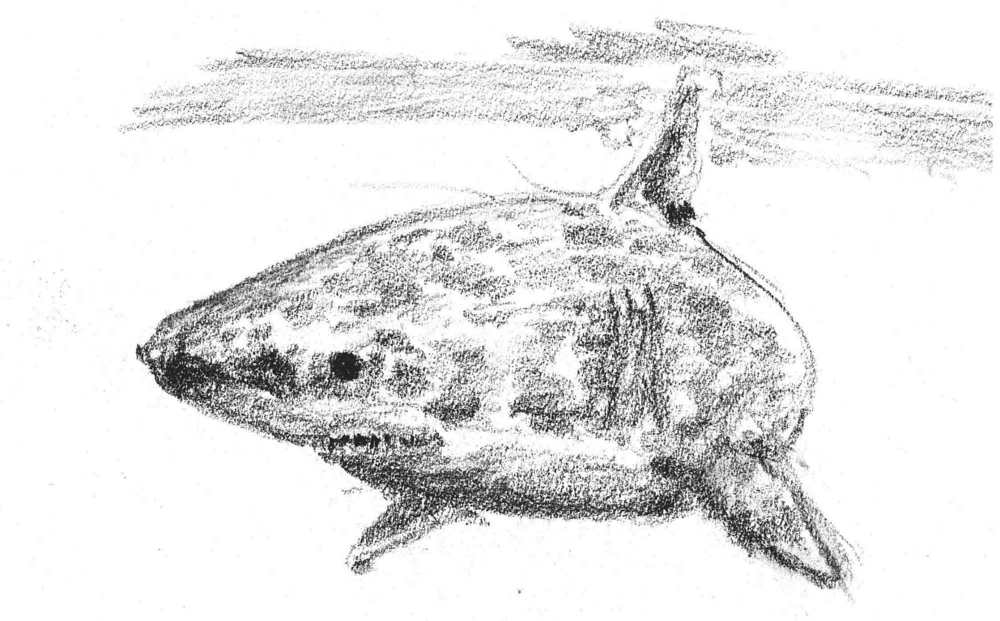

## Game Elements 

This minimalistic game will consist of:

1. Animated shark controlled by keyboard
2. Underwater environment
3. Schools of fish controlled by AI
4. Interface

We are not covering all the topics extensively. We will, however, walk you through some of the basics of modeling, animating, and other Blender-specific tasks.

If you are already familiar with Blender as an asset-making tool, you might skip some of those steps. You will find incremental snapshots for all the individual parts here on this site.

## File Organization, Datablocks, and Linking 

_Starting with the right fin…_

It's important to plan ahead and to know how to organize the files we will be creating. For this project, we will try to make the files as self-contained as possible. You should be able to open the shark file and test the swimming animation-without having to worry about the other fish, the terrain, or the interface.

Having independent files allows for a big team to work together on separated assets. It also helps for individual versioning control. It may seem like overkill for a small project, but it's a good practice that scales up pretty well.

> **Version Control**
>
> Version control is any system you can find to organize the version of your files. If you keep daily backups of your production files in a separate folder, then you are doing version control. In practical terms, there are more modern ways to accomplish this, without having to handle file renaming and manually filled log files-namely SVN, Git, and Bazaar.
>
> Blender files are not optimal when it comes to merging. (Given that they are binaries, you either roll back a file entirely or do it manually.) Thus, working with individual components can help you overcome that.

## Datablocks 

In the previous chapter, we introduced you to the concept of datablocks. Linked datablocks (for example, a texture datablock used by a material datablock) don't even need to be part of the same file. In our project, we will use it to a certain extent. What are the criteria here?

Taking material and textures as an example, you need to consider how you will be using them in your workflow. Those two are often edited together: You adjust the influence of a texture channel in your material, tweak the material diffuse color, and get back to the texture. In this case, it's best to have both datablocks in the same file.

Now let's look at armatures and actions. Only after you are done with your rigging, do you start the animation. Even if you change your armature after you start the animation, you may want to keep them separated. If you need to go back to an earlier version of the armature but want to keep the new animations, separated files are the way to go. That said, we could keep the actions separated from the main armature files. We could, but for the sake of simplicity, we will not.

But how do we keep them linked while in separate files?

## Linking and Appending 

There are four ways of adding new objects and other datablocks to your Blender file:
- You can build them from scratch.
- You can import them from a different format (Collada or FBX, for example).
- You can link them from another Blender file.
- You can append them from another Blender file.

For Linking part of another blender file click on File > Link (Ctrl + A + O). Then browse in your system and find the source file. Click on it and you see some folders that categorize data blocks. Select intended data block(s), configure linking options in the "Link from Library" section. Finally click on "Link from Library".

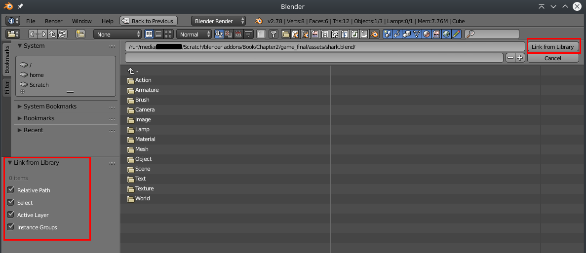

For appending part of another blender file click on File > Append (Shift + F1). Then browse in your system and find the source file. Click on it and you see some folders that categorize data blocks. Select intended data block(s), configure appending options in the "Append from Library" section. Finally click on "Append from Library".

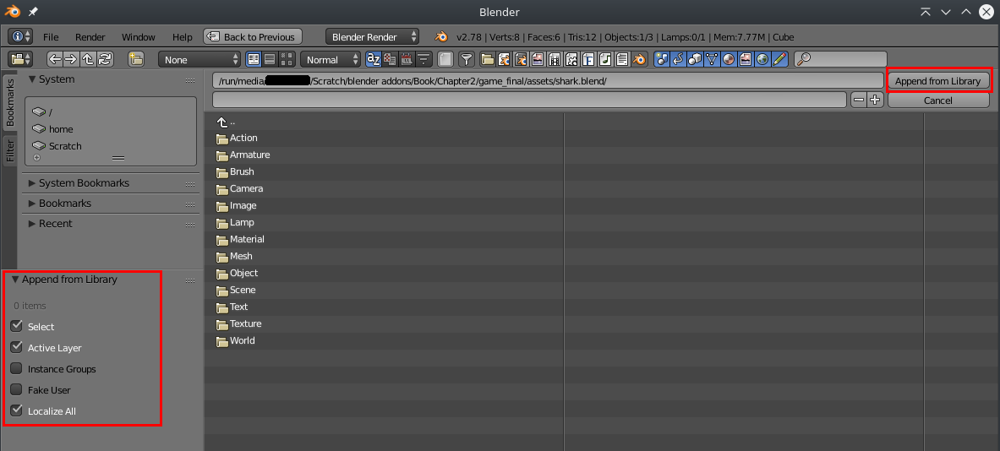

>**Tips**
>
>- In big and complex blender files there are many files (datablocks) and you may have problems in finding your intended file. You can search items through search box in the top right of the dialog (even with wildcards). Also you can filter data blocks and items in the Filter tab.
>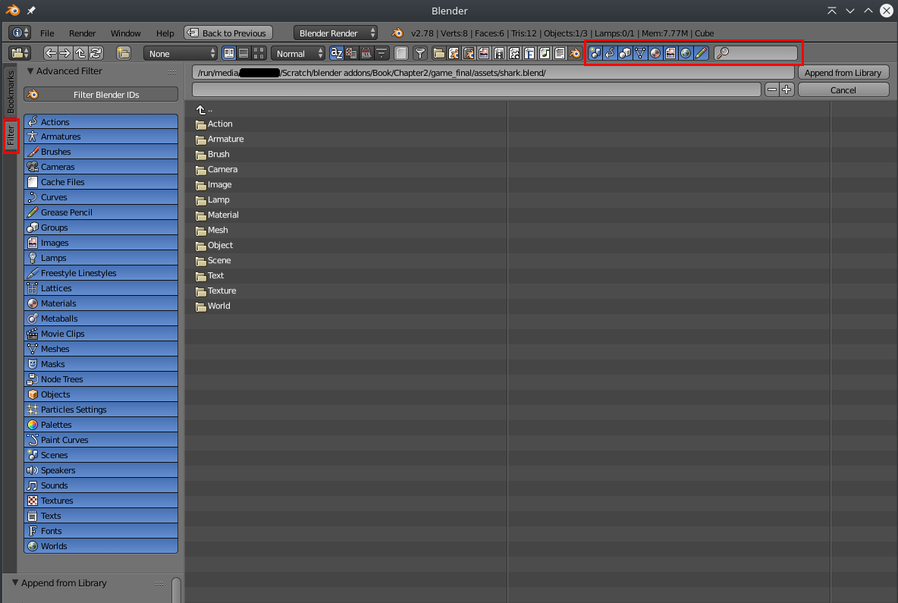
>
>- You can use thumbnails to find some datablock types easier. Before using this feature, use File > Data Previews commands to generate thumbnails for datablocks (like materials, textures, ...).
>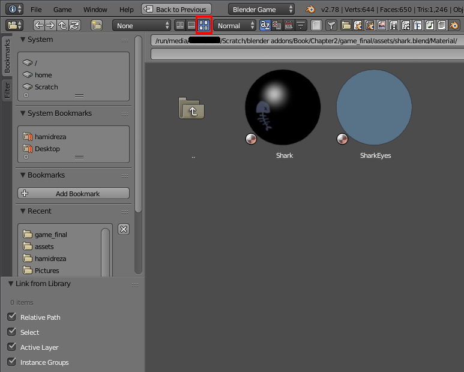

The difference between linking and appending is what happens after you bring the new data into your file. If you append a file - let's call it _library_-the new elements will keep no reference to the original library file. You can literally delete the library file, and it will not result in any changes in your work file. That also means that any change you do in your library file will not be synced back into your working file.

If you want to keep the files in sync (and you do most of the time), you then need to set "Link" while importing the library file. By doing this, you will not be able to edit the file in your working Blender file. Instead, you need to go back to your library file, change it, save it, and then open the working file again.

As you will see from our file structure (explained next), we will be using mostly linking between the files.

You don't simply dump the whole Blender file inside yours. Instead, you can navigate inside the file structure and bring in only an object, or a group, material, or even an entire scene. We will be linking the shark, interface, environment, and other fish in the main file. We could also do nested linking, by having one of the library files link another file inside it (for example, the actions could be linked in the armature files).

## How to Use the Chapter Files 

On the Book files, you can find the complete game(exercise) in the folder Book/Chapter02/game/_final/.

For simplicity's sake, we will use Blender relative path syntax to refer to the files inside this folder. In this case // refers to the base folder and //interface/score.blend stands for Book/Chapter02/game/_final/interface/score.blend.

To play the game inside Blender, open the file game.blend. This file is only a part of the game and depends on the external files that are organized as:

**//** game.blend

**//** assets **/** shark.blend

**//** assets **/** school.blend

**//** level **/** seabed.blend

**//** interface **/** score.blend

To follow the progress of the instruction steps, we have other folders. Copy the whole folder onto your computer to work from there. These are the folders we will be using:

- **Book/Chapter02/game\_my** -The semi-empty folder structure to be filled as you advance in the chapter.

- **Book/Chapter02/game\_progress** -The same folder structure but filled with files of different snapshots. Every file is named after the original name plus a progress number-for example, game.1.blend, game.1.blend, //assets/shark.8.blend. To use them, you need to rename the file to the original name and copy to the right folder in "game\_my" folder.

- **Book/Chapter02/game\_final** -The final as of the end of this exercise; use for reference.

- **Book/Chaper02/references** -Files to support the making of the game.

For the rest of the chapter, we will refer to the files from your //game\_my/ top folder.

## Modeling 

Open Blender and save the default file as //assets/shark.blend.

We will model the outline of the shark based on reference images. To set up your working environment, follow these steps:

1. Split your 3D view into four views (Ctrl+Alt+Q).

2. Open the 3D view Properties panel (N)-remember that the mouse needs to be over the 3D view in order to call the commands for it.

3. In the bottom of the panel, you will see the Background Images option. Turn it on.

4. Add three images for the three Axis/Views: Top, Front, and Right. They can be found in the reference folder named shark-top.png, shark-front.png, and shark-right.png.

5. Change their size to 1.50

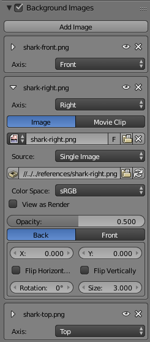

The current file can be found under the name //assets/shark.1.blend.

To start the model, remove the initial cube (X) and add a cylinder into the scene (Shift+A > Mesh > Cylinder). New objects are always added to the 3D cursor location, so make sure that it is in the center of the scene [0,0,0] (Shift+S > Cursor to Center). The default cylinder doesn't match the dimensions or the orientation of the reference model. The quick way to change that is to access the redo last menu (F6) and tweak the cylinder parameters. As you can see in Figure 2.4, we used 12 Vertices, Radius of 0.4, Depth of 1.0, Location Y 0.5, and Rotation X 90 degrees.

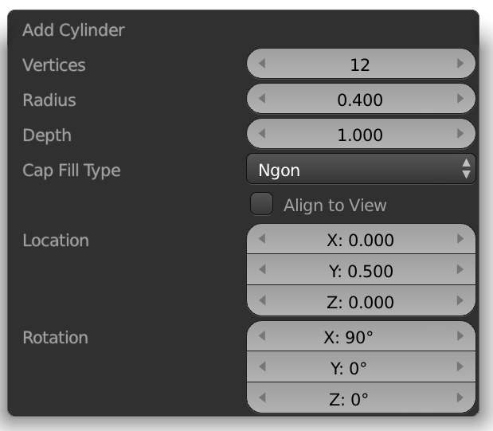

This will be the base for the shark. We will roughly model from the front and side views, trying to match the picture. To work with more freedom, let's customize the screen. Since we will be modeling with side- and front-view references only, it helps to toggle off "quad view" in the Properties panel in the 3D view. Instead, we will split the screen in half (dragging the triangle from the bottom left edge of the 3D view editor).

Enter the Edit mode and, in the top view, remove half of the mesh (leaving the vertices from the middle). Since the shark is symmetrical, we don't need to model its two halves. Switch back to the Object mode and in the Properties panel add a Mirror Modifier. Set clipping to on and make sure that the mirror axis is X. The other default options are fine.

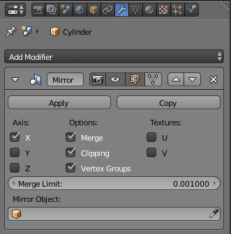

Thanks to the modifier, you should now see the cylinder complete again. Back in the Edit mode, any change you make will be automatically mirrored in the other half, as you can see in Figure 2.5.

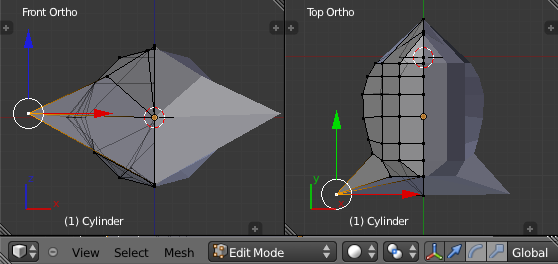

We can't do much with the current mesh. We need more vertices to model the shark, and we will use the Loop Cut tool for that. In Edit mode, press Ctrl+R. This will show a purple edge on top of the cylinder. If you move your mouse over the mesh, you can choose where to slice it. In our case, we want a cut parallel to the base of the geometry. To confirm the command, right-click in the window and either move the mouse to slide the new edge loop, or press Esc to cut through the middle of the cylinder. If you scroll your mouse wheel before you confirm (click), you can do multiple slices at once, as shown in Figure 2.6.

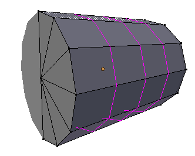

We will slice the cylinder on every section where the outline of the shark has a significant change in its slope. Remember to save the file, and if you want to compare your progress, check the file //assets/shark.2.blend.

Since this is a shark and not a sausage, we need to accommodate the new mesh arcs to follow the reference image. The B key will turn box selection on and let you select one or more vertices at once. Another useful shortcut is Alt+RMB (in linux : Alt + Shift + RMB) on one of the edges of the loops to quickly select the edge loop.

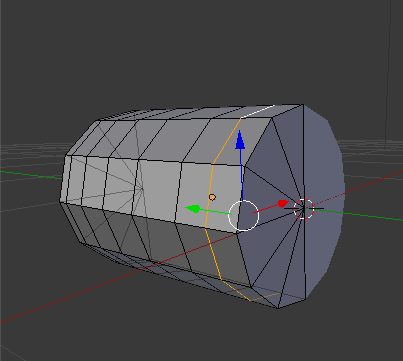

With the arcs selected, you can grab them and move around (G). When necessary, you can use the S key to scale them around them. The transformations (Rotation, Scaling, and even Grabbing) always happen relative to/around a pivot. By default, the pivot is the 3D Cursor. You can change it, for example, to pivot around the center of the selected vertices. To change the pivot, use the shortcuts comma and period (current selection and 3D cursor respectively) or the menu by the Shading mode. In fact, a lot of the other options in the 3D View header are important for modeling (such as snap, proportional editing, vertex/edge/face selection) and can be found in Figure 2.7.

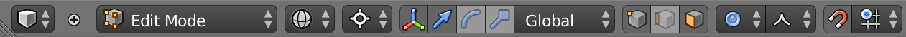

At this point, you can start exploring the top view as well. For quickly switching to top view, use NumPad7 or toggle quad view on and off. Sometimes you need to transform the geometry only in one axis. In Figure 2.8, you can use the handler to pull if you want to move an edge in a specific axis. You can also use the keyboard for that. To restrict the transformation, press X, Y, or Z after the command and slide in the specified axis. Shift+X, Y, or Z works in the opposite way. It locks the transformation for the opposite axis (so you can only move/scale/rotate in a plane). This is really useful-we use G with Shift+Z all the time.

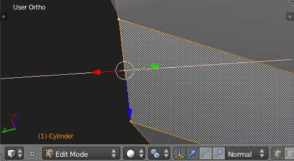

You can also use the Proportional Editing tool, as shown in Figure 2.9. Sometimes you don't want to move individual vertices/edges/faces, and edge loops and box-selected areas are too big to be transformed as a single unified block. To use proportional editing, press O (or go to the icon in the 3D View header) to toggle it on and off. Now if you move a vertex, all the neighboring vertices will tag along. The influence of the tool is determined by the circle around the pivot. (Again, see how important the pivot is?) You can increase the size of the circle of influence by scrolling the mouse wheel up and down.

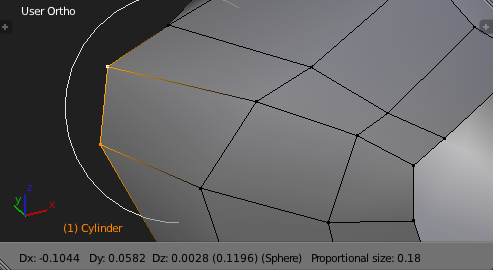

With these tools, you can get to the stage of the file //assets/shark.3.blend. Also in this file, there are some sketch lines on top of the 3D view; these are made with the Grease Pencil tool to help block out the shape before modeling. They are temporary markers and nothing more. Therefore, they were removed once the model was finished in shark4.blend. Although we can already add a tail to the shark, this poor shark still can't swim. To finish the modeling instructions, we will extrude those missing bits. In this context, extruding means to pull a piece out of the base geometry while keeping it connected. It's easier to show than to say. In Edit mode, select the face on the side of the shark and extrude it by pressing E, as shown in Figure 2.10.

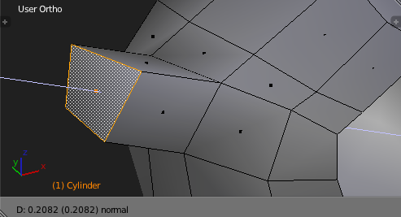

Once you enter the extrude command, a new face is created. This face is connected to and in the same position as the original face. Additionally, it automatically puts you in the Grab command with the movement locked to the normal axis (no more the X, Y, or Z but the face normal instead). Pull the face as far as needed (in our case, the front reference image should be the guide) and click to finish it. If you press Esc, you will cancel the Grab part of the command but will still have the new face.

>**Transform Orientation**
>
>If an object or its parts is rotated in relation to the global axis, you will find the default axis locking hardly useful. Therefore, Blender allows you to quickly set a different alignment mode in the 3D View header (the default is Global). To switch to it, enter the desired axis twice (for example, X+X).
By changing the global orientation, you are actually changing the orientation of the Transform controllers (Translate, Rotate, Scale).
One exception to this system (and broadly used) is that when Global is set as the global orientation, you get Local transformations when double-typing your locking axis.
Additionally, an advanced resource is to add custom Transform Orientations. This is accessible at the end of the 3D View Properties panel.

Because the Mirror Modifier has both "Merge" and "Clipping" options turned on, the extrude will not simply be constrained to the normal (the axis perpendicular to the face) initially. Instead, the extruded face will be locked to the normal, but half of it will be locked in with the mirror plane. Therefore, it will behave as if locked vertically (Z axis).

To save time with the modeling, we will add a head from the built-in meshes in Blender. While in the Edit mode, go to the Add Mesh menu (Shift+A) and choose Monkey. You will need to scale (S), rotate (R), and grab (G) it to make it match the reference image. And they match perfectly-what a happy coincidence.

You will need to remove some faces from the neck to connect it with the top part of the body. To delete faces, use the X key. This will bring up the menu shown in Figure 2.11-pick your option wisely. To connect vertices and edges, use the F key. (They need to be selected, and no more than what can fit in a face.)

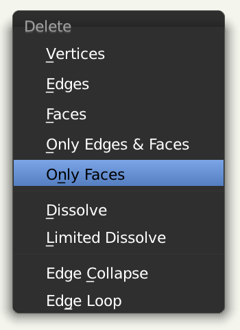

To finish the model, you can add the swimmers on the sides. Start by selecting one face in the lateral of the mesh and extruding it until necessary. As we did for the main body of the shark, we should add more sections to the swimmer with the Loop Cut tool.

You can refine your model as much as you want. The current model is in //assets/shark.4.blend.

## Texturing 

The next step shouldn't take much time. To add the skin of the shark, we will use an image projected into the faces. Images are two-dimensional, while our models are three-dimensional. In order to match them both, we need to do the equivalent of peeling an orange and flattening the peel onto a flat plane. The peel in the plane will be our image of the orange skin, allowing us to use a 2D image for our 3D model. Another example is the representation of the world map where a sphere is projected onto a plane, as you can see in Figure 2.12. The process of mapping the 3D geometry to a 2D plane is called _UV texturing._

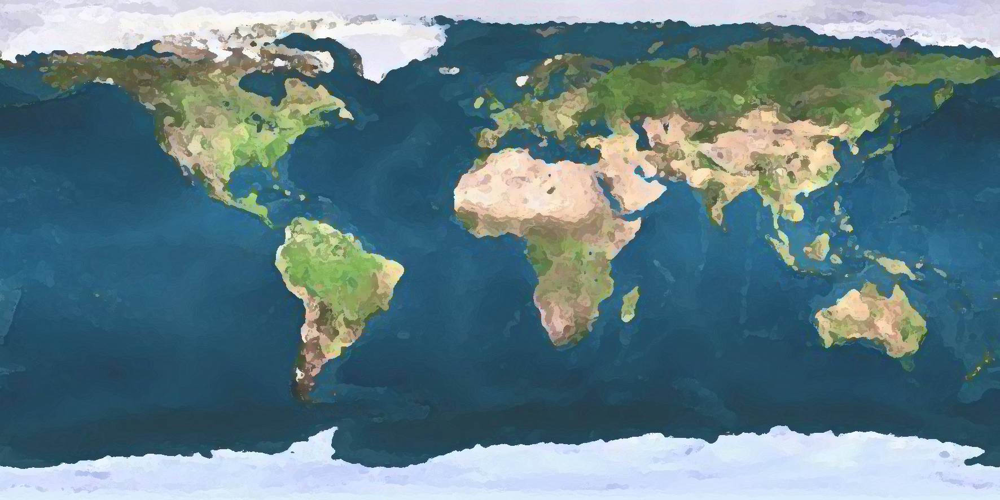

Before we start, go to the Modifiers panel and apply the Mirror Modifier. If you don't do that, the shark can't have a different texture for each of its sides-instead, it would use the same texture flipped in the model. Also, you will no longer need the background images. You can turn them off or remove them from the file-both options can be found in the Background Images panel in the 3D View Properties menu.

To start creating a UV texture, you need to switch to Edit mode and call the UV Mapping menu (U). This menu has different mapping options. We will be using the first one,  Unwrap, which is a semi-automatic way to calculate the optimal stretching for the 2D texture. The result can be seen and edited in the UV/Image Editor.

In the Editor menu, click Image > New, and in the pop-up menu, set UV Test Grid and confirm. This will produce a sample image where you can check in the 3D model as to how stretched the map image (texture) will be, once it is re-projected onto the shark model. If you look at Figure 2.13, you should spot a problem with the default unwrapping: the image on the side of the shark is too stretched and does not have enough resolution. While the shark tail has a high resolution, that doesn't correspond to its need (the tail is small after all)-the smaller the squares of the UV test grid, the higher the pixel-per-face ratio.

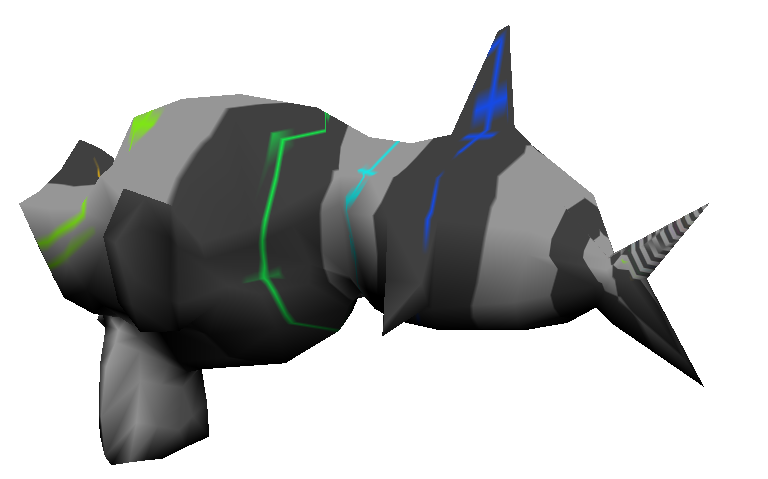

To solve this problem, go to the 3D view and select the edge loop that splits the side-swimmer from the body. With this "ring" selected, go to the Edge menu (Ctrl+E) and select Mark Seam. Now redo the UV Mapping  Unwrapping, and you will have a more distributed stretching along the mesh. This can be seen in Figure 2.14 and in the file //assets/shark.5.blend.

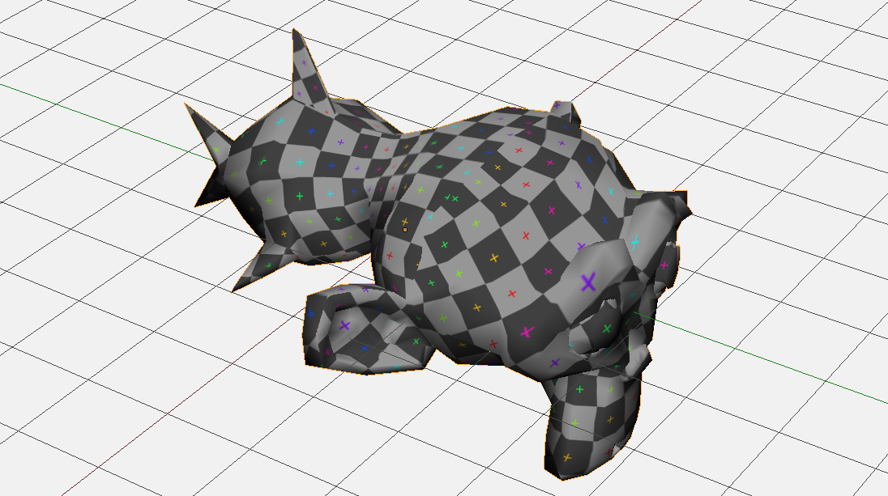

Your model is now ready for proper texturing. In the 3D view, switch to the Texture Paint Mode and have fun. Once you are done painting, save the image from the UV/Image Editor to your computer in //assets/textures/shark.png.

>**No Paint, No Pain**
>
>There is more to texture painting than we can cover here. But it's important to know that the feature is there, and it works great for 3D touch-up painting of your game textures.
Thus, if you don't want to paint the model, you can use the reference image as texture. Turn back to the side view and in the UV Mapping menu (U), set Project from View. In the UV/Image Editor, select the image you used for reference. For the side-swimmers, go to top view and, selecting only them, repeat >the procedure and choose the top reference image.
Another option is to use the simple "shark tattoo" texture I painted for the final game file. This fish is a small part of the texture, because the texture corresponds to the UV layout of the whole mesh. If the image looks strange in your shark, you will have to edit your UV layout to make it match the UV of the //assets/shark.6.blend. You will find the texture in \Book\Chapter02\game\_final\assets\textures\shader.png.

The texture needs to be part of a material. Select the object, and in the Properties Editor, open the Material panel. Create two materials-one for the eyes and one for the rest of the shark. In Edit Mode, you can assign a material for the selected faces. The material for the eyes is shadeless and uses white as its diffuse color. The body material is also shadeless, but needs a texture for the color information. With the body material selected, switch to the Texture panel and add a new texture. The texture type needs to be "Image" or "Movie," and you need to pick the image you prepared as a texture. Finally, go to the Mapping tab and select UV as Coordinate. This way, the texture will be mapped according to the UV you just created.

If you are not familiar with materials in Blender, refer to Chapter 5, "Graphics." You can also import the materials Shark and SharkEyes from the current file at //assets/shark.6.blend .

## Rigging 

_Animate the shark…_

In order to make the shark swim, we need an armature with bones. Similar to real bones, the Blender bones will deform the mesh, producing the animation for our game.

The base file is here: //assets/shark.6.blend

The first thing to do is to add an Armature object (Shift+AArmature). It's important to have the armature center at the "center of mass" of the shark, which happens to be the right place for the shark mesh origin as well. (In our case, it's in the center of the scene at coordinates [0,0,0]). To make sure you got this right, in the 3D view look at the big dot representing the center of the shark or try to rotate it using its center as pivot. If the center is slightly above the side-swimmers and centralized in the short side of the shark, you are good to go. Otherwise, you need to reset its origin with the Shift+Ctrl+Alt+C option:

1. Move the 3D cursor to the approximate location (or to skip the next step, put it in [0,0,0] or use Shift+C).

2. Set its X coordinate to 0-the Property panel shows the 3D cursor's exact location.

3. Set Origin > Origin to 3D cursor.

With the 3D cursor in the center of the object, add the armature (Shift+A). In the Edit mode of the armature, select this bone (A or RMB on it) and move it [nd]1 unit in Z. Now the tail of the bone is in the center. The tail is the small extremity of the bone, opposite to its head. This will be our root bone, the one bone that controls all the others.

With the 3D cursor still in the center, add a new bone (Shift+A). Select this bone tail and move (G) it until it matches the mouth location, as you can see in Figure 2.15. Now select this bone and the root bone and parent them without linking them (Ctrl+P  Keep Offset). This way the bone can still move freely, although it is parented to the root bone.

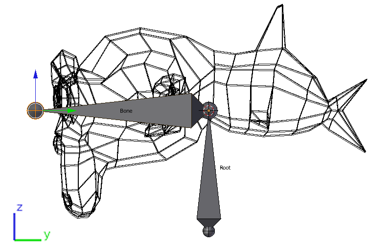

Back to the root bone: select its tail and extrude it (E). This is another way of adding bones, automatically connecting them. Move the extruded bone to the beginning of the shark tail. Now repeat the procedure for the new bone, extruding it all the way to the end of the shark tail. Figure 2.16 shows the current bones as seen in //assets/shark.7.blend .

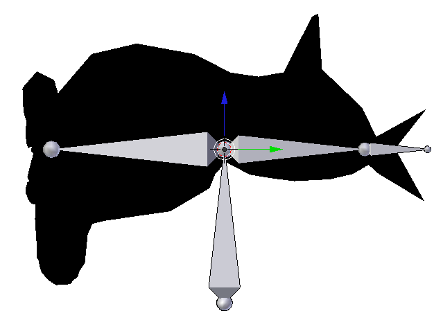

Before animating the shark, we need to link the armature with the mesh. This is done with the Set Parent To operator:

In the Object mode, select the shark mesh and then the shark armature and Ctrl+P  Armature Deform  With Automatic Weights. This will try to automatically set the influence of each bone in the mesh. For fine-tuning, select the armature, set it to Pose Mode, and then select the mesh and set it to Weight Paint mode. Now you can select the bones individually and paint their influence over the vertices as shown in Figure 2.17.

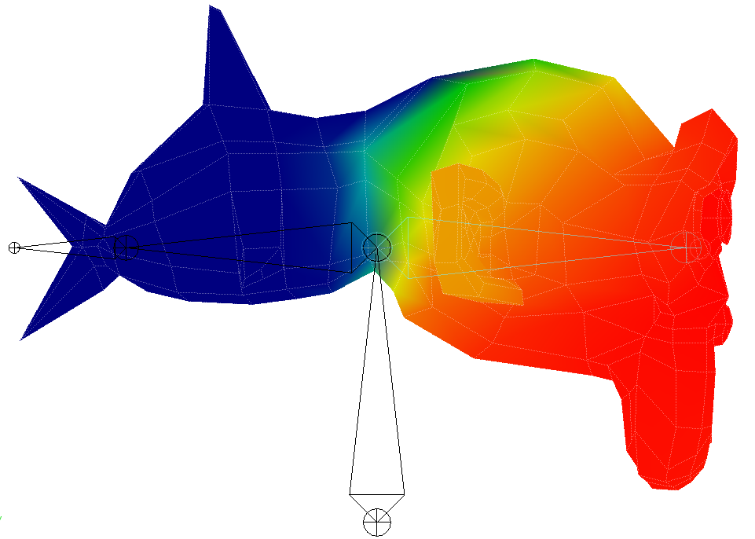

>**X-Ray and Auto-Normalize**
>
>With the armature selected, go to the Properties Data panel and set X-Ray on in the armature display-this will make the bones always be visible. Also, while weight painting, you can set Auto Normalize in the Tool panel-this ensures that all bone-deforming vertex groups don't add up to 1.0 while weight painting.

To test the bone weighting, move the bones around (in the Pose not Edit Mode) and see if the mesh goes with it. The file is ready for animation and can be found here: //assets/shark.8.blend.

## Animation 

To create an animation, you need to define the individual poses that will build up the illusion of movement. As an artist, you can define the poses frame by frame or work in a few moments of the animation. For example, you can define just a few frames, and Blender will automatically calculate the missing frames for the animation. It depends on how much control you want.

>**When 206 Bones Are Too Many**
>
>The animation complexity is also directly related to the number of bones created in your rig. For this game, we are not using many bones for simplicity's sake. In Chapter 4, "Animation," you will find more robust examples.

We will create a swimming cycle-an animation where the first and the last poses are the same and can be played seamlessly in a loop. Let's start by the following these steps:

1. Set the current frame to the initial one (Shift+Left).

2. Select the armature.

3. Change to the Pose mode.

Rotate the tailbone 50 degrees clockwise in the Z axis. Rotate the head bone 5 degrees counter-clockwise in the same axis. Select all bones (A) and insert a keyframe (ILocRot). This will be our pose for the first frame. The current file is at //assets/shark.9.blend and is shown in Figure 2.18.

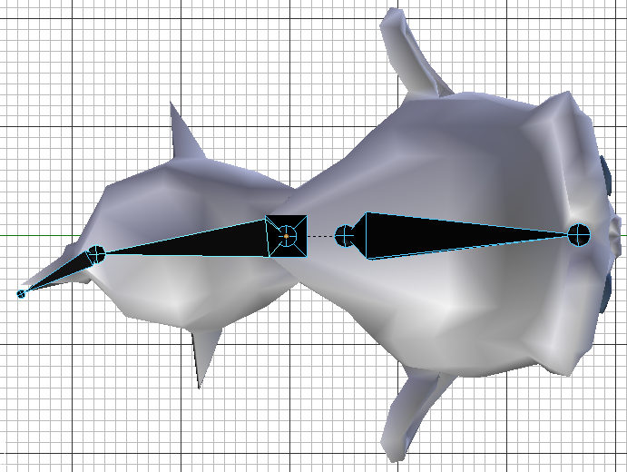

To create a cycle, you need the beginning and end frames to match. Move to frame 31 (through the Timeline or Shift+Up six times) and add a new keyframe for the same pose.

There are different ways to see your animation in Blender. Change your current screen to Animation (in the header menu where you see Default). This screen shows the three animation editors: Dopesheet, Graph Editor, and Timeline, as you can see in Figure 2.19.

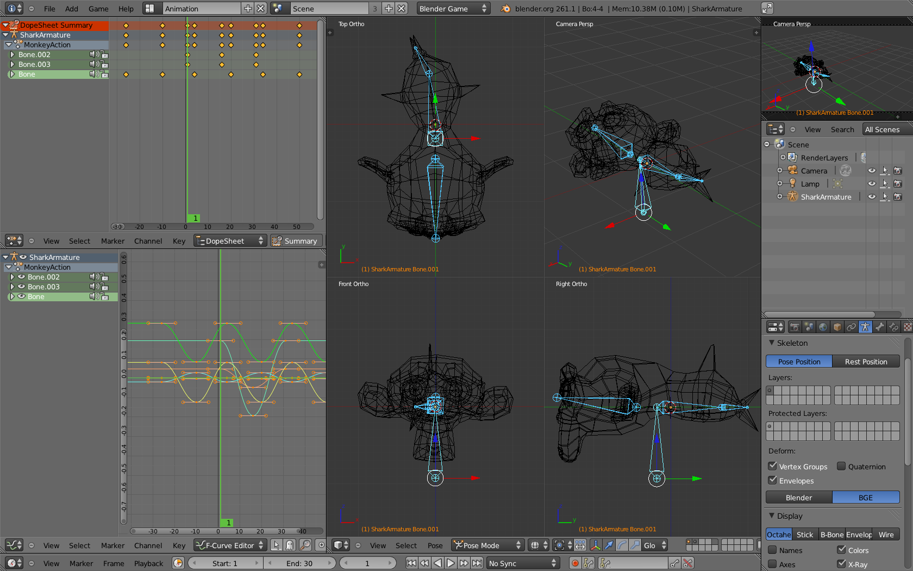

In the Dopesheet, you can see where we have added keyframes so far. The two points and the line connecting them mean that there is no change between the two poses. The other way of adding a new pose is by selecting the keyframes in the Dopesheet and duplicating them. As with the other editors in Blender, you can grab (G), scale (S), copy (Shift+D), and toggle all selection (A) using the same shortcuts you are used to.

The middle pose of the animation cycle should be opposite to the initial (and final) pose. Blender has a simple way to flip poses. In Figure 2.20, you can see the Paste Flipped option in the 3D View header.

1. Change to the Pose Mode.

2. Select all bones (A).

3. Click on Copy Pose in the 3D View header.

4. Go to frame 15.

5. Click on Paste Flipped Pose.

6. Store the keyframes (I).

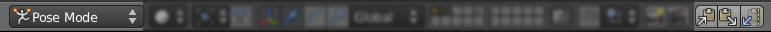

>**Bones Mirroring**
>
>If your rigs have bones bifurcating from the main bone chain, there is a special way to make them mirror. By default, Blender will try to paste the pose of the same bone mirrored relative to the Y axis. Sometimes, however, you want to swap the transformations between two bones-a left and right. The classic example is walking animations when you need to animate only half of the strides.
>To have Blender interpret the bones as two sides of the same bone, you need to name them L (for left bones) and R (for right bones). This way, the bone Swimmer.001.L will be treated as the pair of Swimmer.001.R, and their poses will be swapped and mirrored when using the Pose Flip Paste option. To learn more about this, refer to the walking cycle tutorial in the Chapter 4.

The swimming animation is now finished. In the Timeline, set the final playback frame to 30. Playing back the animation (Alt+A) will reveal our lovely and clumsy swimming cycle. In the Dopesheet, switch the Display mode to Action Editor. There you can change the name of the current action to "SharkSwimming," as shown in Figure 2.21.

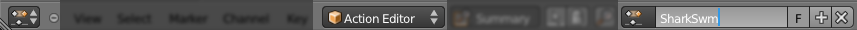

The current snapshot of this file is //assets/shark.10.blend.

You can also do a "SharkAttack" animation. For a smooth transition, make the new action with the same initial and final poses as the "SharkSwimming." If you go with that, use the attack animation when the shark eats a fish.

## Camera and Keyboard 

After all the hard work of setting up your main character, it's time to bring in the game. If you play (P) the game now, you will see nothing but the shark standing still.

>**Playing and Quitting the Game**
>
>Every time you need to test the current status of the game, you can launch it from the Game menu (available when the Engine is set to Game Engine) or by using the shortcut P. To quit the running game and go back to the regular Blender environment, use the Exit key set in the game Render panel (Esc by default).

We will now set up the logic bricks. You'll learn more about logic bricks in the next chapter. They are the visual components of the logic and interaction of the game. The shark animation and movement will be controlled with logic bricks. We will also set up the camera control and motion.

The shark will always be swimming. Thus, we will be playing the swimming animation constantly:

1. Change your screen from animation to game logic.

2. In the Logic Editor, add an Always sensor (Shift+ASensorAlways).

3. Add an Action actuator and connect it with the sensor.

4. In the Action actuator: mode Loop Stop, action SharkSwimming, start frame 1 and end frame 30.

Now that the shark can swim, you want it to move around. The controls of the game are simple: use the spacebar to swim forward; left and right to rotate; up and down to emerge and submerge. You have to add a Keyboard sensor for each of those keys and connect them as such:

- Left key => Motion actuator: RotZ = 1° and disable L for rotation

- Right key => Motion actuator: RotZ = -1° and disable L for rotation

- Up key => Motion actuator: RotX = 1°

- Down key => Motion actuator: RotX = -1°

- Space key => Motion actuator: LocY = -0.05

Test your progress inside the game (P) and remember to always save. If your file is showing a different result than the file at //assets/shark.11.blend, check the logic bricks in Figure 2.22.

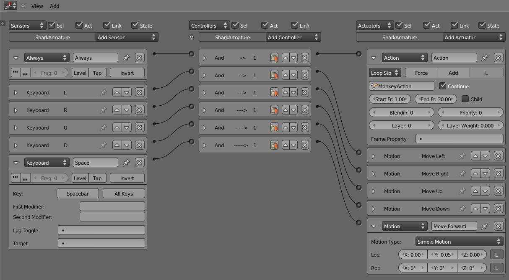

This simple setup allows the shark to swim freely away from the camera. To have the camera following the shark, select the camera and do the following:

1. Add an Always sensor.

2. Add a Camera actuator and connect it with the sensor.

3. In the Camera actuator, set SharkArmature as object, height 5.0, axis [nd]Y, min 5.0, max 20.0, damping 0.10.

This camera will be behind the shark, always trying to stay inside the specified distance (from 5 to 20 Blender units). The damping will set how fast you want the camera to adjust to the new position while the shark swims away.

If you are modeling everything from scratch, you should tweak the speed and angle of the shark Motion actuator and the damping and distance of the camera to better accommodate the scale of your work.

With the shark alone in the scene, it's hard to tell how it is moving. It's time to add other objects to the scene so you can make sure that the camera settings and the shark motion are well adjusted. Thus, the next step is to add the world (the SeaBed et al). In the meantime, you can compare the status of your file with: //assets/shark.12.blend.

## World and Environment 

We will leave the shark file for now and put the game pieces together. Open the file //game.1.blend. This empty file will be the main file of the game. If you want to start a file from scratch, open the Blender default file, delete everything from it (press A to select all and then X to delete), and change engine to Blender Game and Shading mode to GLSL.

You need to bring the shark model into this file. Start by linking in the SharkMesh and the SharkArmature objects from the shark asset file. Go to the menu File > Link, navigate to the shark blend file, and once in it, navigate inside "Object," select the SharkArmature and SharkMesh objects, and press OK. A screen capture of the linking options is shown in Figure 2.23. The defaults options are good for now.

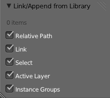

It's important to save your file first; otherwise, the Relative Path option will have no effect. Linking keeps your shark file as an external asset. Any changes you make in the shark.blend file will be transferred over to the game.blend file, once you save it. That also means you cannot make changes in the asset objects through the game.blend file. If you linked before you saved the file, no worries. You can change all the file paths going to the menu File > External Data > Make All Paths Absolute.

The camera doesn't need to be linked. In fact, it's better to keep it as a local object, given that you will certainly adjust its parameters later. To append (not link) the camera, use the menu File  Append and use the default options to import the camera. This will be the main camera for the game. Select the camera and in the 3D View header, choose View > Cameras > Set Active Object as Camera. If everything went right, you can now play your game, and it should behave just as in the shark.blend file.

Good news. The SeaBed was already prepared and is ready for the game (and in your game\_my asset folder). Repeat the linking steps once again for the SeaBed group inside the //level/seabed.blend. You now have the shark, the camera, and the set prepared for the game. The progress shown in Figure 2.24 can be checked at //game.2.blend.

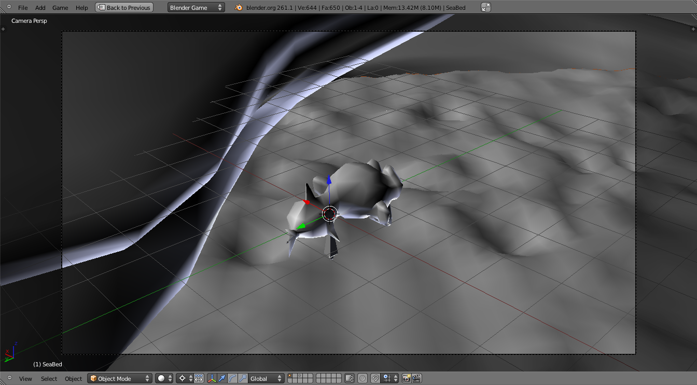

To simulate the water, we will add a blue mist effect. This produces an effect similar to fog and gives a nice water attenuation effect (where everything eventually fades to blue). Follow these steps:

1. Switch to the World panel in the Properties Editor.

2. Create a new World.

3. Set Horizon Color to Hex: 264A6B.

4. Turn Mist on and set Start 0.0 and Depth 50.0

In order to preview the color and the mist effect in the 3D Viewport, you need to set Viewport Shading to Texture (Alt+Z), as shown in Figure 2.25. The World is now finished and part of the //game3.blend file.

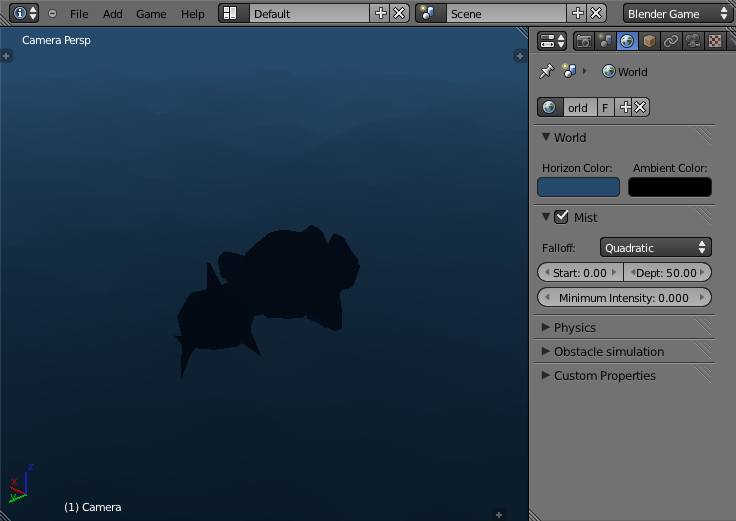

Play your game and swim around with the shark. However, there is one basic element missing in our survival shark game: the food.

## Artificial Intelligence 

While the shark is 100 percent interactive, controlled by the player, the fish will be controlled through a simple AI (artificial intelligence) mechanic. The principles are simple: the fish's swimming cycle is handled by logic bricks, while the fish's constant spawning inflow is controlled by an individual "program" (a script) responsible for the following components:

- Populating the game with fish schools.

- Making the fish follow a "fish leader."

- Killing some fish when the shark attacks.

>**Speaking of Scripts**
>
>Scripts can also be used to complement the functionality of a component of the game. The score scene is using logic bricks to handle the score, but it needs a script to handle the time out, the game over, and to change the resolution of all the text objects. We'll explain more about that in the "Scoring System" section of this chapter.

Once again, we will take advantage of a system with linkable assets. Instead of creating the fish school yourself, you will bring it inside your game, ready to use.

Start by reopening the current version of the file //game.blend. Now you need to link the group FishSchool from the file //assets/school.blend. (This time, instead of navigating in the Object subfolder, go to Group.) If you link a group in with the "Instance Groups"  option enabled, you will end up with an instance of this group added to the scene. This "group instance" is nothing more than an empty object that is used to place a Blender group in the scene. The group is linked from the original file, thus changes made there are kept in sync with your game file.

In Figure 2.26, you can see the game with the school of fish around the shark. If you open the file school.blend, you can see an empty (FishLeader) in the visible layer and an object (Fish) in the second layer (which is and has to be hidden by default). The empty is always rotating and adding more of the fish model into the scene. A fish is added every second or so until the limit specified in the FishLeader game property, maxFish, is reached. Change this number from 30 to 100 and fish will flood you. Decrease to 5, and you make the game even harder. Select the FishLeader, and you will see some new logic bricks. Pay particular attention to the Python controllers.

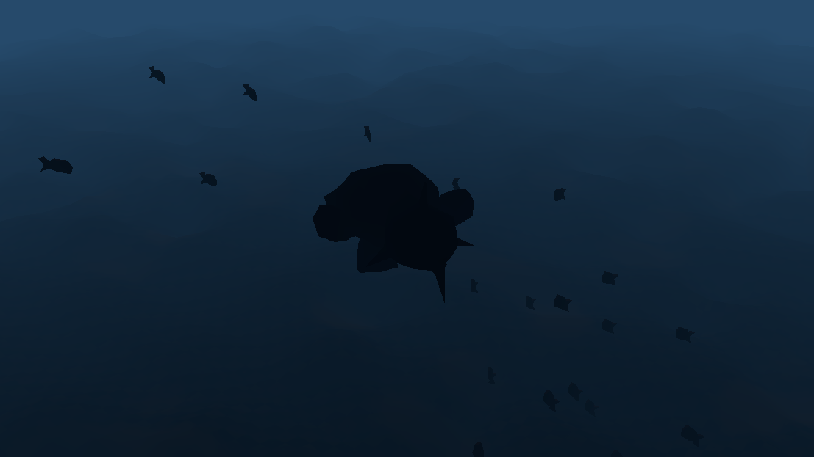

The script allows for more direct manipulation of your game elements, complex math computations, and a denser logic for your game play. If you look at the scripts in this file (in the text editor), you'll see you have nothing to be scared of. This is a simple textual way to describe interactive behaviors for your game. And it's far simpler than the hardcore task of programming an entire game engine. Cheers for the compromise. In Figure 2.27, you can look at the game property and logic bricks (including the script controllers) of the FishLeader.

>**Art Versus Math**
>
>"But I'm an artist and don't understand math." Sure, we get that a lot. But bear in mind that here you only need to understand the mechanics of when to rely on a script and what you can do with it. For a more in-depth overview of this topic, see Chapter 7, "Python Scripting," later in the book. Also, the math you need for Python scripting is more accessible than most people assume. Unless, of course, you are planning to run for Miss U.S.A. [http://youtu.be/9QBv2CFTSWU](http://youtu.be/9QBv2CFTSWU)

If you want to do your own customizations, try to animate the fish with bones. You can follow all the steps we did for the shark. Additionally, remember to change the object being added by the FishLeader "AddFish" actuator (see Figure 2.27). Instead of adding the fish, you will have to add the fish parent (the FishArmature object you will create). The armature child (the fish itself) will be added together automatically.

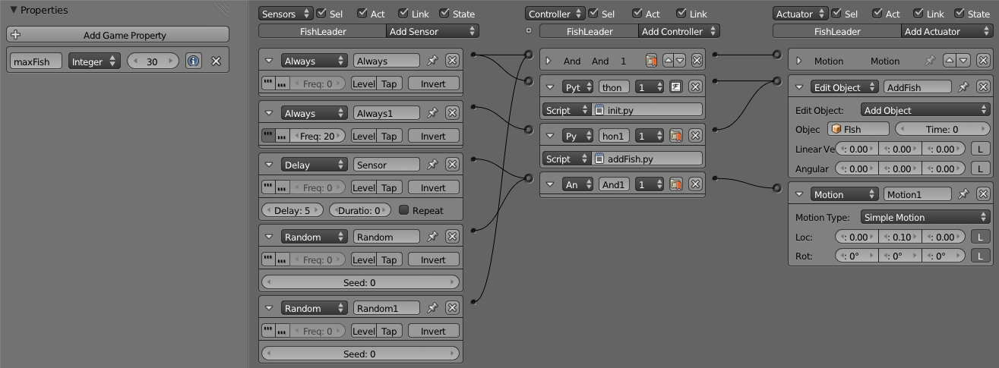

The current checkpoint is at //game.4.blend. If you changed your //assets/school.blend file, you need only replace the one in the sources with yours. As we mentioned (three times already, anyone counting?), the new data will be automatically synced in the game. Play your game, and get ready to wrap up the shark feeding.

## All You Can Eat 

If you try to catch the fish with the shark, you will see that the shark pushes the fish away. For the game, we need three things to happen: (1) the fish needs to die, (2) the shark needs to get bigger, (3) a score on the screen needs to tell how many fish we caught and how much time we have left.

The score system will be made in the next section. For now, we will focus on making the shark and the little fish interact.

The school of fish is, in fact, already set up. But let's look at what we have there. Open the file //assets/school.blend. In the second layer, select the fish and look at the logic bricks, shown in Figure 2.28.

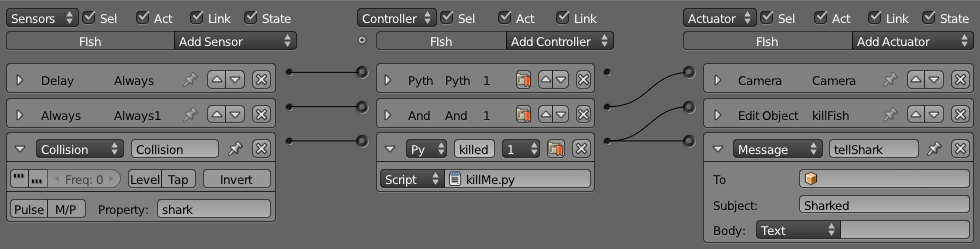

We have a Collision sensor that will only be active when touching an object that has a "shark" property. We don't want to know when one fish collides with another or with the seabed, for that matter. This filter addresses that. The sensor is connected to a Python controller "killMe.py" that takes care of some housekeeping. It tells the FishLeader that we will need a new fish soon. The controller also activates two actuators: one to kill the fish, and the second to send a message indicating a fish went down.

This message is like spam mail. It doesn't matter if you have a mail-only sign in your mailbox. It doesn't even matter if you don't have a mailbox. You will receive the McDonald's coupon you never asked for. (And you will end up eating there-damned spammers!)

And so will the shark. Once the shark receives a message, it can act accordingly. In our case, we want to make the shark big. To do so, open the file shark.12.blend again. Until now, we have been adding all the logic bricks to the armature. Now let's put the armature aside and use the mesh:

1. Select the SharkMesh object.

2. Add a keyframe to the size (IScaling).

3. Go to frame 100, scale up the shark, and repeat the previous step.

4. Open the Logic Editor.

5. Create a Boolean game property named "shark."

6. Create an Integer game property named "size."

7. Add a Message sensor with the subject "Sharked"

8. Add a Property actuator: mode Add, property "size," and value 1.

9. Add an Action actuator: mode Property, action SharkMeshAction, and property "size."

10. Connect the sensor with both actuators.

The final shark file is at //assets/shark.13.blend. In Figure 2.29, we have a screen of the logic bricks setup.

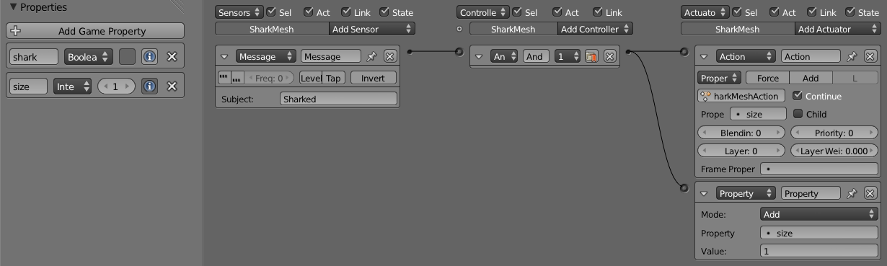

We started by creating an animation for the shark. This animation is played according to a game property (size) that will increase every time a message is received. The message gets to the shark every time a fish is eaten (for example, collides with the shark). Thus, we have a good synchronization between fish disappearing and the shark getting bigger.

Apart from that, the shark needs the "shark" game property to be detected by the fish school. This will trigger the collision. The collision sensor simply checks if the object has a property with a given name, so the type and value of the property are arbitrary (in our case, we are using a Boolean property, but it could be any other property type). Now one by one, we can eat the fish. And it's time to count sheep.

## Scoring System 

The score system of the game is part of its interface built on top of the 3D view. In Figure 2.30, you can see the main elements of the interface: the score on the top left, the time countdown on the top right, and the title of the game on the bottom right.

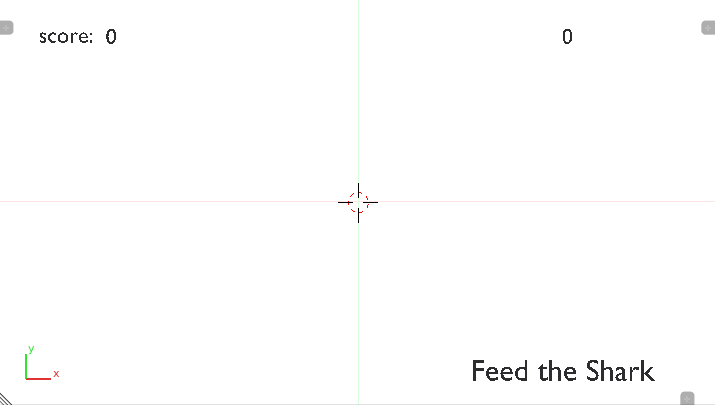

The user interface is independent from the game file, objects, and events. Thanks to the messaging system of the game engine (the combination message actuator and message sensors), you can implement the interface as a separate file with its own logic. Open the interface file in //interface/score.blend. The diagram in Figure 2.31 illustrates the dynamic of its elements and the message flow.

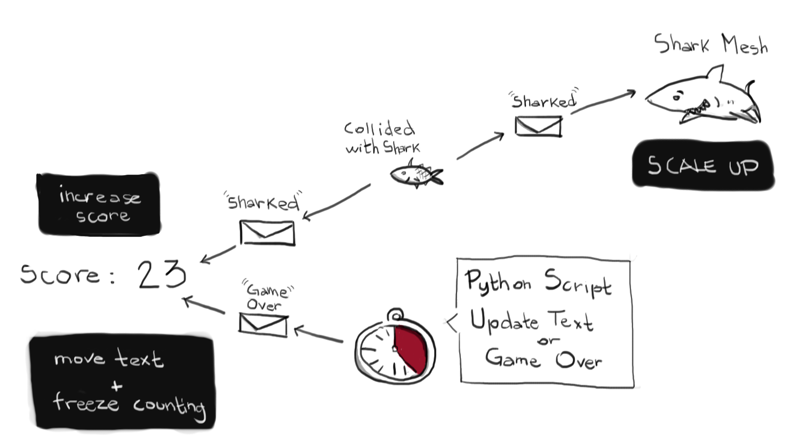

Now you have two sets of independent and concurrent events. On the one hand, you can  update the score every time a message comes from a fish saying it got "sharked" (a fish collided with the shark). This is pretty straightforward and happens for as long as the game is not over.

The game is over when you run out of time, which is part of the second set of events. The time system is an independent countdown timer (using a timer game property). It updates the time in the interface and sends a message to all the game elements when the time is up, and the game is over. This message is used to freeze the fish-counting and trigger an action to move the score to its final position, as you can see in Figure 2.32.

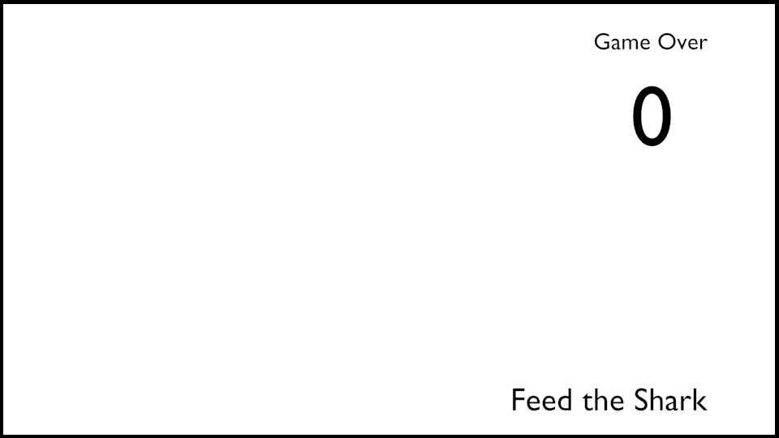

This scene will be imported without changes into your game file. Once again, the linking system of Blender allow you to keep components separated and synced. Open //game.4.blend and link (not append) the "Score" scene from the //interface/score.blend file. Although the scene is now in the Blender file, you still need to load it into the game:

1. Add an empty object (Shift+AEmpty).

2. Select the object and open the Logic Editor.

3. Add an Always sensor.

4. Add a Scene actuator: mode Add Overlay Scene, scene "Score."

5. Connect the sensor with the actuator.

Now the game is a combination of two scenes that work as separate layers. The file is at //game.5.blend. In Figures 2.33 and 2.34, you can see the user interface integrated within the game.

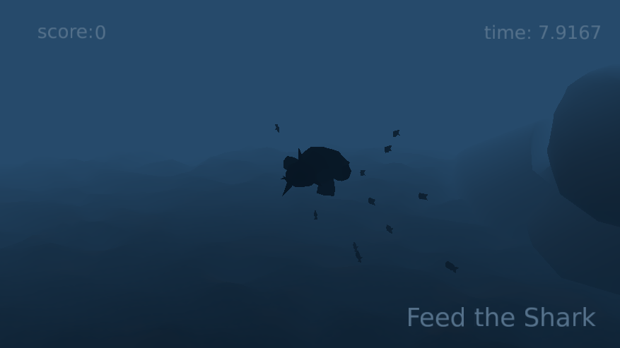

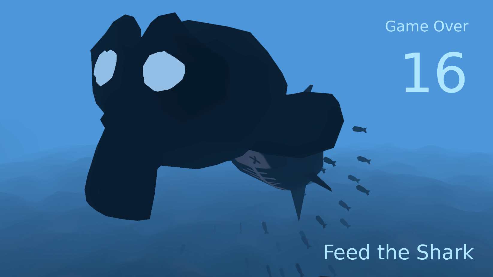

## Music for Your Ears 

A game is not complete without sound effects. There are three sounds under // sounds/: the ambient sound (water.m4a), the eating-fish effect (sharked.m4a), and the ending sound (gameover.m4a). This is the farewell set of instructions for this chapter and a prelude for the following chapter (entirely on logic bricks). Speaking of the lack of images, those are sound samples. Feel free to whistle along.

- **Ambient sound** : Add a Sound actuator; load the sound file (water.m4a). Mode: Loop End, Volume: 2. Connect it to the Always sensor you created to load the UI. This will play the ambient sound through the whole game in an eternal loop.

- **Eating-fish sound** : Add a Message sensor with subject: "Sharked" and a Sound actuator; load the sound file (sharked.m4a). Mode: Play End, Volume: 2. Connect the sensor with the actuator. Every time a fish is eaten, the sound effect will be played.

- **Ending game sound** : Add a Message sensor with subject: "GameOver" and connect it to a new Sound actuator; load the sound file (gameover.m4a). Mode: Play End, Volume: 0.3.

There is a catch here. You are sending the GameOver message not once but continuously. That would make the GameOver sound play in loop, which you don't want. You can fix this in the score.blend scene file (by sending the message only once). Or else you can do it here, as follows:

You need a Boolean game property that tells you what the status of the game is: when gameover is False the game is running; if gameover is True the game is over. When you receive a message with the subject "GameOver," you need to change the value of this property. You do this by connecting the Message sensor with a new Property actuator -Mode: Assign, Property: "gameover," Value: True.

Next you add a Property sensor named GameIsNotOver to detect if the game is running (if the gameover game property is True or False). Set Evaluation Type to Equal, property to "gameover," and Value as False.

Connect this sensor to the And controller of the game over Sound actuator. Optionally, you can also link this sensor to the And controller of the eating-fish Sound actuator. This will make the sound effects stop after the game is over. The ambient sound should still play; thus, there is no need to connect the GameIsNotOver sensor with the And controller of the ambient Sound. The final logic bricks can be seen in Figure 2.35

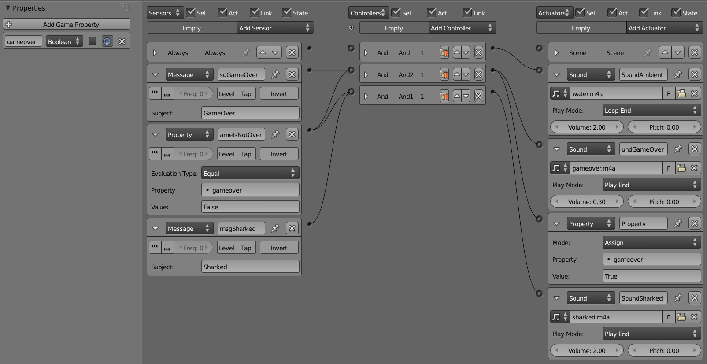

The final file is at //game.6.blend.

## Where to Go from Here 

The game is complete: the final files are in \Book\Chapter02\game\_final\game.blend.

The modular approach we took allows for easy customization of the individual elements of the game. As you advance in the book, you should try to keep evolving the games files. Create a new user interface. Create multiple shark animations. Change all your assets.

If you want to share your version of the Feed the Shark the game, please host it online and send us a link. If there are enough contributions, we will make them available on the book's home page.
