**Table of Contents**

- [Chapter 3: Logic Bricks](#Chapter_3:_Logic_Bricks)
	- [General Overview](#General_Overview)
		- [Simple Example](#Simple_Example)
	- [Architecture](#Architecture)
	- [Interface](#Interface)
		- [Add](#Add)
		- [Remove](#Remove)
		- [Move](#Move)
		- [Link](#Link)
		- [Unlink](#Unlink)
		- [Expand/Show/Hide](#Expand/Show/Hide)
		- [States](#States)
		- [Properties](#Properties)
		- [Sensors](#Sensors)
			- [Header](#Header)
			- [Always](#Always)
			- [Delay](#Delay)
			- [Actuator](#Actuator)
			- [Joystick](#Joystick)
			- [Keyboard](#Keyboard)
			- [Mouse](#Mouse)
			- [Armature](#Armature)
			- [Touch](#Touch)
			- [Collision](#Collision)
			- [Near](#Near)
			- [Radar](#Radar)
			- [Ray](#Ray)
			- [Random](#Random)
			- [Message](#Message)
			- [Property](Property)
		- [Controllers](#Controllers)
			- [Header](#Header)
			- [Booleans](#Booleans)
			- [Expression](#Expression)
			- [Values](#Values)
			- [Comparison Tests](#Comparison_Tests)
			- [Arithmetic Operations](#Arithmetic_Operations)
			- [Boolean Operations](#Boolean_Operations)
			- [Python Controller](#Python_Controller)
		- [Actuators](#Actuators)
			- [Header](#Header)
			- [Action](#Action)
				- [What Can Be Animated](#What_Can_Be_Animated)
				- [What Cannot Be Animated](#What_Cannot_Be_Animated)
				- [Object Settings](#Object_Settings)
				- [Play Modes](#Play_Modes)
				- [Blendin, Layers, and Priority](#Blendin,_Layers,_and_Priority)
			- [Armature](#Armature)
			- [Camera](#Camera)
			- [Constraint](#Constraint)
				- [Location Constraint](#Location_Constraint)
				- [Distance](#Distance)
			- [Orientation Constraint](#Orientation_Constraint)
			- [Force Field Constraint](#Force_Field_Constraint)
			- [Edit Object](#Edit_Object)
			- [Message](#Message)
			- [Motion](#Motion)
				- [Simple Motion](#Simple_Motion)
				- [Servo Control](#Servo_Control)
				- [Character Motion](#Character_Motion)
			- [Parent](#Parent)
			- [Property](#Property)
			- [Random](#Random)
			- [Sound](#Sound)
			- [State](#State)
			- [Visibility](#Visibility)
			- [Scene](#Scene)
			- [Filter 2D](#Filter_2D)
				- [Enable, Disable, Remove](#Enable,_Disable,_Remove)
			- [Game](#Game)
	- [State Machine](#State_Machine)
	- [Sharing and Group Instancing](#Sharing_and_Group_Instancing)
	- [To the Infinite and Beyond](#To_the_Infinite_and_Beyond)

# Chapter 3: Logic Bricks 

What makes a game different than a movie? Let's see. In both you can find yourself buried in a comfortable seat eating junk food and alienated from the world. And funny 3D goggles are not exclusive to either. But what about interactivity? In a game you can control a player and interact with the virtual (or real!) world and the game elements. The story can be dynamically created in front of your eyes.

Therefore, as a director and content creator you will play different roles in a movie or a game. In a movie, for example, you have to direct the flow of the story, but for a game, you have to direct how the player controls and experiences this flow. Those are the times of super computers to Watson, IBM's Jeopardy "intelligent" machine. More than ever, it's time to narrow the gap between what technology can deliver and what the public can experiment with and assimilate as part of their own nature. As Kevin Flynn praised in _Tron_ and _Tron Legacy_the Disney game-related movie and prequel   _all the power to the user_.

Traditionally, to design your game interaction in the past, you would have needed coding expertise and a highly technical background. If, as a creative artist, any words such as _technical, code,_ or _programming_ scare you, Have confidence!
"Pure artists" are still scared with code. The idea here is not that they will no longer be afraid of it. Instead, with the BGE they will not have to face their fears. Logic Bricks are an alternative to hardcore coding, known to be "artists friendly" more. Logic Bricks is here to rescue you. Logic Bricks is a visual set of tools responsible for integrating the game components together. By using Logic Bricks, you can determine what to do after a mouse click, when to play an animation, how to move your character, and so on, as shown in Figure 3.1.

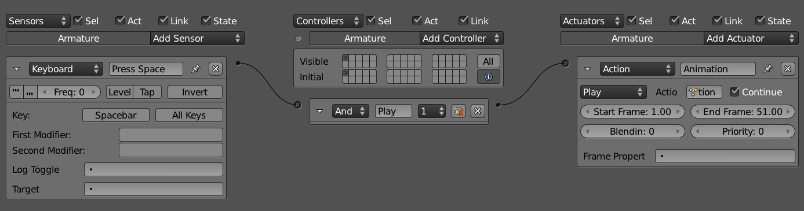

>**Note**
>
>Logic Bricks is high level visual programming.

The Logic Brick system is composed of three main elements: **sensors**, **controllers**, and **actuators**. Sensors are an event system used to trigger an action upon a specific event (for example, an object collides with another object or the joystick is used). Once one or more sensors is triggered, you can use a controller to control whether or not this set of events will produce an event in the game (and which effect). Controllers work as logic pipes, evaluating sensors through simple logic conditions, such as And, Or, and Not. Finally, when a controller validates a set of sensors, it will activate an actuator. An actuator is responsible for a specific action of the game (such as ending the game, moving an object, and so on).

In this chapter, we'll cover sensors, controllers, and actuators in detail specifically, how and when to use them. Additionally, you will learn about object game properties, the State Machine system, how the interface works, and the architecture of the system as a whole. As a system used to build new worlds, this is no place for _do's_ and _don'ts_. It will be up to you to find the best set of features that fits your project and creativity. Nevertheless, when possible, we'll present suggestions of when and how people have used the tools in the past, but you don't have to feel constrained by that. Treat Logic Bricks as small Lego pieces and surprise us and yourself.

>**Leave Your Python at the Door**
>
>Logic Bricks are really easy and quick to use. You can make entire games with them with absolutely no need for coding.

## General Overview 

Thus far, you know that this whole system will allow you to create those little pieces that compose the interaction of your game. There are multiple ways to put those little parts together and even more ways to combine them. It's impossible to show all the possibilities, but there is a common principle as to how they operate that we can look at.

### Simple Example 

From the book files, open _Book/Chapter3/bowling\_base.blend_.
In this file, you have a small bowling game that includes the bowling ball, the pines, and the rink for the ball to roll around in. The goal here is to launch the ball and keep it rolling as much as you can. If you go to the Blender game menu and start the game, you will see that nothing much seems to happen. Here are some things you may need:

- Keyboard sensor to react when keys are pressed.

- Actuator to move the ball.

- Controller to activate the actuator when the sensor is positive.

Select the ball, and you will see that some of those Logic Bricks are already there, as pictured in Figure 3.2. Click in the socket by the Keyboard sensor and drag the line all the way to the socket by the Motion actuator. If your aim was good, this will create a Controller to bridge the sensor with the actuator. Start the game again and press the spacebar a few times to roll a strike.

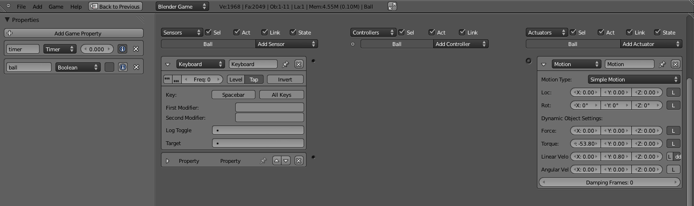

To make things more interesting, there is also a timer that will start when the game begins. If you connect the Property sensor (already in the file) to the same controller as the Keyboard sensor, you will only be able to move the ball for a few seconds. The Property sensor will be positive as long as the timer is inside a specified range. So the And controller will be positive only when both the Keyboard and the Property Sensors are positive.

This is a simple example, but it should get you started so that you can experiment with the available options and other Logic Bricks. Go ahead and change a few things. Don't worry because nothing will break. In Figure 3.3, you can see how your final linked Logic Bricks may look. Notice that there are some Logic Bricks pre-created for the camera and the first pine. If you connect them as shown, the camera will animate as soon as the ball hits the pine.

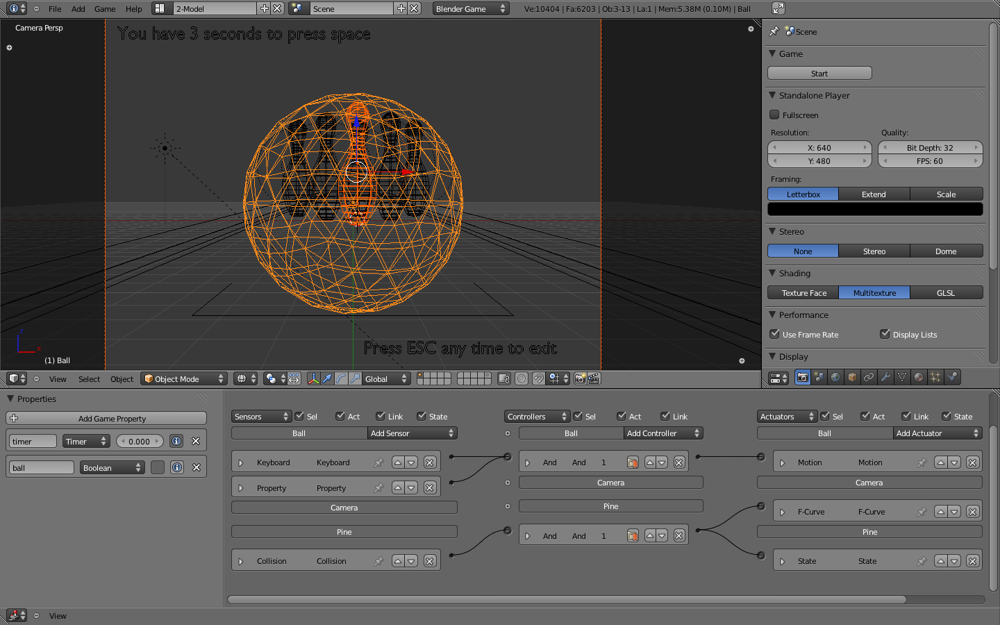

## Architecture 

The game engine was designed to revolve around game objects. Fifteen years ago, when it was first developed, this was a breakthrough design. The idea of having events controlled per object, as opposed to a central controller, worked well for the early days of 3D engines. Nowadays, some people may advocate that controlling elements per object is less scalable and more difficult to manage. That will be up to you to decide. Regardless of your thoughts on that subject, the game engine still allows you to emulate a centralized controlling system, while giving autonomy to each object to deal with its own business. Part of this flexibility is due to the hooked-up Python layer and the Logic Brick system. Through the Python interface, you can replace or at least control most of the effects and logic setups you create with Logic Bricks. With Logic Bricks, you can quickly set up a system that is easy to visualize, implement, and test. The strength of the game engine comes from the trade-off between the two sibling systems. A flexible design may lack features and performance compared to specific engines. Nevertheless, the different kinds of applications you can prototype and develop quickly with the game engine make up for the compromise.

If you look at a level deep into the object structure, you will find that the architecture of the Logic Bricks system is "controller-centric." It revolves around the controllers of the game because they are the ones to determine what do to with the sensors and what actuators to activate. This doesn't have to be followed strictly, but based on this design, you will want to keep your sensors and actuators to a minimum and optimize their usage with the controllers. Actually, in order to optimize the performance, the game engine disables any sensor and actuator that is unlinked to a controller or linked to a controller in a non-active state. This is one of the (many) reasons why Python controllers are so popular. They allow you to replace the use of multiple sensors and actuators by direct calls to their equivalents in the source code. Chapter 7, "Python Scripting," is entirely dedicated to that aspect of the game engine, and will complement the applications of Logic Bricks discussed in this chapter.

## Interface 

Logic Bricks has its own editor inside the Blender interface. While other game settings are spread all over the panels and menus, editing Logic Bricks can be done entirely inside the Logic Editor.

You can see that Logic Bricks are sorted per object and organized according to your own needs. For each individual object, the controllers are executed from top to bottom, as presented in the interface. Nevertheless, there is not much control as to which of the object's Logic Bricks runs first. The criteria of organization for the Logic Bricks tend to reflect more personal preferences and visual clarity needs than internal requirements.

Here are some instructions on how to use the Logic Editor interface.

>**Note**
>
>For those used to the Blender 2.49 interface, you may need some time to get used to the enhanced new design of Blender. The first thing you will notice is that the Physics panel has been moved to the Physics tab at the Properties Logic Editor. If you jumped straight to this chapter and are a bit lost navigating Blender interface, then Chapter 1 should help you find your intended UI element.

### Add 

To add new Logic Bricks, it is only possible for the active object. This one always displayed as first in the Logic Editor list. You can see the Add Sensor/Controller/Actuator button right after the name of the active object on its respective column, as shown in Figure 3.4.

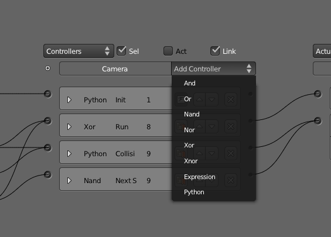

When you click in the button, a pop-up list will show you all the available Logic Bricks that are compatible with this kind of object (for example, Armature sensors are only available for Armature objects). Selecting the desired type will create a new Logic Brick with the default parameters for this particular type (which you will likely need to change). The name of the Logic Brick is automatically created, based on its type, for pure convenience.

>**Quick Ways to Add a Logic Brick**
>
>As a quick alternative, you can use the Add Menu (in the Logic Editor header bar) or press Shift+A (while mouse pointer is in the Logic Editor).

### Remove 

In order to delete individual Logic Bricks, you need to click the "x" icon present in the header of each Logic Brick. By doing this, you are unlinking each Logic Brick with any connected Logic Bricks and removing it. Although this action can be reverted with Undo (Ctrl + Z), simply unlinking a Logic Brick or moving it to an inactive state (for Controllers) is enough to disable it. There is also a Checkbox button that sets active state of the sensor. The game engine will not compute unlinked and disabled Logic Bricks. Thus, it can be handy to have testing sensors and actuators hanging around for later use with no performance impact.

### Link 

Every Logic Brick has a connector used to link it with other Logic Bricks. Sensors show the connector on the right side of their header, while actuators show it on the left side. Controllers are placed between the sensors and actuators, so the connectors are presented on both sides. Drag the connector from a Logic Brick and drop it in the connector you want to link to.

>**Kill Two Birds with One Stone: Linking and Adding a Controller**
>
>Try to link a sensor directly with an actuator on the same object. Blender will automatically create an And controller and link it between them.

You don't need to keep the logics self-contained in single objects. When you select more than one object at the same time, you will see all of them in the Logic Editor. That feature allows you to connect a sensor from one object to the controller of another one and again to the actuator of yet another object. This is one of the key elements for group instancing[md]an advanced way of sharing Logic Bricks, which is covered at the end of this chapter.

>**Message System**
>
>If you found that cross-linked objects can easily become hard to keep track of, welcome to the team. Before getting desperate, make sure that you read about the elegant alternative presented by the Message sensor and Message actuator. Be aware that if you decide for the messaging system, your events will always be delayed by one logic tic, since it will only trigger the sensor in the next logic loop.

### Unlink 

Drag the mouse holding the left mouse button and the Control key to use the Unlink feature. This will activate a knife system to cut the links between Logic Bricks you want to unlink. It works the same way as the Node Editor in Blender.

### Expand/Show/Hide 

Visual organization is a key aspect of working with Logic Bricks. You don't need to edit the values of a Logic Brick all the time so you can often keep most of them hidden. You can hide/show one particular Logic Brick using the arrow to the left of its header. If you want to hide/show all the sensors or controllers or actuators of one object, simply click in its corresponding header.

>**Hide and Show Menus**
>
>On the top of the Logic Editor, you can access a menu to quickly hide or show the bricks for sensors, controllers, and actuators for all the selected objects, as seen in Figure 3.5.

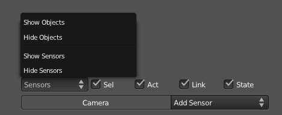

### Move 

When you add a new Logic Brick, it will show up in the bottom of the Logic Bricks stack of the active object. You can move it up and down according to your need. In order to rearrange them, you need to set the Logic Brick to be unexpanded and use the up and down arrow icons.

### States 

Above the list of an object controller, you can see a small but important plus icon. It shows and hides the States control. You can also set initial game states and the ones you want to see at that moment in the interface. In order to learn how to use the State system, look ahead to the end of this chapter in the "State Machine" section.

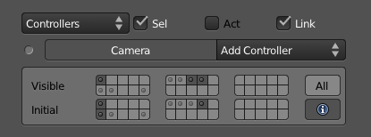

>**States Layers**
>
>When you play the game, the active states of a controller are the ones in the bottom row shown in Figure 3.6, known as _initial states._ The states present in the top row, namely visible states, are a tool to help you visualize different states without messing with the Initial States set. They are reset to the Initial States every time you reopen your file.

The States interface works like the layer system in Blender[md]click to select one state and Shift+click to select more than one. As for the Blender layers, states have no individual names for the time being.

### Properties 

The left panel in the Logic Editor allows you to add and edit your object game properties (see Figure 3.7). Unlike the Logic Bricks, the visible game properties are those of the current active object only. As with other editor areas in Blender, you can hide/unhide this area with the property panel shortcut (N).

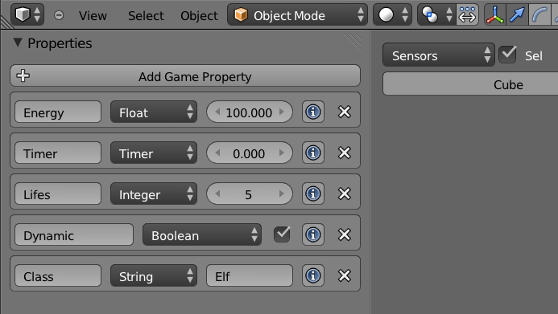

Properties are often used to store a variable characteristic of a game object (for example, life, energy, or speed). In this case, you will be using Property actuators to change the values of a property when hitting an enemy, accelerating, and other sorts of events. On top of that, Property sensors or Expression controllers can invoke different actions when you get to certain values (for example, end the game when life and energy are zero).

Another way of using the properties is to determine how other objects will react to each one. As we will see later on this chapter, there are a few sensors that rely on the existence of a property to interact with an object. Those Physic sensors (Near, Collision, etc.) work regardless of the property value; they check only for the property name, which can't be changed inside the game.

The available properties are: Float, Integer, Timer, Boolean, and String.

Now let's move ahead and look at the functionalities you can use.

### Sensors 

Sensors are the first layer of interaction between your game objects and the game itself, so they need to be planned carefully to avoid overhead on your logic performance. It's usually a trade-off between maintainability and work speed. For the first stages of your project, you may be able to have multiple sensors for the same tests (for example, individual collision sensors for different property and material checks). Later on, when and if performance becomes an issue, you can replace them for a more elegant solution with the same functionality. But for now, you should just focus on playing and experimenting with the presented tools.

The next part of the chapter is structured to serve both as a continuous reading and reference guide. If you read it through, you will capture the big picture of the system, what you can do, and when you might use the specific features. I recommend you read it all at least once. Later, you can revisit this chapter for a deeper perspective on the presented functionalities.

#### Header 

In the first part of this chapter we mentioned some options present in all the logic bricks. Now we will see with more details the properties that are specific for sensor headers, as shown in Figure 3.8.

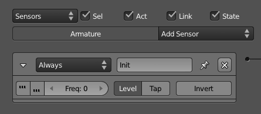

- **Name:** Can be used to identify your sensor, even when it's not expanded. You will refer to it from inside the Expression and Python controllers.

- **Pulse Positive:** Continuously sends positive pulses to the controller while the sensor is active.

- **Pulse Negative:** Continuously sends negative pulses to the controller while the sensor is not active. A negative pulse will not be sent before the sensor is positive at least once or the level is enabled.

- **Frequency:** Sets how often the pulse will trigger the sensor. The frequency is actually the number of logic tics that will be skipped before triggering the sensor again. Keep it at zero to have the sensor pulsing for every logic tic.

- **Level:** Triggers the controller at the beginning of the game or when the controllers are activated from a disabled state. With this option, you can force negative signals (for example, a property is not inside a range, a mouse is not over your object, a key is not pressed) to trigger the controller, even if it never turns positive. Mostly used as part of a state system to force a sensor to be evaluated right after the state of an object changes.

- **Tap:** Triggers the sensor only one at a time. It works opposite to the pulse, and it's especially useful for Physical sensors, Keyboard sensors, and Mouse sensors.

- **Invert:** Still triggers the sensor as it would normally, but sends a negative signal when it starts and a positive one when it stops being valid (for example, when a key is no longer pressed). If you need the sensor to send a negative signal before ever being positive, remember to turn on Level.

#### Always 

Always, as shown in Figure 3.9, is the simplest and most often used sensor. There are basically two ways of using it. When Pulse is off, it will run once when the level starts and never again. When Pulse is on, the sensor will run repeatedly, triggering controllers according to its frequency.

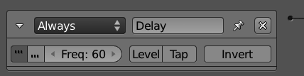

Always sensors are commonly used to initialize actuators, such as Filters 2D, Motion, Scene, Sound, and so on. When combined with the Python controller, this sensor is often used to call scripts that need to be initialized first (when the frequency is zero) and scripts that handle global events (with the frequency set according to the needs of a particular script).

#### Delay 

Similar to the Always sensor, the Delay sensor allows you to postpone the initialization of some actions by some logic tics (see Figure 3.10). You will notice three options here: Delay, Duration, and Repeat.

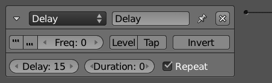

_Delay_ is the initial waiting period before the sensor is triggered. _Duration_ stands for how long (once triggered) the sensor will be positive/active. If you want this to happen cyclically, you can set Repeat on. It's important to note that the Pulse option works on top of those three parameters.

In combination with the Python controller, this sensor is often used to call scripts that require other scripts to run first.

#### Actuator 

Here comes a chicken-and-egg situation. In order to understand this sensor, you may need to get more familiar with actuators first. The actuator sensor is triggered when the selected actuator changes its status (active/inactive), as shown in Figure 3.11. A typical application of it is with the Action actuator. If you use an Expression controller to check for the actuator sensor status (for example, actsensor=false), you can trigger another action right after an animation is done.

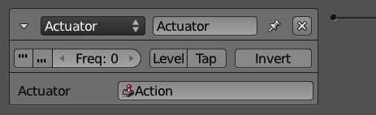

>**Actuator Sensor and the Messaging System**
>
>In the online files, you can find a file that illustrates how this sensor can be used with the message and the animation system: _\Book\Chapter3\sensor\_actuator.blend_

#### Joystick 

Don't listen to those Kinect fanboys, joysticks are still here to stay (see Figure 3.12). Start by selecting your Joystick Index, which means you can work with multiple joysticks in the same game. For every Joystick sensor, you can control one of the following: Hat, Axis, Button, and Single Axis.

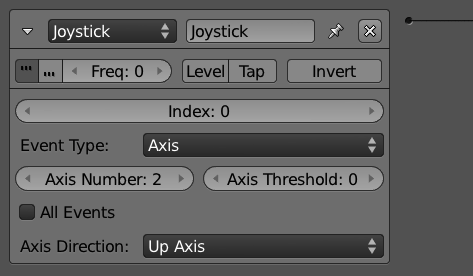

#### Keyboard 

You don't want to map your keyboard, key by key to individual Keyboard sensors (see Figure 3.13). Yet you can. In order to provide flexibility for game developers, the game engine can control actions on an individual key basis, capture modifiers (traditionally Alt, Ctrl, Shift but extended to any key), or on no particular key. For the latter, the option All Keys linked to a Python Controller is the way to go, although for a full Python approach, you don't even need the Keyboard sensor.

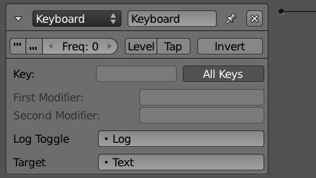

Log Toggle and Target work together. When the Log Toggle property value is True and a String is set as Target, you can keep track of all the pressed keys by a given sensor. It can be used for debugging or even for direct input of texts for a property.

In the online files, you can see a sample of that: _\Book\Chapter3\sensor\_keyboard.blend_

>**Keys Status on Python**
>
>The keyboard sensor will send a positive pulse when the specified key is pressed down and a negative one when it is released. The status of the key is represented by Python constants: bge.logic.KX\_INPUT\_JUST\_ACTIVATED right when it's pressed, bge.logic.KX\_INPUT\_ACTIVE while it's being held, and bge.logic.KX\_INPUT\_JUST\_RELEASED right after it's been released. Its status can only be accessed from a Python Controller.

#### Mouse 

The Mouse sensor is used to control the mouse input in the game. It can be used entirely with Logic Bricks or integrated with Python. Be aware that individual sensors are needed to handle different mouse events and most of them are not handled per object (see Figure 3.14). The mouse events are separated in two different types commonly combined together:

- **Mouse inputs** - general input: Movement, Wheel Down, Wheel Up, Right Button, Middle Button, and Left Button.

- **Mouse actions** - per object: Mouse Over and Mouse Over Any.

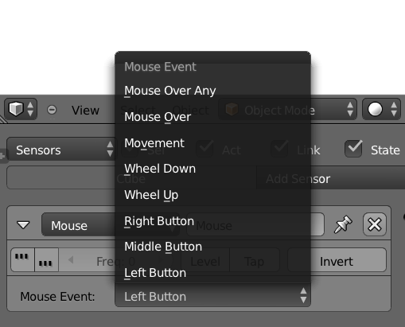

If you run an actuator when a mouse input is triggered (for example, Left Button), the action will happen, regardless of where the click is. If you need an actuator to happen when you click on one particular object, then you need a Mouse Over and a Left Button linked through an And Controller.

>**Collision, Physics and Mouse Click**
>
>In order to be clickable, an object must have collision enabled in the Physics Panel.

#### Armature 

Armature is an advanced sensor to help you detect error threshold on bone constraints (see Figure 3.15). It was created as part of the IK solver implementation integrated by the developer Benoit Bolsée.

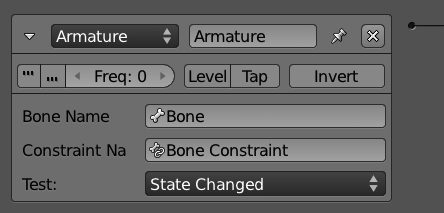

The original goal of this set of functionalities was targeted at robotic studies, so it may rest outside the scope of your project. If you are going to use iTaSC (instantaneous Task Specification using Constraints), this sensor will help you keep track of your armature constraints. For more information, please visit: [http://wiki.blender.org/index.php/Dev:Source/GameEngine/RobotIKSolver](http://wiki.blender.org/index.php/Dev:Source/GameEngine/RobotIKSolver)

>**To Caesar What Is Caesar's**
>
>The armature sensor is only available for armature objects. If you copy this sensor to non-armature objects, the panel will show "Sensor only available for armatures," and the sensor will be inoperative.

#### Touch 

The Touch sensor is a subset of the Collision sensor. Actually, they share the same code internally. It's likely to be deprecated in the future.

#### Collision 

The Collision sensor can be used to detect collisions between a game object and other objects or the environment (see Figure 3.16). You can filter the collision to only trigger the sensor when the object hits a face with a specific material or an object with a particular property (use the M/P button to toggle between them). As with the Physics sensors, this sensor is dependent on the Physics properties of the objects involved in the interaction (collision, ghost, bounding box, and so on). Look at Chapter 6, "Physics," to read about the physics settings for the objects and the game.

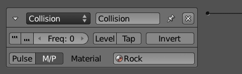

This sensor is often used with collision proxies, which are invisible low-poly meshes created to spare your heavy graphic objects from the expensive collision tests.

>**Use It Moderately**
>
>Together with the other Physics sensors, this sensor is considered to be expensive computation-wise, so use it reasonably and use physics proxies whenever possible[md]a topic discussed in the Chapter 6 and Chapter 8, "Workflow and Optimization."

#### Near 

For more advanced control over the physics interaction of your game, you can trigger actions based on the distance of the objects in your scene before they even collide. Unlike the Collision sensor, the Near sensor is only sensitive to Property detection (see Figure 3.17). Leave the Property blank, and it will detect all the objects.

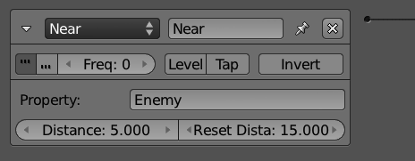

This sensor will be triggered when a detected object is closer than the Trigger Distance. Once triggered, it will only stop being valid after the object is farther than the Reset Distance.

>**The Amazing Near Sensor**
>
>The Near sensor detects all directions. It's the game engine equivalent of the Spider-Man sense.

#### Radar 

The Radar sensor creates a detection cone locked up to one direction (see Figure 3.18). You must choose the axis, the distance, and the angle of your detection radar. Similar to most of the other Physics sensors, you can filter the detection per property.

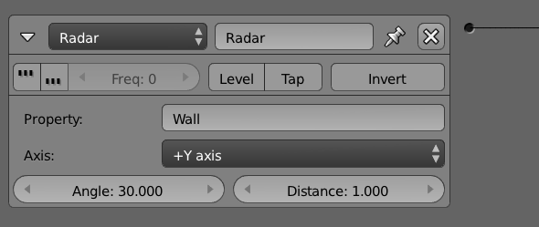

>**Troubleshooting and Debugging**
>
>In order to easily debug your radar settings in the game, you can turn on the Show Physics Visualization option in the Game Menu. The result is shown in Figure 3.19.

#### Ray 

The Ray sensor can only cast rays in a specified axis (relative to the object) and as far as the determined range distance goes. Although it may seem limiting, this makes it the fastest Physics sensor available (see Figure 3.20).

In order to get more data from the casted ray, you can access the sensor from a Python Controller. The API allows you to access hitObject, hitPosition, and hitNormal.

If X-Ray Mode is on, the ray will only stop when hitting an object with the property or material specified. Otherwise, it will stop when the first object returns None, in case of a non-match.

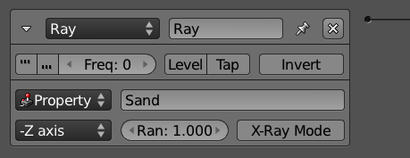

#### Random 

The Random sensor generates pulses randomly (see Figure 3.21). Its use is so generic that it is misleading to define one specific application for it. You can change the Seed property to produce pseudo-random pulses. When the seed is zero, it works as a regular Always sensor.

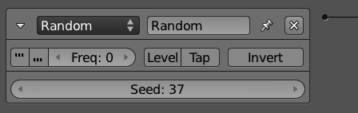

>**Do Not Use It Randomly**
>
>Use the Random sensor together with other sensors to add an organic dynamic to them. It's especially useful for environment behavior and artificial intelligence (A.I.).

#### Message 

The Message sensor receives a message sent from a Message actuator or from a Python controller (see Figure 3.22). A game object will receive any message sent specifically to it or broadcast to all the objects. To achieve another level of control, you can use the optional Subject field to filter the messages of a particular subject (not triggering it otherwise). Take a look at the Message actuator for a longer explanation.

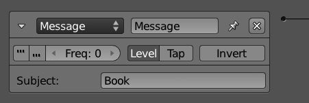

>**Extra Message Information**
>
>>The extra information available in the message (subject, body) can be accessed only by a Python controller.

#### Property 

The Property sensor helps you use Properties effectively for your game objects (see Figure 3.23). A game property usually does not change any aspect of your game directly (see the note "Expressions"). Instead, they store a value (for example, life points) to be interpreted and to invoke specific actions and effects.

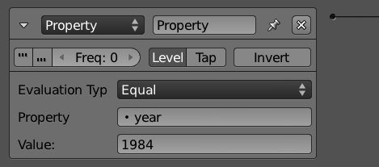

This sensor has different evaluation types that allow you to detect specific values, track ranges, or sense any property change. Respectively, they are: equal, not equal, interval, and changed. Be aware that the intervaloption should not be used by Strings and Booleans, but it is the only one recommended for Timer properties.

The exceptions are properties used by Python scripts, those used by Filters 2D, and Text strings used by Bitmap Texts.

>**Expressions**
>
>Instead of direct values, you can use an expression in the value fields for this sensor. Take a look at the Controller Expression for more details.

### Controllers 

Sensors can't do much for themselves without controllers. As explained in the architecture section, controllers are the central piece of the Logic Bricks, because all events pass through them, as well as the actions of the game. Yet, they are simple to understand and use. For games using only Logic Bricks, you will be using one or two types of controllers most of the time. Indeed, until a few Blender versions ago, we didn't have more than four kinds of controllers.

In this section, the Expression Controller deserves special attention due to the possibilities that it brings. The Python Controller, on the other hand, is the shining star of another section of the book, as it reveals a world of complexity and promises. It can be skipped for now and revisited once you get to Chapter 7, "Python Scripting."

>**Using States as Organization Layers**
>
>The controller state system was designed to help in building advanced state machine systems. But as it turned out, it works great as a way to organize your Logic Bricks. You can use different states as layers, to group controllers and their linked sensors and actuators. The initial state of the controller needs to include all the states you set. But while working, you can alternate the visible states to show only a small parcel of them at a time.

#### Header 

Similar to the sensors, each controller carries a unique set of information, regardless of its type. Pay special attention to the State and Mark options, both unique to Controllers. In Figure 3.24, you will find all the options available on their headers.

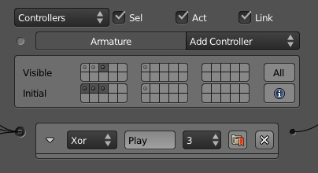

- **Name** : Unlike the sensors and actuators, the name here has no importance other than to keep your controllers easy to identify when not expanded.

- **State** : Set the state (from 1 to 30) of the controller. To read about the State Machine system, check out the "State Machine" section in this chapter.

- **Mark** : Forces the controller to run before non-marked controllers.

#### Booleans 

When you have one single sensor that has to call an actuator, there is not much to worry about. In this case, a simple And controller will make it work. If instead you need to activate the actuator only when the sensor is False, you can use the Invert option to keep using the same Add controller. Too simple? Let's complicate it a bit then. What if you have two sensors and only one of them needs to be True? You could create two And controllers linked to the same actuator. It's not elegant, but it would work.

>**How Many Times Can You Activate an Actuator?
>
>If you think that the setup above would call the actuator twice, then have fun testing it. An actuator is activated only once per frame, regardless of the number of controllers calling it.

But what if you wanted to use only one controller to handle those two sensors? In this case, it would be the Or controller, created specifically for that. That's not all, though. Either for convenience or for more advanced control, you could simplify your controllers by using the other Boolean controllers. Together with And and Or, those are the other logic switches to use when combining multiple sensors and their outcomes.

- **And** : True if _all_the sensors are True. False if _any_ of the sensors is False.

- **Or** : True if _any_ of the sensors is True. False if _all_ the sensors are False

- **Nand** : True if _any_ of the sensors is False. False if _all_ the sensors are True

- **Nor** : True if _all_ the sensors are False. False if _any_ of the sensors is True

- **Xor** : True when _only one_ sensor is True. False if _more than one_ sensor is True or if _all_ the sensors are False.

- **Xnor** : True if _more than one_ sensor is True or if _all_ the sensors are False. False when _only one_ sensor is True and _all_ the other sensors are False.

#### Expression 

Sometimes logic switches don't give you enough control to evaluate your sensors. You may want to compare the value of more than one property at once, or maybe even to check for specific arranges in your sensors, calling the actuator only when some sensors are positive and others negative. Or why not (it's your game after all) do all of this together? As you have guessed, expressions can handle all of those situations and a few others.

Before going into all of the options, let's first take a look at some examples:

First case: We want to eliminate your player when the energy is zero, and there are no lives left. So we create two game properties, named "energy" and "life," and control them with the expression:

energy<=0 AND life==0

Simple, right? But what if you want to finish the game when you type "quit"? Now you need a keyboard sensor with all keys logged to a text property. The expression would be:

text=="quit\n"

>**End of Line**
>
>Here we are using \n to identify a Return (Enter) right after the word. You can see this last technique combined with other actuators and different objects on: _\Book\Chapter3\controller\_expression.blend._
>This is especially powerful for quick prototyping and debugging of your game.

Expressions tend to be as simple as the examples presented. They can grow big, however, and the following parts will show how to combine simple expressions to create more advanced controllers. Keep in mind that expressions are actually used also in the Property sensor and Property actuator. The difference is that for them the result will be directly used as the property value. Therefore, there you will use mostly Values and Arithmetic Operations. For the Expression controller, the expected value is always a Boolean, so you end up using Comparison Test and the Boolean Operations more often.

>**Error Checkpoint**
>
>Always check the console for errors. If the expression is incorrect, the game engine will print an error when you call the controller.

#### Values 

The simplest expression contains no more than a single value. If you want to check if a Boolean property is true, you only need to use its name as a value:

my\_property\_that\_may\_be\_true

For the Controller Expression, you will only use the lonely value when dealing with Booleans; however, for the Property sensor, Property actuator and as part of big expressions, you can also use the following types as values:

- **Boolean** : True, False

- **Number** : 5, [ms]7, 3.5, 40, 3.5[md]integers and floats, positive, negative, and even zero.

- **String** : "text"[md]always around quotation marks.

- **Property** : propertyName[md]gives the property value.

- **Sensor** : sensorName[md]gives True or False according to the sensor status.

A single value is not exactly an expression. Let's move on and see what kind of expressions and operations we can make when combining them together:

>**Sensors in an Expression**
>
>In order to use a sensor name, the sensor has to be linked to the Expression controller. Sensors can't be used in the expressions for the Property sensor and the Property actuator.

#### Comparison Tests 

If instead of testing a single variable, you need to compare two values, there are five different comparison tests you can use. The test can be between a variable (property or sensor) and a value, two values, or two variables:

- **Equal** : fruit = "jabuticaba"

- **Greater** : 2.5 > 2.49

- **Lesser** : energy < 37

- **Greater or Equal** : speed >= 100.0

- **Lesser or Equal** : timer <= 2011

The result of a comparison test will always be a Boolean. If you need to return a value other than True or False, then what you are looking for is:

**Condition Statement** : IF (frame < 0, [ms]1, 0)

The syntax is: IF (Condition, ValueWhenTrue, ValueWhenFalse). If you use the above expression as a value for the Add mode in a Property actuator, it will decrease the counter (for example, frame) if the value is greater than zero.

#### Arithmetic Operations 

If your value is numeric, you can also manipulate it a bit. This can be used to assign a value based on a variable (for example, speed \* time) or as part of a test (for example, energy + potion > 0). The most basic math operations are supported to operate your value, for the records:

- **Addition** : 1 + 3.8

- **Subtraction** : 10.5 - 5

- **Multiplication** : 23 \* 1000

- **Division** : 37 / 400

- **Modulus** : 10 % 3

#### Boolean Operations 

Finally, you have the capability of combining Boolean tests together. A Boolean test can be a simple Boolean value (for example, a sensor or a property value) or the result of a comparison test. They work as aggregators through which you can compile big expression tests.

- **And** : potionKeyboardSensor AND numberPotions > 0 AND energy + 30 < 60

- **Or** : speed <= 0.0 OR stopKeyboardSensor

- **Not** : jumpKeyboardSensor AND NOT floorCollisionSensor

The Boolean operations are not commutative or associative when grouped together. For example, try to read the following expressions:

1 = 2 AND 3 > 4 OR 5<6

False AND False OR True

They are intentionally ambiguous. Are we testing the AND or the OR first? In order to solve this issue, you can use parentheses to isolate your expressions. The previous expressions are evaluated as:

(1 = 2 AND 3 > 4) OR 5 < 6

(False AND False) OR True

Those expressions will result in true (false or true = true). If the expected result was false, we should have grouped it as:

1 = 2 AND (3 > 4 OR 5 < 6)

False AND (False OR True)

You can find an elegant use of the Boolean operators to create a toggle mechanism on: _\Book\Chapter3\controller\_expression\_toggle.blend._

>**Fake Flipper Animation with Expressions**
>
>In the accompanying material, you can see a simulation of the Flipper animation mode implemented using the Property mode instead. This is done in two different ways: one with a Expression controller, and another with a Nand and And controllers and an Expression in a Property actuator. It shows the flexibility of the system and is a nice way to regulate the speed of your animation: _\Book\Chapter3\controller\_expression\_flipper.blend_ .

#### Python Controller 

With a Python controller, you can evaluate sensors and activate actuators just as you would do with the other controllers. You can indeed replace any of the tests (logical switches or expressions) by an equivalent in Python. Actually, not only can the other controllers be replaced by this, but also most of your Logic Bricks as well. Chapter 7 is entirely dedicated to how and when to use this controller. Even if you are not into programming, we recommend you read the introduction sections of this chapter to understand its differences and advantages.

There are two types of Python controllers: Script and Module.

- **Script** : This will take an internal Text datablock and run it as a script.

- **Module** : This will call a module from a script file inside or outside your game file. The Module mode has a Debug option that forces the module to be recompiled every time you call it. This is really slow, but allows you to do changes in your script while your game is playing.

>**Which Came First, the Controller or the Controller?**
>
>For scripts, the order in which the controllers is executed matters. In cases where you need a script to run before the others, you can use the Mark option present in the Controller header. This is commonly used for Python controllers running scripts that are responsible for the initialization of your game variables and settings.

### Actuators 

Last, but not least, there are the actuators. The trouble you've taken setting up sensors, controllers, and noodle linking will finally pay off. The actuators are grouped per themes (scene, game, object, actions, and so on), and their names and applications may surprise you. (For example, did you know the Camera actuator doesn't have to be used by a camera object?) We recommend that you familiarize yourself with all the options and sub-options and experiment with them as much as you can. While some effects work by themselves (for example, the game actuator), some will be more useful when combined together (for example, motion and action actuators). Have fun!

#### Header 

The header of the actuators is similar to the sensors. Like the sensors, the Name is an essential element when using the actuator with a Python controller. In Figure 3.25, you can also see the Pin, a special option available to be used with controller states.

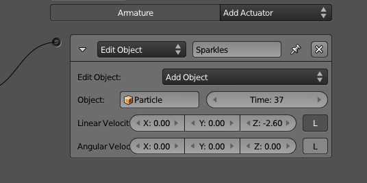

- **Name** : This can be used to identify your actuator, even when it's not expanded. It's also used from Python scripts to activate it.

- **Pin** : When working with the State Machine system, you can use the State option on top of the actuator list to show only the actuators linked to controllers from visible states. With the Pin option in the actuator header, you can set your actuator to be always visible.

#### Action 

Camera, lights, action! And let the animation begin. Whether you want to animate your Armature or you want to play a pre-recorded Action, you will end up using this actuator. An action can contain different F-Curves, controlling various object properties. If you split your property curves in different actions, you can control them one at a time. For example, leave Size and ObColor in the same action, and you can have a banana that is green when it's still small and turns yellow while growing.

You can also have the same property present in multiple actions and use individual actions to store different animations.

>**Short Actions in the Long Run**
>
>Before the animation system redesign in Blender, it was only possible to have multiple actions for armatures and shape keys. Therefore, for any other animated action, people would create one really long action with different animations in different frame ranges. This still works well, but it's hard to manage if you ever need to change the length of one of the animations[md]you would have to update the start and end of all the actuators that were playing the other subanimations. You may find yourself still using this technique in order to organize your file; however, sometimes a long action can be easier to manage than multiple small ones.

The actuator will let you pick an action, set the frame range, and configure how you want to play it (see Figure 3.26). If you are planning to reuse this actuator[md]for example, for linked/shared Logic Bricks[md]you can leave the action blank and set it through the Python API during the game engine. In Chapter 4, "Animation," we will use this actuator in a series of tutorials.

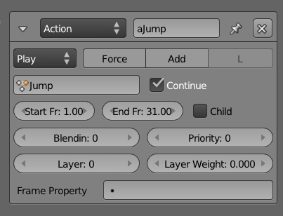

##### What Can Be Animated 

Some of the animations you create in Blender can be used in the game engine. The same result you see in the viewport when you play them back with Alt+A, you can also get in the game engine. That includes armature poses, shape keys, and some of the properties of object, material, light, and camera as following:

- **Pose** : Any recorded sequence in an Armature object can be played. It's common to have different animated cycles[md]walking, running, jumping, tired walking, taking a break[md]and to alternate between them during an event. When using multiple action actuators, you may have an action currently playing when you start a new one. To make the transition smoothly, you can set the Blend In and Priority to respectively blend the animations for a certain number of frames and to play the new animation on top of the old one.

- **Shape Keys** : Similar to poses, you can play the shape key actions created in the DopeSheet Editor with control over the blending, priority, frames, and so on. There is even a Continue option common to both that allows you to start the animation when you left the last time you activated it. Remember that you don't play the individual shape keys but rather the action that stores their influence on each other over time.

- **Object Properties** : Location, Rotation, Scale, Color, and Physics properties (Location and Rotation Damping, Anisotropic Friction).

- **Material** : Diffuse Color.

- **Light** : Energy, Color, Distance, Attenuation, Spot Size and Spot Blend.

- **Camera** : Start/End Clipping and Focal Length.

##### What Cannot Be Animated 

Unfortunately, not everything we can animate inside Blender can be animated in the game engine. More specifically, the following elements can't be animated with the Action actuator:Drivers, Scene, World, remaining Object, Material, Camera, and Light properties.

Be aware that this may change in the near future. And some of these settings behave differently, depending on the render mode (GLSL, MultiTexture).

>**Animating More Elements via Scripting**
>
>Some Scene settings, such as Shading Mode, Mouse Cursor, and Eye Separation, can be set through the Python API. The same is valid for World settings, such as Mist, Background Color, Physics and Logic Maximum Steps, and FPS.

##### Object Settings 

If you are not animating an Armature Pose or a ShapeKey, there are extra options you can use, as below and highlighted in Figure 3.27.

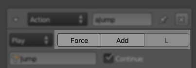

- **Force** : If your object is Physical Dynamic, you can apply the transformations (for example, location) as a mechanical force. This avoids the "ghost" effect of having objects trespassing each other when their new location overlaps. With force, they will simply collide.

- **Add** : Evaluate the fcurves as relative values. This way you can add the transformations on top of each other, instead of setting a new position/size/rotation.

- **Local** : Apply the transformations in local or world coordinates.

##### Play Modes 

The game engine, by default, plays the actions from the start to the end frame, and stop. There are times where you may want to loop the animation, play it backward, or even control the playback speed in a different way. This can be achieved by changing the Action actuator playback type, as you can see in Figure 3.28.

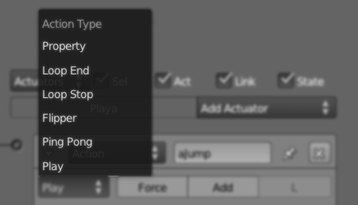

- **Play** : Plays the action from start to end frames. If you want it to play again, you have to send a new positive signal to the actuator (for example, a Keyboard sensor with Pulse enabled can have the animation playing interruptedly if a key keeps being pressed).

- **Ping Pong** : Plays the animation from start to end. Next time, it will play it from end to start. Then start to end, and end to start again. And ping, ping, ping, pong.

- **Flipper** : Plays it until you keep it valid. As soon as you stop with the positive signal (for example, you release the key), it plays back to the initial frame. This happens even if the animation was only halfway through the frames.

- **Loop Stop** : Plays the animation while the actuator is valid. If the animation gets to the final frame, it loops back to the start frame. If the actuator is no longer active, it stops right away.

- **Loop End** : Plays the animation continuously going to the initial frame after reaching the final one. If you interrupt the signal in the middle of the action, it will behave like the Play mode and play it all the way until the end frame.

- **Property** : Instead of using a start and final frames, you drive the animation by a game property value. You can use any number, integer or not, as the property value. That way, you can have pretty smooth playbacks. With this option, you can also simulate slow-motion, time-lapse, or even create your own Play mode by controlling the property change as you will.

##### Blendin, Layers, and Priority 

If you need to play multiple actions for the same object, you need to configure their transitions and how they will interact. So you need to explore the remaining options in the Action actuator interface: Blendin, Layers, and Priority. Blendin works as a cross fading effect between actions, while Layer allows to have different actions playing at the same time.

- **Blendin** is necessary when you need to switch actions. More specifically, it's vital when you want to smoothly fade from one animation to another. Imagine, for example, that your character is walking and then starts to run. Even if the frames of both animation cycles start and end exactly alike, the effect will be strange. The difference in speed of the actions will make the transition too noticeable and unnatural. Thus, unless you are animating an old car with some engine problems, you don't want the transition to be so abrupt. Therefore, you can Blendin the new action (for example, to run) within the current one (to walk). Blendin works even if the old animation is no longer playing. Note that Blendin only works between Action actuators that are in the same animation Layers.

- **Priority** will determine the execution order of different actions in the same layer. If you have two or more actions playing at the same time, which one will be played? This will be up to the priority to decide. The actuator with the lowest priority will be the one played (so a low priority number equals a high execution priority).

- **Layer** allows you to have concurrently playing animations. In other words, you can stack multiple actions to be played independently. For example, you can have a base layer for the body actions and a top layer for the face animations. While the body can be playing a walking animation, the face can be playing different idle actions. Splitting actions in separate layers (and separate Action actuators) also allows for gradual blending between the actions.

- **Layer Weight** sets the ratio of influence of the previous animation layers to blend into the current Action actuator.

#### Armature 

The Action actuator is not the only way of moving and controlling your armature. With the help of bone constraints, armatures can perform autonomous interacting with other objects. Together with the Armature sensor, this actuator was originally created for robotic simulations. Nevertheless, these kinds of non-baked/pre-done bone animations can serve multiple purposes. For a proper explanation on when this can be used and how it works, please refer to the iTaSC section in Chapter 4, "Animation."

And for more information, please visit: [http://wiki.blender.org/index.php/Dev:Source/GameEngine/RobotIKSolver](http://wiki.blender.org/index.php/Dev:Source/GameEngine/RobotIKSolver)

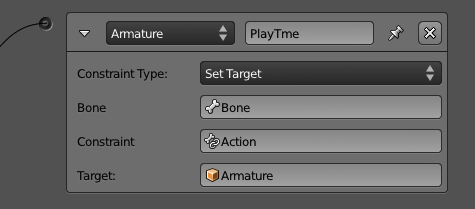

The actuator modes are the following:

- **Run Armature** : Runs the simulation in this armature.

- **Enable** / **Disable** : Takes a bone and a bone constraint as arguments. It allows you to control when this particular constraint should run.

- **Set Influence** : Sets the influence of a bone constraint dynamically.

- **Set Weight** : Sets the weight of the IK influence in a bone.

- **Set Target** : Sets the targets for a bone constraint. When using the Inverse KinematicConstraint, you can also set the Secondary Target (also known as _polar target_).

>**Dynamic Constraints**
>
This actuator only works for Armature objects. If you want to drive some of the bone parameters (for example a bone constraint influence), you need to have an active Armature actuator with the "Run Armature" option.
You can find an example of Set Influence with Run Armature in the sample file \Book\Chapter3\influence\_dynamic.blend.

#### Camera 

The Camera actuator will move your object (usually your active camera) behind the specified axis (X or Y) of the camera object (see Figure 3.30). The front part of your object is its Y axis, because this is the one used in the final alignment. It will not act right away, though. The more you activate it, the closer you get from the specified parameters: Min, Max, and Height. After reaching the target, your object will keep "bobbing," while making sure it keeps itself inside the distance determined by the Min and Max range.

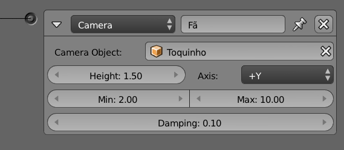

>**Tips**
>
>If You Are Looking to Change the Active Camera, Keep Looking
>
>If you are trying to change the active camera of the scene, please look at the Scene actuator.

#### Constraint 

The Constraint actuator takes control over your object position and orientation. You can use it to make sure that an object is always close to the ground, which is probably the most popular application of it. If you are into physics demos and sci-fi games, you might use it to simulate an anti-gravitational field. What if you want to make a bop bag? A Constraint actuator will make it for you. (Well, you do have to set it up.)

##### Location Constraint 

With the Location Constraint option, the actuator will move your object inside the specified range (see Figure 3.31). It doesn't have to happen right away, and this is one of the beauties of it. You can set a Damping factor, which will determine how many frames it will take for the object to get in the right position; this produces very smooth results.

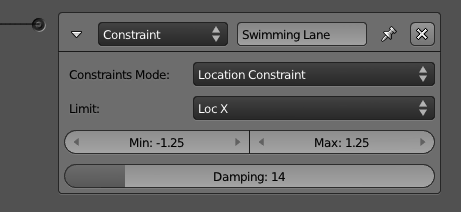

The Min and Max are global coordinates and can only restrict one axis at a time. To lock your object into a three-dimensional cage, you need three distinct Constraint actuators. This will give you full control over the range of positions where your object should be.

##### Distance 

The Distance Constraint option compares and controls the distance between your object and nearby objects (see Figure 3.32). You first have to determine which axis you want to use for the distance check. If you toggle the **L** button, the actuator uses the object axis; otherwise, it uses the global one. The game engine will cast a ray in that direction and try to find a surface that has the game property or the material specified with the M/P option. It uses the Range to determine the maximum length of the casted ray. If the ray hits a face, the following options will be considered:

- **Force Distance** : Sets the new distance between your object and the found/hit surface.

- **Damping** : The number of frames for the repositioning to be complete.

- **N** : Turn it on, and your object will be aligned with the (normal of the) found/hit surface.

- **RotDamping** : The number of frames to complete the alignment rotation.

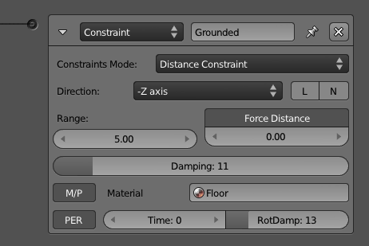

>**Until a Negative Signal Do Us Part**
>
>This actuator will be active as soon as it is triggered and will remain active until it receives a negative signal or can no longer find a surface (for example, the floor) in the given range. If you want to keep your actuator active even when it doesn't find a surface to be constrained to, you can turn on the Persistency **(PER)** option. If Time is greater than zero, it will set the maximum activation period of the actuator.

#### Orientation Constraint 

Instead of affecting your object's position, the Orientation Constraint option will restrict its rotation on individual axes (see Figure 3.33). It aligns the specified axis with the reference direction. For example, if you want to make your bop bag stay straight, you can use Z as Direction and 0, 0, 1 as the Referencedirection. As with the other Constraint Actuator options, you can set Min and Max angles, Damping frames, and the Time.

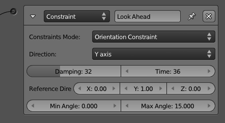

#### Force Field Constraint 

The Force Field Constraint simulates a spring field underneath your object (see Figure 3.34). The effect is similar to hovering above water or simple buoyancy. Force fields can also be set with the Physics settings in the Material Panel (see Chapter 6 for details).

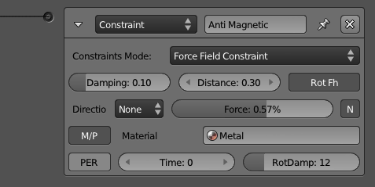

The special options are the following:

- **Force** : Spring force of the force field.

- **Distance** : Height of the force field.

- **RotFh** : Aligns the object axis with the normal of the force field.

- **N** : Adds a horizontal force to (the slopes of) the field.

The rest of the options behave as the ones presented for the other Constraint actuator types **:** Direction, M/P, PER, Time, Damping, and RotDamping.

#### Edit Object 

There are a few actuators that feel as if they could be split into individual ones. The Edit Object is certainly one of them (see Figure 3.35). With this actuator, you can add more objects into your scene, remove your object out of it, replace its mesh, track its orientation to another object, or eventually alter some of its physics dynamics settings. Let's take a look at them:

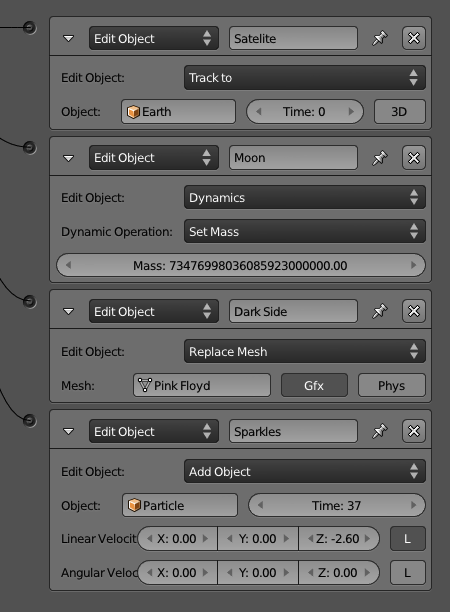

- **AddObject** : If you have objects in one of the non-visible layers, you can add them into the game with this option. The added object will be at the position and with the orientation of the object controlling the actuator. The scale, however, will be a combination of both objects. Other than that, the new object is pretty much autonomous[md]actually game property and logic bricks in the new object will be as good as if the object existed since frame one. The only exception is the Timer game properties that start counting only when the object gets added. You can add multiple instances of the same object, and any of them will behave as an independent duplicated copy of it.

Through the options in the interface, you can change the initial linear and angular velocity of the object and its life duration.

>**For More Control Go with Python**
>
>There are so many applications for this feature that it is hard to narrow them down to one example. They run from dynamically populating your game to creating short duration particle effects. You may find yourself looking for more control over added objects, and scripting may address this for you. Through the Python API, you can access the previously added object, get its life span, or even completely replace the actuator by its Python equivalent function KX\_Scene.addObject().

- **EndObject** : Take a deep look at your game object. Now turn away and say bye! Not only will your object be removed from the game, but also any child object parented to it.

- **ReplaceMesh** : If your object is not an Armature, a Camera, an Empty, a Lamp, or a Text, it does have a mesh attached to it. And if it has a mesh, it can have it switched into a different one. There are two options here: to replace the graphic mesh[md]the one you see rendered[md]or to replace the physical mesh[md]the one used for physics interactions, viewed with Show Physics Visualization.

>**But Isn't This Slow? Not Really**
>
>This feature works pretty fast. All meshes in the blender file are preconverted when the game is launched. When the actuator is activated, the game engine simply swaps the current mesh for the new one. This works even if there is no visible object using the mesh you want to replace, or there is no object at all; just make sure to keep the mesh alive with the "fake user" option.

This option can be used to implement what is known as level of detail: you swap your object mesh based on its distance to the camera. Whether the extra stress on your Logic and eventual scripting makes up for the gain in rasterizer performance will be up to your particular game.

- **TrackTo:** Unlike the Camera actuator, this Edit Object option will not move your object but rather change its rotation. Your object will work as a security camera tracking the object specified in the Object field. The 3D tracking option allows for three degrees of freedom in the tracker object. If Time is bigger than zero, it will determine how long a tracking lasts before the actuator is reactivated. To change the tracking axes, go to the Relations Extras options in the Object panel.

- **Dynamics** : Rigid Body and Dynamics can be turned off and back on here. That doesn't make a static object into a Rigid Body or Dynamic. It works to temporarily (or permanently) disable the physics behavior of one. The mass of the object can be changed here as well.

#### Message 

There are different ways to coordinate actions between different objects. As presented earlier, one of them is through linking logic bricks from different objects. That is not only messy, but also limiting; you can only link objects if they are both present in the game altogether (ruling out dynamic added objects); nor you can broadcast an action over multiple objects without linking them manually. A good alternative is to use the Message actuator to send a message for other objects (or for itself). The three optional available fields are: To, Subject, and Body. You can see them in Figure 3.36.

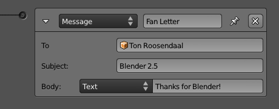

If you don't know which object to send the message to (or want to send it to more than one), you can broadcast it instead. For that you simply have to omit the To parameter. A Message Sensor[md]the other part of the story[md]can filter messages by their Subject. The Body can only be retrieved by a Python script, and it is commonly left blank when you only want to trigger an event, not to pass a value. The Body can be either a text or the value of a property.

> **The Real Thing About Real-Time Is That It Has a Delay**
>
>Be aware that messages are only going to be detected by the Message sensor in the next Logic cycle. Therefore, it's not a full replacement for linked Logic Bricks.

#### Motion 

_"My body move, move, my body …move!"_[md]hippo dance/pickup line (one of the best moments of DreamWorks' _Madagascar 2_).

It moves, but it does it in distinct ways. For example, an animated character will use an actuator to control the bones and a Motion actuator to control the general movement of the object into the scene[md]its orientation and position. So unless the game character is doing a windmill exercise, your walking cycle will need this actuator. As a matter of fact, any object[md]with or without an action assigned to it[md]may need to rotate and move around. Therefore, this is one of the most important actuators and vastly used for a game. Let's take a deep look at the two available methods: Simple Motion and Servo Control.

>**Rotate It Just a Bit**
>
>Once activated, this actuator will keep playing until it receives a negative signal or until it stops receiving the positive ones. So if you want to rotate your object a few degrees only when you press a key, you must use the Tap option in the Keyboard sensor.

##### Simple Motion 

The simplest way of moving an object is by changing its location in a specific direction. You can determine the offset in the X/Y/Z axis and in the next frame, your object will be that far from its original position. You can apply a rotation the same way, by considering the angle you want to rotate each of the axes every time. In Figure 3.37, you can see the barebones for this actuator.

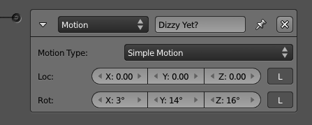

But what happens if your object is a dynamic one? If the object is already being controlled by the rules of physics, you can interact with it on that instance as well. Dynamic Object Settings allow you to apply physical changes into your object and let it react to them. Instead of displacing it a few units away, you can actually push it with some force into a given direction. What will stop the object from moving in this direction forever? As in the real world, the reaction from the other objects will produce resistance through surface collision (also known as _friction_). There will be times when you want to move your object regardless of the other game actors' physic meshes. For those, you can still rely on the Loc and Rot options.

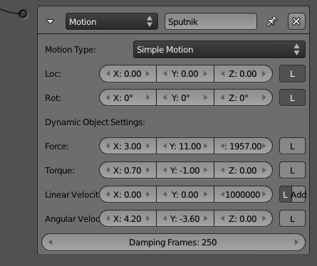

When your object is a dynamic one, you will see new options in the actuator (see Figure 3.38). Force, Torque, Linear and Angular Velocity, and Damping were all explained earlier. The difference between Force, Torque, and Linear and Angular Velocity is simple: when you use Force and Torque, you are adding physic momentum that will be applied to the object mass and result in a specific velocity. When you set the velocity directly, you have the game engine making sure the applied momentum will result on that velocity. There is also an option to Set or Add the Linear Velocity on top of the existent one and specify the Damping Frames to simulate acceleration; those are the number of frames that it will take to reach the target velocity.

>**Local and Global Again**
>
>In Blender, there are two main coordinate systems: Local and Global. Whenever you refer to an axis, you should be aware of the system you want to use. The default one is always the Global (also known as _World_) and will use the absolute X,Y,Z reference of your scene. When you want to use the Local one, which is shown as an L in the interface, the axis used will always be relative to your object's current orientation.

##### Servo Control 

This is a more complex and complete method for controlling your object's linear movement. The Servo Control option enables you to control speed with force. It will apply a variable force in order to reach the target specified speed. It can be used to simulate the most varied effects, such as friction, flying, sliding, and so on.

The Servo Control can (and should) be used for any object, regardless of its dynamic/physic properties (see Figure 3.39). It replaces both Location and Linear Velocity from the Simple Motion option. The produced result is a more fluid and continuous movement for your object. This also doesn't affect the behavior of collision and other physics interactions[md]as opposed to using Location in the Simple Motion. The latter makes the object do "jumps into space," ignoring whatever is between its original and final position.

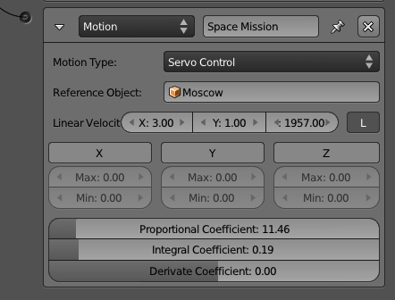

- **Reference Object** : Albert Einstein once said that everything is relative. One of the breakthroughs of his scientific findings originated from his observation of a train from different reference points (a station, the same train, another train). The Reference Object here works as such, relativizing the new velocity from its position and velocity.

- **Linear Velocity:** The target velocity used in the Servo Control calculation.

- **Force Limit X** , **Y** , **Z** : It can control the minimum and maximum of the force applied in the object. The target velocity will eventually be reached so this option works toward speeding up or slowing down the acceleration.

>**Advanced Motion Control**
>
>**PID Servo Control System** : The following options help you to control the responsiveness and the reaction of your movement. In simple English, this is known as a "control loopback mechanism," and it is a constant evaluation procedure that shapes the characteristics of your movement.
>This is a generic (non-Blender specific) system; for more information, look at external references such as:http://en.wikipedia.org/wiki/PID\_controller

- **Proportional Coefficient** : You don't need to change this parameter unless you know what you are doing. It will adjust itself to be 60 times the IntegralCoefficient, so if you want a different value, remember to update it after making any adjustments there.

- **Integral Coefficient** : The default value (0.5) will give you a fast response into the system. Values as small as 0.1 will produce very slow responses.

- **Derivate Coefficient** : This parameter is not required and has a direct effect on the stability of the movement. High values can cause instability.

##### Character Motion 

Last and more recent is the actuator to work with character objects, which is covered in Chapter 6. This actuator will only work if the object physics type is set to Character.

As you can see in Figure 3.40, most of the options are already familiar to us. The only addition is the Jump option, used to simulate a Physic accurate jump from your character.

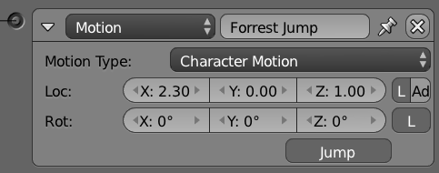

#### Parent 

Dynamically setting the parent of your objects allows you to make small components behave as a unity. Think of a Rubik's Cube game as a good example of this. Every time you rotate a face of the cube, the small pieces will be linked to a different rotational axis. In terms of implementation, you will reset the parent relation of the individual pieces on every rotation. Now, thanks to the Parent actuator, you only have to worry about the face's movement as a whole, instead of the pieces individually.

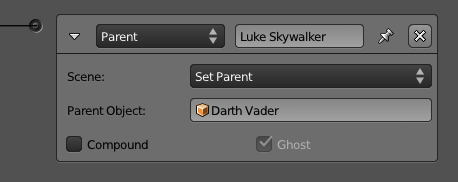

The ui options are presented in Figure 3.41. If the parent object shape is a compound (set in the Physics panel), you can merge the shapes with the Compound option. From an opposing standpoint, when you don't want your object to interfere with your parent physics geometry, you can check the Ghost option to make it behave as such.

>**If You Go with Physics, Don't Parent It!**
>
>Some of the physic interactions, such as Rigid Body, will behave erratically or not work at all when your object is parented.

#### Property 

There are a few ways of changing your game properties. You can change them through a Python script, a logging option from a Logic Brick (for example, a Keyboard sensor), or by using the Property actuator (see Figure 3.42). Let's take a look at the available options.

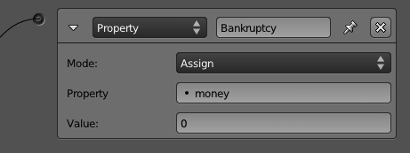

- **Add** : Increments or decrements of numbers can be done with this option. Remember to use the minus sign to decrease a number, although when adding a number to a String property, that number will get added to the text, regardless of its signal.

- **Assign** : This option allows you to specify a new value for your property or to copy it from another property of the same object. When your property is a String, you can enclose the new value in single or double quotes.

- **Copy** : Copy a property from a different object. See the note that follows on different data type conversions.

- **Toggle** : When the property is a Boolean, it will toggle from True to False and vice versa. When it's a number (integer, float or timer), it will toggle from 0 to 1 and anything different than 0 to 0.

>**Mixing Types**
>
>When your properties are of different types, Blender will try to accommodate them. Booleans are converted to 0 or 1 when assigned to numbers, and floats are always rounded down.

>**Remember the Expressions?**
>
>Instead of direct values, you can use an expression in the value fields for the Property actuator. Take a look at the Expression controller for more details.

#### Random 

Controlled randomness is one of the keys for a decent AI (artificial intelligence). As you can see in Figure 3.43, the Random actuator has 10 options to generate pseudo-random numbers. They are divided by types[md]Boolean, integer, and float[md]and they use a seed for consistent results over time. A seed allows an algorithm to generate the same random numbers every time you start the interaction.

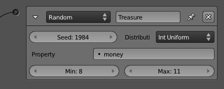

The generated number is stored in a game property indicated in the Property field. Booleans are converted to 1 or 0 when assigned to a numerical property, and to a TRUE or FALSE text when assigned to a string property. Integers or floats are converted to False when they are zero and are assigned to a Boolean property; they are converted to True otherwise.

#### Sound 

Soundtracks and sound effects[md]the possibilities are endless and definitively a key aspect of your game. You will use this Sound actuator when you play a "click" sound for the UI (see Figure 3.44). You will also use it to announce steps from surrounding enemies. In fact, the opening music, the main track, and the credit sounds all are musical[md]music, music, and music. You may love music, but if they all play together at the same time, you get the cacophonic experience of an indie garage band. On the other hand, to sync the events of your game with its sounds, you can use these options: Play, Volume, Pitch, and 3D Sound.

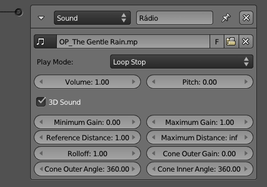

>**Spatial 3D Sound**
>
>If the sound has only a single channel, you can use it as a 3D sound source. That means the sound will be played using your game object position as reference; it gets louder the closer it gets to the camera, and lower when it's farther away. The 3D options cover the distance range of the volume influence of your sound, the audio cone extension, and its angles.

#### State 

The State machine in the game engine works like a layer system on which every controller can belong to one or more state. As with the Blender layers, you can have none, one, or multiple states active at a time. If you disable a state, you will disable the Logic Bricks that are exclusively linked to this state's controllers. You need a way to change the active states and that's what the State actuator is for (see Figure 3.45).

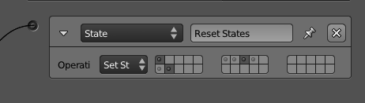

- **SetState** : Replace the current state mask entirely with the one supplied.

- **AddState** , **RemoveState** : Act on individual states by adding/removing the select ones.

- **ChangeState** : Toggle the selected states reversing their values.

>**States Continued…**
>
>Read more about how to use the states in the "State Machine" section, later in this chapter.

#### Visibility 

In the Physics buttons, you can choose the initial visibility of your object and whether or not it's an occluder object. The Visibility actuator allows you to change those properties dynamically during the game, as shown in Figure 3.46. The extra option, Children, replicates the visibility and occlusion recursively for all its children objects.

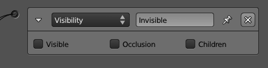

#### Scene 

While most of the actuators act on top of the object, the following actuators[md]Scene, Filter 2D, and the Game actuator[md]work globally, either per scene or per game.

Multiple scenes are a common way to make a user interface (overlay scene), handle different levels (although that can be accomplished with multiple blender files as well), or even preload your game assets in the memory (adding scenes and suspending them before effectively switching between scenes). See Figure 3.47.

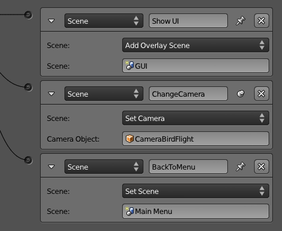

Multiple scenes are rendered as a stack, the ones in the back first, followed by the ones on top. The Scene actuator allows you to restart your scene, change the current one, add overlay and background scenes, suspend, resume, and remove them.

Also, you can change the current camera of the scene by assigning a new camera object in the Set Camera option.

>**Freeze! New Scene!**
>
>Every time a new scene is set or added, the game engine has to convert all the assets into its internal objects. This is the same process that occurs for your main scene when you first load up your game. Since the game engine is single threaded for most of its operations, the whole game will freeze waiting for the new scene to load.

#### Filter 2D 

The 2D Filter actuators are post-processing effects applied to the entire screen (see Figure 3.48). They are similar to what can be done with the Composite Nodes in Blender or the filter effects from a graphics software program such as GIMP or Photoshop.

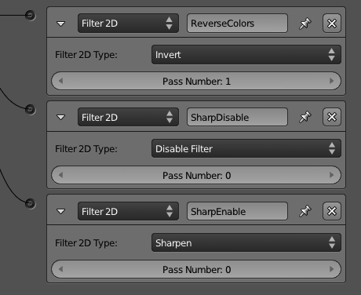

>**Old Graphic Cards Support**
>
>Filters 2D require graphic cards with support for GLSL (officially included in OpenGL 2.0 or higher). Otherwise, they will not run and may crash Blender in some cases. Most of today's computers do support it, but you may have trouble running it in some old embedded graphic cards. When not supported, you will see an error report in the Blender console, and it can eventually lead to crashes on Blender. There is no harm for your system, though, so you if you are not sure of the compatibility of your graphic card, you can go ahead and try it.

You may be already familiar with most of the built-in filters. They have similar implementation to traditional filters found in any digital processing software:

- **Blur** : It smudges the whole canvas. Neighboring pixels are blended together, thus existent small details are eventually lost.

- **Sharpen** : It's the opposite of Blur. The details will jump out of the screen becoming crystal clear.

- **Dilation** : While Blur averages neighboring pixels, Dilation will pick the brightest (maximum RGB value) one of the surrounding pixels and use it as the pixel color. The result is a sharper image but with a loss of details; however, it's a good compromise between Blur and Sharpen.

- **Erosion** : It works opposite to the Dilation method. This filter compares the values of all the neighboring pixels and uses the darker (minimum RGB value) one as the pixel color.

- **Laplacian** : This was originally conceived as an edge detection filter. It will produce dark regions where there are not many changes of color and bright zones when the color changes abruptly.

- **Sobel** : This is another simple edge detection formula that detects the spatial frequency of high changes in the image. It will produce images of high contrast with white lines against a solid dark background.

- **Prewitt** : Similar to the Sobel algorithm, this filter also handles edge detection. The difference is that the Prewitt algorithm is more sensitive to vertical and horizontal edges. The Sobel, on the other hand, is isotropic; it's not biased for any particular set of directions.

- **Gray Scale** : This filter discards the color information of your image, keeping the same luminance.

- **Sepia** : This simulates a photography technique to give a warmer tone for a photo and make it last longer. This effect can set an interesting mood for flashbacks or past scenes in your game. The Sepia effect is reached by first converting the image into grayscale and then mixing it with a bright, desaturated yellow.

- **Invert** : Makes a negative of the frame image. What is white becomes black, what is pure red is converter to cyan, and so on. The inversion is made on top of the RGB values of your scene (instead of the HSV, for example).

A filter can be applied on top of another one. In order to combine more than one filter, the filters have to run in a controlled order; otherwise, the effects may vary a lot. To run in the correct order, each Filter 2D Actuator has a Pass Number **,** which will determine which runs first by an ascending order.

There are two extra filters that complement the usage of the other ones:

- **Custom filter** : This is a more advanced option that allows you to write your own filters for your game (see Figure 3.49). There are interesting effects that can be implemented: depth of field, screen-space ambient occlusion, high dynamic range, color balance, vignetting, noise, and so on

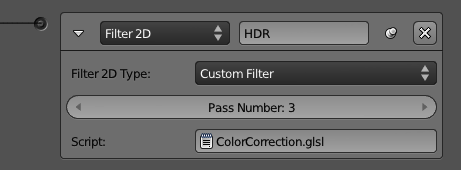

It's still important to be aware of the Pass Number, just as for the other filters. The Custom Filter can be mixed with the others with no problems. Finally, you can select a Text datablock to use as the filter source. The filter is actually a GLSL shader, which is a whole topic on its own. Chapter 5 covers that in depth along with other graphic topics.

- **Motion Blur** : In a video camera, fast objects appear to be blurred the faster they go. It's quite a popular effect and even in real-time rendering, it can be simulated in an artistic way (a euphemism for a trade-off between quality and performance with tons of compromise).

This filter has its own option to be enabled and disabled. As you can see in Figure 3.50, there is no Pass Number there. The reason is that Motion Blur is always computed before the other filters. Therefore, it will run prior to the first of your filters. You can set the Value to adjust the sensitivity and general effect of the blur[md]small values will produce very little blur.

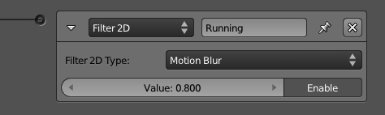

##### Enable, Disable, Remove 

You can run a Filter 2D just like any other actuator. A positive signal will trigger it once, and the filter will run. However, the filter will keep running, even if the sensor sends some negative signals.

If you want to turn a filter temporally off, you can use the Disable option. To reactivate the filter, you use Enable. If, however, you know that you will no longer need this filter during the game, you should use Remove to remove it instead. For any of these three options, you have to set the Pass Number of the filter you want to deal with.

>**Why Does Filter 2D Not Follow the Rest of the Actuators' Behavior?**
>
>Although it may sound arbitrary, there is a reason behind the enable/disable design of the Filter 2D system. The filters are actually shaders, small programs that must be sent to the graphic card for them to be compiled and accessible to the game. To avoid the overhead of recompiling the shaders every time you call them, the game engine keeps them in its memory from the first moment you enable them until you finish the game, remove the filter, or remove the scene where the filter belongs._To remove the object that called the Filter 2D will not make the filter stop running._

#### Game 

The Game actuator concentrates on top-level functions you can perform on each game. Its options are Start, Restart, and Quit this game, Load and Save GameLogic.globalDict, as shown in Figure 3.51.

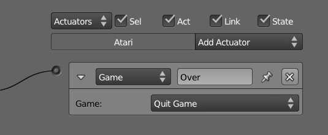

Start Game From File will stop the game and start/load the new file. It's used to load new levels or simply to access files with new scenes. Blender will go through the whole process of loading a new file and converting the data. That may produce some waiting time where the whole game (shaders included) seems to be frozen. All the events that happened in the game will be lost with the following exceptions:

- **Global dictionary:** The python dictionary bge.logic.globalDict (explained properly in Chapter 7) is persistent through all your gameplay.

- **Material settings:** If you change the material render mode from Multitexture to GLSL, for example, it will only be valid for the new file you load. This is very useful for loading files that help you to set up the graphic property according to the user profile.

Restart Game will load the opened file again. Since it loads the saved file, any changes made before launching the game engine will not be present.

Quit Game works the same way as if the exit key is pressed (ESC key is the default, this can be changed in the render panel). When combined with the proper sensor and controllers, this option allows the user to quit the game by clicking in a button in the game, for example.

Load and Save bge.logic.globalDict is only relevant if you are using Python scripts. Once you save the global dictionary, it will create a file in the same folder as your blend file with the extension .bgeconf.

>**Please Wait While Loads…**
>
>If the initial scene of your game is too heavy, you may consider implementing a simpler initial scene/file with the game credits, title, and a "please wait while loads" message. This scene will then have an Always sensor linked to a Game actuator set to Start Game From File.

## State Machine 

_"Why did the controller cross the road?[md]to get to the next state."_

A state is a conjunct of actions to be performed by a game character. In our case, it's a set of sensors, controllers, and actuators that together represent a subset of the possible behavior the character will present. Let's say it in a simple way.

Pretend we are creating a triathlon sport game. The triathlete will be able to swim, bike, and run during the course of the game. A real athlete doesn't stop to switch modalities and neither does ours. Therefore, we need to make sure the game inputs (for example, keyboard sensors, collision detection, and so on) will result in different actions and interactions for each modality (for example, diving, jumping, crashing, and so on ). The other thing we must consider is the transition of the states. In our example, each modality/state is exclusive and sequential; they can't happen simultaneously and have a specific order to follow. The player will start swimming, then biking, and finally running. Although they are independent states, they can (and likely will) share sensors and eventually actuators. In Figure 3.52, you can see a pseudo Logic Bricks arrangement for the initial settings of all three modalities. As you can see, the same sensor is linked to different controllers, each one in a respective state and calling different actuators.

Although all the controllers and actuators are visible, the state 1 (Swim) is the only one that is part of the initial states. Therefore, any controllers from other states (for example, Bike and Run) will be disabled when the game starts. Indeed, sensors and actuators will only be active if the controller they are linked to are currently active. In our pseudo Logic Bricks, the actuator set to make the player float[md]a Location Constraint Actuator[md]will be disabled automatically once the state one (for example, Swim) is demoted.

This is the simplest way of using states. It's not the only one, though. In more complex systems, the states don't need to be exclusive and will work more as individual components that you can turn on and off accordingly. One of the important aspects of this system is that from a controller of any state, you can completely rearrange the status of all the other states, turning them on or off.

>**Artificial Intelligence and the State Machine**
>
>In the artificial intelligence literature, there are multiple techniques to deal with artificial behavior. The State Machine implementation in Blender is flexible enough to be used with your design, whatever you pick. Two of the most popular systems[md]Finite State Machine and Behavior Tree[md]can be implemented with the current features and the other variations might as well. The State system can also be accessed through the Python interface for a pure programming control.

## Sharing and Group Instancing 

The game engine centralizes the logic components at the object level. This is at the same time a curse and a blessing. On the positive side of things, you can set up each object as a unique, independent participant of your game. The down side comes when you need to reproduce a behavior, and when the last thing you need is unique objects. Sure, you can copy over Logic Bricks and properties, but this is hard to maintain and doesn't scale well for more complex files. Note that we are not talking about duplicated objects[md]those indeed share the same Logic Brick. We are looking at game objects that have different individual components but need to share part of each other's functionality. We need a compromise between both systems, and this is possible with group instancing and Logic Bricks cross-linking.

Group instancing support in the game engine was added for the project Yo Frankie[md]a game demo project organized and developed by the Blender Foundation in 2008. For this particular project, they had to share the Logic Bricks between the NPC enemies (sheeps, rats, etc.) and a different set of Logic Bricks for the two main playable characters (Frankie and Momo).

>**To Read More…**
>
>To read about their specific implementation you can look at Campbell Barton's chapter in _The Blender GameKit, 2nd_Edition_: http://wiki.blender.org/index.php/Doc:2.4/Books/GameKit\_2/12.Yo\_Frankie!#Logic\_Sharing.

The first and simplest usage of this feature is to replicate the same set of objects multiple times. Open the file _\Book\Chapter3\group\_instancing\_logic\_1.blend_. As you can see in Figure 3.53, here we have 10 copies of a system compound of balls and fountains. The balls will constantly roll inside the fountain and every once in a while the ball will get more of an impulse at the bottom of the fountain.

There are three relevant components here: a fountain for the ball to roll in, a ball, and an invisible plane in the bottom of the fountain set to send the balls up when they collide. Since we want the objects to be alike, what we need to do is to group the three elements together and hide them in one of the non-visible layers. Now in our main layer, we can use the Add Menu (Shift+A) and select the newly created group in the Group Instance option. Figure 3.54 shows the option to be selected there.

>**Logic Brick Duplication**
>
>There are other ways to duplicate your Logic Brick object. In fact, the Group Instance option from the Add Menu is simply a shortcut for using an Empty with Group as the Duplication type. Vertices and Faces can also be used there, but this will only duplicate the child object in the geometry, not an entire group.

The most obvious advantage of this is that if you need to change the Logic Bricks, you can at any time edit them in the original elements of the group. This will automatically be replicated to all the instances that share the same Logic Bricks. Group Instance also works for dynamically added objects. In other words, you can add a Group Instance by placing it in the file (as the previous example shows) or by using the Add Object option of the Edit Object actuator.

Now that you understand how Group Instancing works, let's go a step further and see a more advanced (yet still simple) example of sharing Logic Bricks. Please open the file _\Book\Chapter3\group\_instancing\_logic\_2.blend_. In the first example, we were duplicating the same group, but here we have two different groups: Pyramid and Orbit. Both groups share one common object, the DummyMesh, and have a unique object on their own.

Now look closely at the Logic Bricks in Figure 3.55. The sensor and the controller are in the DummyMesh, while the actuators are in the Pyramid and the Orbit objects. This way, a Group Instance that contains the DummyMesh and either the Pyramid or the Orbit will share similarities, allowing for individual effects on top of them. In this example, if you press the spacebar, the Pyramid rotates while the Orbit runs away from the camera.

## To the Infinite and Beyond 

Now that we have gone over the various possibilities with Logic Bricks, it's time for you to put these skills into practice. Try the sample files and play with them. Rip them apart, disassemble them, and combine them. It's important to look at them creatively and use their diversity and flexibility in your favor.

In the past few years, there have been community organized game engine contests. One of the categories is specifically Logic Bricks-only games. It's really interesting to see what can be done without a single line of code. An online search for "Blender Game Engine Contest" should give you enough inspiration for further experimentation.

Actually, even if you are planning to use Python over plain Logic Bricks, it's important to understand both systems and how they work together. In the end, which tools you use will depend on the project you are working on, your team, and your workflow.

Finally, in one way or another, the next chapters all relate back to this one. You might review some parts of this chapter while learning the game engine aspects of animation, graphics, physics, constraints, and Python.
