**Table of Contents**

- [Chapter 4: Animation](#Chapter 4: Animation)
	- [Every Pot Has a Cover](#Every Pot Has a Cover)
	- [Animation Cycles](#Animation Cycles)
	- [Moving Animation Cycles](#Moving Animation Cycles)
	- [Still Animation Cycles](#Still Animation Cycles)
	- [Actions and F-Curves](#Actions and F-Curves)
	- [Armature and Poses](#Armature and Poses)
		- [When to Use Pose Actions](#When to Use Pose Actions)
	- [Graphic Mesh vs. Physic Shape](#Graphic Mesh vs. Physic Shape)
	- [Bone Constraints](#Bone Constraints)
		- [Bone Constraints Not Supported](#Bone Constraints Not Supported)
		- [Bone Constraints Supported](#Bone Constraints Supported)
			- [Transform](#Transform)
				- [Copy Location, Rotation, Scale](#Copy Location, Rotation, Scale)
				- [Copy Transforms](#Copy Transforms)
				- [Limit Distance, Limit Rotation, Limit Scale](#Limit Distance, Limit Rotation, Limit Scale)
				- [Maintain Volume](#Maintain Volume)
				- [Transformation](#Transformation)
			- [Tracking](#Tracking)
				- [Clamp To](#Clamp To)
				- [Damped Track, Locked Track, and Track To](#Damped Track, Locked Track, and Track To)
				- [Inverse Kinematics](#Inverse Kinematics)
					- [Legacy Solver](#Legacy Solver)
					- [iTaSC Solver](#iTaSC Solver)
				- [Stretch To](#Stretch To)
			- [Relationship](#Relationship)
				- [Action](#Action)
				- [Child Of](#Child Of)
				- [Floor](#Floor)
				- [Pivot](#Pivot)
	- [Bone Parenting](#Bone Parenting)
	- [Shape Keys](#Shape Keys)
		- [When to Use Shape Keys](#When to Use Shape Keys)
	- [Tutorials](#Tutorials)
		- [Pre-Tutorial](#Pre-Tutorial)
		- [Animation Cycle Tutorial](#Animation Cycle Tutorial)
			- [Armature Setup](#Armature Setup)
				- [Inverse Kinematics Bone Constraints](#Inverse Kinematics Bone Constraints)
				- [Track To Bone Constraints](#Track To Bone Constraints)
			- [Extreme Poses](#Extreme Poses)
			- [Moving Forward](#Moving Forward)
				- [Root Bone](#Root Bone)
				- [If Mohamed Won't Go to the Mountain…](#If Mohamed Won't Go to the Mountain…)
			- [Between Poses](#Between Poses)
			- [Play Time](#Play Time)
		- [Idle Animation](#Idle Animation)
		- [Making a Face](#Making a Face)
			- [Shape Keys and Bone Drivers](#Shape Keys and Bone Drivers)
		- [Get Your Hands Dirty](#Get Your Hands Dirty)
		- [Wiring Up the Logic Bricks](#Wiring Up the Logic Bricks)
		- [How Many Bricks Does It Take to Turn Momo?](#How Many Bricks Does It Take to Turn Momo?)
		- [Hats Off to Momo and Vice-Versa](#Hats Off to Momo and Vice-Versa)
		- [Mango Jambo Special Animation](#Mango Jambo Special Animation)
	- [To Learn More](#To Learn More)

# Chapter 4: Animation 

_Written in collaboration with Moraes Júnior - Mango Jambo for friends[md]known for his work as the main character animator in the Blender Foundation open game project Yo Frankie._

Animation is the breath of life. It's the soul of your characters. And we swear we're not making that up. Take a look at the etymological origin of the word, and you will find that animation comes from _anima_, which means _soul_ in Latin. Try to remember that. If for nothing else, it can help you to sound smart for the next person who wonders why you are paid to play video games. Figure 4.1 highlights what animation can be.

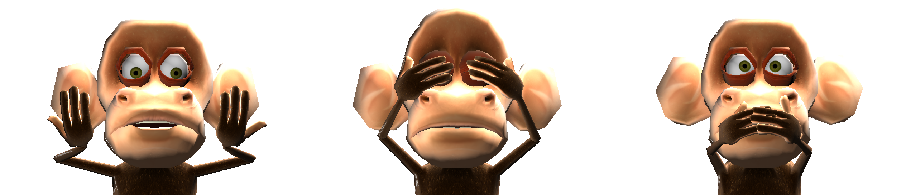

Back on the right track, in this chapter you will note a different structure than the previous chapters.

We will first talk about the main animation tools and available techniques. This part will be naturally dense, focusing on when and why to use specific animation features. Even for those experienced Blender animators, there are important aspects of the game engine system that you will need to learn because not all the resources available in Blender translate directly to the game engine.

The second part is organized as a tutorial. I worked with artist Moraes Júnior to expose his animation workflow. In this part, we will revisit the game engine animation features and learn how an artist integrates them into a production environment. For this part, it's especially important that you follow along with the steps in the book files.

\*\*\* Begin Note

Keyframing a Keyframe

_Keyframe_ is used both as a verb and a noun in this chapter. The latter (noun) refers to the animation frames that you will manually create. The first (verb) is the action of creating those frames (through the "I" key shortcut or the Auto Recording system).

\*\*\* End Note

In order to use the animation system properly, it will help if you know how to produce astonishing animations. For that there is a lot of good literature available, whether it is Blender specific or not. This book will not teach you how to do nice animations. Nonetheless, we want you, the artist, to understand how to animate for the game engine.

\*\*\* Begin Note

Before You Start

If this is your first time working with animation in Blender, make sure that you haven't skipped the first chapter. The game engine uses the animations created in Blender with Keyframes, F-Curves, interpolations, and so on. To learn how to master animation, you will have a better time consulting a Blender-specific book. Nevertheless, it doesn't hurt to refresh your mind regarding basic concepts and interface navigation topics covered in Chapter 1.

\*\*\* End Note

## Every Pot Has a Cover 

_Every animated pot has an F-Curve._

Where do we use animations in a game? The most obvious place is for character animation; for example, whenever the player walks, jumps, or flies, you'll see game animations running. That is not the only time, though, when you'll see animations. You will also see them in cut scenes, background elements, the user interface, and so on[md]the list is endless. In order to cover such a wide variety of usages, there are three mechanisms that the game engine provides to animate your game elements: object transformations, armature poses, and shape keys.

\*\*\* Begin Bullet List

[lb] **Object transformations** enable you to change object transformations such as size, rotation, and location.

[lb] **Armatures** let you work with a bone structure, deformed mesh, and bone special settings, such as bone constraint and bone parenting.

[lb] **Shape keys** give you complete mesh transformation control.

\*\*\* End Bullet List

These are different systems, but there is a lot of overlap among them. More importantly, you often will use them together. In the next pages, we will talk about these mechanisms individually and also see how they complement each other. In the practical aspects of how to use them effectively, we will focus on character animation, which is the most complex form of animation you can have in your game. Once you understand the concepts of character animation, you will have no difficulty in bringing life to your menu elements, shake your environments, and direct your cut scenes.

Rousing reading awaits you. Let the fun begin. First, let's look at one fundamental concept for game animation[md]the animation cycle.

## Animation Cycles 

An animation cycle is usually a short action that when repeated produces the illusion of a continuous long movement. A classic example is the walking animation of a character. You don't need to animate the left step, then the right step, then left, then right … ad infinitum. An action with a left and right step can produce the same result. Just make sure the action starts and ends in the same pose, and you can keep playing it in a loop.

Animation cycles are at the core of the character animation in a game. A library of multiple animations can provide a diverse and rich behavior for your game character. As a reference, in a game project such as _Yo Frankie_, the main characters[md]Frankie and Momo[md]have 87 and 70 individual unique actions, respectively. A few of the actions you can find there are: Walk, Walk Back, Walk Faster, Turn Left, Turn Right, Jump, Pick, Thrown, Jump, Idle Sleep, Idle, Idle Show Off, and many others.

## Moving Animation Cycles 

A lot of the basic actions of a game can be expressed as moving animation cycles: to walk, to run, to spin, to fly, to roll, and to swim. You may have noticed that all these example actions express the idea of movement in space as well. However, an animation cycle does not have any influence in the displacement of the animated object. Rather, you get the final animation look and feel through a combination of external motion control (for example, a Motion Actuator) and playback of an animation cycle. Indeed, if you play back only the animation action alone, you will see that it looks more like a treadmill exercise.

\*\*\* Begin Note

Still Not Convinced?

What we are doing here is splitting the bone pose animation from the object animation. We could indeed make the character move forward by moving all the bones in that direction. Although this would make the object mesh display in the right place, it wouldn't move the object's center, which would result in errors for the physics computations and eventually for the display of the object itself. The physics bounding box is calculated around the object's center, as does the camera culling test[md]the routine that makes sure that objects outside the camera range are not rendered.

\*\*\* End Note

## Still Animation Cycles 

There are cases where you don't need to displace your object while playing its animations, and we call them still _animation cycles._ An animation cycle without the displacement component is like a dog chasing its own tail. And if this is what you want to animate, you need the animation cycle and nothing more. In fact, any idle or secondary animations can be used directly without the need of a Motion actuator. For example, if you are doing a breath animation cycle or making your character tap his feet while waiting impatiently for you to make a move, all the animation is controlled by the armature poses. Even if your character has to move around a bit, you would not use a Motion actuator here. In these cases, make sure that the final pose is in the same position as the initial one.

## Actions and F-Curves 

An action in Blender is something special for animation. By its definition, an action is a collection of channels of F-Curves. It allows a property (object size, bone position, etc.) to have a different value along different frames.

But what are F-Curves? Functional Curves are curves created by control points (the keyframed positions) and interpolated to fill the void. As in Blender, in the game engine you don't need to define a keyframe for every single frame of your animation. The parts of the curve between keyframes will be calculated based on the interpolation settings and the handlers of each of the keyframes.

When we talk about the action of an object, we are referring to the current action linked to it. This is the animation that will be played when you play back the animation in the viewport, or if you render the animation from Blender. This is also the action the keyframes are stored in. To play this action in the game engine, you need to get the action name to use in the Action actuator[md]select the object, and you will find the action in the Dope Sheet when set to Action Editor.

\*\*\* Begin Note

Don't Lose Your Action

If you want to play different actions for the same object during a game, you need to create them in Blender. An action is a datablock that can be named, removed, imported, and linked as any other Blender datablock.

It is important to set the Fake User option (in the header of the Dope Sheet set to Action Editor) if you plan to unlink an action from an object and create a new one. Otherwise, the software will assume you no longer need that action and will remove it the next time you save and reopen your file.

Also, you can use an action created by one object into another object, proven that they are compatible. For most objects all they need is to be of the same type. For armatures, they also should have the same amount of bones with the same names. For meshes with shape key actions, the shape key channels need to have the same name.

\*\*\* End Note

At first we don't edit a curve directly in the F-Curve editor. The usual workflow is to first keyframe some parameters (for example, position and rotation) in the 3D view. After the blocking of your key and in-between poses, you may want to do tiny adjustments in the curve. This is the time when you can go to the F-Curve editor and make changes directly in the curves. With some practice you may even look at the chaos as in Figure 4.2 and see bouncing balls and smooth fade-ins and fade-outs.

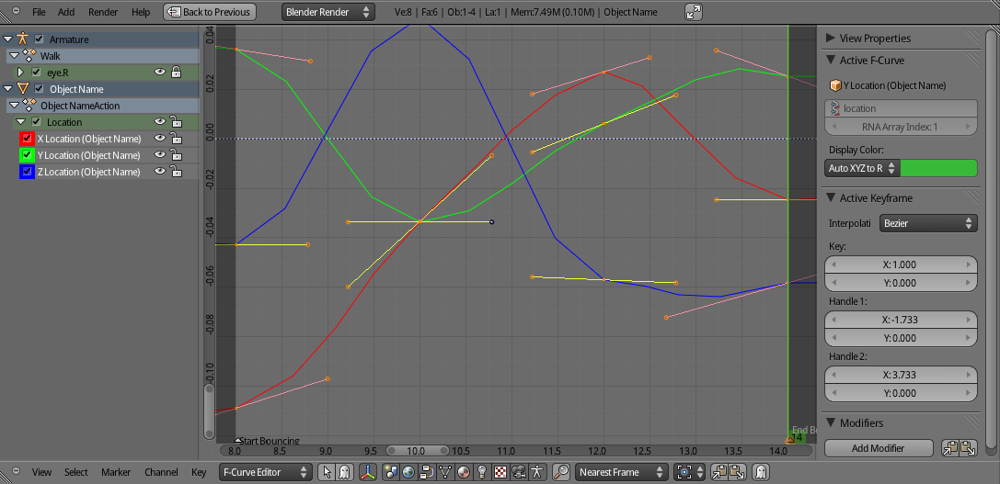

Even when you are using the Action actuator, you will be internally manipulating F-Curves (through the Dope Sheet or luckily the 3D view). The only actions that will change your object geometry are the bone pose action and the shape key actions. The former will play the bone pose action for your armature, while the latter plays a shape key action affecting the whole mesh.

Other actions can be used to animate your object as a whole without affecting its internal geometry. You can move the object, change its size, rotate it, and animate its specific type parameters. For example, you can animate a camera to follow a predetermined path or animate a lamp to flicker a dimly colored dynamic light. Does your camera need to change the lens during the game? An action can easily do that for you.

## Armature and Poses 

The Bone animation system works in the game engine very closely to the way it does in Blender. You will create a Mesh object and an Armature object to deform the first.

\*\*\* Begin Note

Mesh and Armature

Both the Armature and the Mesh objects need to be present in the game for them to work. In fact, if you are adding the animated object dynamically (for example, through an Add Object actuator), you will refer to the Armature object to bring in the animated conjunct.

As in Blender, the Armature object is the parent of the Mesh object. Therefore the armature will be the game object running most of the animation sensors and actuators. Thus you may as well dump all the Logic Bricks of your object in the armature. An exception is the Replace Mesh option in the Edit Object Actuator. In that case you need to run the Actuator in the Mesh object itself.

\*\*\* End Note

The workflow for Armature and Bones resembles the NLA (Non-Linear Animation) Editor in Blender. You create individual animation actions that you want to be played at a certain time. Those are the actions we referred to when talking about the animation cycles, earlier in this chapter.

The first difference is that you don't need to predefine the order and length of all the action you want to play. For example, in the NLA Editor if you want to animate a shark turning, you will create an action for "Straight Swimming" and another for "Turning." You will alternate between them based on your script: maybe the shark turns at the same time you throw bait close by.

\*\*\* Begin Note

Speaking of NLA

Even though NLA animation is not supported in the game engine, you can still use the NLA Editor to make your animation sequences. Cut scenes or complex dialog scenes can benefit a lot from a NLA based workflow.

For example, you can combine dialog actions from a MoCap (motion capture) system with pregenerated idle body animation cycles. Once the animation editing is done you need to combine the actions into a single action with the Bake Action operator, available via the Search Menu (spacebar).

\*\*\* End Note

Unlike in the NLA Editor, we have a chance to play actions based on the player decisions or AI predesigned interactions. In our shark example, we can have the player controlling the shark and turning it when it gets tired of swimming in a straight line. Maybe this shark likes to chase its tail restlessly. Either way, we can play and stop playing the individual animations ("Straight Swimming" and "Turning") anytime. Figure 4.3 illustrates this.

The second difference is regarding the bone constraints. We will cover it in more detail later. It's important to know that not all the Bone Constraints that work in Blender will work in the game engine. Most of them do, so it shouldn't be much of a hassle. Also, the constrained bone and the target bone should be part of the same armature.

The third difference is the general simplicity of the armature and bone system. In general, games have simpler rigging (as the armature and bone system are known) than in animated movies. For AAA games, this is not so true[md]their rigs are closer to film than to traditional game rigs. In the end, the complexity of the rig is also directly related to the amount of polygons your mesh has. Therefore, as game objects naturally have fewer faces than their animated film counterparts, the rigging reflects that.

A good example is Frankie the Flying Squirrel in the animated short _Big Buck Bunny_ and in the _Yo Frankie!_ game. As you can see in Figure 4.4, the original model had 11,777 faces and 388 bones, while the model remade for the game has only 2,509 faces and 52 bones. Even though the role of Frankie was pumped up from a side film character to the game main character, the complexity of the game file is much simpler. (The film-file face count goes to 128,404 when you apply the Subdivision Surface modifiers.)

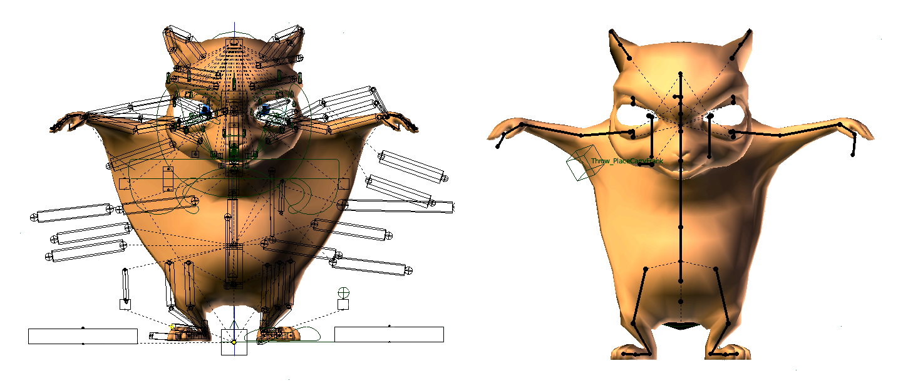

### When to Use Pose Actions 

Always! The main usage of pose actions is the one explained earlier when talking about animation cycles. Full animation cycles will not be the only ones in your character repertory.

You don't need to have all the bones posed in all the actions you want to play. Imagine you want to have a regular walking animation and allow the character to look back while walking. For this kind of situation, you can animate the upper-body bones in a different action than the legs and the hip. If the animations are in separate actions, you can turn the single actions (walk, look back) on and off individually. This will spare you from making an animation action for every possible combination of individual movements (blink, jump, walk, scratch the head, and so on). It also makes it simpler to control those actions. They don't need to have the same length or be called from the same actuator.

Animated characters are not the only game objects that can use the armature animation system, though. You can use armatures anytime you need more control than the Motion Actuator can provide. Even a simple object like a door can use an armature to help open and close it. The problem with a door is that you often need to use the door as a colliding object[md]to keep the three little pigs safe from the wolf. That leads us to our next topic.

## Graphic Mesh vs. Physic Shape 

To animate a mesh with bones is a relatively expensive task for the computer. Therefore, when you set an object to play a pose action, you are changing only the graphic mesh of the object[md]the mesh used for the game render. All the physics computations, however, are done in another instance of this mesh, and are not updated with the animation. In Figure 4.5 you can see the screen when Show Physics Visualization is on and the game has an object armature animated. The original rest pose of the armature is used for the physics/collision mesh. This is the mesh with the arms lying still. Although we can see the correct pose on top of that, this is not the one used for the physics computations.

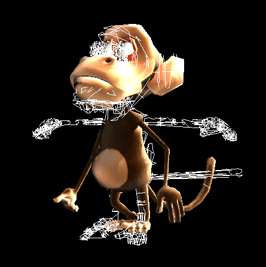

## Bone Constraints 

The constraints are a handy set of tools to facilitate the animation process. They are more familiar to riggers than to animators, since they are used to build easier-to-animate armatures. Thanks to bone constraints, we can build bone controllers to ease the work with complex game armatures. Because of constraints such as the IK (Inverse Kinematics), we can create poses in very simplified ways. In a nutshell, bone constraints will spare you from animating all the bones individually by setting relations between them.

The way bone constraints work in the game engine is quite similar to Blender itself. There are a few differences, though. When you define a bone constraint[md]for example, the copy rotation[md]you set one bone to be constrained to another bone, the target bone. In this case, the constrained bone will copy the rotation of the target bone for every pose, every frame. Unlike Blender, in the game engine, the target bone and the constrained bone need to be part of the same armature.

In Blender, bone constraints can be used in two ways. The first and simplest way is to use them to help with posing. For example, the Track To bone constraint helps you indirectly animate the eyes' rotations by animating the target the eyes are looking at. In this case, even though you are not directly animating the eye bones, the animation process is much more intuitive. This is how you do it in Blender, and this is how you will do it for the game engine. Another way of using them is by setting up the constraints and animating their Influence values. Each bone constraint has an influence that ranges from zero to one.

\*\*\* Begin Note

Bone Constraint Influence

When you start a game, the current influence of the bone constraints will determine the initial armature behavior. If you need to change it during the game, you can use an Armature actuator with the Set Influence option.

\*\*\* End Note

### Bone Constraints Not Supported 

Because the constrained bone and the target bone need to be in the same armature, some constraints that rely on external curves, hinges, and objects are incompatible with the game engine. In the current version of Blender, the nonsupported bone constraints are: Spline IK, Follow Path, Rigid Body Joint, Script, Shrinkwrap, and, partially, the ChildOf.

\*\*\* Begin Note

Rigid Body Joint Partly Supported

Rigid Body Joint is supported as an object constraint, but not as a bone constraint. You will learn how to use it in the chapter 6 Physics.

\*\*\* End Note

### Bone Constraints Supported 

All the Transform, Tracking, and Relationship bone constraints that were not mentioned previously can be used as you would in Blender.

In Figure 4.6, you can see the menu with all the bone constraints compatible with the game engine highlighted.

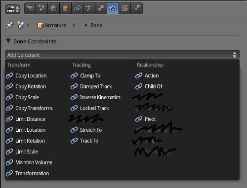

If you're not familiar with bone constraints, following is a brief overview of them and their functionalities. As with almost every other feature of the game engine, the suggested usages illustrate but do not limit their potential application.

#### Transform 

The Transformation bone constraints help you build a bone control system. This control armature is a high-level armature, with only a few bones directly affecting the real armature.

##### Copy Location, Rotation, Scale 

These allow you to copy part of the transformation and to set an offset for the copy. The bone doesn't get locked, allowing for further adjustments of the bone transformation (see Figures 4.7a-c).

A simple use would be building control armatures with bones duplicated between the armatures. Those bone constraints allow for syncing of the bone chains.

An artistic example of its use would be clothes or armor. The external bone chains (for clothes) can copy the base bone chain (for the body) to use as a base transformation. Since there is no locking, you can animate the external bones independently of the body animation. The offset can be used to match the real separation between the body and cloth geometries.

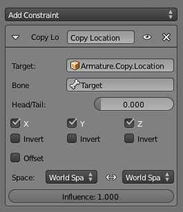

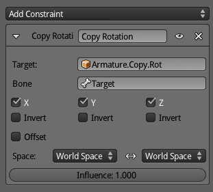

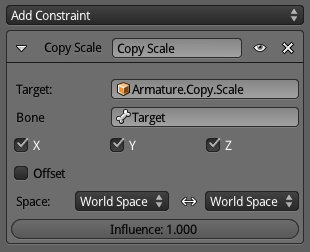

##### Copy Transforms 

Unlike the previous bone constraints, you cannot set the bone offset in this constraint, so with influence 1.0, the constrained bone and the target bone will be exactly in the same place (see Figure 4.8).

As a rule of thumb, an influence different than 1.0 produces more interesting behaviors.

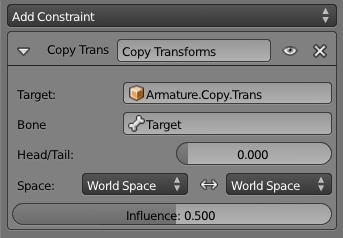

##### Limit Distance, Limit Rotation, Limit Scale 

When you use a bone transformation to influence another bone (for example, bone control sliders or bone drivers), you are mapping a range of transformation (the position from [0,0,0] to [0,1,0] into the constrained bone[md]see the Transformation bone constraint). Limit bone constraints restrict the bone to transformations inside the expected range they are being mapped from (see Figures 4.9a-c).

They can also be used to complement Copy Location/Rotation/Scale bone constraints by copying the transformation but limiting some of the parameters (for example, copy location but not allow Z to be below zero[md]under the bone used as a ground reference).

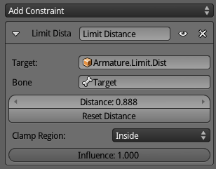

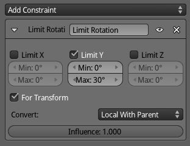

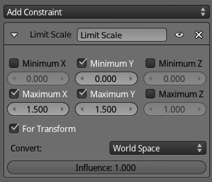

##### Maintain Volume 

This bone constraint does not use a target (see Figure 4.10). The transformation happens only dependent on the bone itself (and within the axis opposite to the selected Free axis).

It's used for squash and stretch, the classic cartoon effect for squeezing bouncing balls.

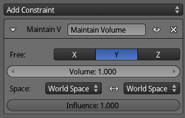

##### Transformation 

This is the best bone constraint for sliders. It allows you to map the transformation from the target bone into a completely different transformation of the constrained bone. For example, you can map the location range of a target (slider) bone from [0,-1,0] to [0,1,0] onto the rotation of the constrained bone from -90 degrees to 90 degrees (see Figure 4.11).

In the book files, you can see this example of a bone slider where we are using Limit Location, Transformation, Copy Rotation, and a Limit Rotation Bone Constraint to set up a simple arm. It's not the optimal use of those Bone Constraints, but it shows how they can be set up together.

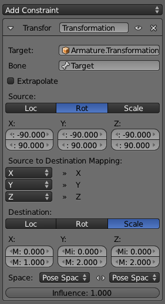

You can find the file in _\Book\Chapter04\1\_constraints\_transform.blend_ (see Figure 4.12).

#### Tracking 

A tracked bone constraint can be part of your main armature or your control bones. For example, it's common to have the Inverse Kinematics bone constraint in one bone that is part of the chain. At the same time, the Track To often uses a bone not connected to the chain and not deforming any mesh directly.

##### Clamp To 

The Clamp To bone constraint forces the bone along a curve object (see Figure 4.13). The bone needs to be disconnected from the bone chain to properly constrain its location into the curve.

It's quite handy for cyclic environment animation of assets from your game. For example, you can make birds flying in the sky by having a predefined curve for the bones to follow along. Cars driving or even people walking in the background also can be accomplished with this technique.

##### Damped Track, Locked Track, and Track To 

Those three bone constraints work in a similar way. You select a target bone[md]where the constrained bone will be facing[md]and an axis indicating the internal direction to point to that target. The difference is how much manual control over the bone rotation you need after setting up the bone constraint. While the Track To completely locks the constrained bone rotation, the Damped Track keeps it completely loose for transformations on top of the bone constraint influence.

The Damped Track gives you the most freedom between them, and it's the simplest to set up. You only have to select the axis to lock, and it allows you to adjust the rotation of any axis of the constrained bone (see Figure 4.14). You can see an example of this used in robotic eyes. The basic effect is to track a target object. But you can still spin the eye around for a cheesy, I mean, classic "droid target locked" effect.

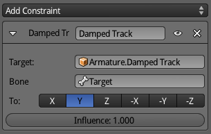

Locked Track will work as a compromise between the other two trackers. It allows you to adjust the rotation of the non-tracked axis (see Figure 4.15). A security camera can be simulated with this bone constraint. A main axis is tracked by the camera (for example, doing a horizontal spin-around routine), while the other axes are independently controlled/animated.

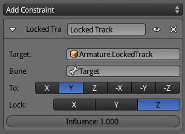

Track To locks the constrained bone for any rotation adjustment, leaving its rotation to be controlled entirely by the bone constraint (see Figure 4.16). By default, it rotates only one axis. However, you can track the other axis of the bone by setting Target Z in this Bone Constraint panel. The classic use of this is for eyes. Instead of rotating the eye bones directly, you can set them to track a target bone at which the eyes will be staring.

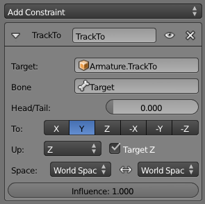

##### Inverse Kinematics 

The IK (Inverse Kinematics) bone constraint helps you bypass the FK (Forward Kinematics) architecture of the armature bones. FK is designed for individual changes of rotation over the bone chain (from the parent to the children). In order to change a bone location, you need to rotate all the bones that lead to it and make sure the resulting rotation places the bone into the desired location (see Figure 4.17).

It's very easy to lose yourself in going back and forth to fine-tune the position of your bones. Let's look at an arm rig as an example. A simple armature would have a shoulder bone as the parent, and the arm, forearm, and hand as children. If you want to put the hand in a particular place, you need to rotate the shoulder, rotate arm, and finally rotate the hand. If you miscalculated the extension of the arm and its radius of extension, you need to go back and rotate the hand again, fine-tuning it.

With IK, you only need to move the hand to the target place. The rotation of the forearm, arm, and shoulder will be automatically calculated by Blender.

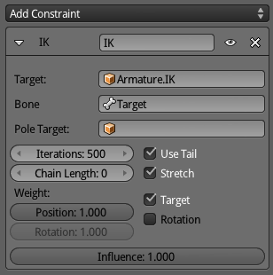

The target bone can't be a parent or child of any bone constrained by this bone constraint[md]this produces cyclic unpredictable effects. This includes not only the bone where you added the IK, but also as many bones as you set in your chain length. (Leaving it as zero influences the whole bone chain.)

###### Legacy Solver 

By default, Blender uses the Legacy solver for the Inverse Kinematics calculations. This is how most of the animation software works and how animators are used to work.

When a bone is under the influence of an IK Bone Constraint, you can set specific IK settings in the Bone panel, as you can see in Figure 4.18.

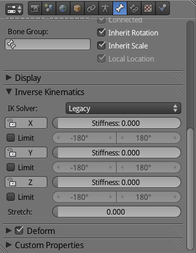

Those parameters allow you to add some control over the otherwise automatic IK computations.

**       ** [lb] **Limit** : In the arm, you need to make sure that the bones behave as real bones would. For example, in real life you can't twist the elbow above certain limits. In order to mimic this behavior you can force the rotation of a bone to be inside a given range. In our case, the limits would be set: X: 5 degrees to 180 degrees; Y: -90 degrees to 90 degrees; Z: 0 degrees to 0 degrees.

**       ** [lb] **        Stiffness:** This parameter sets how difficult it is to rotate the bone. High values make a bone rotates less. Joint stiffness can be one of the earliest symptoms of arthritis. So look after your characters.

**       ** [lb] **Stretch:** Cartoon arms often need to stretch beyond their original sizes. The Stretch factor has to be set per bone. (Stretch needs to be enabled in the Bone Constraint as well, but it's on by default.)

Unlike the Stretch To bone constraint, the volume of the bone is not entirely preserved when using the IK stretch. In order words, the arm seems fat when stretched. To use IK stretching and the Stretch To bone constraint, you need to set up two bone chains separately: one for the IK, and the other[md]with Stretch To[md]to deform the mesh. The Stretch To is what preserves the correct volume for the bones. You can see a sample file in the Stretch To section later in this chapter.

\*\*\* Begin Note

Target-less Bone Constraint

If you don't select a target for the bone constraint, you can still use the IK in a special way. In this case, the constrained bone is the self-target, and as such it's free to be placed anywhere. This technique, known as _fake IK,_ is really light in terms of computation. In the traditional IK, you keyframe only the target bone, thus the IK computation has to run every time you play the animation. With fake IK, the computation is valid during the transformation (when you are moving the target bone around). You have to keyframe all the individual constrained bones for this to work. (This is automatically done when AutoKey is enabled from the Timeline editor.) Since there is no IK happening when you play the animation, the computation of fake IK is far superior to real IK.

\*\*\* End Note

###### iTaSC Solver 

Additionally, you can change the IK solver in the Armature panel to use iTaSC. This name stands for _Instantaneous Task Specification using Constraints._ This IK solver was developed especially for robotics, but can be used as a more advanced replacement for the old IK (Legacy) solver.

The calculation or the armature structure is calculated on the fly, based on predefined constraints and a dynamic target. It's a very powerful system, but not directly related to the more traditional armature, bones, pose animation paradigm. No keyframes are required here.

The iTaSC solver is faster than the Legacy one and definitively better at handling real dynamic constraints (see Figure 4.19).

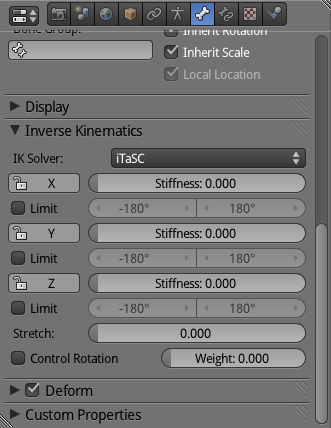

The other bone constraints are great to help you animate your armature, but they are not as efficient in dealing with the real-time changes in the armature to produce dynamically plausible movement. If you are into robotics or simply want to explore more advanced settings in this solver, please refer to the official documentation:

_http://wiki.blender.org/index.php/Dev:Source/GameEngine/RobotIKSolver_

##### Stretch To 

A stretched bone allows you to produce cartoon body transformations (see Figure 4.20). Different from a scaled bone, a stretched one maintains its volume. The target bone needs to be completely isolated from and not connected at all to the constrained bone. It can't be either a child or a parent.

In the book files, you can find an example of a more advanced technique that integrates Stretch To, IK, and Copy Rotation bone constraints. Study it carefully; further instructions are inside the file _\Book\Chapter04\2\_cartoon\_arm.blend_.

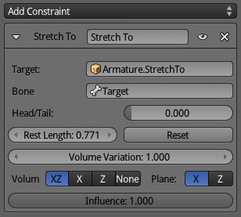

#### Relationship 

The following are the bone constraints that are supported the least. Ironically, apart from the category name, there is not much relationship between them.

A bone constraint worth mention is the Action bone constraint. With it, you can play complete actions in the armature by moving one single bone around. Given the complexity of this constraint, the example part of this text evolved as a pseudo-tutorial. I say _pseudo-tutorial_ because we are working on top of no file, although you should be able to follow the instructions and reproduce the effect yourself.

##### Action 

With the Action bone constraint, you can play back an entire action by controlling one single bone (see Figure 4.21). Make sure that the target bone is not animated in the action you are playing; otherwise, this will produce unpredictable results. Since this is a more complicated bone constraint, the best way to show possible usages is by a pseudo-mini-tutorial as you see next.

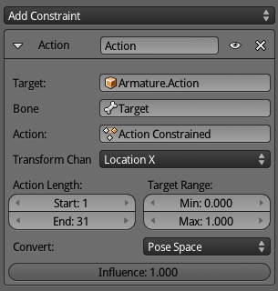

An example of using this is for Transformers-like animations. Let's say you need to create a character similar to Optimus Prime. The armature has two very distinct base poses: a regular car and a bad-ass robot. Some of your animation cycles will happen in the car shape and others in the robot.

You first create a separated action with two extremes[md]the car and the robot bones' conformation. The action itself contains the transformation between those two shapes.

Now you create a bone[md]disconnected from the main chain[md]to control the influence of this action over the bone's pose. This bone will be used as a target in the Action bone constraints you need to create for all the bones (and by that I mean create one bone constraint, set it properly, and copy over to the other bones).

\*\*\* Begin Note

Slider-like Controllers

This is indeed a classic usage of a bone controller as a slider. Since only one of the transformations of the bone ( Location X) will be used to influence the played action, you can even lock the other pose transformations (Location YZ, Rotation XYZ, Scale XYZ) and create a limit location bone constraint for this bone. In Figure 4.22 you can see an example of this setup.

\*\*\* End Note

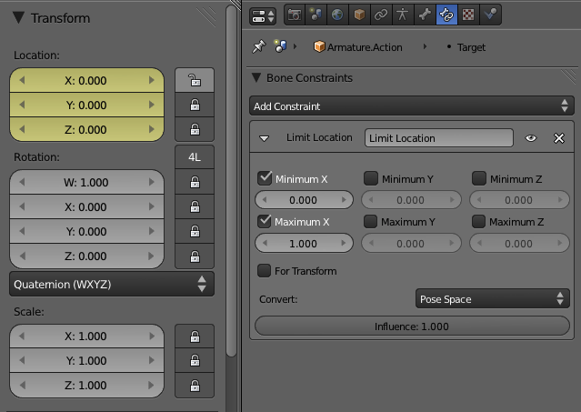

After all the setup is done, you only need to worry about the target bone when you need to switch between the poses. Move the bone to the left, and you have a car. Move it to the right, and you have a robot. Animate the bone going from left to right, and you can integrate the "Transformers" animation as part of any other action.

Another use for this bone constraint is to play two actions influencing the same bones at the same time. This is a work-around for the game engine's limitation of only being able to play one action that influences a bone at a time. In the book files, you can see a sample of this in _\Book\Chapter04\3\_action\_constraint.blend_. Note in the file that each Action actuator is set to its own layer, so they can be stacked together for the same object.

##### Child Of 

_It's only partially supported._

The ability to dynamically set parent relations for bones during the game is essential for some animations. Imagine that you are building a samurai game. In the nonfight moments, the sword will be inside a scabbard, and therefore it should be parented to it. During combat, the sword will move from the scabbard to the samurai's hands. From that point on, the sword should be parented to the hands so that it follows their position and rotation during the slicing-heads animation.

The bone to be dynamic parented (for example, the sword bone) needs to have no transformation in Pose mode (it needs to be in its local origin [0,0,0] and with zero rotation). It also can't have a parent, other than the ones dynamically defined by the constraint.

In Blender, you can have multiple Child Of bone constraints and alternate between the current parent for a bone. In the game engine, however, since you can't animate the Influence of bone constraint, the use is not so flexible. In the end, you will be using it as if it were the Copy Transformations bone constraints. The difference is that the Child Of allows you to select which transformations to copy over (for example, Location and Rotation), and its Set Inverse option is similar to the Offset option of the Copy Location, Rotation, and Scale bone constrains (see Figure 4.23).

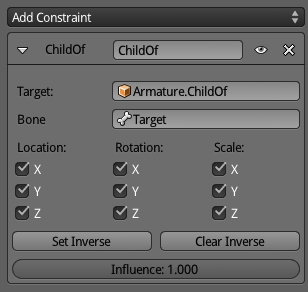

Another option for this type of animation is to use bone parenting. With that, the sword can even be a Physics object and interact with other elements of the game. This is covered in the last tutorial of this chapter, titled "Hats off for Momo and vice-versa."

\*\*\* Begin Note

Not Supported Yet Useful

As with the other bone constraints not properly supported in the game engine, you can still use it fully to help animating in Blender. However, you will need to bake the constrained bone transformations in order to see the changes in the game engine. This topic is covered later in Chapter 8, "Workflow and Optimization Chapter 8."

\*\*\* End Note

##### Floor 

The floor allows you to create an imaginary plane to constraint your bone transformations to. It creates the equivalent of a floor, a ceiling, or a wall that cannot be transposed. The pose location from the constrained bone must be cleaned for the clamping to the plane to work (Alt+G). See Figure 4.24.

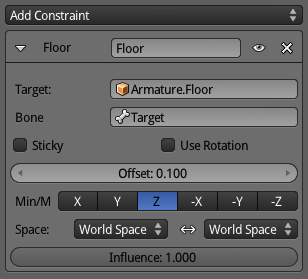

##### Pivot 

This bone constraint helps rotate bones around a specific bone. An example would be to create a screwdriver animation. The screw position would be represented by a bone used as a pivot (the target bone in this bone constraint). The hand with the screwdriver would have its rotation locked to the pivot. To make the Influence propagate through the bone chain, you would need the hand bone to have an IK bone constraint (see Figure 4.25).

Given that often the screw will not be part of the mesh directly deformed by the armature (unless you are animating Frankenstein preparing himself for an IQ test), the Pivot bone can be the parent of an external object you use as a placeholder for the screw. More on that in the next section.

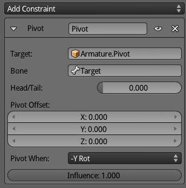

## Bone Parenting 

It's not Vegas, but what happens in the armature does stay in the armature. So, how do you make your animation affect other objects? The armature affects the deformed mesh, but that's not all.

Bone parenting allows you to sync external events with the internal animation. It's a very simple feature, similar to object-to-object parenting. The difference here is that you parent one object to a bone. Whenever you animate the armature, the bone position will be copied over to the child object. This child object actually acts as a parent for other objects. It works as an integrated extension of the armature into the game world.

Earlier, when talking about armature and poses, we mentioned that the Physic mesh of your deformed mesh is not deformed. Nevertheless, you still can use bone parenting to interact physically with your world.

Let's look at an example. Imagine that you need to pick up an element (a key, a coin) in your game with your character's hand. You start by animating your arm armature and arm meshes as you would do normally. You then need an empty object parented to your hand bone and placed right on top of it. This empty will be your object. It will automatically move with your hand and can be used with any Logic Brick you want.

After your hand takes the key, you need to make sure the key doesn't fall to the ground or drop into a drain and meet its end next to rusted pennies, cockroaches, and my old yoyo.

As soon as the Collision object (our parented empty) touches the target object, you can set this object to be temporarily parented to this empty (which is then parented to the hand bone). Now, if you keep playing your "picking up key" animation, you will have the target element always "at hand." For more details and instructions please refer to the "Hats off for Momo and vice-versa" tutorial.

In the _Yo Frankie!_ game, they use this feature in a similar way. Both main characters[md]Frankie and Momo[md]have an empty parented to the wrist bone. When the player tries to catch some nuts or sheep, the game calls a Python script to control that interaction. Internally, a collision sensor checks to see if the picked object is close to the player, and it parents the picked object to the "Throw Place Carry," the bone-parented empty. In Figure 4.26, you can see Momo's "Throw Place Carry" empty in the middle of the throwing animation.

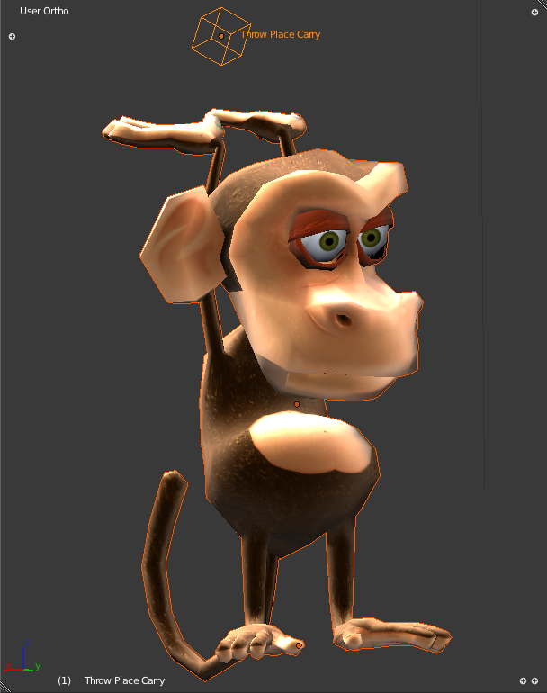

## Shape Keys 

Sometimes bone animation may not give you enough control over the mesh deformation. In those cases, you can animate the mesh directly via Shape Keys. As in Blender, you can define multiple shape keys representing different poses for your character. Each pose holds the position of all the vertices of your mesh.

The workflow with shape keys is different from armature animations. You start defining your base pose, and on top of that, you create pose variations. If you change your geometry later on, it will be a painful process to merge the change back to all the previously created poses, so make sure your mesh is ready before you create your shapes.

\*\*\* Begin Note

Shape Keys Performance

The level of control that you get from Shape Keys comes with a price. The performance required for the per-vertex calculation is considerably heavier than regular armature control. Thus, you should not abuse this technique.

\*\*\* End Note

### When to Use Shape Keys 

Use shape keys whenever the animation is too complex for armature animations. That's not the whole story, though. Shape key animations are often integrated with the traditional armature animations, not as something separate. They can work as stand-alone animations, of course; there is indeed an actuator dedicated only to that. However, the greatest application of shape keys is not to replace the bone animation but to complement it.

The most popular usage is for character facial animation. You can create a face pose for every extreme position of your expressions and rely on basic interpolations between the poses to simulate the animation. This can be used for specific applications, such as lip-sync, to general animation, such as expression of moods (happiness, sadness, Monday-ness).

In the game _Yo Frankie_, both of the main characters used shape key animations together with armatures. Momo used six shape poses to help its animations. The simple ones help with eye blinking. What would our cute monkey be if it couldn't wink at its mates? In Figure 4.27, you can see the Momo base pose and variations of it created by changing only the influence of the four eye poses[md]eye lids up, eye lids down, eye brows up, and eye brow down.

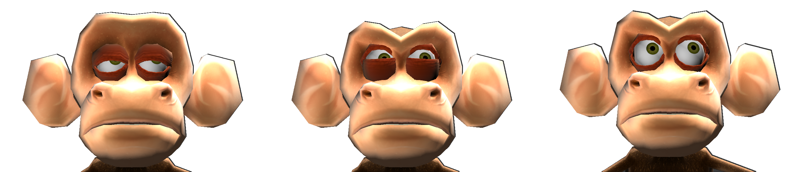

\*\*\* Begin Note

Isn't This Overkill?

You may be wondering if those poses could have been created with regular bone poses. You bet they could. However, the _Yo Frankie_ project has an important educational mission. One of the goals of the project was to demonstrate the multiple features of the game engine. Actually, the support for shape keys in the game engine was implemented specifically for this project. Thus, those files are the first reference that animators studied on how to use them.

\*\*\* End Note

The poses left[md]Smile and Ooh[md]are a bit more complex. They are opposite extremes of the same shape key animation with the Natural pose in between them. Momo can be smiling, natural, or ooh'ing. Since the latter is not a real verb, take a look at Figure 4.28 to better appreciate all the monkey sex appeal. It would be hard to get those results without adding lots of bones, which would create a system hard to animate. So shape keys are a far more elegant solution.

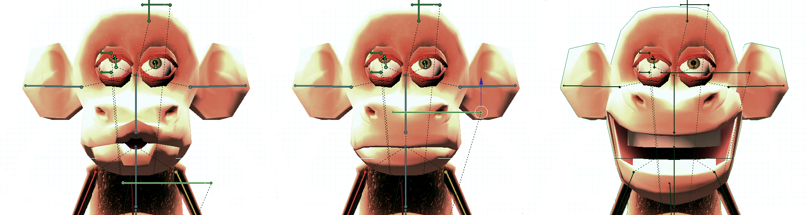

Frankie, the flying squirrel, also uses shape keys for some facial expressions and to control its wings. Like Momo, it would be too hard to control the wings' deformation using only bones. Therefore, a shape pose was created to show how the mesh should be when the wing is tucked in. In Figure 4.29, you can see Frankie in a natural pose and with wings active.

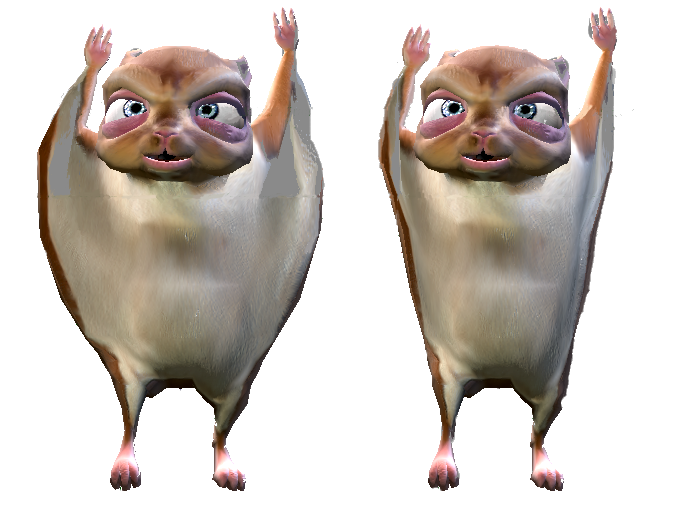

Those shape keys are not used isolated as an action. Instead, they are used as part of an armature pose, driven by a bone, like all the other animation bones. This bone is used as a driver for the shape action it is intended to control. Like the other bone-over-bone controls with constraints (which we will see next), the driver bone itself is unaware of its role as the shape key controller. Figure 4.30 shows the regular setting of the shape action to a control bone. You will learn more about this later in the tutorial section.

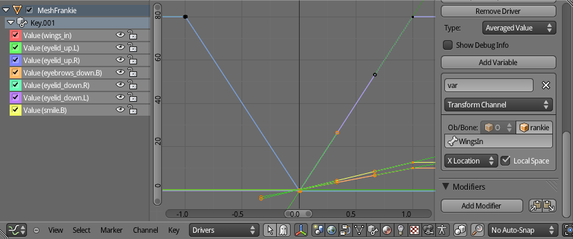

\*\*\* Begin Note

Action Actuator

Shape keys can also be used directly by the Action actuator. This is useful when you need to animate your whole mesh exclusively through the vertex manipulation. Although you will probably not use it for your main character, you can make nice groundbreaking effects with this.

\*\*\* End Note

## Tutorials 

_No keyframes were hurt in the making of those tutorials._

In the following pages, we are going to make a character walk, interact with objects, and have some nice facial expressions for you to play with. For the model, we will be using the monkey, Momo (see Figure 4.31). I cleaned up the original file, removing the shape keys and the animation cycles previously created. You can get Momo in his fresh state in _\Book\Chapter04\tutorials\__tutorials\_momobase.blend_.

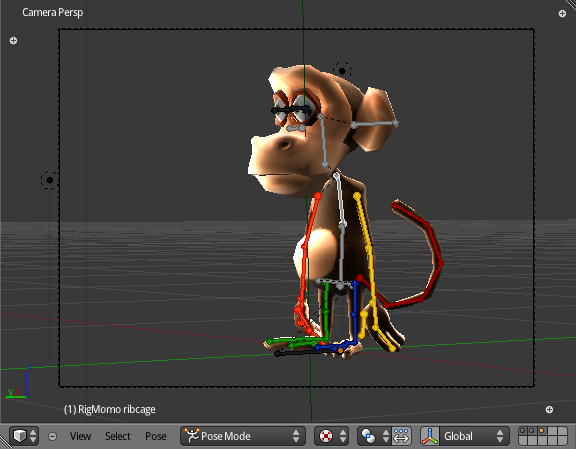

### Pre-Tutorial 

In this short pre-tutorial, we will the animate the camera rotation and the camera focal length as an opening effect for the game.

The whole tutorial is based on using the Action actuators to control the Momo animations. As we explained previously, there are different action types that can be used. Regardless of the action type, the way to use the actuator is the same. So we will start with a very simple action, and progressively go over more complex topics such as bone and shape key animations.

Open the base file from the _\Book\Chapter04\tutorials\tutorials\_momobase.blend_.

\*\*\* Begin Numbered List

1.Change the current frame to 1.

2.Select the camera object.

3.In the Camera panel in the Properties Editor, set focal length to 10.0.

4.With the mouse over the value, press I to keyframe it for frame 1.

5.Go to the frame 30.

6.Change the focal length to 100.0.

7.Keyframe the new value for this frame.

\*\*\* End Numbered List

What we did was set an initial focal length for the camera to animate over a specific range (90mm over 30 frames ~ 1 second). If you play back the animation in Blender (Alt + A), you can see the camera zoom changing quickly over the initial frames

However, if you enter the game engine, the camera is not animated. We still need to hook this animation with the logic bricks. So with the camera still selected, we need to do the following:

\*\*\* Begin Numbered List

1.Create an Always sensor. Leave the default options so it runs only once.

2.Create an Action actuator. Change the frame range from 1 to 30.

3. Set CameraAction as the actuator Action. (This is the action we created by keyframing the camera lens; it's automatic named by Blender).

4.Connect both bricks. (This will create an And controller.)

\*\*\*End Numbered List

The logic brick can be seen in Figure 4.32. There is really not much to it other than to make sure that the animation plays once after you run the game.

If the fast zooming of the lens still doesn't make everyone dizzy, it's time to animate the camera rotation. It's good to remember that while the rotation is a property of the camera object, the focal length is part of the camera datablock. As such, these transformations are stored in independent actions. Thus, we will need to create a new action (through keyframing the camera rotation) and set up a new Action actuator.

\*\*\* Begin Numbered List

1.Change the current frame to 1.

2.Select the camera object.

3.With the mouse over the 3D viewport, invoke the Keyframe menu (I key) and select Rotation.

4.Advance 5 frames.

5.Change camera rotation along its local Z axis by 60 degrees so it keeps looking forward but spinning (press R + Z + Z + 60).

6.Keyframe the rotation again.

7.Repeat the previous steps until you get (and keyframe) frame 30,which will complete a full loop of 360 degrees.

8.Create an Action actuator. Change frame range from 1 to 30.

9.Set CameraAction.001 as the actuator Action. (This is the new action we created.)

10.Link the And controller with this Action actuator.

\*\*\* End Numbered List

You can get this final file on _\Book\Chapter04\tutorials\pretutorial\_camera\_actions.blend_.

This effect is a bit annoying if you play the file multiple times to test the animation (as you will soon). So this spinning camera is not included in the base file you will use for the actual tutorial. If, however, you want to bring the camera along, you can append it into your other files. All the logic bricks and actions linked to the camera object and camera datablock will follow the Blender object.

### Animation Cycle Tutorial 

To start, let's open the Momo file and look at the armature. Open the book file _\Book\Chapter4\tutorial\_walk\_1.begin.blend._

We will create a walking cycle for Momo, following these steps:

\*\*\* Begin Numbered List

1.Armature setup

2.Extreme poses

3.Moving forward

4.Between poses

5.Play time

\*\*\* End Numbered List

In this tutorial, we will not cover animation extensively. This topic alone could fill a whole book. Instead, we will focus on the workflow of integrating your animation skills with the game engine tools. You'll get some tips you can apply to both Blender and the game engine animations. Both platforms work in a similar fashion.

#### Armature Setup 

The armature is already created, but not yet ready to animate the character. If you go to the Pose Mode, you can move the individual bones, as shown in Figure 4.33. As you might already know, bones constraints are useful in posing the armature, so let's create some.

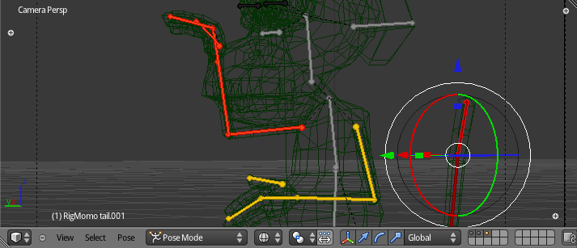

For Momo, there are two sets of bone constraints that will help your posing. The Inverse Kinematics, IK, for controlling the bone chains from their extreme bones, and Track To for the eyes.

##### Inverse Kinematics Bone Constraints 

First, let's take a look at the IK bone constraints. IK can be used to pose arms and legs by moving only the hands and feet. The position of the arm and leg bones will be automatically calculated to accommodate the hand/feet position. Not only Momo's human counterparts (arms, legs, etc.) benefit from it, but also Momo's tail is perfect to demonstrate the usage of IK, so let's start with it. With the file open, follow these steps to get to the configuration shown in Figure 4.34.

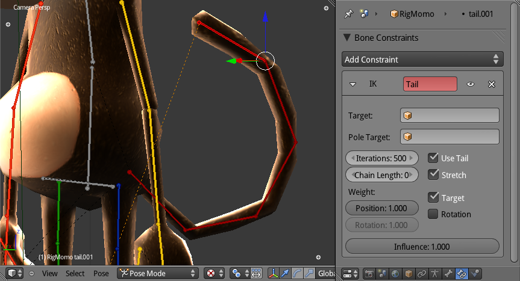

\*\*\* Begin Numbered List

1.Select the armature object.

2.Change to Pose mode.

3.Select the last tail bone (RigMomo.tail.001).

4.Select Bone Constraints in the Property Editor.

5.Add an Inverse Kinematics bone constraint.

\*\*\* End Numbered List

Now the setup is almost done. Before we finish, try to move the tail bone around. This results in all sorts of twists and revolving poses just by moving only a single control bone. You can see this early iteration in Figure 4.35, which went a bit too far, however. All you need is to control the chain of bones that this bone belongs to; in this case, all six bones from the tail bone group.

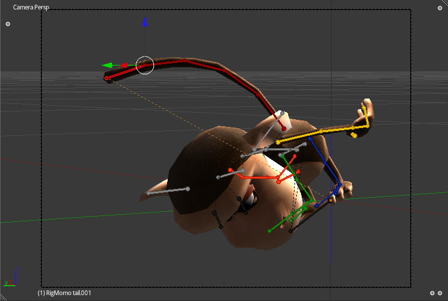

In order to constraint the Influence of the bone control, you need to set the chain length in the IK Bone Constraint panel. The default value, zero, makes the chain of influenced bones as long as possible. For the tail, you can set the chain length to be five bones.

There are other IK bone constraints that we want to set. So far we have been seeing only the bones from the first bone layer. Bone layers work like the object layers in Blender. A bone can be in more than one layer, and you can choose which layer to set at a time. The bone layers can be found in the armature Object Data panel in the Property Editor, as seen in Figure 4.36.

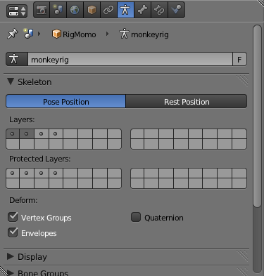

If you can turn on the second bone layer, you will see only the hand, foot, and tail bones. They all need IK bone constraints as well. Try copying the steps for the tail bone. To mimic the original file, you need to set the chain length to be two bones for the forearm and the shin bones, and three bones for the feet. These numbers correspond to how many bones are left in the chain of bones. At this point, your file should be like the one on _\Book\Chapter4\tutorial\_walk\_2.ik.blend._

\*\*\* Begin Note

Targetless Constraints

Those IK bone constraints are targetless. As explained previously in the bone constraints section, they are a fake IK. They are used only to help in posing and can be removed from the final file once the animation is done.

\*\*\* End Note

##### Track To Bone Constraints 

Well, if you haven't looked at the hidden third bone layer, now is a good time to do so. As you see in Figure 4.37, in this layer, we have the eye bones and two other bones to be used as trackers. Sure, you could move the eye bones directly, but again, this is not the ideal workflow.

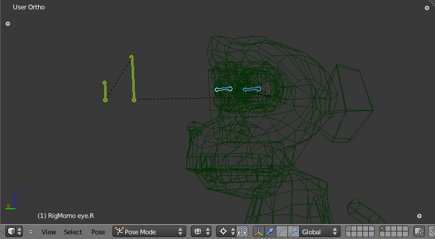

The two bones in front of the eyes are the tracker bones. Each eye bone will need a Track To bone constraint with those bones set as the targets. Think of the bone trackers as the direction in which Momo is looking. For example, if there is a banana on the floor, you can place the trackers right on the fruit. This will make the eyes converge there.

Setting the Track To bone constraint is not much different than setting the other bone constraints. If you follow the steps in the list below, you should see the settings shown in Figure 4.38:

\*\*\* Begin Numbered List

1.Select the armature object.

2.Change to Pose mode.

3.Select the left eye bone.

4.Select Bone Constraints in the Property Editor.

5.Add a Track To bone constraint.

\*\*\* End Numbered List

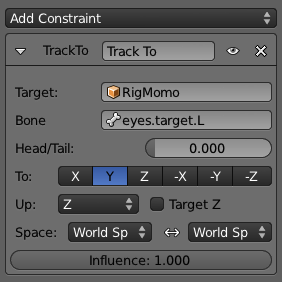

To finish the setup, select the RigMomo as the target object and eyes.target.L as the target bone. Do the same for the right eye, and you are ready to move the target bones around. The armature is now ready for the first animation. If you just want to have fun animating the character, you can check the current file status at _\Book\Chapter4\tutorial\_walk\_3.trackto.blend._

#### Extreme Poses 

The first thing you need for your animation is the start position of the walking cycle. A good cycle shouldn't have a clear beginning or end, so we'll start with the extreme poses. In general, an extreme pose shows a moment when the animation hits a peak, before it changes direction. For the walking cycle, an extreme pose is when one leg is in its maximum stretch and the other is slightly bent, waiting to transfer its weight to the leg in front of it. We will start from there.

It helps to be able to view images and videos when animating. If you want to spare yourself from a visit to the nearest circus, a drawing or video of a person walking will do just fine.

On the book files, you can find an image of Momo walking in _\Book\Chapter4\ ExtremePoseSide.png_ and _ExtremePoseFront.png._

In Figure 4.39, you can see those images being used as background in a file ready for posing. This Blender file is the same one we built in the previous section with additional reference images as background. Find it in _\Book\Chapter4\tutorial\_walk\_4.extreme\_reference.blend_.

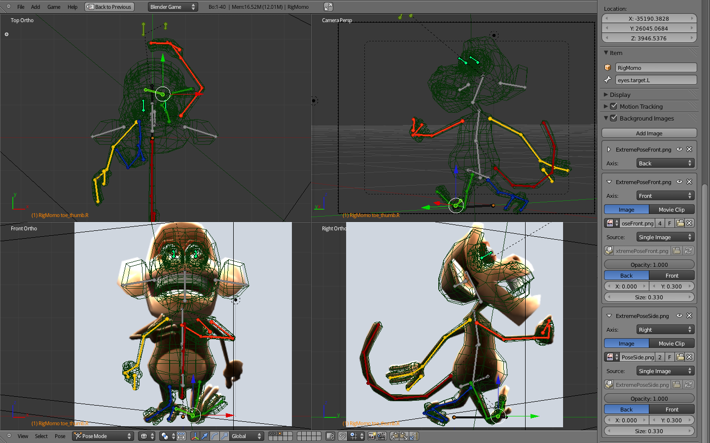

\*\*\* Begin Note

Reference Images

The reference images are used here in the background. If you prefer to see them on top of the view, you have two options. You can use the "Front" option in the Background Images panel. Or you can use empties instead. Add empties with the Display type set to Image. Place them in the desired location and lock their selection in the Outliner.

\*\*\* End Note

Try to match your armature to the reference image. In the Pose mode, move and rotate the bones around. (You don't want to change the armature in Edit mode.) Pay special attention to the feet bones to make sure they are well planted in the ground.

After you are done with the initial pose, you can go for a bit of monkey see-monkey do. Follow the steps below. The explanation follows.

\*\*\* Begin Numbered List

1.Change current frame to 1.

2.Select all bones.

3.Keyframe Loc/Sca/Rot (I key)

4.Change frame to 41[md]this will be the end frame of our animation.

5.Keyframe Loc/Sca/Rot again (with the bones still selected).

6.Change frame to 21[md]the half of the animation where the second stride begins.

7.Copy all the bone transformations (Ctrl + C or the icon in the 3D View header).

8.Paste them mirrored (Shift + Ctrl + V or the last icon in the 3D View header).

9.Keyframe Loc/Sca/Rot yet again.

10.In the F-Curve Editor, select all bones and change Extrapolation Mode to Constant (Shift + E or Channel Menu  Extrapolation Mode).

\*\*\* End Numbered List

What we just did was first define the animation length for 40 frames (1.3 seconds at 30 fps for one complete set of two strides). The first and last frames need to match; so we copied the transformation of the bones over frame 1 to 41. (You can copy them in the Dopesheet Editor as well.) We copied to frame 41 and not to frame 40 because we don't want a duplicated frame in the animation. We want the transition from the last frame (40) to the first frame (1) to be the same as from the last frame (40) to the next frame (41), which is outside the loop range.

The extreme poses for the left and the right strides are flipped copies of each other. If you named your bones properly (as we did, using .L and .R for symmetric left and right bones respectively), you can mirror copy/paste them. Therefore, in the middle of our animation (frame 20), we place a copy of the poses.

Finally, the change in the Extrapolation mode ensures that the frames behave as if they were copied over and over in the Dopesheet. The handlers of the initial keyframes change with the handlers of the final frames and vice versa.

In the Render panel in the Properties Editor, you can set the speed (30fps). The playback range (1 to 40) can be changed in the Timeline Editor or in the same Render panel If you switch the render engine to Blender Render. With this set, you can play back (Alt + A) your file to see the two extreme poses alternating over time. Before finishing, go to the Dopesheet Editor, switch from Dopesheet to Action Editor and rename the previously created action from ArmatureAction to Walking. You can see the panel in Figure 4.40.

The final file can be found in _\Book\Chapter4\tutorial\_walk\_5.extremeposes.blend._

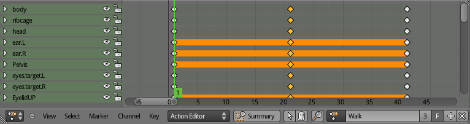

#### Moving Forward 

The final walking cycle will have no real forward movement: the character stays in the same place. It's similar to those old Looney Tunes cartoons when the coyote runs past the cliff and keeps running without going anywhere. Then he falls. Nevertheless, you still need to set up a system where you can see the character walking as if you had a Motion Actuator attached to it. To help with this, we will look at two methods: using the central bone or moving the environment.

##### Root Bone 

The simplest way to make Momo move is by keyframing the root bone along the way. The root bone is the parent of all the bones. Thus, if it moves, the rest of the armature will follow it. To set the root bone to move, go to Pose mode and do the following:

\*\*\* Begin Numbered List

1.Select the bone. In RigMomo you will find the Bone.main on the floor level.

2.Insert a Location keyframe. This will be the initial position of the bone and armature.

3.Advance from frame 1 to 41.

4.Move the bone forward the distance of one stride[md]0.23 (see the note below).

5.Keyframe the new bone position.

6.Change the Channel Extrapolation mode of the root bone to Linear Extrapolation.

\*\*\* End Numbered List

In the book files, you can see Momo setup with the root bone steps at _\Book\Chapter4\tutorial\_walk\_6.rootbone.blend_.

\*\*\* Begin Note

How Big Is a Stride?

If your character is walking, eventually you will need to find where its feet will land after each stride. This varies from person to person, and is a function of the leg's size, the speed of the movement (walking, running, jumping), and other factors such as the environment (for example, snow). For this walking cycle, you can use 23cm (or 0.23 Blender units) for the complete two strides.

\*\*\* End Note

After you are done with all the animation (past the polishing stage), you then can clean the bone location F-Curve. During the production of your game, you may need to come back for tweaks in your animation cycle. Therefore, instead of cleaning the bone curve you can simply disable the root bone channel in the Graph Editor. In Figure 4.41, you can see the speaker icon you use for that.

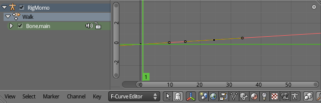

The downside of this method comes when you need to change the root bone as part of your animation. For example, sometimes you don't want your animation cycle to be uniformly moving forward. Even for Momo's walk, it's better if there is a break every time he rests one of the feet as he gets ready for the next step. As you know, the movement of the character will be decoupled from the animation cycle. And, no, we don't get tired of repeating that. So, in this case, if you look at the character from a constantly moving point of reference, it will seem as if Momo is moving forward, then backward, and then forward again to the original position. To move all the bones at once, nothing is better than the root bone. It's not a good idea to rely on a bone that you plan to disable though.

A work-around for that is to have one root bone to control the external position, and another bone (parented to the root bone) to control the internal position, relative to the object location. To avoid this surplus of global control bones, let's look at our second method.

##### If Mohamed Won't Go to the Mountain… 

…he goes to the beach. Our dear monkey, however, is suntanned enough and might as well stay put. In other words, in this method, Momo never moves. We will instead animate the environment around him.

This method is based on the principle that perception is always relative. For example, on your computer screen, there is no way to distinguish between moving the camera away from the character and moving the character away from the camera. The result will be exactly the same. We will be adding moving placeholders that you can use as a guide to position the feet. Figure 4.42 shows the setup.

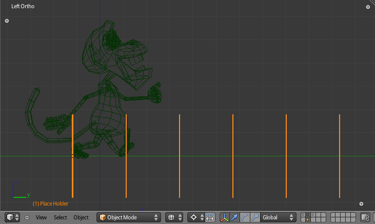

This file is on _\Book\Chapter4\tutorial\_walk\_7.placehold.blend_. You can't tell from the picture, but if you play back the animation, you will see the placeholders moving against Momo (or would it be the other way around?). In fact, the camera is static so Momo doesn't really move.

\*\*\* Begin Numbered List

1.Create a simple, easy-to-spot object.

2.Create an Array modifier[md]set the constant offset to be equivalent to one stride and set enough copies to fill the screen.

3.Move the Array object to be aligned with Momo. The feet from your extreme pose should match the position of the array elements.

4.Insert a location keyframe.

5.Advance from frames 1 to 41.

6.Move the array object forward the distance of two strides[md]0.46. (See the note on root bone.)

7.Keyframe the new array object position.

8. In the Graph Editor, change the array object Extrapolation mode to linear extrapolation.

\*\*\* End Numbered List

This method requires a bit more setup than the previous one, but it has a big advantage. To work in the between poses (the next step of this tutorial), you will need to keep track of the foot position while the character moves forward. While the body is constantly moving, the feet are planted on the ground until it's their time to get up and get smashed on the floor again. This will prevent the undesirable effect known as _sliding feet_. This problem will be revisited next when we create the poses between the extremes. Figure 4.43 shows the complete walking cycle in different moments; note that the feet are always in the same place relative to the placeholders.

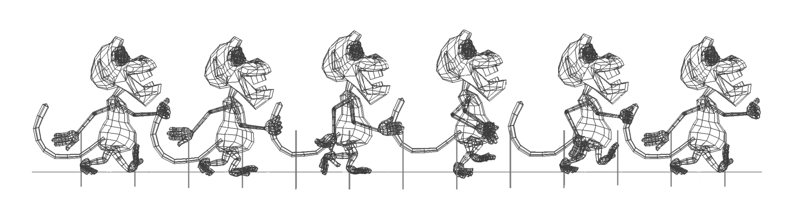

#### Between Poses 

So far we have only two poses, the extreme left and the extreme right stride poses. By default, Blender interpolates the keyframed poses, creating a smooth transition between them. This mathematic interpolation is of no use for the final animation. That leaves us with 20 frames to fill between those extreme poses.

From traditional animation literature, you can use two main techniques to create those in-between frames: straight-ahead action and pose-to-pose.

Regardless of the advantages of one or another method (you can learn more about them in the material in the reference section of this chapter), we should attend to the differences in their workflows. In straight-ahead action, you animate frames one-by-one as you go. In pose-to-pose, you create sub-extreme poses and fill in the intervals systematically.

In both cases, you need to ensure that the feet are not sliding while you pose them. Use the technique presented in the previous section to prevent this. Sliding feet and feet going under the ground are hallmarks of not enough frames and automatic interpolation. Avoid them at all costs.

Also, although you can create the animation by posing and keyframing the bones in the 3D view, you might want to tweak them in the Graph Editor. That can spare you from creating too many frames and using the handlers for fine-tuning your transitions. The fewer frames you have, the easier it is to change your animation. In Figure 4.44, you can see the current F-Curves edited for this walking cycle.

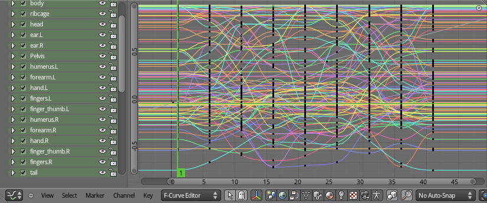

This is no different from the traditional workflow of animation in Blender. It's not even much different from the animation workflow in other 3D software. From the vast amount of techniques and tools available, I used the following for this cycle:

\*\*\* Begin Bullet List

[lb] **IK bone constraints:** Use the IK constrained bones as guides, but remember to keyframe the affected bones as well.

[lb] **AutoKey:** Automatic keyframe insertion in the Timeline Editor header, especially for the straight-ahead action will spare you from a lot of manual keyframing.

[lb]**Show/Hide Handlers (Ctrl+H):** My personal favorite shortcut in the Graph Editor.

[lb] **UV grid:** In the floor to spot feet sliding.

\*\*\* End Bullet List

In Figure 4.45, you can see the final result of our take on this. This file is in _\Book\Chapter4\tutorial\_walk\_8.pose\_to\_pose.blend_. Play it back to see it animated. From here, you can either keep working out of your file, take it from the book file, or merge both together. An action, as any other data block in Blender, can be imported and saved over different files (as long as the armature bones don't change their names).

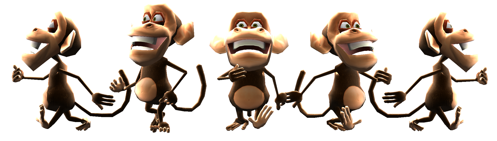

#### Play Time 

Now that the animation cycle is done, it's time to bring it from Blender into the game. You need to set an Action actuator to play the walking action and a Motion Actuator to make it move accordingly.

Let's start by creating the Logic Bricks for the armature. With RigMomo selected, follow the steps in order. In Figure 4.46, you can see how the Logic Editor will look.

\*\*\* Begin Numbered List

1.Add an Always sensor and set Positive Pulse on.

2.Add an Action actuator. Set the action created (for example, Walk), the Play mode to Loop End, and the Start and End Frames to 1 and 40 respectively.

3.Link the Action actuator with the Always sensor; this will automatically create an And controller.

4.Add a Motion actuator and leave the values blank for now.

5.Link the Motion actuator with the same And controller.

\*\*\* End Numbered List

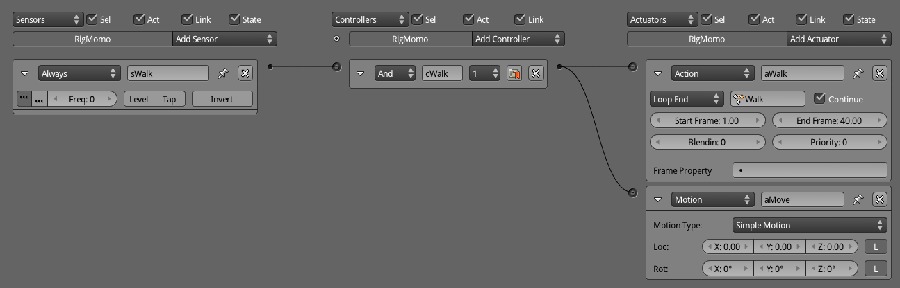

To set the value in the Motion actuator, you need to calculate the object speed in Blender and convert it to the game engine. The calculation is simple and is going to give you the precise speed. If, however, you don't feel like doing math today, let trial and error be your guide.

The speed-in Blender units by seconds-is equal to two strides (0.23 x 2) divided by the number of cycles per second - the frame range of your animation cycle (40) divided by the Blender fps playback value. The game engine uses the same frame rate as Blender, to be set in the Render panel to 30fps. So for Momo, the speed we are working with is 0.35 Blender units per second: 0.46 / (40/30).

The value to use in the Motion actuator is the object speed times the frequency on which the Motion actuator is activated. Since we are using an Always sensor triggering every logic tic, the frequency is 1/60 or 0.017. If you change your game to run at 30 logic tics per second, the frequency would be double (2/60 or 0.033). The multiplication of the speed times the frequency is the value you will add to the component of the actuator. The final Loc is [0, -0.0059, 0] X, Y, and Z respectively (see Figure 4.47).

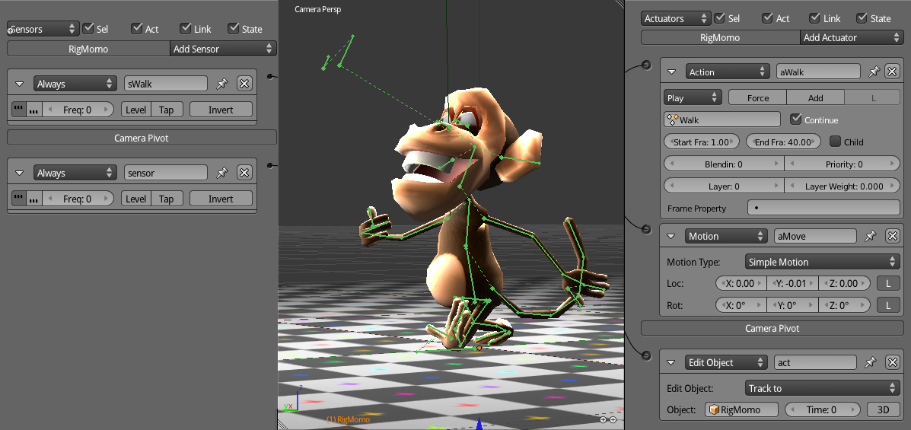

In the end, you might want to set the camera to track Momo during the walk. In the sample file, you will see the camera is parented to an empty with an Edit ObjectTrack To Actuator to follow Momo. Also, the zoom and rotate camera intro effect was brought back from the pretutorial. A checkerboard pattern on the floor will also help to follow the pace of his progression. The final file is shown in Figure 4.47 and can be found on _\Book\Chapter4\tutorial\_walk\_9.playtime.blend_.

### Idle Animation 

In the latest file, we set up Momo to walk. We never set it up for him to stop walking, though[md]the Always sensor will play the animation in an infinite loop until you quit the game. To push our animation exercises further, let's create an idle animation for Momo. We will then set up Momo to walk, stop, and walk again. Idle animations are played when the character is waiting for you to make a decision (whether to keep walking, to run, to turn, etc.). So as soon as we stop walking, we will set the character to act accordingly.

Start off by opening the file _\Book\Chapter4\tutorial\_idle\_1.begin.blend_. This is the same file we made in the previous tutorial, duplicated here for convenience (the spinning camera effect was removed again). Select RigMomo and create a new action in the Action Editor inside the Dopesheet. You actually have two options here: you can either create a new blank action or use the Walk action as reference (duplicate it and make changes on top of it). To duplicate the existing action into a new one, you have to click in the number by the action name, as shown in Figure 4.48. This is useful when you are creating variations of the same action (different walking styles, different jumps, and so on).

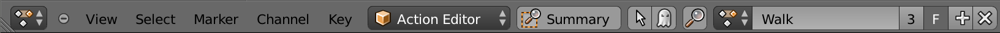

In this case, since the actions are very different, there is not much to recycle from the walking cycle to the idle animation. You want to keep only the first and final frames to guarantee a smoother transition between the two animations. If you don't want to bother deleting keyframes, you can create a new action from scratch, maintaining the initial pose by following these steps:

\*\*\* Begin Numbered List

1.Go to frame 1.

2.Unlink the Walk action from the armature (click the X button).

3.Create a new action (click in the + or New button).

4.Rename your new action "Idle."

5.Select all the bones of the armature and keyframe them.

6.Go to a later frame, which will be the final frame for your idle animation. For example, to make an idle animation of 4 seconds, go to frame 121.

7.Set a keyframe for all the bones again.

\*\*\* End Numbered List

Now you have a new, blank action to play with. The only rule you need to follow is to avoid animations that require Momo to move around. The reason is that you may need to interrupt the idle animation at any moment as soon as you get back to walking.

The transition between the walking animation and the idle one can be seamless. In the Logic Brick section next, we will explain how to make the walk finish its complete cycle before starting the idle animation. Also, this will have to rely on the blend between poses from both actions for a few frames. This will work only if the pose in the current frame of the idle animation is not very distinct from the pose at the initial frame of the walking action. If the poses are extremely different (for example, Momo is facing opposite directions), the automatic calculated in-between poses will be mathematically correct but artistically awful. This is similar to our reasons for making the between poses in the previous tutorial.

As long as your poses are inside the range of the initial and final frames, the idle animation will play fine. Since you want to avoid moving Momo around, it's a good time to learn how to enhance his facial expressions.

Before you finish the idle animation, you need to set up drivers for your shape keys. You can find the current snapshot file at the end of the next section.

### Making a Face 

Do you know the difference between television and a live performance? In television the director has full control of the framing of the shots. It's common to use and abuse close-ups and strong facial expressions as a replacement for expressive body language. In the live theater, the audience may be sitting close or far away from the stage, and they all need to be pleased. (Sure, people fight over a front seat, but the show still has to make sense to everyone.)

Good artists do fine in both mediums. But a pretty face on your HD television screen can be a very boring, disappointing I-want-my-ticket-back experience in a live theater (been there, done that, and slept).

In a game, we have the best and the worst of both worlds. You still can use directed framing for cut scenes. But for most of the game, you must be prepared to produce good, effective animations for close and far distances.

In the previous tutorial, we covered the techniques for a good, full body-language posing. Add some more classic animation techniques (for example, strong silhouettes, lines of action, and exaggeration), and you are good to go. For facial expression, however, we will look at something new. If you have not been reading these chapters in order, now is a good time to go back and read about the shape keys.

#### Shape Keys and Bone Drivers 

A shape key is like an individual piece of grammar. You need to build a library of poses to use in your animation. Momo already has a few poses previously created. We will use them in our animation posing with the bone-driven technique.

Open the file _\Book\Chapter4\tutorial\_idle\_2.shapekeys\_ui.blend_. This is the initial file with the UI rearranged to work better with the shape keys.

In Figure 4.49, you can see all the poses in the Mesh data panel in the Property Editor for the MeshMomo object. The different poses were created in pairs: smile and ooh; eyebrowsUP and eyebrowsDOWN; eyelidUP and eyelidDOWN. They are all relative to the basis shape. To see the poses change the value by their names in the shape keys slot[md]set the influence value to 1.0 and all the other poses to 0.0. If you want to tweak any of the poses, you need to select the shape and go to the Edit mode. You will no longer be working in the basis shape, so any changes will only be applied to this particular shape.

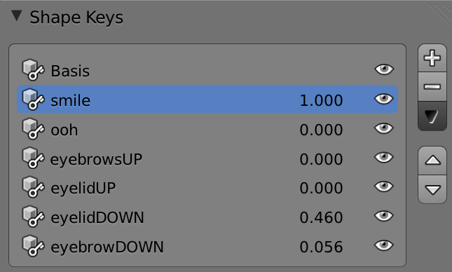

The shapes are not exclusive. Often, you will have more than one pose active at the same time. Therefore, each shape has very isolated changes. For Momo, you could have a single pose with both the eyelid up and the eyebrow up shapes. However, this would give you no way to play with their influence individually in different actions. Unlike armatures, you have no way to mask out the shapes by using only a few "bones" (or part of the mesh).

Now you can integrate the shape keys into your idle animation. The first thing you need to do is to set bones to drive the shapes. The idea is to use shape keys as "pose libraries" inside your armature animation workflow. Therefore, you will be using control bones from RigMomo to control the influence of each individual shape.

Select RigMomo and switch to the Pose mode. In the walking tutorial, we looked at the bones in the bone layers 1 to 3. Now you can finally turn on layer 4 to see the last bones of Momo's armature. The bones in this layer are all detached from the main armature, as you can see in Figure 4.50.

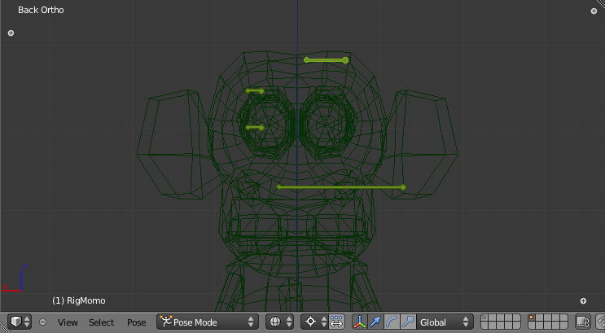

To hook up the control bones with the shape keys, you need to follow the steps. The final driver in the Graph Editor will look like Figure 4.51.

\*\*\* Begin Numbered List

1. Select the MeshMomo object.
2. Select a shape key (for example, smile).

3.Click with the right mouse button in the Influence value.

4.Select Add Driver.

5.Open the Graph Editor.

6 .Switch the Edit mode from F-Curve Editor to Drivers.

7.Inside the "Key" channel, select the curve to edit (for example, Value(smile)).

8.Open the Property panel (N).

9.Change Type from Script Expression into Averaged Value.

10.Delete the F-Curve modifier (created by default).

11.In the Object/Bone panel, set RigMomo and the bone to use as controller (for example, Mouth).

\*\*\* End Numbered List

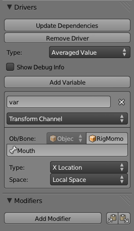

By default, Blender sets the global X coordinate of the bone to drive the shape influence. In the Pose mode, you can move the mouth bone sideways to see the shape influence increasing and decreasing respectively. As with any other bone, you can keyframe the position of this bone controller (mouth) to animate this shape key influence over time.

This is not an effective setup, though. First, it's more intuitive to use the vertical position of the bone to drive this particular shape. Second, it's better if you don't need to move the bone as much as you do now to have significant changes. Sure, these are not deal breakers, but we are here to learn, aren't we?

First, in the Driver panel, change the Transform channel influence from X Location to Z Location and change Space to Local Space. Optionally, you can lock the transformation of X, Y and rotation of the bone[md]we will be using only its Z movements.

Second, you need to map the bone transformations to shape influence. To keep the bone positions not far away for the rest of the armature, we will use the short distance of a tenth Blender unit to control all the shape influences. That creates a curve with two points, [0.0, 0.0] and [0.1, 1.0]. This will map the shape influence to 0.0 when the bone Z pose location is 0.0, and 1.0 when the location is 0.1.

To move the bone up and down will now drive the shape influence as you want. Your file now should match the book file: _\Book\Chapter4\tutorial\_idle\_3.smile\_shapekeydriver.blend_.

For the second pose, "ooh," you will use the same bone controller but with a different mapping. We want to set the "ooh" pose when the bone is in -0.1 and "smile" when it's 0.1, as we have. This will allow a smooth transition between those two extreme poses. Repeat the previous steps all the way to the creation of the F-Curve.

This time the curve will be the reverse of the smile, with two points: [-0.1, 1.0] and [0.0, 0.0]. Figure 4.52 illustrates the final arrangement.

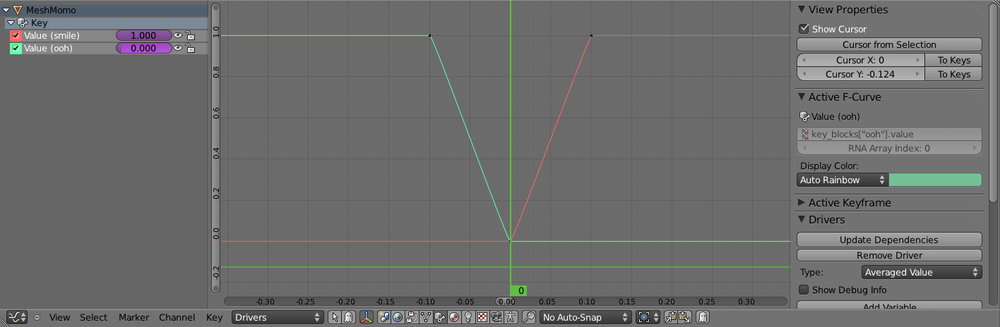

Additionally, you can add a bone constraint to make sure the bone controller is moving only vertically and that it's always inside the range you are using (-0.1 to 0.1).

Finally, you need to set up the remaining poses[md]eyelid up and down and eyebrow up and down. The setup is the same as for the pair ooh and smile. This time, we will leave them for you, but you can check the final setup file in _\Book\Chapter4\tutorial\_idle\_4.shapekeysdriver.blend_.

### Get Your Hands Dirty 

With the armature ready to pose, you can complete the idle animation. Once things are set, there is no need to worry about anything but the armature poses. Take the previous file and create the complete cycle.

Our attempt of a fun idle animation can be seen on the book file _\Book\Chapter4\tutorial\_idle\_5.action.blend_. The animation is not (yet) set to play in the game engine, but you can play it back in the 3D view. Also remember to change the end frame in your render panel to match the playback of your animation cycle. This will not affect the game engine, but it will help you preview your work in Blender.

After the tutorial section, you can check out the idle and walking animation made by Moraes Júnior especially for this book. In the meantime, enjoy our take on Momo, the happiest monkey in the world (see Figure 4.53).

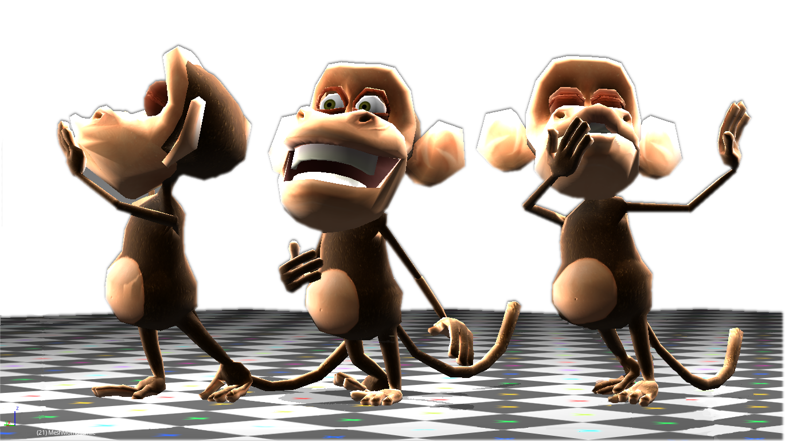

### Wiring Up the Logic Bricks 

There is only one thing missing. We need to alternate between the two animations: the walking and the idle one. With the latest file open, select RigMomo and in the Logic Editor, make the following changes:

\*\*\* Begin Numbered List

1.Change the Always sensor to a Keyboard sensor with Key set to W.

2.Add a Property Sensor to check whether the frame property is between 39 and 40. Set Invert and turn on Positive and Negative Pulse modes.

3.Connect the Property Sensor to the Motion actuator (Move Forward).

\*\*\* End Numbered List

These changes can be seen in Figure 4.54. What you are doing here first is to set the action to play when the W key is pressed. Since the Action Actuator is set to Loop End, the animation will still play for a few more frames. In order to make Momo keep moving forward, you need to keep the Motion Actuator active until the frame played is not the final (40). That way when you release the key, you ensure that the Momo animation is in the beginning of its animation cycle, ready to blend with the idle action.

Now all that is left to be done is to play the idle action when Momo is not walking. Add a Nor Controller connected to the Keyboard and the Property and connect it to a new Action Actuator. The Nor Controller will play this actuator only when both sensors are false. The Action Actuator and the final logic bricks can be seen in Figure 4.55. The explanation for the parameters follows.

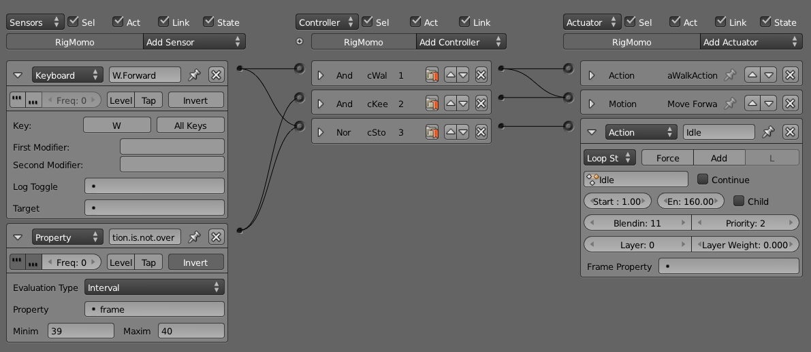

**       ** [lb] **        Playback type** : Loop Stop will make the action loop until the Keyboard Sensor is active. It will stop immediately after.

**       ** [lb] **        Priority** : 2[md]it has to be higher than the walking Action Actuator. Lower priority actions have precedence over higher ones.

**       ** [lb] **        Start/End Frame** : 1 and 160[md]the range of your animation.

**       ** [lb] **        Blendin** : 11[md]If the pose of the initial frame of the idle animation is the same as the walking, you don't need to blend them (Blendin = 0). Otherwise, this parameter will make the transition smooth.

**       ** [lb] **        Continue** : False[md]ye want the animation to start over from frame 1 every time you stop walking.

The final file is on _\Book\Chapter4\tutorial\_idle\_6.idlewalkforward.blend_.

### How Many Bricks Does It Take to Turn Momo? 

Momo can walk and stop. Now, if only we had a jump, we would be set for a side-scroller platform game (due to copyright restrictions, you will not see a figure of Momo running after a spinning-spiked hedgehog). For a 3D game, however, you need to be able to freely navigate into the levels. And there is no better way than allowing the character to turn around.

The simplest way to make Momo turn is by adding new Motion Actuators responding to a new set of Keyboard Sensors. Let's use the key A to turn left and D to turn right. To make it turn left, follow these instructions:

\*\*\* Begin Numbered List

1.Add Keyboard sensor[md]key A.

2.Add Motion actuator with Rot Z 2.5 degrees.

3.Connect Sensor with Actuator, which creates a new And controller.

4.Change the original cWalk controller from And to Or.

5.Connect the new sensor to this controller as well.

6.Connect the new sensor to the Nor controller.

\*\*\* End Numbered List

Now do the same for the right rotation, and you will have the logic bricks shown in Figure 4.56. You may notice that I'm using three States for the controllers here. They are always turned on, thus the main purpose is purely for organization.

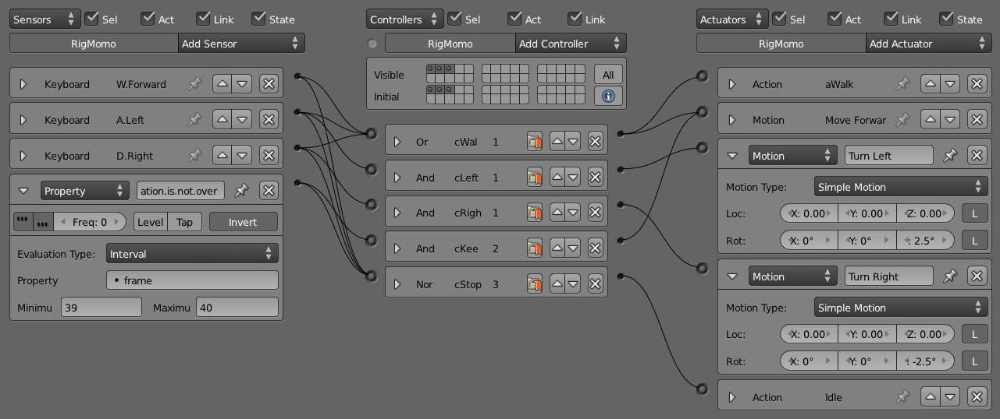

Source: Blender Foundation.

The final file is on _\Book\Chapter4\tutorial\_idle\_7.turning.blend_.

\*\*\* Begin Note

The Dilemma of the Sweet Miso Soup

Once when I was younger, my hand slipped while seasoning the miso soup and, brilliantly, I thought it was a good idea to compensate for the salt by sweetening it. Guess what, it didn't work (and yes, I had to eat it all).

The same goes for animation. No one needs to turn right and left the same way. It can be because of a soccer injury, a shorter leg, you name it.

So sometimes (not always, not now), you need more control over the turning. For the _Yo Frankie_ project, they had specific animations for each side Momo would be turning. Those subanimations make for both good transitions between actions and for more artistic control. It's always a matter of compromising between what you can afford to do and what you can't, which is addressed between the technical and artistic teams. Thus, even though a programmer may insist it is so, an animation for "getting up" is not the same as a "sitting down" animation played backward. For our simple walking cycle, this will do.

Bottomline: a miso soup with sugar is not a break-even[md]it's bad cooking.

\*\*\* End Note

### Hats Off to Momo and Vice-Versa 

Momo is a classy monkey, often seen at parties of the animal kingdom's high society. However, when with his inner circle of friends, Momo is actually a very casual monkey[md]not much to show, nothing to hide. One character[md]two quite distinct moments. This is the theme of our animation.

In this tutorial, we will show how to make Momo switch between two kinds of hats: a bouncing hat and a hat that fits tight on its head. We will not only use two different Blender objects, but also animate them differently when worn. To make an object external to the armature follow it, we need two things: a bone and a parented empty.

The bone, which can be animated as any other bone, will indicate Momo's head location and rotation for every frame. The empty, external to the armature, is parented to the bone, and copies the bone transformations automatically during the game. In this tutorial, this empty, working as a placeholder, will be used to place the hat Momo will be wearing.

Start by opening a variation of the latest walking Momo on the book file _\Book\Chapter4\tutorial\_hat\_1.begin.blend_.

If you want to carry these changes to your own working file, you need to append the Hats group into your local file. This also includes the camera object and an empty where we are running the script to control the hat switch. You can see the hats in Figure 4.57.

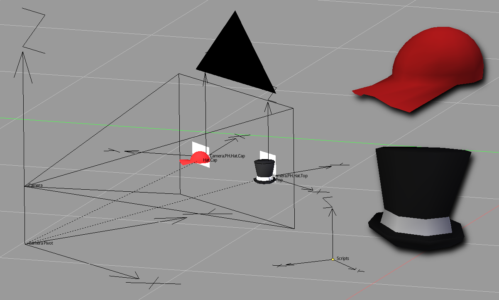

Source: Blender Foundation.

This is a simple tutorial, focusing on illustrating the bone parenting technique. Thus, most of the components are ready for you to hook up with your file (for example, the scripts). Let's first set up one of the hats.

\*\*\* Begin Numbered List

1.Select the armature and go to Edit mode.

2.Create one bone in the middle of the head named Head.Hat.Steady.

3.Parent the bone to the head bone.

4.Change Armature mode to Pose mode.

5.Go to Object mode and create an empty with the same position/rotation as the Head.Hat.Steady bone. Name the empty Head.PH.Hat.Steady.

6.With the empty selected, select the bone you just created and make it the parent of the empty (Ctrl+P  Set Parent To  Bone).

\*\*\* End Numbered List

With those changes, you can already animate the bone Head.Hat.Steady, and the empty placeholder will follow along. The hat will be placed exactly where the empty is. In the current file, both hats are parented to empties/placeholders close to the camera. In order to animate the hat bones, you need to temporarily bring the hat to the position it will be during the game. For that to work with the Head.Hat.Steady bone, you need to bring the Hat.Cap Blender object to the same position/rotation as the empty placeholder and parent the hat object to it (select the hat, select the empty, in the Transform panel in the 3D view, right-mouse click in the values to "Copy To Selected," Ctrl+P to parent). Now you can go to the armature Edit mode and move the bone to make the hat fit the head properly. Figure 4.58 shows the arrangement of Bone + Empty + Hat. The current snapshot can be found _in \Book\Chapter4\tutorial\_hat\_2.capsetup.blend_.

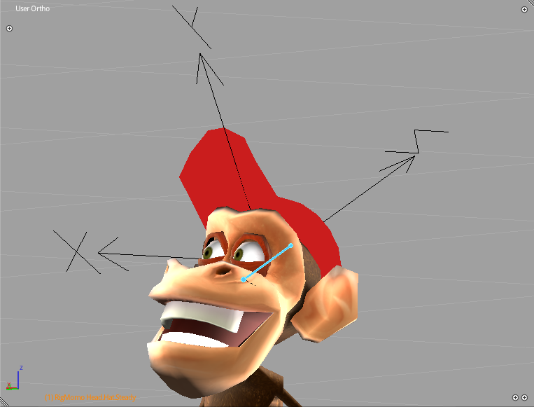

Once the bone is in the right place, you can go over the walking and the idle animations and do some tweaks on its position/rotation over time. For this hat, you don't need to move much. In our case, we only tilted it a bit in the middle of the idle animation to follow the eyebrow raising and some subtle bouncing during the walk. When you now run the game, you will see the hat always in the right place during the animations. To make sure you can follow closely, the file with the animated Hat.Cap can be seen in Figure 4.59 and the book file _\Book\Chapter4\tutorial\_hat\_3.animatedcap.blend_.

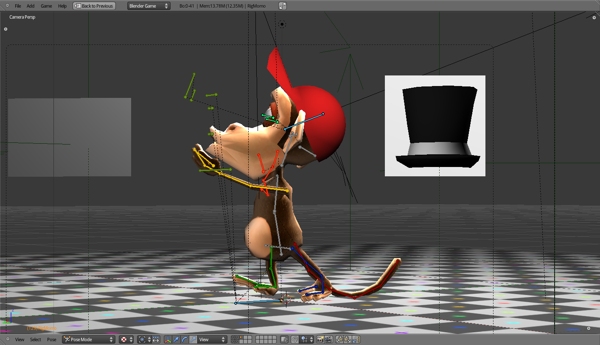

So far so good. Let's now set up the second hat. For this one, you will create a new bone and a new placeholder. The reason is that you will make a different animation for this hat. The classy top hat will be a bit looser, so it should bounce more during the animations.

Start by moving/rotating the Hat.Cap back to its original placeholder by the camera and re-parent it to the empty (Camera.PH.Hat.Cap). Now repeat the same steps you did for the other hat. This time name the bone Head.Hat.Bouncy and the empty Head.PH.Hat.Bouncy. For the animation, make it more exaggerated, with the hat slipping during the walk and the idle actions. Figure 4.60 illustrates one of the moments the hat almost fell off. After moving the Hat.Top object back to its original placeholder (Camera.PH.Hat.Top), your file should be ready for the final adjustments.

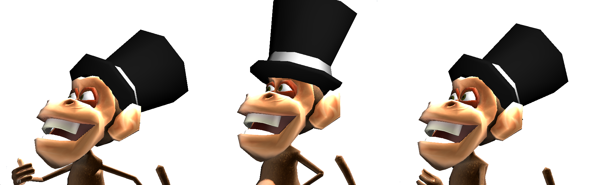

\*\*\* Begin Note

Copy Menu Attributes Add-on

As soon as you start parenting your objects, you will see that it's not so easy to copy over transformations. Blender built-in copy tools work only on top of the local transformations, and this is not enough when you want to copy the visual or world transformations. The difference is that the visual transformations (what you see) are an accumulated result from the different local transformations of the chain of parents.

Blender comes with an add-on that allows you to do all sorts of advanced copy operations. Go to the User Preferences, Add-Ons and enable the Copy Attributes Menu add-on.

This add-on was originally intended only to bring over the copy menu (Ctrl+C) from Blender 2.49. Bassam Kurdali, its original developer and maintainer, was kind enough to expand it to help with this tutorial. Kudos to him.

If you don't want to use add-ons, you can go old school with Blender 2.49 work-arounds. Duplicate your empty and do a Clear Parent  Clear and Keep Transformation in the new empty. Now you can use this object to copy the transformations from, delete it, and parent the hat to the original empty.

\*\*\* End Note

Now that the animations are done and the armature set up, we can move on to look to the implementation of hats switching on the fly.

Take the final file _\Book\Chapter4\tutorial\_hat\_4.animatedhats.blend_.

The interaction is simple: click on a hat to switch to it; click anywhere else to bring it back close to the camera. When you pick a hat, the game engine will have to do as you did to tweak the animations: take the selected hat, move it to the head placeholder position, match their rotations, and parent it to this placeholder.

This is done by a script that is already hooked up for the camera. This Python script is very simple, and you should be able to understand it after the Chapter 7, "Python Scripting." The script accesses the objects[md]hats and empty placeholders[md]by their names. Therefore, for your local changes, it's important to follow the names as presented here or tweak the script accordingly.

### Mango Jambo Special Animation 

The walking cycle you've seen so far is technically correct, and it follows the workflow you can count on, regardless of your animation skills. The bottom line is: with a good method and the understanding of the techniques, although you may not be brilliant, you can't go wrong either.

Now, as the icing on the cake, I've asked the animator Moraes Júnior to do the same thing we did together[md]a new walking cycle and idle animation using the same base file. For reference, he created Momo for the _Yo Frankie_ project and its original animations. After our using and abusing of Momo in the previous pages, it's only fair to see what his "father" would have done instead. Here you can see and study his work and the final contribution: \Book\Chapter4\mangojambo.blend

## To Learn More 

Finally, dedicate the proper time to mastering the ways of animation. Learning how to make animation work in Blender is still not the same thing as knowing what to do. Here is a list of classic materials for learning animation[md]modern references for animation and character control in games and Blender-specific reading.

\*\*\* Begin Bullet List

[lb]_Drawn to Life_ by Walt Stanchfield

[lb]_The Animator's Survival__Kit_ by Richard Williams

[lb]_Cartoon Animation_ by Preston Blair

[lb]_3rd Person Action Platformer Hero Animation Graph_ by Rune Vendler

[lb] [_http://altdevblogaday.org/2011/04/14/3rd-person-action-platformer-hero-animation-graph_](http://altdevblogaday.org/2011/04/14/3rd-person-action-platformer-hero-animation-graph)

[lb]_Character Animation DVD_ by William Reynish

[lb]Blender 2.5 Character Animation Cookbook by Virgilio Vasconcelos

\*\*\* End Bullet List
