**Table of Contents**

- [Chapter 5: Graphics](#Chapter_5_Graphics)
	- [Visual Style](#Visual_Style)
	- [Designing for Real Time](#Designing_for_Real_Time)
	- [Geometry](#Geometry)
	- [Materials and Textures](#Materials_and_Textures)
	- [Lights](#Lights)
	- [Shading Modes](#Shading_Modes)
		- [GLSL Mode](#GLSL_Mode)
			- [Material and Textures](#Material_and_Textures)
				- [The Material Panel](#The_Material_Panel)
					- [Material Management](#Material_Management)
					- [Multi-Material Objects](#Multi-Material_Objects)
					- [Object vs. Data](#Object_vs._Data)
					- [Preview](#Preview)
					- [Diffuse](#Diffuse)
					- [Specular](#Specular)
					- [Ramp](#Ramp)
					- [Shading](#Shading)
					- [Game Settings](#Game_Settings)
					- [Physics](#Physics)
					- [Additional Options](#Additional_Options)
				- [The Texture Panel](#The_Texture_Panel)
					- [Texture Data Blocks](#Texture_Data_Blocks)
					- [Image](#Image)
					- [Image Sampling Panel](#Image_Sampling_Panel)
					- [Mapping Panel](#Mapping_Panel)
					- [Influence Panel](#Influence_Panel)
			- [Combined Exercise](#Combined_Exercise)
			- [Nodes](#Nodes)
		- [Multitexture](#Multitexture)
	- [Lights](#Lights)
	- [World Settings](#World_Settings)
	- [Texture Painting](#Texture_Painting)
	- [Custom GLSL Shaders](#Custom_GLSL_Shaders)
	- [GLSL Primer](#GLSL_Primer)
	- [Custom GLSL Shaders](#Custom_GLSL_Shaders)
		- [A Useful Fragment Shader](#A_Useful_Fragment_Shader)
		- [A Useful Vertex Shader](#A_Useful_Vertex_Shader)
		- [Going Further](#Going_Further)
	- [2D Filters](#2D_Filters)
		- [Why Use 2D Filters?](#Why_Use_2D_Filters?)
		- [How to Use 2D Filters](#How_to_Use_2D_Filters)
		- [Custom Filter](#Custom_Filter)
		- [Limitations](#Limitations)
	- [Text](#Text)
	- [Bitmap Text](#Bitmap_Text)
	- [Text Object](#Text_Object)
	- [Video Texture](#Video_Texture)
	- [Stereo](#Stereo)
	- [Dome](#Dome)

# Chapter 5: Graphics <a id="Chapter_5_Graphics"></a>

Welcome to Chapter 5, where it's all about the visuals! When you play a game, the graphics are usually the first element to make an impression, long before you can form a more rounded opinion of the game based on other aspects like gameplay, story, physics, or sound. Whether it's a screenshot, a video trailer, or a printed poster, graphics is the one element that publishers constantly rely on to draw the public's attention. So it's only fair that we should look at this topic in great detail.


In a modern game, it is not unusual for the computer to spend the majority of its processing time in rendering the graphics, while game logic, physics, and sound typically take up only a tiny fraction of the total computation time. This fact alone should convince you of the complexity of real-time computer graphics.

In this chapter, we will learn first how to work with the material, texture, and shading systems in the game engine; followed by a quick introduction to GLSL – OpenGL Shading Language, the shading language that would let you further extend the graphic capability of the game engine; and conclude the chapter by showing off some of the more specialized tools and features that can be used in a game.

## Visual Style <a id="Visual_Style"></a>

For most graphic artists, the ultimate goal of their work has always been photorealism. Photorealism means that the scene looks as believable as possible by replicating all the intricate geometries, light interactions, and surface properties of the physical world. While photorealism is a perfectly valid goal for games that strive to achieve the most realistic graphics possible, many games intentionally employ non-photorealistic styles. Achieving looks such as a cartoon style, anime style, or even a retro 8-bit style is certainly possible within the game engine. With some slight changes in the content-creation process, combined with a good understanding of shading, texturing, and lighting, you'll be able to create stunning artwork of any visual style.


## Designing for Real Time <a id="Designing_for_Real_Time"></a>

For a typical computer animation, the rendering time is effectively unlimited. A movie studio like Pixar has hundreds, if not thousands of computers working together as a rendering farm to make the images. Games don't have this luxury of rendering time. Because games are interactive, there is no way to pre-render frames ahead of time. Games need to pump out many frames every second (and from a single computer!) in order to achieve interactivity with the player. That means that preparing art assets for games is a bit trickier than for non-real-time animation, where performance usually isn't a concern.

> **Art Assets**
>
> Art asset refers to any piece of work that is used in a game. It includes models, textures, animations, sound, and even shader codes.

Because games are generally distributed to a large audience with a wide range of computer hardware, you need to make sure that the games will run at acceptable speeds on different hardware configurations. This way, you avoid alienating people without top-of-the-line computers. Blender has support for switching between different shading modes to help artists create games that work with different generations of computer hardware. This will be discussed in detail later in this chapter.

Modern graphics cards are surprisingly fast at pushing out high-quality images at astonishing speed, but you still need to keep a few things in mind when making art assets, in order to avoid slowdowns.

## Geometry <a id="Geometry"></a>

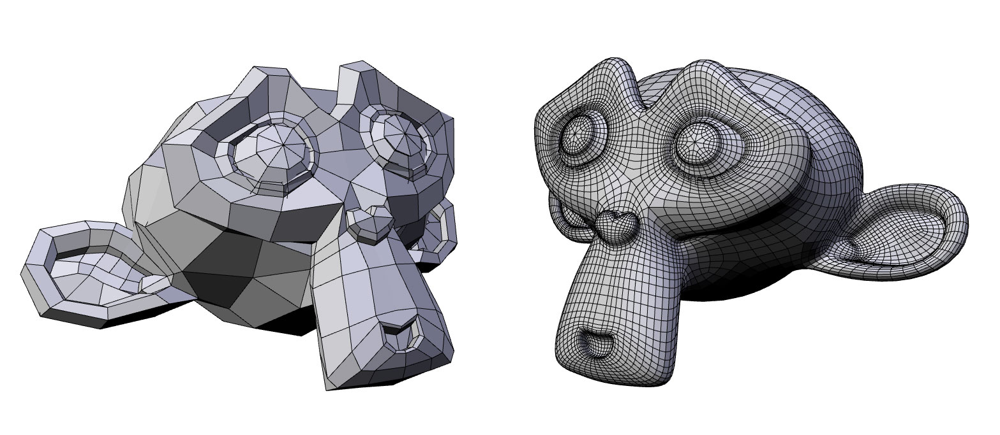

Geometry is the basis for any 3D scene. You can quantitatively measure the amount of geometry data in a scene using a "polygon count," which refers to the number of faces (triangles or quads, in Blender's case) in a scene. The more geometry data there is, the slower the game will be. So how many polygons are too much? Rather than imposing an absolute limitation, just remember to use polygons sensibly, spend them where they are needed, and don't waste excessive polygons on unnecessary parts that will not be visible to the gamer. That said, today's average computer should be able to render a million polygons at an interactive frame rate, so polygon count isn't as much of a concern as it used to be. A high-resolution model is smoother, more detailed, but is slower to process by the computer.

The supported Blender object types in the game engine are: camera, light, empty, mesh, and text.

Non-supported Blender object types are: curve, surface, and metaball. These objects will be hidden during the game.

## Materials and Textures <a id="Materials_and_Textures"></a>

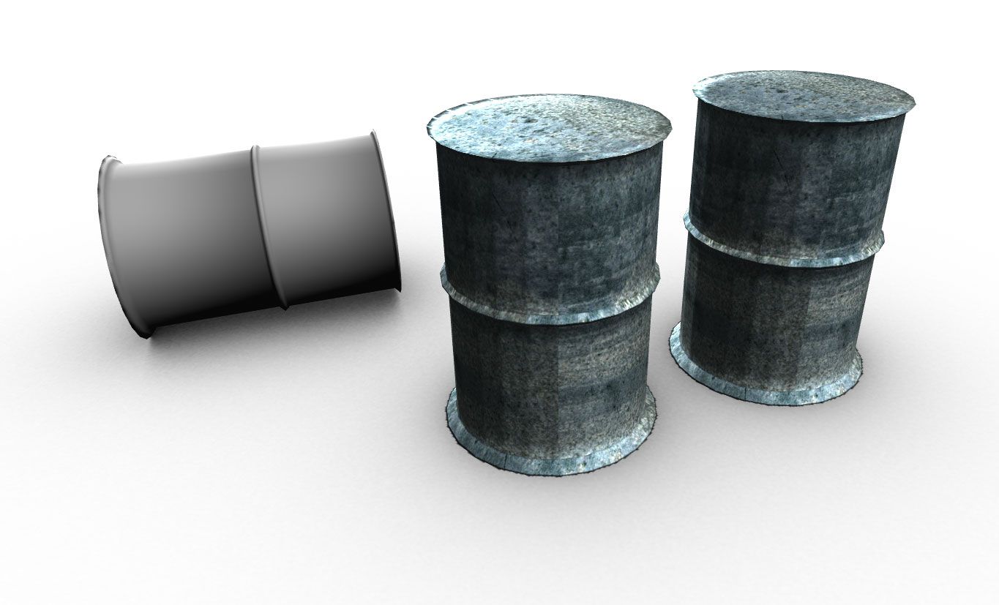

Once the modeling is done, materials and textures, which add visual fidelity, can be applied to the mesh. Using a combination of materials and textures, you can define surface characteristics such as color, shininess, bumpiness, and transparency. Textures also allow you to "bake" certain effects, such as complex light maps and shadows, onto the object, because these effects would otherwise take too long to compute in real time. Due to the importance of materials and textures, a large portion of this chapter will focus on materials and textures. (For a more in-depth discussion on texture baking, refer to Chapter 8.)

The Blender game engine implements a subset with some overlapping of all the features found in the regular Blender. Not all options available to the Blender internal renderer are available in the game engine; many advanced graphics features are simply too slow to be implemented in real time. But as you will soon find out, even some of the complex effects like reflection, soft shadows, and ambient occlusion can all be approximated in the game engine using clever tricks on modern graphic cards.

## Lights <a id="Lights"></a>

Lighting not only sets the overall tone of the scene, but it also helps highlight certain details while hiding others. Older hardware or mobile devices cannot afford to use dynamic lighting for performance reasons, so they often employ precomputed static lighting, which is faster to render, but does not have the flexibility that dynamic lighting offers (such as swinging bathroom lights that cast moving shadows).

In fact, without lighting, the virtual world you create would be pitch black.


The game engine supports eight real-time lights in Multitexture mode and at least eight in GLSL mode (more on the different shading modes later). But lights are expensive, and more lights will slow the game down significantly. Advanced features such as real-time shadow will slow down the game even more. Light is a very complex phenomenon; effects such as ambient occlusion, bounced light, and volumetric light shafts are all very computationally intensive and simply not feasible for most real-time projects. It is up to the artist to devise ways to fake these effects when needed.

> Advanced Shading Techniques
>
> Thanks to the rapid advances in shading language and graphics processing units (GPU), effects such as ambient occlusion, bounced light, and many others that were considered "impossible" are now possible using some very complex shaders. Explaining these advanced techniques is outside the scope of this book, but a selection of sample files is included on the accompanying disk. For advanced shader examples you can look at the book _GPU Gems_ from Nvidia.


## Shading Modes <a id="Shading_Modes"></a>

The game engine offers two different real-time shading modes. Think of them as different rendering pipelines - one is more limiting, the other is moore advanced. In this chapter, you will first be introduced to the most feature-rich shading mode: **GLSL**. Then we will talk a bit about the older **Multitexture** mode.

To switch between shading modes, go to the Render Property Editor.


> **Game Engine Interface**
>
> If you are following this chapter on your own without using the supplied template file from the book, remember to set the render engine to Game Blender once you started Blender. This will reveal all the relevant game engine features in the user interface and hide non-relevant interface elements. 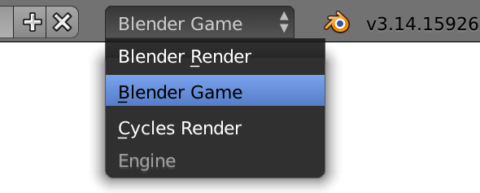

Here is a table that shows the advantages and disadvantages of the two shading mode. The GLSL mode, despite being the most advanced shading mode in Blender, also happens to be the easiest to use because we can accomplish the effect using the regular material and Texture panel. Unless backward compatibility with older hardware is a big concern, I strongly recommend using the GLSL shading mode for all your projects. Even if you are not planning on using all the advanced features, it's good to know that they are there if you need them later on.

Table 5.1 Comparison of Shading Modes in the Game Engine

|                        | Multitexture | GLSL        |
| ---------------------- | ------------ | ----------- |
| Date of introduction   | 2006         | 2008        |
| Hardware Compatibility | OpenGL 1.3+  | OpenGL 2.0+ |
| Lighting  accuracy     | Per vertex   | Per pixel   |
| Number of Lights       | 8            | 8+          |
| Real-time shadow       | No           | Yes         |
| Max texture layer      | 4            | 16          |
| Texture blending       | Yes          | Yes         |
| Custom shader          | No           | Yes         |
| Material nodes         | No           | Yes         |
| Viewport Preview       | Partial      | Full        |
| Should I use it?       | Nah...       | Yes!        |

Because the way to apply materials and textures varies somewhat depending on the shading mode, it is a good idea to decide on a shading mode before you start the project to avoid unnecessary conversion later. An example of what each mode offers is shown here using this car model.


### GLSL Mode <a id="GLSL_Mode"></a>

The GLSL shading mode is the newest real-time Shading mode in Blender, added to augment the old Multitexture modes. In a nutshell, GLSL mode tries to emulate the functionality of the internal rendering engine as much as possible. In doing so, it blurs the distinction between the Blender internal renderer and the game engine. In GLSL mode, the artist uses the familiar Material panel and Texture panel to apply shading and texture to an object, as one would normally do when working with the internal renderer. This means materials created for the game engine in GLSL mode can be used for rendering almost without doing any modification.

> **Technical Background**
>
> GLSL, or the OpenGL Shading Language, is a C-like programming language that runs on the graphics card (as opposed to most other programming languages, which run on the CPU). GLSL lets the artist define custom shaders to achieve more complex animation, material, shading, and texture effects than are possible with traditional fixed-pipeline processing. Blender is capable of generating GLSL codes automatically, so don't get scared just because we mentioned "programming language." Blender converts your settings from the Material and Texture panel into GLSL internally. In fact, the entire process is completely transparent to the artist. The only reason we bring it up now is so that you have a better understanding of what goes on behind the scenes.

This is the easiest Shading mode to use, since the same materials and textures settings that are used in regular Blender are also used in the game engine.

> **GLSL Requirements**
>
> Being the most advanced Shading mode, GLSL requires a relatively modern graphics card that supports OpenGL 2.0 or higher. If you have a computer with onboard Intel graphics, GLSL might not run as expected. It also helps to update your display drivers by visiting amd.com, nvidia.com, or intel.com, depending on your graphic card manufacture.


#### Material and Textures <a id="Material_and_Textures"></a>

To help you get to know the material system better, let's play around with a sample file.

Open  /files/Chapter5/GLSL1.blend. You'll see a very simple scene, with the lights and a monkey head already set up for you as shown here. Press P to start the game and see what it looks like in-game.

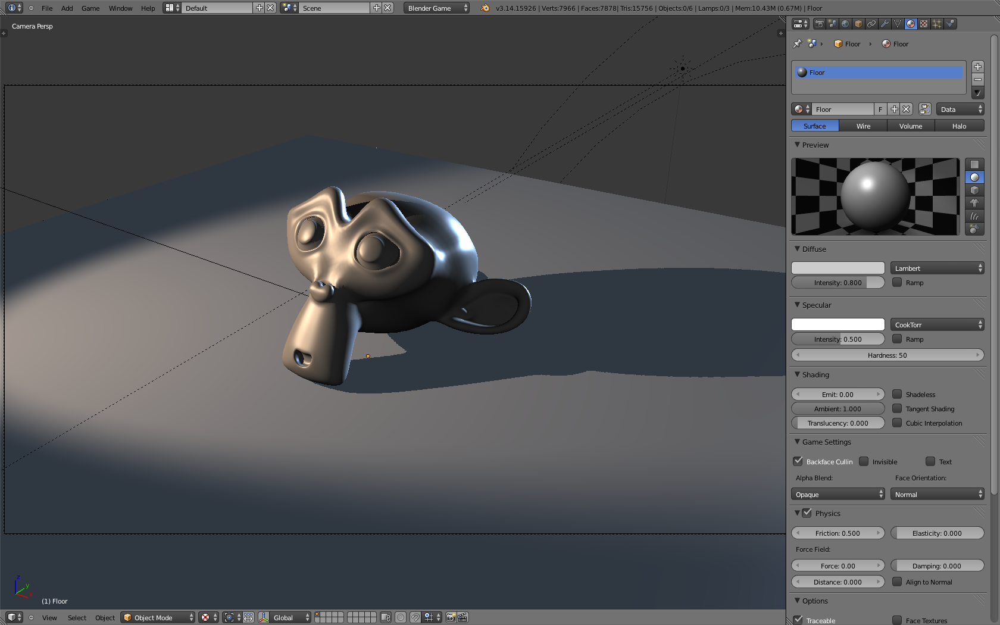

Notice the visuals in the 3D Viewport are exactly as in-game. This true "what-you-see-is-what-you-get" is only possible in GLSL mode. This means that as you set up material and texture settings in the Property Editor, changes will be reflected in real time in the 3D Viewport. In fact, as long as the viewport shading is set to Texture, there is no need to run the game in order to preview how the object will really look.

The next two sections will go over each option in the Material and Texture panels, explain what they do, and when to use them. Follow along as we work through the massive list of sliders and options shown in this panel.


#####  The Material Panel <a id="The_Material_Panel"></a>

In GLSL1.blend, you'll see the Material panel on the right side of the 3D Viewport. In the demo setup, the material attached to the floor is shown by default. Recall that this panel was already discussed briefly in Chapter 2, so go ahead and play around with the settings and see how they affect the model in the 3D view in real time.

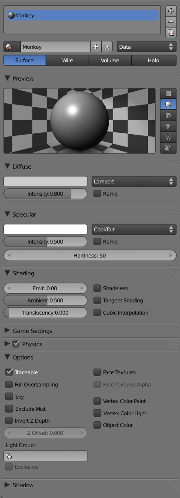


If you are already familiar with the material system of Blender, you'll be right at home with this section. As an artist, just remember that the game engine supports a smaller subset of features found in the regular Material panel. Advanced shading features such as ray-traced reflections and refractions and subsurface scattering are not available in the game engine. So they are hidden from the Material panel when Blender Game is selected as the active render engine.


###### Material Management <a id="Material_Management"></a>

The very top section of the Material panel lets you manage the material data blocks. Since each object can have multiple materials, the box shows a list of all the materials attached to the active object. Selected materials are highlighted in blue.

To create a first material for an object:

1. In the 3D view, select an object without a material (for example, the monkey in GLSL1.blend).
2. In the Material panel below the Material Slot List, click on the [+ New] icon to create a new material for the object.
3. Since the object has no material, by default the new material will be applied to the entire object.

###### Multi-Material Objects <a id="Multi-Material_Objects"></a>

If the object has an existing material, you can create another material and assign the new materials to part of the mesh as follows:

1. In the 3D view, select the object.

2. In the Material Panel below the Material Slot List, click on the [+ New] icon to create a new base material for the object.

3. In the Material Panel, click on the [+] icon to the right of the material slots to create another material slot, followed by clicking on the [+ New] button to create a new material. You will assign this material to the selected part of the object.

   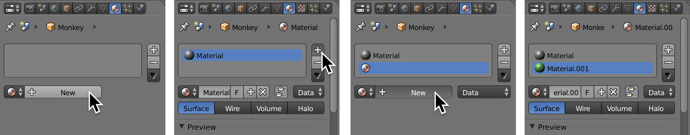

4. Change the color of the newly created material to green just so that you can tell the materials apart.

5. In the 3D view, enter Edit mode for the object using Tab. Select all the vertices that you want to be assigned the new material.

6. With the new material highlighted, press the Assign button to apply the new material to the selected part of the object. 

   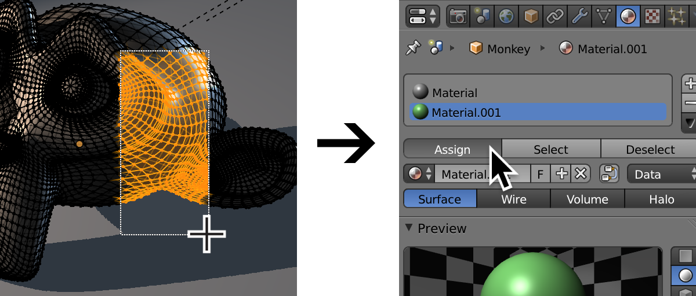

Below the Material Slot List is the control for the selected material. You can (and should) rename a material to be more descriptive. This will help you immensely in a large project, since it's usually not very obvious what "Material.001" is, "Orange" is better, "OrangePlastic" is even better, and "MatteYellowishOrangeSoftPlasticWithSmallBumps" is overdoing it.

A material datablock can be shared by multiple objects. Clicking on the miniature material icon (Labeled as Browse ID Data) will bring up a list of all the existing materials within the current Blender file. To assign an object to an existing material, simply select a material datablock from that list.

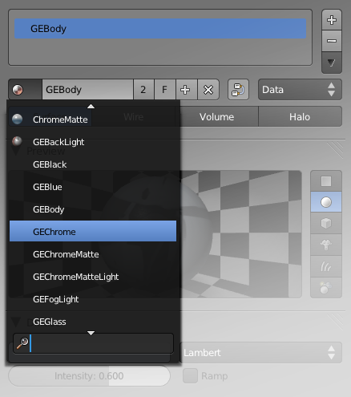 

The concept of datablock is very important in Blender: it allows you to effectively organize all the assets into a logical hierarchy. Datablocks are discussed in detail in Chapter 2.


###### Object vs. Data <a id="Object_vs._Data"></a>

You might have noticed another pull-down menu beside the New Material button. This link selector controls whether the material is linked to the object or the object data (also known as _mesh_). This distinction is practically negligible for single objects, but if you have an object with shared mesh in the scene, the difference becomes important.

When a material is linked to a mesh (and not the object), duplicating the object using Alt+D to create a copy of the object that shares the same mesh as the original object will result in the material being shared across both objects.

On the other hand, if the material is linked to an object, duplicating the object with Alt+D will result in the material being linked directly to the object. This way, you can assign a different material to each object even if they share the same mesh.

**Material datablock linked to the mesh:**

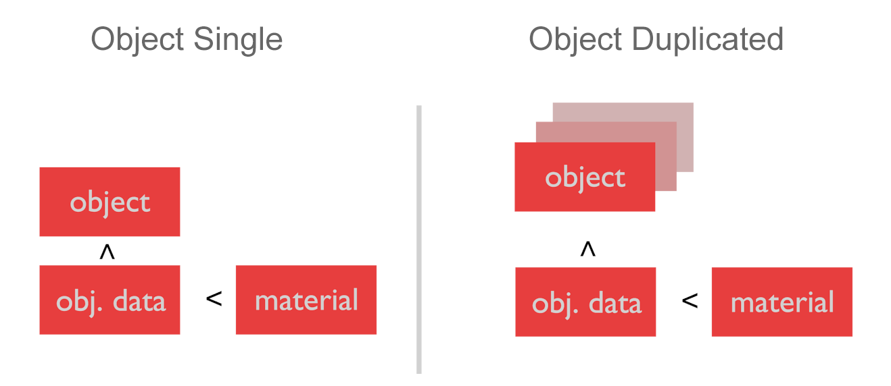


**Material datablock linked to the object:**

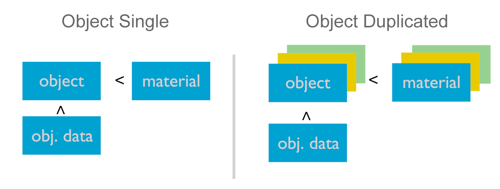


###### Preview <a id="Preview"></a>

The Preview panel shows how the selected material would look if rendered. Because of the generic models and a single light source, the accuracy of the preview is limited if the material relies on a complex lighting setup. You can usually get a more accurate preview directly from the 3D Viewport. Just remember to make sure that Viewport shading is set to Textured by toggling Alt+Z.


###### Diffuse <a id="Diffuse"></a>

Diffuse is the soft (matte), reflected component of a surface. Compared to specular highlights below, diffused light is not viewing-angle dependent.

Using the color selector, you can change the diffuse color of the material.

The intensity slider controls how much diffuse light is reflected off the surface-in another words, how bright a surface is when it is exposed to light. Use this in conjunction with the color selector to get the surface color you want. For example, to create a white material, not only do you need to select a white color in the color palette, but you'll also need to crank up the diffuse intensity to 1.0; otherwise, you'll end up with a medium gray. Setting the intensity to 0 instantly creates a black surface, no matter what color is set in the color selector. Figure below shows the difference between a low diffuse value material and a high diffuse value material.

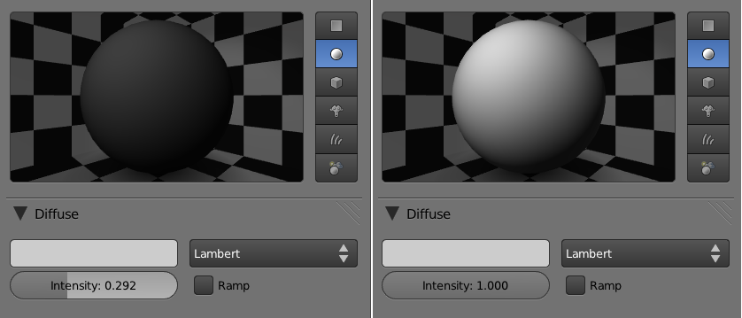

- Lambert is the default diffuse shading algorithm; it is suitable for most surfaces.
- Oren-Nayer better approximates rough surfaces, as it provides a more gradual transition from light to dark than Lambert. Thus Oren-Nayer is generally "softer" looking than Lambert.
- Minnaert is like a regular Lambert shader but with additional processing on the edge of the object where the surface normal is parallel to the camera. It can achieve a somewhat velvety-looking material without the use of a ramp shader.
- Toon shader creates a very distinct banding effect, resulting in a cartoonish look that's suitable for a cell-shaded game.
- Fresnel shader uses the incident light angle to achieve an interesting look that can be best described as "anisotropic," perfect for those brushed metal objects that reflect lights in bands or radial patterns.

Of all the diffuse shading algorithms, Lambert is the simplest in terms of shader complexity. So for performance reasons, it is best to stick with Lambert unless you can truly utilize the additional benefits from the other specialized algorithms.

As a different shading algorithm is selected, additional options for that particular mode may appear. Rather than trying to explain these extra settings for each shading algorithm (which is futile without talking about the math behind it), we invite you to try them out yourself and see how they affect the outcome. In the end, all that matters is how it looks.


###### Specular <a id="Specular"></a>

Specular is the hard (glossy), reflected component of a surface. It is viewing-angle dependent: as the camera, object, or light moves relative to each other, the specular highlight appears to move along the surface. With the color selector, you can change the color of the specular highlight. Most materials (plastic, wood, glass) have a white specular highlight. The only common material that can physically have a colored specular highlight is colored metal, such as gold and copper. Figure 5.17 shows three different specular settings.

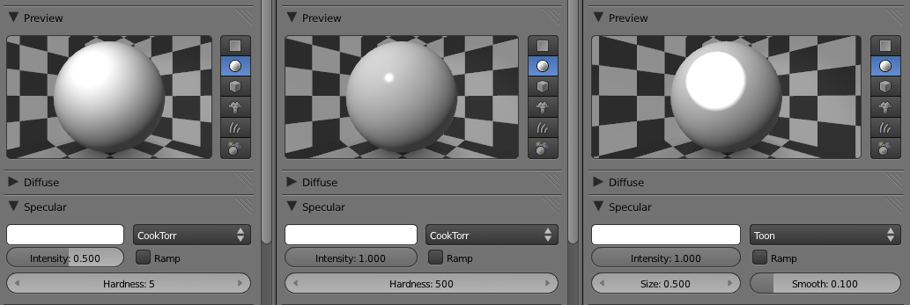

Intensity controls how bright the specular highlight is, while hardness controls the size of the specular hotspot. A high hardness value is useful for shiny material, such as hard plastic or glass. A low hardness value is useful for matte objects, such as rough plastic or plants. For surfaces with almost no visible specular component, such as dry brick walls, dirt, or carpet, you can even disable Specular entirely by setting the intensity to 0. This can improve the performance of the game slightly.

Just like diffuse, there are different algorithms to achieve different-looking specular highlights: Wardlso can be used to create very tiny specular highlights, and Toon is used for creating that sharp fall-off often desired in a cartoon. CookTorr is the default algorithm, but Phong is another popular choice. Visually, cookTorr and Phong are very similar.


###### Ramp <a id="Ramp"></a>

Ramp lets you add an arbitrary color gradient to the object. Its power lies in the fact that you can map a color palette onto the object in many different ways. Some common uses for the ramp shader include adding a "peach fuzz" to skin material and adding rim light to objects for dramatic effect.

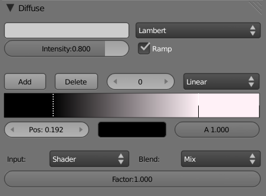


The top part of the ramp is used to set up the color band. To define a gradient, you can add or delete color stops; each color stop has its own position, color, and alpha value. By default, when you enable ramp, two color stops are created for you. To select a particular color stop, left-click on it. Active color stops are drawn with a dotted line. Once a color stop is selected, you can drag to change its position and alter its color and alpha values using the color selector below it.

The bottom part of the Ramp Shader panel controls how the color band is mapped onto the object. Available input options include:

- **Normal:** The color band is mapped to the surface normal of the object in camera space. Thus, any surfaces perpendicular to the camera (facing the camera) will obtain their color from the right side of the color band, while surfaces that are parallel to the camera (facing sideways) will get assigned the left side of the color band.

- **Energy:** The color band is mapped to the incident energy of all the lamps. High energy areas are mapped to the color band right and vice versa.

- **Shader:** The color band is mapped to the result of the calculated shader intensity. This option is similar to energy, except it also takes the shading model into account.

- **Result:** The color band is mapped to the final resulting material color, including all shading and texture information. Bright pixels are mapped to the right of the color band, and dark pixels are mapped to the left-most color band.

  ​

The Blend option controls how the color-band colors are mixed with the existing color, not unlike the layer-blending option in a 2D image-manipulation software such as Photoshop. These blending methods frequently appear in Blender, so you should be familiar with them.

- **Mix:** Uses a combination of the both inputs. A factor of 0.5 means each input contributes exactly half toward the final color. A factor of 1 means one of the inputs completely dominates the other.
- **Add:** The two input colors are numerically added together, often resulting in a brighter image.
- **Multiply:** The two input colors are numerically multiplied together, often resulting in a darker image.
- **Subtract:** One input is subtracted from the other, sometimes resulting in a darker image, and sometimes resulting in a "negative" image where the colors are inverted.

Both diffuse and specular channels can have their own ramp. While the diffuse ramp shader can be visible on the entire object, the ramp for specular is only visible in the region where specular highlights are visible. Other than that, the Ramp Shader panel for specular is exactly the same as the Ramp Shader panel for Diffuse Shader.


###### Shading <a id="Shading"></a>

**Emit**: Controls how much light a surface appears to give off. A non-zero value means a surface is visible even when it's completely unlit. Because emit is a material property, and not a real light source, you cannot rely on using emit materials to light up other objects in the scene. Emit is often used to simulate surfaces that give off light on their own.

**Ambient**: Controls how much influence the ambient color has on the material. Ambient color is a global color that is added on top of all materials, including objects without an explicit material. By default, the ambient color is black, effectively disabling itself. The ambient color can be changed in the World panel. If you want to uniformly lift the brightness of the scene without adding additional lamp, ambient color is a fast way to achieve this. You can also create a color tint in the world by using a nonwhite ambient color, which is a great way to set the mood of your scene.


> **Ambient Drawbacks**
>
> Ambient does have its drawbacks. Because it adds light to all surfaces uniformly, excessive ambient will reduce the contrast of the scene, making everything look flat and washed out.


**Shadeless:** When enabled, disables all light calculation for this material. This option bypasses all the complex shading calculations; thus, it can improve performance at the cost of no lighting calculation. This option is useful for situations where you do not want the object to react to light.

**Cubic Interpolation:** When enabled, gives a smoother transition from light to shadow, at the cost of a slight performance decrease. For certain smooth shapes like spheres, this option helps the shape look more natural.

###### Game Settings <a id="Game_Settings"></a>

**Backface Culling:** When disabled, makes both sides of a face visible when running the game. By default, only the front side of the face is rendered for performance reasons, while the backside of a face is invisible. This is not critical for most new computers, if you are to handle a few faces. However, it's better to take the safe approach and disable backface culling only when you need double-sided faces.

 **Invisible:** When enabled, makes the surface completely invisible. This option is often used for creating hidden physics collision objects. Objects can be also made invisible from the Physics panel (see Chapter 6).

**Text:** When enabled, tells Blender that this object is used to display bitmap text. Using bitmap text in the game engine is covered later in this chapter. Because bitmap text is rather difficult to set up, using the Blender text object is an easy alternative.

 **Alpha Blend:** Selects the way faces are drawn. Options are shown in Figure 5.19 and in details in Figure 5.19b.

- **Opaque** : Treats the material as a regular solid. This is the fastest draw mode.

- **Add:** Numerically adds its own surface color with what's behind it, making the combined surface brighter. This option can be used to simulate halo lights, particles, and other "bright" special effects.

- **Alpha Clip:** Enables binary transparency. Used frequently for texture where there is a very distinct edge, such as tree leaves and a chain-link fence. This is the fastest way to render textures with alpha since there is no alpha blending: a pixel is either fully opaque or fully transparent.

- **Alpha Blend:** Enables alpha blending between its own color and the background. It is used for truly transparent materials such as glass. One drawback of Alpha Blend is that multiple layers of Alpha Blend surfaces are often not displayed in the correct Z-order. This is a common issue with hardware-accelerated alpha rendering. The solution is to use Alpha Sort, as explained below.

- **Alpha Sort:** Similar to Alpha Blend, but it solves the Z-sorting issue inherent with Alpha Blend. If you see an alpha-mapped object that is showing through other transparent objects, or if multiple layers of alpha are displayed in the wrong order, then you should use Alpha Sort instead of Alpha Blend. Keep in mind that Alpha Sort is much slower than regular Alpha Blend.

  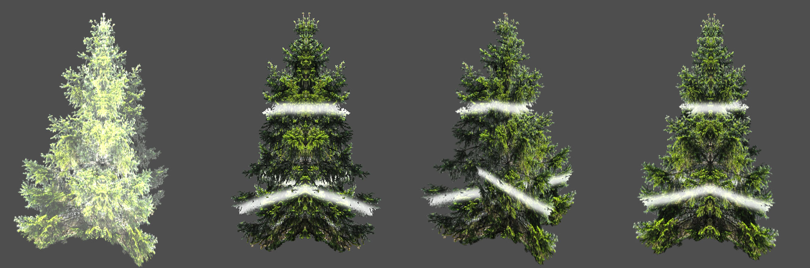


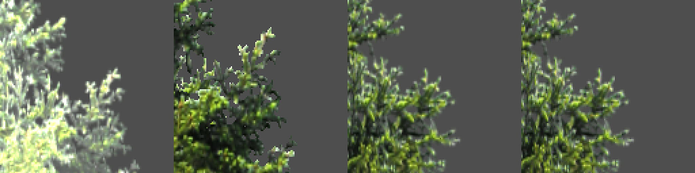


- **Face Orientations:** Rotates the faces away from their original orientation. Note that face orientations are not visible in the Viewport; therefore, to preview the effect of these settings, you need to enter the game mode.
- 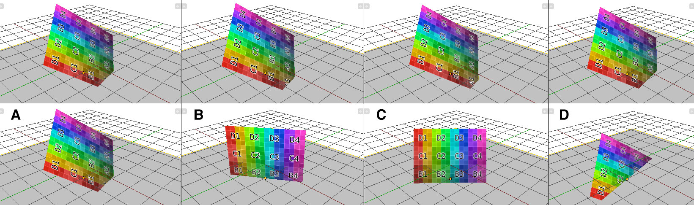
  - Normal: The default option. No extra orientation is applied and faces are rendered as normal. (See A)
  - Billboard: Forces the X-axis of the object to face the camera while keeping the Z-axis of the object upright. To visualize this, imagine someone is holding a billboard and trying to get your attention by always rotating the billboard to face you. Billboard is used frequently to render simplistic vegetation and trees in architectural visualization, so that a tree can be represented by a single plane that always rotates around its center. (See B)
  - Halo: Forces the X-axis of the object to always face the camera. This is similar to the billboard option, but no axis is locked. Halo, as the name implies, can be used to render particles and other non-3D sprites (see C).
  - Shadow: Objects will reposition and reorient themselves so that the center of the object will match the closest object directly below it in the Z axis. This is used to make an object "fall" and stick to the ground, such as when faking a drop shadow (see D).

Remember that face orientation is applied after logic and physics calculations. This means that the collision mesh will still be in its original position, so what you see on the screen could be different than the internal physical collision mesh.


###### Physics <a id="Physics"></a>

The physics setting controls some of the physics property of the surface. They do not affect the visual property of the object but change the way the object interacts under the physics engine. Jump to Chapter 6 if you want to learn about these settings.

###### Additional Options <a id="Additional_Options"></a>

- **Exclude Mist:** Excludes the object from the mist calculation when enabled. Mist is a world setting that can be accessed from the World panel.
  - Face Textures: Forces Blender to replace the diffuse color of the material with the UV texture. This is an easy way to apply a simple texture onto a material without creating a texture data block for the material.
  - Face Textures Alpha: This option is only visible when Face Textures is enabled. It will also override the transparency of the material using the alpha channels of the texture, in addition to replacing the diffuse color of the material.
  - Vertex Color Paint: Multiplies the vertex color of the mesh on top of the regular material.
  - Receive Shadows: Makes real-time shadows cast by lamps visible on the surface. Only spot and sun lamps cast shadows.
- **Object Color:** Modulates the material color with the object color. Useful for getting different objects sharing the same material to have different colors. The object color can be set from the object Properties Editor.

So far, we have covered all the functionalities of the Material panel. Most of the settings are very intuitive, and their effects can be seen directly in the Viewport, with the exception of the face orientation settings, which require the game engine to be running to see their effects.


##### The Texture Panel <a id="The_Texture_Panel"></a>

Texture is the main way to add details to a surface without adding extra polygons. It is done by mapping a 2D image onto the surface of the 3D object. Figure 5.21 illustrates the concept of texture mapping.

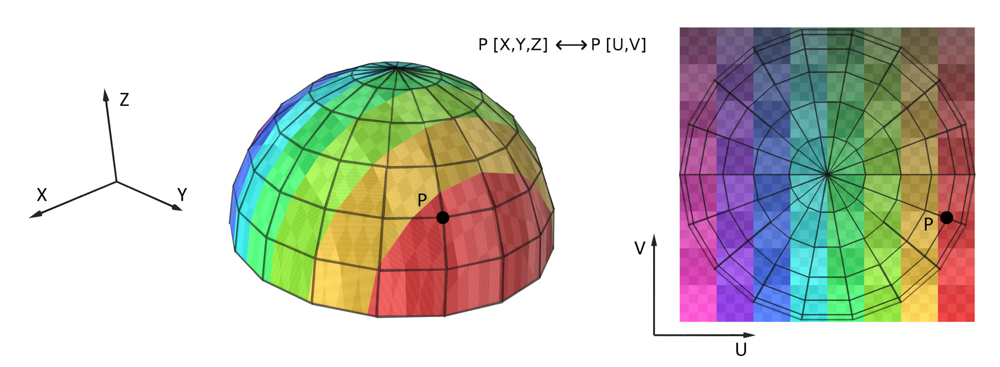


###### Texture Data Blocks <a id="Texture_Data_Blocks"></a>

Texture data blocks are almost always linked to a material (see note below for exception). Each material can have multiple textures, and through layering and blending of textures, complex effects can be achieved. The top area of the Texture Panel shows you all the textures attached to the active material.

> Non-Material Textures
>
> The only exception is a "world" texture, which is linked directly to the world settings without a material, and the Brush texture, which is used for painting or sculpting. However, both of them are only supported in the Blender internal renderer and not implemented in the game engine. Therefore, for our game purposes, all the texture data blocks must indeed be linked to a material.
>

Note that in Blender, texture slots are ordered so that textures further down the texture slots override textures on top of the list. This is opposite from how most image editors treat layers. 

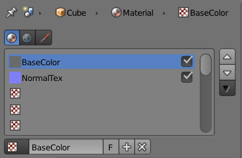


1. To create a new texture, the object must already have a material. Select the object and add a new material, if necessary.
2. Then, in the texture panel, click on the [+ New] icon to create a new texture in the first texture slot (see Figure 5.23).
3. For working with the game engine, set the type for the texture to image. (Image texture is what we will be using most of the time.) The only other available texture type option is environment map. Procedural textures, such as clouds and noise, are not supported in the game engine.

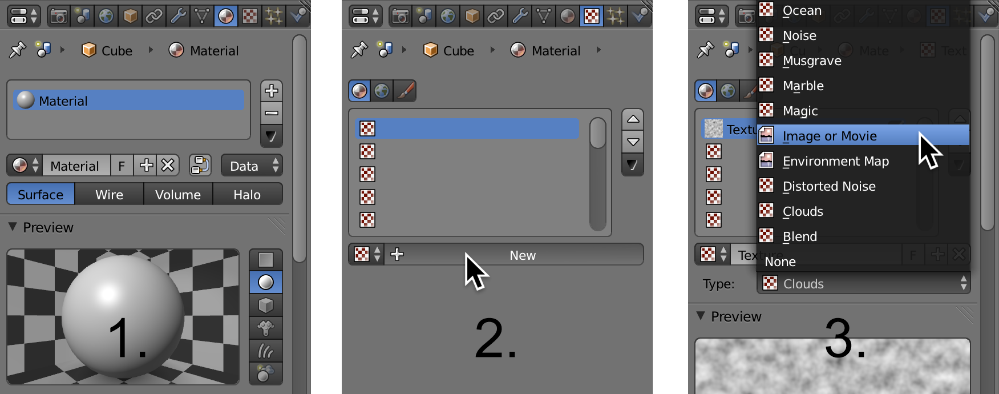


###### Image <a id="Image"></a>

To load an image as a texture, you can either:

- Load an existing image data block (one that is already being used in this Blender file).
- Generate a new image directly from within Blender.
- Browse and load an image file from your computer.

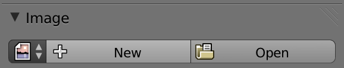

Once an image is loaded, you have some options to change the way the color space and alpha channel are interpreted.

- **Input Color Space:** Controls the color space transformation that happens when the image is used. Normally, textures are created in the sRGB color space, so the default setting is sufficient. For color-sensitive work, you can change the Input Color Space to match the image file.
- **View as Render:** Apply an additional color transform in order to take into account the color transform when rendering.
-  **Use Alpha:** Uses the alpha channel of an image when available. If enabled, you can also pick between Straight alpha and Premultiplied alpha. The difference is beyond the scope of this chapter, but if your alpha texture has a dark or bright fringe around the edge, then sometimes switching between straight alpha and premultiplied alpha can solve it.


###### Image Sampling Panel <a id="Image_Sampling_Panel"></a>

The Image Sampling panel contains some of the options that change how the image is interpreted inside Blender:

- **Calculate (Alpha):** Ignores the real alpha channel from the image file and instead calculates the alpha channel from the intensity of the image. This treats black pixels as transparent and white pixels as opaque.
- **Normal Map:** Tells Blender to treat the image as a normal map, so that the RGB value is interpreted as surface normal, which can be mapped to the normal channel of the material to create bumpiness on the surface.


###### Mapping Panel <a id="Mapping_Panel"></a>

Mapping controls how the 2D texture is mapped onto the 3D object. Available options include global, object, generated, UV, reflection, and normal. The default option, generated, might work in some very simple cases. But most of the time, you will need to use the UV/Image Editor to control exactly how the image is projected onto the object. Using the UV/Image Editor is covered in Chapter 2. When the UV mapping is selected, you can specify which UV channel to use, if there is more than one UV layout for the mesh.

- Offset: Translate the texture coordinates.

- Size: Changes the scale of the texture coordinates.

  ​

###### Influence Panel <a id="Influence_Panel"></a>

This panel controls how the value of the texture is actually applied onto the surface. By default, color is selected with the influence set to 1. This means that the texture completely replaces the diffuse color of the material. A setting of 0 means there is no influence, effectively disabling the texture channel. Any in-between number will blend the current texture with the layer preceding it.

_Normal_ is another commonly used influence setting. By using a normal map, you can create fake but convincing surface irregularities without using massive amounts of geometry. To apply a normal map to an existing material:

1. In the Texture panel, create a new texture slot by pressing the [+] icon.

2. Set the texture type to image and load a normal map image from disk.

3. Enable the normal map option under the Image Sampling panel.

4. Disable texture influence on material color by unchecking color under the Influence panel.

5. Enable the texture influence on material normal by checking normal under the Influence panel. Move the slider to adjust the strength of the effect.

   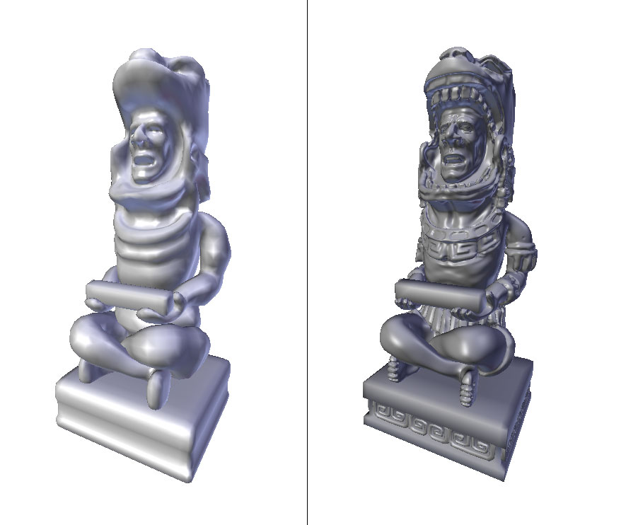


> Normal Maps and Height Maps
>
> A normal map is stored as a regular image file, but instead of changing the color of the surface like a regular color texture, normal maps are used to alter the per-pixel surface normal. By altering the surface normal, you can change the apparent bumpiness of a surface.
>
> Internally, a normal map uses the three color-channels (RGB) to store the normal directions (XYZ) of a surface. Because most surface normals are pointing straight up, they have a normal value of (X=0.5,Y=0.5, Z=1.0), which is what gives normal maps that distinct purple color (when in tangent space).
>
> Speaking of tangent space, normal maps can be stored in various different spaces, such as tangent, object, world, and camera space. They affect how the normal maps are interpreted and used in lighting computations. Suffice it to say that tangent space is the most commonly used option.
>


The other options in the influence section work in the exact way as color and normal. They each influence a different aspect of the material. For example, if you want a texture to influence the alpha value of a material, enable alpha and set the influence to 1. Then, in the Material panel, make sure alpha is set to 0.

- Blend : The blend selector is another key setting that controls how textures are mixed with each other. The blend option controls how the texture is mixed with the existing material color.
- Negative: Inverts the color of the texture.
- RGB to intensity: As the tooltip suggests, converts a RGB image to a grayscale image.


#### Combined Exercise <a id="Combined_Exercise"></a>

If all the checkboxes and sliders seem daunting, don't worry! Now let's put what we just read about material and textures to use. Soon it will become clear how everything fits together.

1. Open \Book\Chapter5\GLSL2.2blend

2. You will be greeted with a partial car model that we have prepared, as shown in Figure 5.26. Hopefully, you will agree that the model is of decent quality and that all it is lacking is a good material to make it, er, shine.

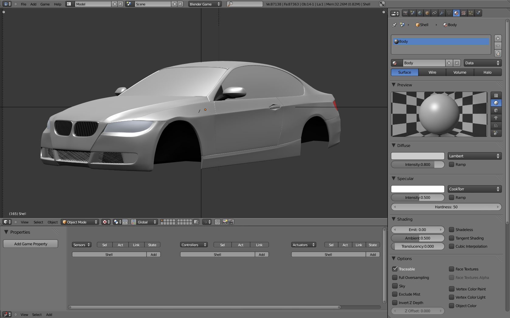

When working with materials, it is important to make sure there is sufficient lighting to see the model, as the lights can significantly affect the way materials are perceived. In fact, without lighting, everything will be pitch black!

In this car example, since we are trying to duplicate a photo studio setup, we have set up a single hemi lamp in the scene, pointing straight down over the car body. This basic lighting setup gives a very uniform lighting on the entire surface of the car, without any harsh shadows.

We want to give this sporty machine a shiny metallic finish so that looks like it just drove out of a car commercial. To achieve this effect, we will need two texture layers: one layer responsible for creating that sparkle found in metallic car paint, and another layer that contains a reflection texture to convey the idea of a glossy finish. The two textures shown in Figure 5.27 are provided online.

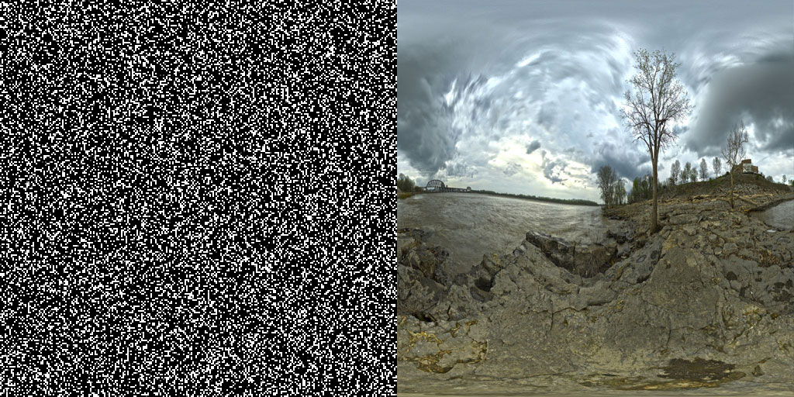

3. Select the body of the car (object "Shell") in the 3D Viewport. Notice there is a default material attached to it. But before we spend too much time tweaking the material, let's add the textures first.

4. Go to the texture Properties Editor. Click on New to add a new texture. Notice that the first texture slot is now occupied. Rename the data block from "Texture" to something more descriptive like "MetallicSpeck."

5. Since procedural textures are not supported in the game engine, we have created our own noise image in an external image-manipulation software. You can find one already made for you online, named Noise.png

6. Change the texture type to image. Then click on Open to reveal the file browser. Navigate to \Book\Chapter5\Textures and select Noise.png. Open it. Now the car should be covered with the texture you just loaded.

The first problem you'll notice is that the texture is stretched across a certain  vertical part of the shell. This is because a proper UV texture layout has not been  set up, so Blender is trying its best at using a default texture mapping. So let's  first make sure the texture is mapped uniformly across the object.

7. With the car body object still selected, enter Edit mode with the tab key; select all the vertices with a few taps on the A key until all the faces are highlighted.

8. With your mouse still over the 3D Viewport, press the U key to invoke the UV mapping menu. Select Smart UV Project and leave the options as default. This will intelligently project the entire model onto a UV map with minimal distortion. This operation takes a few seconds to complete.

9. Optionally, set one of the window types to UV Image Editor to see the result of smart project.

10. Don't worry that you can't see the new UV map yet on the 3D model. In the Texture panel, change the mapping coordinates from generated to UV and select UVMap from the drop-down menu, as shown in Figure 5.28. This will tell Blender to use the new UV map that you just created.

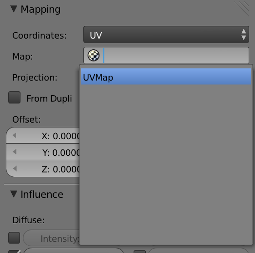

Now the 3D Viewport should look like Figure 5.29

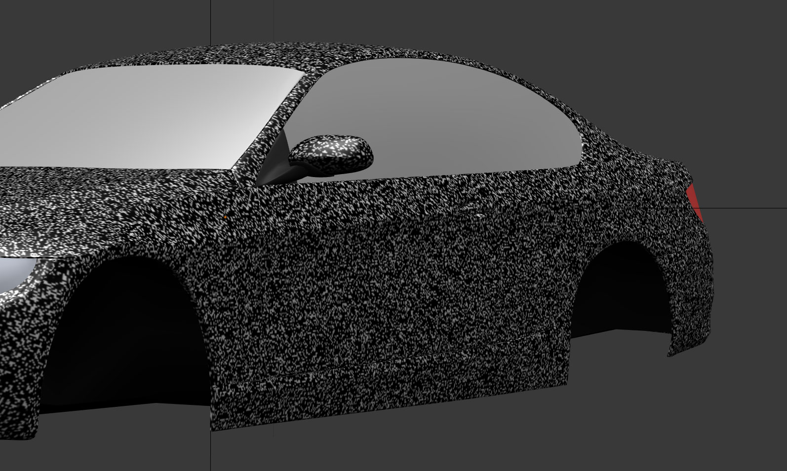

11. It is apparent that the noise is way too big to be realistic. To scale it down, change the Size attribute under Mapping from 1.0 to 10.0 for all the X, Y, and Z axes.

 To get the metallic shine, you don't want the texture to affect the color channel of  the material.

11.Scroll down to the bottom of the Texture panel and locate the Influence panel. Turn off Color. Now, turn on Intensity and Color under Specular. This will make the texture affect only the specular channel of the material. This way, the speckle will only be visible when there is light shining on it, which is exactly what you want. Figure 5.30 shows all the relevant settings in the Texture panel. Settings not shown are left untouched.

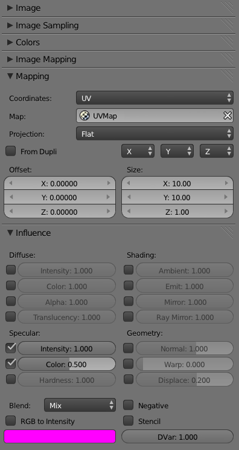

12. To add a second texture layer, go back to the very top of the Texture panel and select the top-most empty texture slot from the list. It should be one with a red-and-white checkerboard pattern icon.

13. Click on New to create another texture data block. This will be your reflection layer. So name it "ReflectionMap."

14. Again, set the texture type to image. Click on Open, navigate to \Book\Chapter5\Textures, and load uffizi\_rectangular.jpg. This image will be used as your environment map.

15. Under Mapping, set the Coordinates to Reflection. This will automatically wrap the texture onto the object in such a way that resembles a real reflection.

16. However, notice that the sparkle you created in the previous texture slot has disappeared. This is because the new ReflectionMap texture is covering the previous texture. To make the reflection less intense, set the color Influence value from 1.0 to 0.75.

17. Change the Blending mode from Mix to Multiply. This will allow the reflection map to look better on base color.

 At this point, you should have something that looks like Figure 5.31.

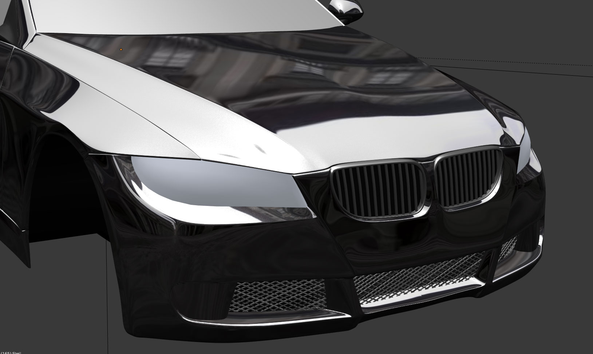

18. You can now go back to the Material panel and change base color of the car by altering the diffuse color however you wish.

>**Material Caching**
>
>There is a new setting in Blender 2.66 under the Render Properties Editor called _Material Caching._ With this turned on, loading of the game will be faster because GLSL materials are cached. This setting does not work well in Multitexture and Singletexture mode.

#### Nodes <a id="Nodes"></a>

Node is a new way to work with materials and textures in Blender. Instead of using a panel-style user interface to define a material, nodes allow you to build up materials using basic components. This may seem like a step backward because it will probably take much longer to create a simple material in the Node Editor than using the Material and Texture panels to achieve the same effect. But node offers the artist the freedom to accomplish much more than what is possible using the fixed Material and Texture panels.

Working with Node materials and textures is more of a process, so this section will be presented as a continuous tutorial. Once you have mastered this simple example, you will be able to adapt the workflow to create much more complex effects.

1. Open /Book/Chapter5/GLSL3.blend and familiarize yourself with the scene setup; note there is a sphere object without any material attached. The bottom half of the screen has been changed to the Node Editor.

2. Create a new material by clicking on the New bottom in the Material panel. Rename the material to NodeMat so we can refer to it later.

3. Click on the Use Shader Nodes button to enable nodes. The Node Editor should now look like Figure 5.32. Notice that the object in the 3D Viewport has turned black; this is because node material has just been activated, but since you have not actually set up a valid node material, the default color is black.

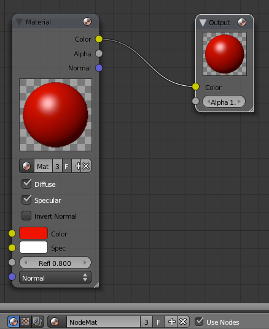

4. Because we don't want to create the material from scratch, we can use an existing material as the basis for the node material. To do that, in the Material node, click on the Browse Material icon and select NodeMat. Now the input material for the node is the material defined in the Material panel on the right side of the screen. Change any of the properties in the Material panel, and you can see the change is reflected in the node material system. Try setting the material color to red.

5. Insert a new Hue-Saturation-Value node in between the input and the output node, and connect them by drawing a line from one yellow dot to the other. The resulting setup should be the same as Figure 5.33.

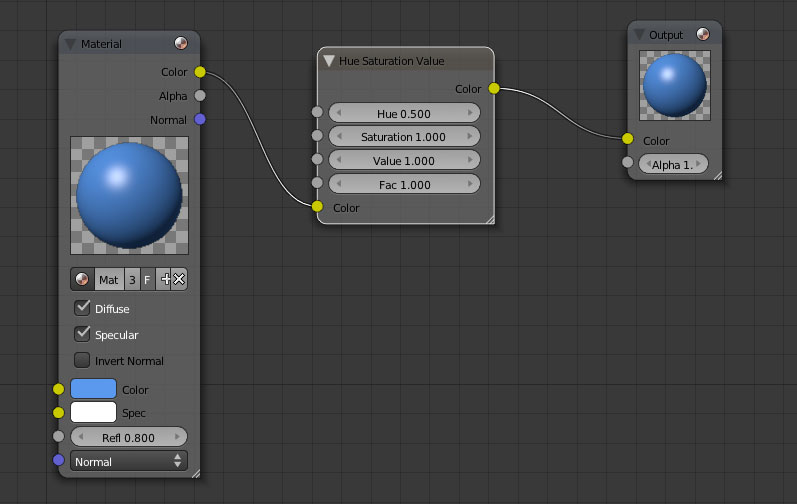

Congratulations! You are using node materials! Although the example we worked through is very basic, the power of the Node Editor is the ability to create almost infinite combinations of looks by only using a few basic building-block nodes.

Some typical uses for node-based materials include:

- **Mixing multiple materials:** With the Node Editor, you can load multiple materials as input and mix them together to create a meta-material.

- **More control:** Want the object position to affect the texture brightness? Want lighting intensity to affect the object transparency? With nodes, you can set up almost any effect you can think of.

- **Experimentation:** Using the node system as a sandbox to experiment with different effects is a lot faster than writing shader code to accomplish the same effect. In many cases, you can use the node system as a prototyping platform to build shaders.

### Multitexture <a id="Multitexture"></a>

Multitexture is older than the GLSL shading mode, but still far more capable than the singletexture material system.

As outlined in Table 5.1, multitexture uses per-vertex light rather than the per-pixel light of the GLSL. This means that multitexture is generally faster at the cost of less accurate shading.

In Multitexture mode, the artists still use the Material and Texture panels to apply shadings and textures. Compared to GLSL mode, the following material options have no effect in Multitexture mode:

- **Diffuse Shader Model:** The default one will always be used.

- **Specular Shader Model:** The default one will always be used.

- **Cubic Interpolation:** Always disabled because the lighting calculation is per-vertex.

- **Ramp Shaders:** Always disabled.

- **Shadow Settings:** Always disabled. No object casts shadows in Multitexture mode.


Compared to GLSL mode, the following texture options have no effect in Multitexture mode:

- **Blending Mode:** Other than Mix, Add, Subtract, Multiply, and Screen.

- **Influence Setting:** Other than Color and Alpha.

- **Mapping Coordinates:** Other than Global, Generated, Reflection, and UV.

To add a texture for the Multitexture shading mode, you need to use the UV/Image Editor. The Material panel can be used to change some of the surface properties of the model, such as diffuse intensity, specular intensity, and specular hardness.

## Lights <a id="Lights"></a>

Lights were covered briefly in Chapter 2. We will revisit them here in more detail.

In GLSL mode, supported lamp types are Point, Sun, Spot, and Hemi. Area lamp is unsupported and will be ignored by the game engine. Spot and Sun lamps are capable of casting dynamic shadows if the Shadow button is enabled. Table 5.2 summarizes the features of the lamps.

_Table 5.2 Lights Types_

| Type  | Supported      | Directional  | Shadow      |
|:-----:|:--------------:|:------------:|:-----------:|
| Point | Singletexture+ | No           | No          |
| Sun   | Singletexture+ | Yes          | Parallel    |
| Spot  | Singletexture+ | Yes          | Perspective |
| Hemi  | GLSL           | Yes          | No          |
| Area  | No             | Yes          | No          |

In Multitexture and Singletexture mode, Point, Sun, and Spot are supported, all other non-supported lamp types will be treated as point lamps. There is no shadow support in these two modes.

## World Settings <a id="World_Settings"></a>

From the world Property Editor, you can change things that affect the entire world, such as background color and mist settings:

- **Horizon Color:** Defines the sky color. In textured view, this color fills the background.

- **Ambient Color:** Defines the ambient light color. Ambient light is a fill light that illuminates an object evenly from all angles. It makes shadows less dark, at the cost of making everything look "washed out." By default, ambient color is set to black, which is equivalent to the ambient color being disabled.

- **Mist:** Enable mist to add an atmospheric fog to the entire scene. Objects farther away will fade into the sky color (as defined by horizon color).

- **Mist Start:** As illustrated by Figure 5.34, the start distance at which the fog is applied.

- **Mist Depth:** As illustrated by Figure 5.34, the distance at which an object is entirely obscured by the mist color.

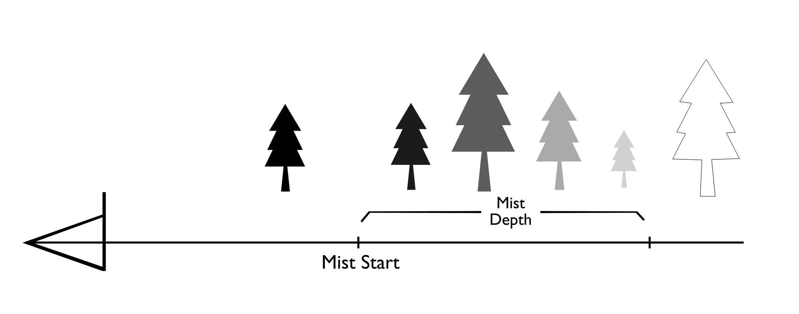

>**Smog Can Be Good**
>
>Mist can help you hide the boundary of your make-believe world by smoothly blending the far object into the horizon. Furthermore, fog can increase the atmosphere of the scene by giving a better sense of depth to the scene.
>A good example of mist in games is the extremely foggy _Silent Hill_ games. Their development team was able to put more details into the models by combining a more aggressive camera clipping with high mist values.

## Texture Painting <a id="Texture_Painting"></a>

Typically, editing an image texture must be done with external software such as GIMP or Photoshop. Using texture painting, you can edit the texture directly on the model from within Blender (see Figure 5.35). Not only does this give you the ability to see the changes interactively on the model, but brush strokes made on the model will also be automatically projected back onto the image texture. This makes texture painting ideal as a rough outlining tool to mark out some key points on the model for reference or put the finishing touches on the texture. (It's much easier to paint on the model directly than to paint a 2D texture.)

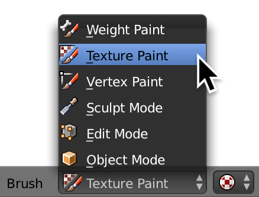

To see how texture painting works:

1. Start a new file and set the 3D view to Texture mode (Alt+Z).

2. To paint directly on an object, you will need to set up a UV texture image first. So in the 3D view, make sure the object you want to paint (the initial cube in this case) is selected, and then enter Edit mode by pressing Tab.

3. Make sure that all vertices are selected (toggle A until they are all highlighted).

4. In the 3D viewport, press U to invoke the UV menu. Select Smart UV Project with the default parameters.

5. In the UV/Image Editor, create a new image by clicking on the New button. From the pop-up menu, select UV Grid or Color Grid as the Generated Type and click OK.

6. Notice that the model now has the newly created image texture mapped on it.

7. Switch from Edit mode to Texture Paint mode.

8. Start drawing on the model!

9. You can change options for the tools using the tool shelf on the left of the 3D Viewport.

10. At the time of writing, images updated by texture painting were not saved automatically. So once you are done, be sure to go back to the UV/Image Editor and save the texture by clicking on Image > Save.

11. Optionally, if you are working with the GLSL mode, you will need to create a new texture in the object's material and assigned the newly created image to it. In this case, you also need to set UV as Coordinates in the Mapping panel.

## Custom GLSL Shaders <a id="Custom_GLSL_Shaders"></a>

Another way to apply material to an object is to override the game-engine material system completely by applying custom-written GLSL shaders. This will give you the ultimate control over exactly how the object looks, and you can achieve certain effects that are not possible with the built-in Material and Texture panels.

>**More GLSL?**
>
>Custom GLSL shaders are not to be confused to with 2D filters, which also use GLSL codes. A 2D filter is GLSL code that is applied to the entire screen as a post-processing effect, while custom GLSL shaders are applied to objects.

Custom GLSL shaders work in the GLSL and Multitexture shading mode; they do not work in Singletexture mode. Custom GLSL shaders are not visible in the 3D Viewport: you must run the game to see them. To use custom GLSL shaders, you will need to use a little bit of Python scripting to link shaders to the object. But first, here is a crash course on GLSL.

## GLSL Primer <a id="GLSL_Primer"></a>

GLSL is the shading language for the OpenGL graphic API. It has a C-like syntax and is compiled into assembly code by the graphic driver at runtime. It is also cross-platform and vendor-neutral (big words for saying they run on everything: Windows, Linux, Mac, AMD, Nvidia, and Intel). The primary purpose of GLSL is to give artists more control over how they want a surface to look by allowing them to write custom code that changes the way an object is rendered.

GLSL shaders can be divided into three types. They differ in where in the graphic pipeline the codes are executed and what types of data they have access to.

- **Vertex shader:** Operates on vertices, allowing geometry transformation.

- **Geometry shader:** Capable of generating or deleting vertices.

- **Fragment shader:** Operates on each pixel on the screen, allowing texture and shading effects.

All three categories of shaders share the same language construct and follow the same general syntax. The GLSL programs are executed in this order:

 vertex shader > geometry shader > fragment shader

Because geometry shader is still relatively new and requires OpenGL 3.2 or higher, Blender does not support it. Only vertex shader and fragment shader can be used within the game engine at the moment.

Rather than wading through all the basics of GLSL, we will assume that you have a background in at least one programming language, and we'll simply outline what makes GLSL unique as a GPU-based language. GLSL is not too different from languages such as C. It has familiar data types such as float (0.5, -3.5), int (0,1,-3), and bool (true, false). Also, because GLSL is designed to work with graphic data, which typically include color information (RGB or RGBA), location data (XYZ or XYZW), and matrices (3x3 matrix, 4x4 matrix), there are many vectorized data types designed just for this purpose.

Consider this snippet of GLSL code:

```c++
vec4 color1 = vec4(1.0,0.0,0.0,1.0);

vec4 color2 = vec4(0.0,0.5,0.0,1.0);

vec4 final = color1 + color2;
```

vec4 initializes the variable to be a four-component floating point vector. color1 and color2 are the variable names. And finally vec4() can be viewed as a constructor that takes four literal constants and generates a vec4 data type from them.

But what does the code actually do? Here, we first declare two four-component vectors, color1 and color2. The values to the right of the assignment operator (=) are mapped to the red, green, blue, and alpha channels of the vector, respectively. Thus, color1 is initialized to a red color with an alpha of 1; while color2 is initialized to a dark green color, also with an alpha of 1. In the last line of the code, we add color1 to color2, and copy the result to a new variable called _final,_ which should have the value (1.0,0.5,0.0,1.0).

The funny-looking swizzling operators of the GLSL language are one of its distinct features. They look like this:

```c++
vec4 myColor = vec4 (0.0,1.0,0.5,0.6);

float intensity  = myColor.r + myColor.g + myColor.b;
```

The dot (.) notation at the end of the color variable is used to select a single component from the four-component vector. In the above case, we took the red, green, and blue components of myColor and added them up to get a sum of the three channels. The result is stored in a variable called _intensity_ as a single floating point number. Valid selectors include RGBA, XYZW, and STQR. You can also repeat swizzling operators or rearrange them.

```c++
vec4 myColor = vec4 (0.0,1.0,0.5,0.6);

vec4 newColor  = myColor.ggrr;
```

newColor now has the value (1.0,1.0,0.0,0.0) because the content of myColor's green channel is copied into newColor's red and green channels, and myColor's red channel is copied into newColor's blue and alpha channels. The value of myColor is not changed.

GLSL supports basic C-like flow control, such as while loops, for loops, if statements, and function declarations. Although supported, branching with if statements is usually avoided because they are relatively slow.

>**Using "If"**
>
>If you must use "if," be careful with writing your conditions. Floating point values in GLSL are usually not precise enough for an equality comparison operation to work. So instead of writing
>`if (myVar == 1.0)`
>which might never evaluate to true, use the much safer
>`if  (abs(myVar - 1.0) < 0.001)`
>This code will look at the absolute difference between the two values it is comparing, and return true as long as the difference between them is small enough (0.001, in this case).

While we know you would enjoy learning about trigonometry, 3D math, matrix, orthogonality, Euclidean vector space, and lerp, teaching GLSL is not the aim of this book. The book _OpenGL Shading Language_ by Randi J. Rost does a fantastic job of explaining what GLSL is all about.

>**GLSL Implementations "Gotchas"**
>
>Because GLSL is compiled by the graphic driver, each vendor (AMD, Nvidia, Intel, etc.) does it a bit differently. This means that codes that work on one might not work on another. For example, on Nvidia, the noise() function always returns 0. (However, this is technically still within the GLSL specification, which states that the return value for the noise() function must be between -1.0 and 1.0.)
>Just keep in mind that some drivers are stricter than others, so a GLSL program that works on one computer might not work on another.

## Custom GLSL Shaders <a id="Custom_GLSL_Shaders"></a>

So now that you have learned the basics of GLSL, are you ready to tackle your first complete GLSL shader?

```c++
void main(){
gl_FragColor.rgba = vec4(0.9,0.4,0.2,1.0);
}
```

That's it. This one-line fragment shader will assign each output pixel (a predefined variable by the name of gl\_FragColor) the color (0.9,0.4,0.2), which happens to be a pleasant orange. The last value sets the alpha to 1.0, to make sure the face is completely visible.

One of the requirements for any valid GLSL shader is that it contains both a vertex shader and a fragment shader. So, supplying only the fragment shader above is not quite enough; you need a vertex shader as well. But in most cases, you don't want to do anything fancy with the vertices, so a simple

```c++
void main(){
gl_Position = ftransform();
}
```

is enough. It tells GLSL that you want the vertex to stay in the same position as it would if you used a fixed-transform pipeline.

In Blender, to use custom GLSL shaders as a replacement for any regular material, you need to run a Python script that helps bind the GLSL shader to a material at runtime. A complete script is shown below:

```python
01 from bge import logic
02 ShaderObject = logic.getCurrentScene().objects.get("Cube")
03
04 VertexShader = """
05 void main()
06 {
07     gl_Position = ftransform();
08 }
09 """
10
11 FragmentShader = """
12 void main()
13 {
14     gl_FragColor.rgba = vec4(0.9,0.4,0.2,1.0);
15 }
16 """
17

18 for mesh in ShaderObject.meshes:
19     for material in mesh.materials:
20         shader = material.getShader()
21         if shader != None and not shader.isValid():
22             shader.setSource(VertexShader, FragmentShader, True)
```

If you are feeling faint, don't panic! (Just wait until you get to Chapter 7.) This script has a nice blend of Python and GLSL, but it's not complicated once you break it down.

Python will be formally introduced in Chapter 7. You can skip ahead and read the relevant part first before continuing on from here.

Line 1 loads the bge Python module, which allows us to use the BGE API within the Python script.

Line 2 is equivalent to

```python
scene = logic.getCurrentScene()

objects = scene.objects

ShaderObject = objects.get("Cube")
```

One important concept to remember is that the GLSL shader is linked to material. Even though you got the material by referencing an object, the GLSL shader is always replacing a material. This means that if multiple objects share the same material, the shader will run on all the objects.

So you are looking for an object named "Cube" within a list of all the objects in the current scene, and you assign the Cube object to a variable named ShaderObject. So, if an object with the name Cube exists, ShaderObject will now contain a reference to that object. If no object by that name is found, ShaderObject has the value None.

On line 4, VertexShader is simply a multiline Python string. Multiline strings are declared by triple quotation marks. The content of the string is the actual GLSL code. (To clarify, the variable VertexShader is still a Python string object, but the content happens to be another language: GLSL. But it's all the same to Python: the string could be in Chinese and Python wouldn't care.). Notice the vertex shader is wrapped in a main() function, just like in C. This is where the execution of the code will start.

Starting on line 11, analogous to the VertexShader, FragmentShader is another multiline Python string containing the fragment shader GLSL code.

From line 18 onward until the end, the Python code is used to invoke the GLSL shader declared above. First, you loop through the internal meshes attached to the object. Then iterating through each mesh, you find all the materials attached to it. Since meshes can have multiple materials (up to 16), iterating through all of them ensures that you replace all the materials on that object with your shader. (Conversely, you can modify the code to apply a unique shader to each material on the same mesh.)

>**Don't Write This Code!**
>
>Since we were trying to keep this example as short and simple as possible, the code has very bad error-handling ability. For example, it would not be good if an object by the name of Cube is not found in the scene, or if the object named Cube isn't a mesh. Do not write code like this in real life!

Line 21 might look a bit convoluted. But in English, it simply means that if there is a shader, the script goes on to check if the shader is valid. If it's not, a new shader is created using the VertexShader and FragmentShader text string as the input. If there is already a valid shader, nothing more is done. (Shaders only need to be compiled and bound once at the start of the game, not every frame. Otherwise, the GLSL compilation will significantly slow down the game)

Save the script as a new text file in Blender. To use the above GLSL shader script, it needs to be invoked once within the game engine. You can easily accomplish this by setting up a simple logic brick chain, as shown in Figure 5.36.

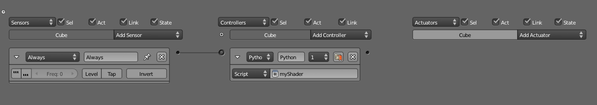

You can try to copy this setup with the provided Blender file at \Book\Chapter5\GLSL1.blend.

In this case, because there is no object named _Cube_, you need to modify the script a bit by replacing the line:

```python
ShaderObject = logic.getCurrentScene().objects.get("Cube")
```

with

```python
ShaderObject = logic.getCurrentScene().objects.get("Monkey")
```

Run the game and enjoy the new orange monkey.

Because GLSL replaces the entire material pipeline with your own code, no shading is applied on the model unless you explicitly tell it to. This is why the monkey head is a flat shade of orange.

Remember that custom GLSL shaders are always applied to each material, not the object, nor the mesh. This means any objects with the same material will all share the same shader.

### A Useful Fragment Shader <a id="A_Useful_Fragment_Shader"></a>

The first GLSL shader you were introduced to is pretty trivial and nearly useless. Here is a much more useful Lambert diffuse shader:

```python
from bge import logic
ShaderObject = logic.getCurrentScene().objects["Monkey"]
lamp = logic.getCurrentScene().objects["MainLight"]

VertexShader = """
uniform vec3 light_position;
varying vec3 light_vec;
varying vec3 normal_vec;

void main(){
 vec3 vert =(gl_ModelViewMatrix * gl_Vertex).xyz;
 light_vec = (gl_ModelViewMatrix * vec4(light_position,1.0)).xyz – vert;
 normal_vec = gl\_NormalMatrix * gl_Normal;
 gl_Position = ftransform();
}
"""

FragmentShader = """
varying vec3 light_vec;
varying vec3 normal_vec;

void main(){
 vec3 l = normalize(light_vec);
 vec3 n = normalize(normal_vec);
 float ndotl = clamp(dot(n,l), 0.0, 1.0);

 vec4 color = ndotl * vec4(1.0,1.0,1.0,1.0);

 gl_FragColor = color;
}

"""

mesh = ShaderObject.meshes[0]
for material in mesh.materials:
 shader = material.getShader()
 if shader != None:
  if not shader.isValid():
   shader.setSource(VertexShader, FragmentShader,1)
  shader.setUniformfv('light_position', lamp.position)
```

This shader uses the Lambert diffuse shading algorithm to apply some basic shading to the object, taking into account the position of the lamp and the surface normal at each pixel. This is still not a terribly useful shader, since the same effect can be achieved without a single line of coding via the Material panel.

We'll leave it to you to discover more complex shaders on your own.

### A Useful Vertex Shader <a id="A_Useful_Vertex_Shader"></a>

This GLSL shader applies a transformation to each vertex along the X-axis, producing a "wavy" effect, similar to that of leaves swaying in the wind. Using vertex shaders to deform geometry is a fast alternative to using bones.

```python
from bge import logic
ShaderObject = logic.getCurrentController().owner

VertexShader = """
uniform float timer;

void main()
{
 //get the first UV layout
 gl_TexCoord[0] = gl_MultiTexCoord0;


 // Fetch the Vertex Position
 vec4 v = gl_Vertex;

 //Displaces each vertex using a sine wave
 v.x = v.x + sin(timer);

 gl_Position = gl_ModelViewProjectionMatrix * v;
}
"""

FragmentShader = """
uniform sampler2D colorMap;

void main(void)
{
 vec4 color = texture2D(colorMap,gl_TexCoord[0].st);
 gl_FragColor = color;
}
"""

mesh = ShaderObject.meshes[0]
for material in mesh.materials:
 shader = material.getShader()
 if shader != None:
  if not shader.isValid():
   shader.setSource(VertexShader, FragmentShader,1)

  shader.setSampler('colorMap',0)
  shader.setUniform1f('timer',ShaderObject["timer"])
```

This shader introduces yet another new concept, called _uniforms_. Using uniforms is one way to pass data from the Blender world into the shader.

### Going Further <a id="Going_Further"></a>

Even though GLSL can seem daunting at first, plenty of learning material is available. The accompanying disk has a few more examples of how GLSL can be used; they can be found under \Book\Chapter5\.

## 2D Filters <a id="2D_Filters"></a>

2D filters are post-processing GLSL shaders that are applied to each frame right before it is displayed. 2D filters can be used to enhance the looks of the image and add special screen-space effects. There are a few built-in shaders that come with Blender to get you started, but 2D filters also allow custom-written GLSL shaders to give you the freedom to do potentially a lot more.

### Why Use 2D Filters? <a id="Why_Use_2D_Filters?"></a>

Using 2D filters makes it easy to tweak the mood of your visual, without having to rework the lighting, material, or textures. Because a 2D filter operates on an image (the frame buffer) and not the individual 3D objects, the 2D filter's performance is not dependent on the complexity of the scene, only the number of pixels on the screen and the complexity of the effect itself.

GLSL fragment shader is the language that powers all the 2D filters. Figure 5.37 shows some samples of what 2D filters can do:

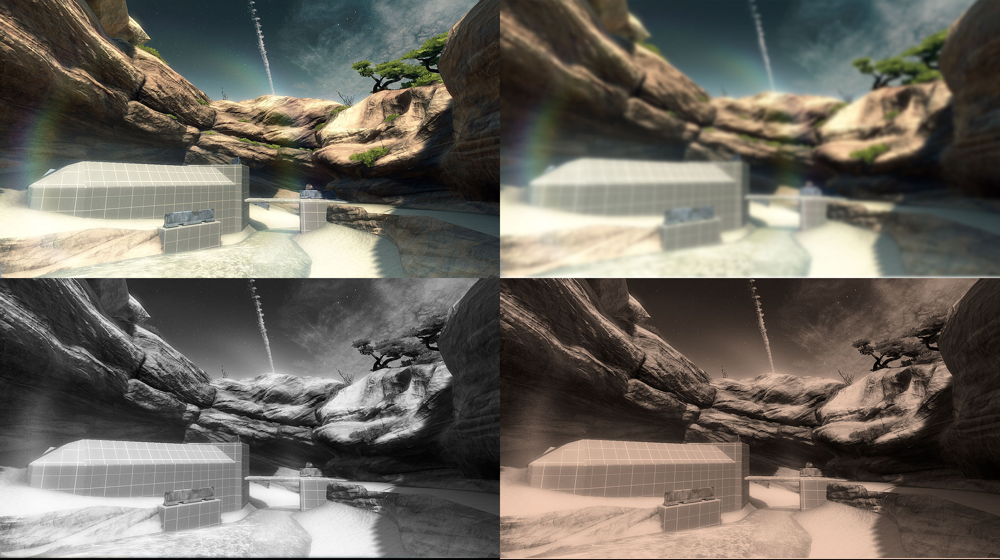

The capabilities of 2D filters:

- Apply effects such as sharpen, edge detection, anti-aliasing, and motion blur.

- Alter basic color attributes such as brightness, contrast, and color saturation.

- Add screen-space effects such as Gaussian blur, radial blur, light bloom, and distortion.

- Add cinematic effect such as depth of field, film grain, sepia tone, and lens vignetting.

- Simulate complex lighting effects such as ambient occlusion and light scattering.


### How to Use 2D Filters <a id="How_to_Use_2D_Filters"></a>

The 2D filters can be accessed as a standard actuator in the Logic Editor window. If you are rusty on what the Logic Editor does, refer to Chapter 3.

To enable a basic 2D filter, add an Always sensor, an And controller, and a 2D filter actuator, and link them together. Remember, even though you want the effect to be applied to every frame, there is no need to turn on the "true" pulse in the Always sensor. Because once the shader is bound (initialized), it will stay active until you explicitly disable it. Binding the 2D filter every frame will only slow down the game.

It also does not matter which object the logic brick is attached to; 2D filter is a screen effect and, thus, does not depend on the object it is attached to. You can attach it to any convenient object. Attaching the 2D filter logic to the main camera is a good idea, because it's an intuitive reminder that the 2D filter is a screen effect. Figure 5.38 shows a basic 2D filter setup.

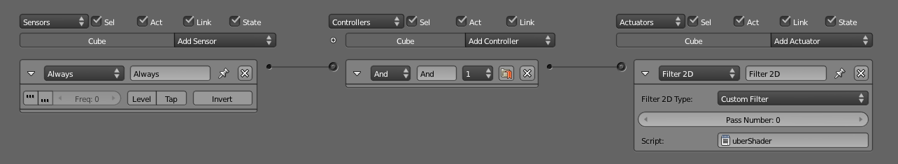

Once you have set up the logic bricks, let's take a closer look at the 2D Filter actuator. The exact function of each option in the Actuator panel is explained in Chapter 3.

The Pass Number at the bottom acts as a "layer" setting where the 2D filter effect resides. Each "layer" can only have one filter, but you can stack filter layers to get a more complex effect. Just make sure that each effect has a unique Pass Number so they don't override each other. Obviously, to set up multiple 2D filter effects, more than one actuator is needed.

In the drop-down menu, you'll see a small selection of predefined effects (Invert, Sepia, Grayscale, Motion Blur). Select one and run the game to see how it looks.

Enable and Disable turn a certain effect on or off. You need to supply a valid Pass Number. Thus, if you bound a 2D filter to Pass Number 5 at one point, you can turn off the effect with Disable and set the Pass Number to 5. Conversely, you can quickly turn the same effect back on by using Enable.

Remove Filter is similar to Disable: it turns off a certain effect on a given Pass Number. Additionally, Remove Filter also completely unbinds the shader, making it impossible to enable the same filter (i.e., Pass number) again.

Custom Filter is used to specify arbitrary shaders. It is useful when the built-in filters can't achieve the effect that you are looking for. To use a custom filter, Blender needs the name of a text file. The text file must be one of the text data blocks stored within the Blender file.

With the pass system, you can make a very robust post-processing stack. You can set up a few filters to be run on an Always sensor to do some basic color correction and add the effects that will always be enabled. Then you can set up a few more filters that are enabled momentarily when you need them.

### Custom Filter <a id="Custom_Filter"></a>

A very simple custom 2D filter is shown below:

```c++
uniform sampler2D bgl_RenderedTexture;
const float contrast 1.5
void main(void)
{
  vec4 texcolor = texture2D(bgl_RenderedTexture, gl_TexCoord[0].st);
  gl_FragColor.rgb = texcolor.rgb * contrast;
  gl_FragColor.a = texcolor.a;
}
```

If the above code looks somewhat familiar, it's probably because a 2D filter is really just a GLSL fragment shader. This shader fetches the color of the current pixel, multiplies it by 1.5, and displays the result. This produces an image with higher contrast than the original.

### Limitations <a id="Limitations"></a>

2D filter can be read from the following inputs:

- Frame Buffer Color Image (sampler2D bgl\_RenderedTexture)

- Frame Buffer Depth (sampler2D bgl\_DepthTexture)

- Frame Buffer Luminance(sampler2D bgl\_LuminanceTexture)

- Image Size (float bgl\_RenderedTextureWidth, float RenderedTextureHeight)

- Custom Textures as Input (sampler2D)

2D filters are applied per scene, with the effect building one on top of the other. For example, if you have a main scene and an overlay scene, the game engine will proceed as follows:

1. Render the main scene.

2. Apply the filters available on that scene into the screen.

3. Render the overlay scene on top of the already post-processed main scene.

4. Apply the filters on top of this multilayered pixel lasagna.

## Text <a id="Text"></a>

To display text, you can pre-make a mesh object that has the real geometry of the text or texture map a plane. This method is simple, but is very limiting because the text cannot be changed during the game. To show different text, the artist would need to create a new asset for each text string the game needs.

To display text that can potentially change during the game, there are four ways to display dynamic texts within the game engine. Two of them are useful for only static text: text that doesn't change throughout the game. The other two are dynamic: the text they display can be changed on the fly.

- Static text using real geometry.

- Static text using pre-made textures.

- Dynamic bitmap text.

- Dynamic text object.

Static text is not treated any differently than regular Blender objects. For the rest of this section, we will look at ways to create dynamic texts.

## Bitmap Text <a id="Bitmap_Text"></a>

If the game engine can render hyper-realistic 3D graphics in real time, how hard can it be to render some text onto the screen? Turns out, it's really difficult due to the awkward workflow needed to create the text.

The process involves creating a texture containing all the letters of the English alphabet (plus numbers and symbols)-yes, languages that use a non-Latin alphabet are not supported using this method; UV map the texture on to a plane; turn on the Text option in the material setting; and create a GameLogic property on the text object called "Text." Fill this variable with some string. Once you run the game, Blender will then automatically display content of the "Text" string on the screen. Tada! Hello? Come back!

Okay, let's try that again.

1. Start with an empty Blender file.

2. Select Blender Game from the Render Engine drop-down box.

3. In the top view, add a Plane by clicking on Add > Mesh > Plane.

4. Configure one of the Viewports to be the UV/Image Editor.

5. Select the Plane; enter Edit mode by pressing Tab.

6. From the UV/Image Editor, load the text image texture from the folder /Book/Chapter5/Textures/text.png.

7. The image texture deserves a little more attention. This texture is generated by a free tool that can be found at [http://www.ashsid.sk/wp/?p=21](http://www.ashsid.sk/wp/?p=21). It contains the most commonly used characters and symbols arranged so that Blender knows exactly where each character is.

8. Create a material for the object; under the game settings, enable Text. This will tell Blender to treat the image texture you loaded in the above step as a special text image. The plane will now show an @ symbol, the first available character of the text image. This is normal.

9. Configure one of the Viewports to be the Logic Editor.

10. Keep the plane selected. In the Logic Editor, add a new Game Property and name it Text. (This is important! Otherwise, it won't work). And set the data type to String.

11. In the value field, type in anything you want; whatever is stored in this Text property will be displayed as text in the game.

12. Run the game. The content of the Text property will replace the @ symbol.

This method of displaying text does have several drawbacks. For example, because texts are drawn using textures, they might appear blurry when shown at extreme angles relative to the camera. Also, since the character set is extremely limited, international support for non-Latin alphabets and right-to-left languages is impossible to achieve.

## Text Object <a id="Text_Object"></a>

Using Bitmap text is a very confusing process. Text Object is an easier way to display text (see Figure 5.39). The same Blender text object type can be used in-game. Simply create a "Text" object in Blender, and it will be rendered as a text inside the game engine. To change the value of the text, you can use Logic Bricks to change the "Text" property of the text objects.

Or one can use Python:

```python
from bge import logic

logic.getCurrentController().owner.text = "Hello World"
```

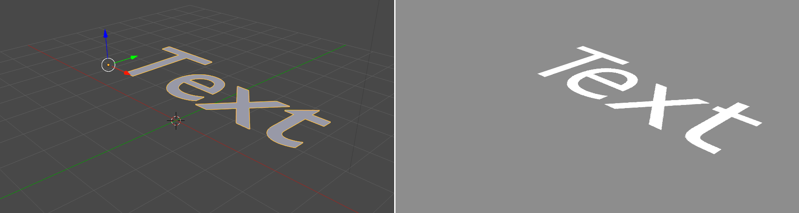

## Video Texture <a id="Video_Texture"></a>

The video texture function allows you to update or replace a texture during the game. Not only does this give you the ability to use a video file as a texture, as the name of the function implies, but video texture can also be used to replace a static texture with the following:

- A video file (useful as animated texture)

- A different image texture (useful if you just want to replace the texture)

- A render from another camera (useful for rendering reflections of mirrors)

Because video texture is a rather advanced feature that requires some Python scripting knowledge, it will be left for your own exploration. The book files contains a few examples of how video texture can be used. You can find them under /Book/Chapter7/6\_texture/.

## Stereo <a id="Stereo"></a>

Human eyes are able to perceive depth primarily in three ways:

- Using environmental cues such as haze, lighting, perspective, and existing knowledge of dimensions of common objects. Using this method, you can still get a sense of depth from looking at a flat picture.

- Using the focusing distance of the eye, because things not in focus tend to be blurrier.

- Using the parallax distance between two eyes to see two slightly different images.

The basic idea behind all 3D stereoscopic techniques utilizes the third point on the list above: parallax. That is, to display a different image rendered from a slightly different perspective to each eye. There are many methods used today to make sure the left eye only sees the image intended to be seen by the left eye, and the right eye only sees the image intended for the right eye. Most 3D movie theaters achieve this by using polarized glasses combined with a dual-projector setup. Glass-based 3D TVs for consumers use shutter-glass that quickly alternates between blocking the left and the right eye, synchronized to a fast-refreshing screen that also alternates between right- and left-eye images.

Blender can output stereoscopic renderings in many ways. Figure 5.40 shows how to set it up. But regardless of the final output format, it starts by rendering the scene twice, with a slight horizontal camera offset (controlled by the setting Eye Separation) to mimic the separation between the human eyes. For a typical viewing environment, the optimal eye separation is approximately Focal Distance / 30.

>**The Nitty Gritty Details**
>
>Blender uses the zero parallax technique to set up the stereo cameras.

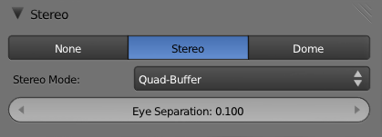

When Stereo mode is selected in the Render panel, as shown in Figure 5.40, six Stereo modes become available.

- **V-interlace and Interlaced:** The left and right images are interlaced together. This mode requires additional 3D hardware to see properly.

- **Above-Below:** The left and right images are stacked vertically. This mode also requires additional 3D hardware to see properly.

- **Side by Side:** The left and right images are placed next to each other without overlapping. In this Stereo mode, you should be able to see the 3D effect by crossing your eyes (really!). But this method of viewing 3D is very straining on the eyes. I do not recommend you try this for extended period of time.

- **Anaglyph:** In this mode, Blender filters the left and right images with a different color and then overlays them on top of each other. This mode requires the viewer to wear a pair of 3D glasses with tinted lens. The left eye should be tinted red and the right eye should be tinted cyan. With the glasses on, the colored lens should only allow one image to go through, blocking out the image for the other eye. This way of seeing 3D is less stressful than Side by Side, but requires the monitor to be sufficiently bright relative to the ambient environment for an optimum image. The only downside of this approach is the lack of accurate color representation.

- **Quad-Buffer:** Quad-Buffer is the natural extension to a typical double-buffer rendering system, which is used for single-eye rendering. This mode also requires additional hardware to display the image. Quad-Buffering is a native stereoscopic method supported by OpenGL. Unfortunately, it does not work on consumer-level Nvidia and ATI/AMD graphics cards; only the more expensive Nvidia Quadro and ATI/AMD FireGL support this functionality.

## Dome <a id="Dome"></a>

The Dome mode in the game engine is a great example of how Blender's open source nature makes it the perfect playground for developers to experiment with specialized features that virtually no other game engines on the market have. The Dome mode was implemented by Dalai Felinto as a part-school, part-commissioned work.

Similar to how environment maps are rendered in Blender, the Dome mode works by rendering the scene from many directions, up to six times. This data is then stitched together and mapped onto a new canvas of any arbitrary shape, and finally displayed on the screen. The image generated by the Dome mode is designed for spherical screens like those found in OMNIMAX theaters and planetariums.

Even if you don't have access to the screen of your local OMNIMAX theater (you don't?!), smaller immersive dome screens are also becoming more popular, like the one shown in Figure 5.41.

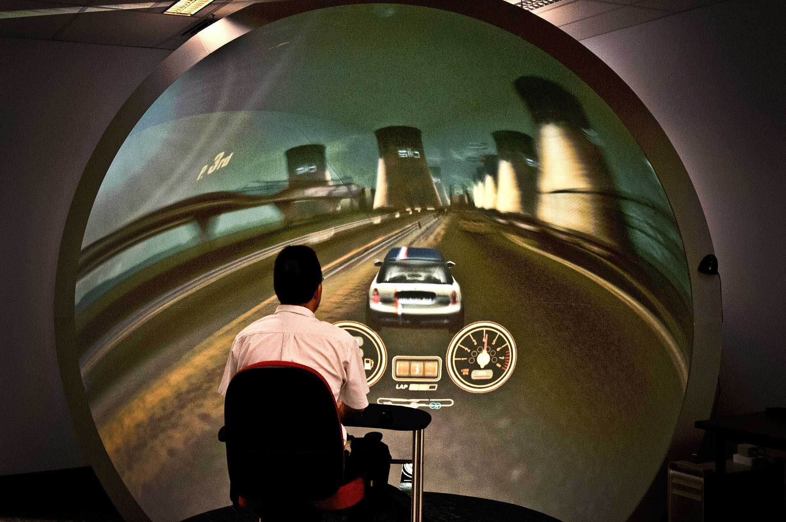

Even with a flat screen, Dome mode can provide you with a much better viewing experience than the default OpenGL perspective mode at extremely wide angles, as depicted in Figure 5.42. Both cameras are 170 degrees. Notice the heavy distortion on the left image, and the fisheye look that the dome perspective obtains.

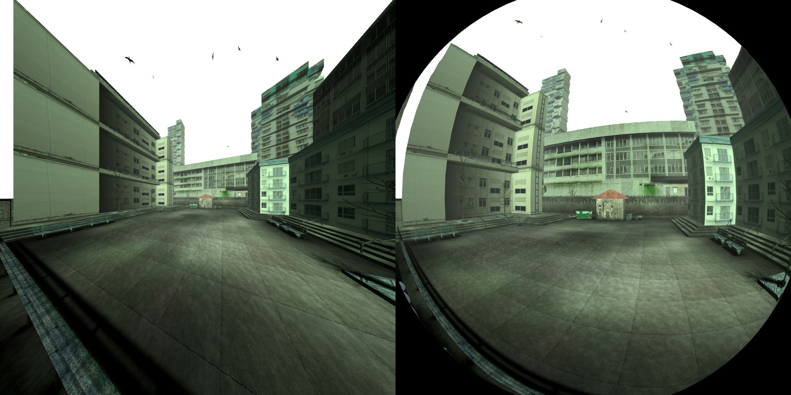

Dome settings can be enabled from the Render panel, as shown in Figure 5.43.

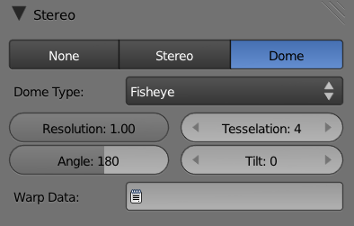

- **Dome type:** Controls how the images are mapped onto the screen. Cube Map shows you the raw render done by the dome engine, laid out in such a way to match how Blender stores the environment maps. This is mainly useful for debugging, or if you want to save the cube map for a different purpose. Other options include Spherical Panoramic, Front-Truncated, Rear-Truncated, and Fisheye. These choices warp the images in different ways to fit the screen. Try them out for yourself! Be careful, though-some of these settings can be very disorienting!

- **Resolution** : Sets the dimension of the render-to-texture images; a smaller value will give you better performance at the cost of a lower-resolution final image.

- **Tessellation** : Sets the number of subdivisions of the mesh used for displaying the final image. A larger value means less distortion, but it will also be slower. You can check the effect of this setting by running the game in wireframe view.

- **Angle:** Sets the field of view of the camera.

- **Tilt** : Pitches the view up and down without actually rotating the in-game camera.

>**Beware of Artifacts!**
>
>Because both stereo imaging and Dome mode require the game to reposition or reorient the camera to create multiple views per frame, certain camera-dependent texture and shading functions (such as normal and reflection, and specular highlights) might contain artifacts when rendered in Stereo or Dome mode.

//TODO
//BY 'Mike Pan'
//ON '2013-04-10T07:30:00'MP
//NOTE: 'Before that, still in domes, maybe talk about warping mesh? The wiki page covers it nicely/simply. You can even be shorter than there.']
//

Before you get carried away with creating the ultimate eye candy, keep in mind that a realistic game isn't just about visual fidelity. As John Carmack (the technical director of id Software, known for _Doom_ and _Quake_ series) noted at QuakeCon 2009: No matter how good a scene looks graphically, it only takes one frame of awkward animation to completely break the illusion of realism. Many games today have achieved near-photorealistic graphics, but once the character starts to move, it becomes painfully obvious how artificial everything is. So keep in mind that even the most detailed 3D model can't immerse the gamer in a fantasy world if the gameplay, sound, or animation doesn't measure up.
