**Table of Contents**

- [Chapter 8: Workflow and Optimization](#Chapter_8_Workflow_and_Optimization)
	- [Optimization Basics](#Optimization_Basics)
	- [Understanding Hardware](#Understanding_Hardware)
	- [Performance Target](#Performance_Target)
	- [Performance Scaling](#Performance_Scaling)
	- [When to Optimize](#When_to_Optimize)
	- [How to Optimize](#How_to_Optimize)
	- [The Performance Profiler](#The_Performance_Profiler)
		- [The Profiler](#The_Profiler)
	- [Quick 'n Dirty Optimization Techniques](#Quick_'n_Dirty_Optimization_Techniques)
	- [Advanced Optimization Techniques](#Advanced_Optimization_Techniques)
		- [Think Small](#Think_Small)
		- [Collision Proxy](#Collision_Proxy)
		- [Partial Collision](#Partial_Collision)
		- [Texture Baking](#Texture_Baking)
			- [Limitations of Texture Baking](#Limitations_of_Texture_Baking)
		- [Normal Map](#Normal_Map)
		- [Level of Detail](#Level_of_Detail)
		- [Object Culling](#Object_Culling)
		- [Scene Management](#Scene_Management)
		- [Linked Libraries](#Linked_Libraries)
			- [Linking vs. Appending](#Linking_vs._Appending)
			- [Relative Path vs. Absolute Path](#Relative_Path_vs._Absolute_Path)
            - [StreetLamp vs. Cube.001](#StreetLamp_vs._Cube.001)
		- [Layers](#Layers)
	- [Beauty Trumps Complexity](#Beauty_Trumps_Complexity)

# Chapter 8: Workflow and Optimization 

We were once told that making a video game is a constant struggle between four elemental forces:
- Quality

- Performance

- Development time

- Monday-morning meetings

Okay, so maybe the last item shouldn't be on the list, which Figure 8.1 reflects. But the point is that it's easy to make a visually impressive game when performance is not an issue. Conversely, it's also easy to make a game perform well if the game has very basic graphics. The difficult part is achieving both at the same time. Luckily, this can usually be accomplished by investing more development time in the project. Finally, if you have worked in a team environment, you undoubtedly know that Monday-morning meetings do not guarantee a better game, but are guaranteed to end in frustration and spilled coffee.

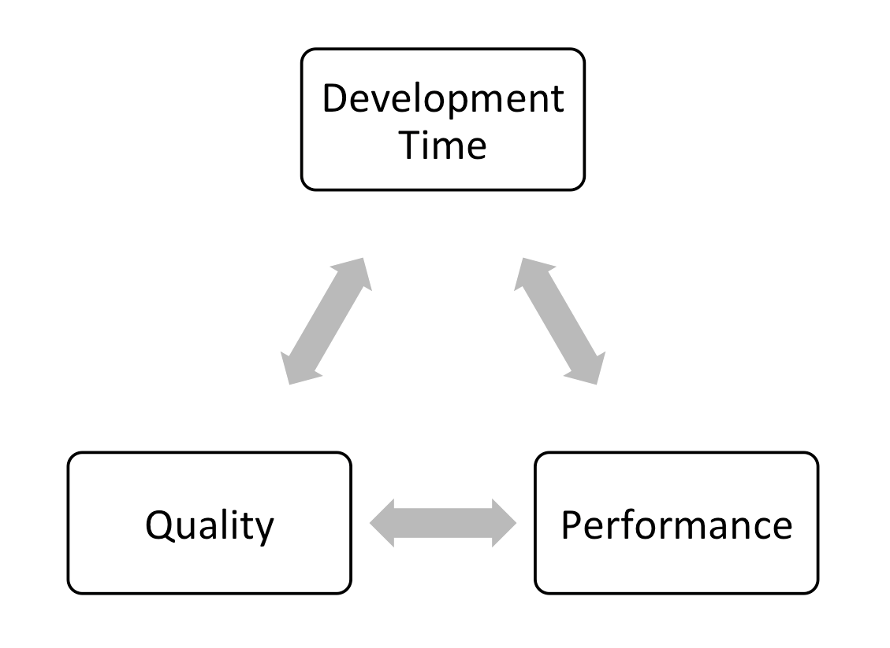

In this chapter, we'll talk about some of the techniques used to improve the performance of the game, speed up development, and how to survive Monday-morning meetings to keep the upper management happy.

## Optimization Basics 

Making a video game is both a science and an art. The creative aspect of a game can't be realized without technology, and the technology alone is useless without the creative work.

When we play a game, we rarely think about the hundreds of program functions that are invoked each second, nor the millions of lines of codes that are executed every frame, nor the billions of transistors that change state every nanosecond to make all that happen. We don't think of all these things because our game runs on a game engine, which runs on top of the operating system, which in turn manages all the low-level hardware. So as the developer,you can focus on making the game fun.

## Understanding Hardware 

That said, having a good understanding of computer hardware is essential in the game-creation process, because it allows you to manage the limited hardware resources efficiently. Making the most of the available hardware enables the game to perform as fast as possible.

The key components of a modern computer are listed below:

- **CPU** (central processing unit), or processor, is often aptly called the brain of the computer. Everything is controlled by the CPU, with the exception of graphics, which are handled by the graphics card. A faster CPU allows more complex logic and physics, as these things are calculated on the CPU. Today, many CPUs are multicore, so they can do multiple tasks simultaneously without slowing down. However, a multicore CPU does not automatically make a game run faster; the software needs to be multithreaded in a way that utilizes multiple cores. Currently, Blender's game engine is not optimized to take advantage of multiple cores. So having even a quad-core processor does not increase the game's performance significantly.

- **RAM** (random-access memory), or memory, is a place to store temporary data for running programs. The more complex the scene, the more RAM will be used. With most computers having 4GB of RAM or more, we usually don't have to worry about running out of memory unless the game is exceptionally large. For a small-to-medium-scale game, memory size is effectively not an issue.

- **GPU** (Graphic Processing Unit), or graphics card, is a processor that is specially designed to display 3D graphics. Blender uses the GPU to render the 3D world, so a faster graphics card definitely helps make the game perform faster. Generally speaking, a faster GPU would allow the game to have more complex geometry, more lights, and more complex graphic effects.

## Performance Target 

If you are a PC gamer, you are no doubt familiar with the (perhaps frustrating) notion of minimum system requirement. Unlike video game consoles, which have a fixed set of hardware, computers vary a great deal in capacity and performance. Minimum system requirement is a way to guarantee that the game will run at a sufficiently acceptable performance level given a certain hardware configuration.

One of the questions that you should ask yourself before starting any project is: Who is your target audience?

For example, if you are making a casual Web-based online game, you probably want to keep the system requirements relatively low, so that a larger number of casual gamers can enjoy it. On the other hand, if your game is a full-blown action game, then there is a higher chance that your game will be enjoyed by "serious" gamers with relatively fast computers. Figure 8.2 illustrates the difference in graphics between one of the first video games and a modern 3D game made in Blender.

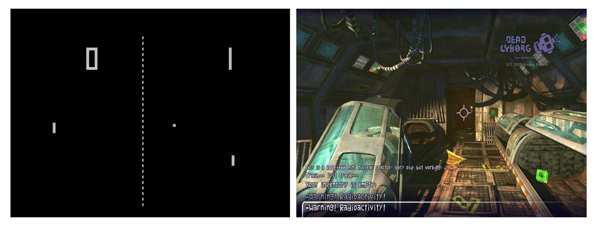
_Pong_ Source: Atari, Inc. Dead Cyborg [c] 2014 Endre Barath.

>**Blender on the Web**
>
>Publishing a Blender game as a browser game is mentioned in Chapter 9, "Publishing and Beyond."

Once a minimum system target is set, you can start creating your game knowing exactly how much detail and complexity you can put into it. You can compromise details to achieve the performance you are looking for. Luckily for us, lowering the overall level of detail usually means the artists have less work to do.

## Performance Scaling 

After a performance target has been decided, most game studios still have to think about how the game will run on hardware that is significantly faster or slower than the target platform.

Big, commercial PC games are excellent at scaling. They accomplish this by giving the user the options to change the game settings to fit a wide range of computers. However, making a game run well on a wide range of computers is time consuming, because additional development time is necessary to make sure the game works well at every combination of settings. For example, you don't want the game to leave out a graphic effect that is crucial to the gameplay just because the user has a slower computer.

Blender has some built-in support for disabling certain advanced graphical features, which can help you in adapting the game to older computers. Figure 8.3 shows _Yo Frankie!_ running at different levels of detail.

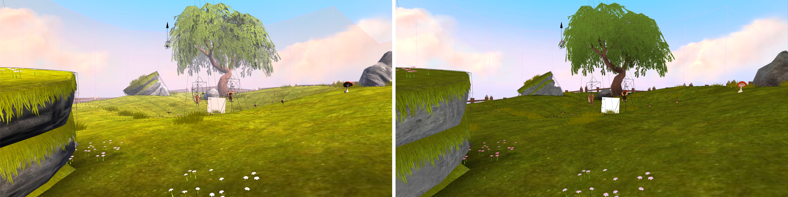

When running in GLSL mode, advanced shader effects can be turned off to reduce the workload on the graphics card. These settings can be found in the Render Properties Editor, as shown in Figure 8.4.

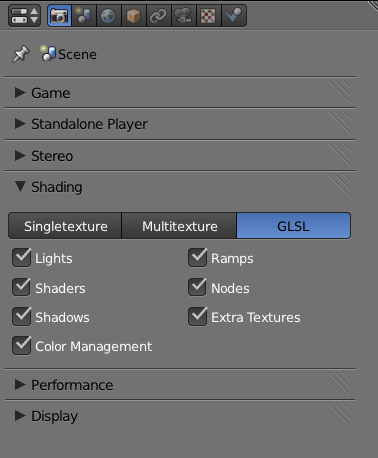

- **Lights:** Disables all GLSL lighting calculation. Has the largest impact on performance as well as visuals.

- **Shaders:** Disables advanced GLSL surface shaders, only basic diffuse and specular shaders will be used.

- **Shadows:** Disables shadows cast by lamps.

- **Ramps:** Disables Ramp Material shaders.

- **Nodes:** Disables Node Materials shaders.

- **Extra Textures:** Disables textures that are not mapped to the diffuse channel of a material. So, in effect, this will disable any specular map, normal map, or emit texture, and only keep the diffuse texture on the surface.

All of the above options are only changeable in GLSL mode. In Singletexture and Multitexture mode, the game engine will always render everything in exactly the same way.

Apart from tinkering with graphical features to influence the performance of the game, many commercial games also vary the object level of detail, reduce particles effects density, and even change the audio quality in order to make the game play smoother on older hardware. Some of these techniques are explained in this chapter.

## When to Optimize 

Throughout the development process, you will have to make high-level decisions that will affect how the game performs, so it's important to keep performance in mind at all times. On the other hand, doing micro-optimization too early will only slow down your workflow, leading to bugs and sometimes making the game hard to maintain, which is all bad.

An example of premature optimization is to compress all the textures to JPEG so that they take up less space. Why is it bad? JPEG is a lossy compression[md]every time you open and resave a JPEG file, some data is lost. So by constantly editing a JPEG file, its image quality will decrease considerably. During development, it is always better to save files in lossless formats, such as TGA or PNG. This applies to audio files as well; editing should always be done on lossless formats such as WAV.

Figure 8.5 shows JPEG compression artifact vs. TGA, which compresses losslessly.

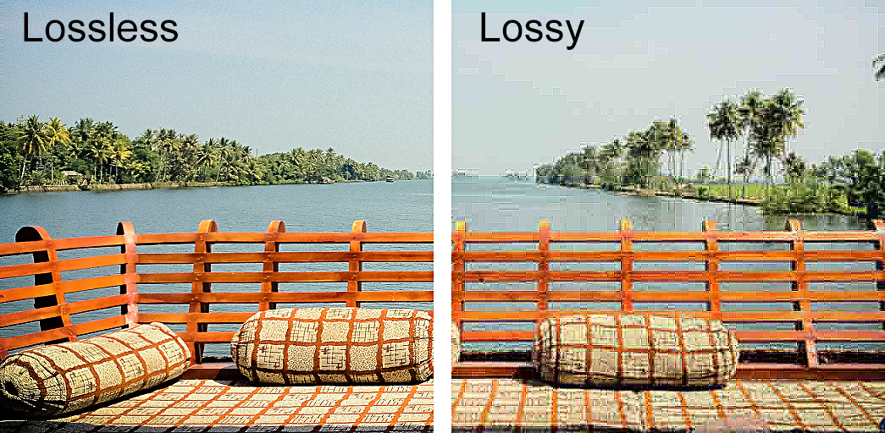

>**The Tale of Two Tabs**
>
>For the underwater marine visualization project Dalai Felinto and I were involved with at the University of British Columbia, I was given the task to "see if you can squeeze more fish into the scene and make it run faster"[md]a typical request from a Monday-morning meeting. Because this BGE visualization already contains hundreds of objects in the scene, I just assumed that Blender wasn't good at handling a large number of separate objects. But despite the hunch (which proved to be so very wrong), I kept trying different scenarios, turning objects on and off, turning off Python scripts, playing with physics, and culling settings. Then I found a script that, when disabled, would speed up the game performance by five times! When 12fps suddenly became 60fps, I knew I'd found the proverbial silver bullet. But being the author of the script, I was not convinced that a 70-lines script could slow down the game by that much, so I dug further, until I finally realized that there was an error in the code that made an inner loop run way more than it should.
>So, after two hours of profiling, the only finding was a badly nested Python loop. The fix took all of two seconds and involved unindentation of the offending code. But the end result was spectacular, to say the least.
>Silly bugs like this might not be present in your project. Without finding a bug like this, you'll never increase your performance five-fold by fixing a few indentations in the code. But never assume you know where the problem is[md]always profile.

## How to Optimize 

As obvious as it sounds, the first step in optimization is locating the bottleneck. A bottleneck is the point in the game where it is taking the longest time to compute. Focusing on the bottleneck will make sure that the work you do in optimizing the game will have the largest impact on performance.

Common wisdom in the programming world says never assume you know where the bottleneck is. Experience might tell you where the slowdown should be, but if there is an unexpected bug somewhere, the bottleneck might not be where you think it is. Always make sure that you locate the bottleneck before trying to remove it. The performance profiler in Blender can give you some very insightful information about the performance of the game and where the bottleneck might be.

## The Performance Profiler 

Blender has a basic performance profiler available to you. It gives you timing information on how long a frame takes to update, as well as the breakdown of how long the game engine spent on specific tasks.

To turn it on, go to the Render Properties Editor and check Framerate and Profile under Performance, as shown in Figure 8.6.

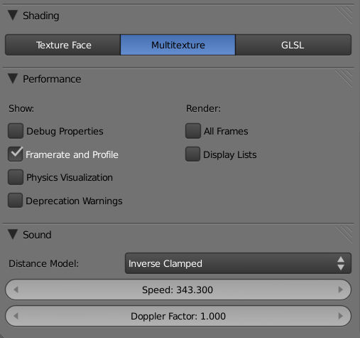

The profiler can also be accessed from the top menu under Game.

Once that's enabled, you will see a text overlay as depicted in Figure 8.7 in the top-left corner when running the game.

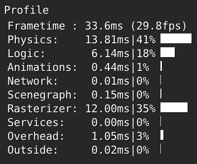

### The Profiler 

The most common measurement of performance for a real-time application is frame per second; that's how many images the computer can render per second. This number is shown at the very top of the profiler in two ways. First, as "swap," which refers to the time it takes to swap out the previous frame for the new one, expressed in milliseconds. Secondly, as a more readable "frames per second" value, expressed in hertz.

Moving down, you can see that the number in the first column is the time it took to complete the operation in milliseconds; the second column is the same value expressed as a percentage of the total time.

To understand the profiler, simply look at the relative percentage of time it takes to complete all the operations. The table below shows you the meaning of each.

_Table 8.1 Profiler Breakdown_

| Label      | Meaning             | Hardware Used | Typical Ratio |
|:----------:|:-------------------:|:-------------:|:-------------:|
| Frametime  | Combined time       | Entire system | 100%          |
| Physics    | Bullet physics time | CPU           | 10%           |
| Logic      | Game logic time     | CPU           | 5%            |
| Animation  | Animation time      | CPU           | 5%            |
| Network    | Network time        | Network       | 0%            |
| Scenegraph | Scene setup time    | CPU           | 10%           |
| Rasterizer | Rendering time      | Graphics card | 65%           |
| Services   | Misc. time          | CPU           | 2%            |
| Overhead   | Misc. time          | CPU           | 2%            |
| Outside    | Idle time           | CPU           | 0%            |

It is impossible to say what would be an ideal profiler-time ratio. The typical ratio is only meant to give you a very rough idea of how an "average" game will perform. Each application is different. A fast-action game with lots of physics could easily spend 25 percent of the time on physics, a graphic-intense cut scene might spend 95 percent of the time on rasterizer, while a scientific visualization might use 40 percent of the time on logic.

The "outside" time deserves special mention. This time represents the idle time that is not spent actively doing anything. So do not be alarmed if the outside value is too high, especially when the framerate is capped at 60.

Furthermore, the ratios change depending on the computer hardware. For example, a computer with a fast graphics card would breeze through the rendering in almost no time, making the rasterizer-time ratio much smaller. Because of this, the profiler works best when it is run on a computer with hardware that matches the intended target audience. Otherwise, it might give you a false sense of where the bottleneck is.

For a detailed analysis of what each of the components do, Mitchell Stokes has written a very comprehensive article on the subject. It can be found at http://wiki.blender.org/index.php/Doc:2.6/manual/Game_Engine/Performance/Display/Framerate_and_Profile.

## Quick 'n Dirty Optimization Techniques 

Once you've located the slowest portion of the game by looking at the profiler, here are some things you can try to speed up the game:

- **Disable physics for non-essential objects:** If physics is taking a large portion of the CPU time, then maybe consider disabling collision for non-essential objects. By default, all objects in the scene have collision detection turned on, so this can be slow. Changing the physics type from static to no collision will make the physics engine work less. Setting is found in the Physics Properties Editor for the object.

- **Switch to simple collision shapes:** The more complex the collision bounds, the harder the physics engine has to work. Consider using simple shapes that approximate the models by switching to a different bounding box. Setting is found in the Physics Properties Editor for the object.

- **Use display list:** When enabled, display list caches the geometry data on the graphic card so that they do not have to be sent to the graphics card every frame; this significantly increases the performance of games that contains complex geometry. Setting is found in the Render Properties Editor. There is almost no downside to this feature. Some very old graphics cards might not support it, but at the time of writing, display list works for almost all the computers in use.

[lb] **Use power-of-two textures:** Older graphics cards expect textures to have dimensions that are powers of twos. For example, 512 x 512 pixels, 2048 x 2048 pixels, and 512 x 64 pixels are all good sizes. Traditionally, non-power-of-two textures are automatically extended to the next highest power of two, so a 513 x 513 pixel texture will take up as much memory as a 1024 x 1024 image texture when the game is running. Even though most newer graphics cards do not impose this requirement on image sizes, it's always a good idea to manually save all your images in a more compatible size.

- **Use DDS-compressed textures:** If your game contains a lot of high-resolution texture maps, they will take up a lot of video memory. File formats such as PNG, JPEG, or TGA are compressed on the file level, but when these images are loaded into Blender, they are uncompressed into a raw format so that the graphics card can quickly decode them. This makes estimating texture memory usage based on file size very difficult, since 40MB worth of JPEG might take up 200MB of real texture memory on the graphics card. If a game has a lot of textures, it might be worthwhile to look into Direct Draw Surface (DDS) compressed textures.

DDS is a common name that refers to a set of compressed image formats (specifically DXT1 through DXT5) that is designed for real-time use. In Blender, DDS textures remain compressed even after they are loaded into memory. Therefore, they take up significantly less memory than a conventional image texture.

Popular image editors such as Photoshop and GIMP have plug-ins that support the loading and saving of DDS files.

- **Reduce the number of dynamic lights:** If rasterizer is taking up too much time on the profiler, consider reducing the number of dynamic lights. Dynamic lights are wonderful. When skillfully placed and animated, they contribute so much realism to the scene. Unfortunately, they come at a hefty cost to the graphics card: more lights mean slower performance. So use them sparingly. Generally speaking, it's best to keeping the number of lights under four. Remember, you can accomplish a lot by prebaking the light effects, discussed later in the chapter.

Lights with real-time shadows are even slower.

- **Reduce the number of objects:** It goes without saying that fewer objects are faster. Sometimes, even just by batching up all the static objects into one, you can achieve an impressive performance boost. A large number of objects usually cause the scenegraph time in the profiler to be unusually high.

- **Use instancing:** If your game world is populated by hundreds of identical objects, make sure they share one mesh. This is done by pressing Alt+D to duplicate the object, rather than the usual Shift+D. Data-block sharing makes the game load and run faster. When using instancing, Object Color can be a handy way to add some variation to the material without having to create multiple materials.

- **Play with window size:** If by resizing the 3D Viewport to a smaller size, you get a larger increase in performance, it means your game is limited by the fill-rate performance of your graphics card. Transparent objects, complex shaders, and 2D filters are all fill-rate heavy. Reducing these effects will make the game run faster on slower graphics cards.

- **Use Blenderplayer:** Blenderplayer, the stand-alone game engine of Blender, can be a bit faster than Blender. So if you are looking for one last bit of performance out of the game, try switching to Blenderplayer. In fact, it's always a good idea to use Blenderplay when publishing your game anyway.

- **Watch the console:** By default, the Blender console window is hidden on all operating systems. Turn on the console and see if there are any error messages being printed. Error messages generally indicate a much greater problem with the game. Not to mention that an excessive amount of console printing can slow down the game significantly.

To turn on the console window on Windows: Go to Main Menu > Window > Toggle System Console

To run Blender with a console window on OS X or Linux, launch the application from the command line.

- **Try another version of Blender:** When all else fails, consider the possibility that there is a bug in Blender that's causing the slowdown. (This has happened before.) Try your file with another (older or newer) version of Blender and see if the performance problem is still there. If you believe something is abnormally slow when it shouldn't be, file a bug report so the developers can have a chance at fixing it. This might not only solve your problem, but it makes the program better for everyone else, too.

## Advanced Optimization Techniques 

Here are some other, more advanced, optimization techniques to try.

### Think Small 

If you are making a large game, instead of making a sprawling million-acre landscape, consider separating the map into many smaller pieces and use cleverly designed tunnels, elevators, or entryways to trigger the loading of a new section of the map. Half-Life 2 is a wonderful example of this; their massive terrain is actually made up of many zones. This way, the computer doesn't have to load and render nearly as many assets at once.

Additionally, if the level chunks are kept in different files, as opposed to different scenes in the same file, you could also have multiple people working on the levels and not cause version control issues.

Once the level is broken up into different sections, each can occupy a Scene. You can use the Scene actuator to switch between Scenes, as shown in Figure 8.8.

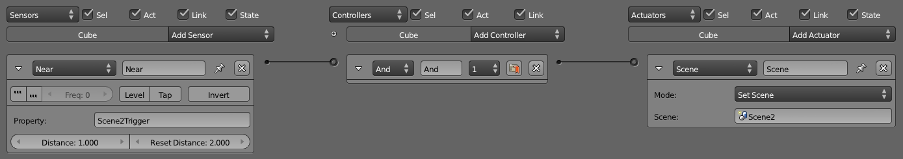

### Collision Proxy 

While it is justifiable to spend hundreds, if not thousands, of polygons on a model to make it look nice onscreen, the collision mesh used for physics rarely needs to be as detailed as the visual representation. Because of this, a common technique used in games is to approximate physics meshes with built-in primitives, such as cubes or spheres. These are the fastest to compute.

If more definition is needed, you can create a collision proxy for a complex object. A collision proxy is a simplified, invisible shell that occupies the same space as the visual model but is only used for collision detection. Figure 8.9 explains.

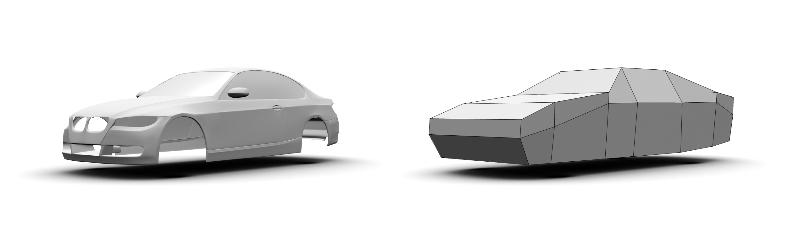

_**Tutorial**_
To use collision proxy:

1. Open /Chapter8/collisionProxy.blend.

2. The scene contains a high-polygon model of a tree. Start the game and notice that all of its faces react to collision. You can confirm this by pressing the spacebar to throw balls at the tree. Notice that no matter where the ball hits the tree, it will detect the collision.

3. If you have a slower CPU, also notice that the physics is taking a large amount of the time, mainly because of the complexity of the tree mesh.

4. To further visualize what's going on, enable Show Physics Visualization from the top menu. All the faces that have collision enabled will be outlined in green when the game is running.

5. If we have to build a collision proxy for the tree object manually, it would involve modeling out a mesh that has the rough shape of the tree, but using much less detail. For this exercise, a simplified version of the tree has been created for you. In layer 2 of the file, you will find a collision proxy that fits over the tree. The model consists of the main tree trunks, combined with a sphere to approximate the canopy.

6. Turn on both layers 1 and 2: Press the 1 key, then, while holding down Shift, press the 2 key.

7. To link the high-detail tree model to the low-detail tree model, we will parent them together. First, right-click on the treeHigh object to select it; then while holding down the Shift Key, right-click on the treeProxy object to select that as well. Now simply parent the treeHigh object to the treeProxy object by pressing Ctrl+P. Note that the order in which we selected the two objects is important!

8. Right now, both objects still have collision and display turned on. If you were to play the game right now, the game engine would have a difficult time trying to resolve the collision between two objects that are occupying the same space, and display a mess of colliding polygons.

9. To remove the collision property on the treeHigh: Select treeHigh. In the Physics Properties Editor, set the physics type to No Collision.

10. To disable the visibility of the treeProxy, Select treeProxy. In the Physics Properties Editor, enable the Invisible button.

11. Run the game now to see how the collision is handled by treeProxy, while the treeHigh gets displayed.

12. Keep in mind that since the treeProxy is the parent of treeHigh, any logic brick should be attached to the proxy object. treeHigh is simply a collision-less, logic-less, nice-looking model.

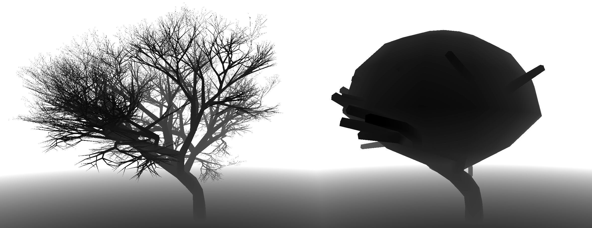

So that's collision proxy in a nutshell. As you can see, a lot of steps are involved with this approach, which makes using collision proxy suitable only for very complex models that have a unique shape. Otherwise, it is much easier (and efficient) to use one of the predefined collision bound primitives.

### Partial Collision 

Another alternative to collision proxy is to simply turn off collision on part of the model. This can be done in the material Properties Editor. By adding multiple materials, you can control which part of the model is collision detected and which part is ignored by collision detection.

_**Tutorial**_

1. Open /Chapter8/collisionMultiMaterial.blend.

2. Start the game and notice that the entire tree object reacts to collision. You can confirm this by looking at the wireframe physics visualization.

3. In order to make the game run better, let's disable collisions for the smaller tree branches.

4. Select the tree object and go to the Material Properties Editor.

5. Select the material slot named _Trunk_ and make sure that the Physics checkbox is turned on.

6. Select the material slot named _Branches_ and disable collision by unchecking the Physics checkbox. The resulting file should look like Figure 8.11

7. Run the game again and notice that the smaller branches will now be ignored by the physics engine. Not only will this free up some physics computation, but it will also make the game more realistic by letting objects go through leaves.

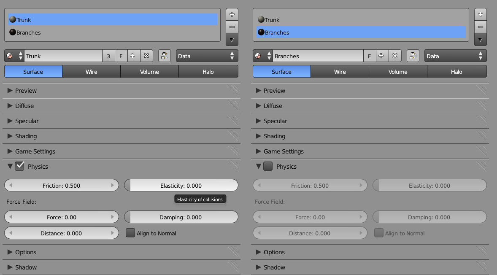

### Texture Baking 

The Blender rendering engine is capable of creating some stunning effects. Don't you wish you could have that level of graphic quality in your game? With texture baking, you can! Texture baking is the process of rendering effects such as shadow map, ambient occlusion, and lightmaps onto a texture, so they do not have to be computed in real time.

Texture baking requires the material to be set up so that it can be rendered by the internal rendering engine. Then, with a few more clicks, the renderable material will be baked onto an image texture that can be used in-game.

The entire workflow can be summarized as:

1. Make object material compatible for rendering.

2. UV unwrap object.

3. Bake.

4. Reassign the baked texture onto the object.

_**Tutorial**_
Let's try this out:

1. Open /Chapter8/TextureBaking.blend.

2. Run the game and notice that this interior scene is very flat, and the lighting isn't very realistic.

3. Quit the game and press F12 to do a render of the scene. This is what we want our scene to look like in-game. Close the rendered image by pressing F11.

4. To bake texture, you need to first UV unwrap the scene so that the baked texture has a place to go. To do this, right-click to select the room object. Enter Edit mode with a quick tap on the tab key. Press U key to invoke the UV Unwrap menu. Select Lightmap Pack.

5. In the pop-up menu shown in Figure 8.12, make sure that the New Image checkbox is enabled; this will ensure that an empty image texture is created for you. Click OK to unwrap the model.

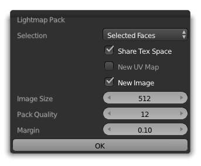

6. For a more complex model, it might be necessary to manually UV unwrap a model, but for this exercise, the automated unwrapping is sufficient. Keep in mind that for texture baking to work correctly, the UV layout should not have any overlapping region. Otherwise, the baking will render to the same texture coordinate multiple times, causing an artifact.

7. To bake texture for the room object, go to the bottom of the Render Properties Editor, where the Bake function is found, as shown in Figure 8.13.

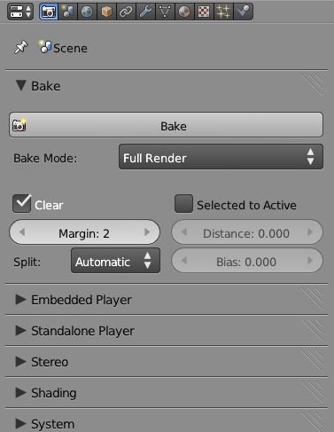

8. The Bake Mode selector controls what will be baked to a texture. Full Render will bake the full color, light, shadow, and texture onto the texture. Ambient Occlusion is another commonly used one.

9. Select Full Render for this project and click on Bake. This might take a few minutes, depending on the complexity of the model. As the texture is getting rendered out, you can see the baked texture filling up the Image Editor on the bottom of the screen.

10. When the texture baking is finished, it should look something like Figure 8.14

11. Now that the baking is finished, quit out of Edit mode by toggling the Tab key.

12. Finally, you need to tell the game engine to use the texture you just baked, instead of the old materials. The easiest way is to delete all three materials from the object by clicking on the [-] button in the Material Properties Editor. This is a cheap and fast way to force Blender to use the texture you just created.

13. Run the game now. Notice that all the light and color you saw in the render are visible in real time. However, specular effects, such as specular highlights and reflections, cannot be baked. Therefore, those are still not visible.

14. The lightmap image is not automatically saved. To save the image, click on Image > Save As from the Image Editor. You can also save the image by pressing F3 with the mouse over the image editor.

15. Figure 8.15 shows the finished version, which can be found at /Chapter8/TextureBaking-finished.blend

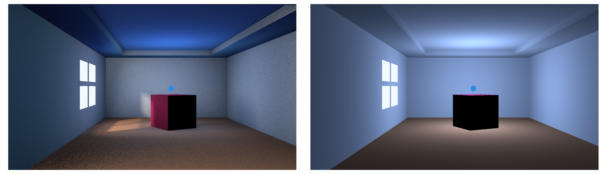

#### Limitations of Texture Baking 

As with anything that "sounds too good to be true," there is usually a catch.

- With texture baking, only view-independent lighting effects can be baked. So while diffuse color can be baked to a texture because diffuse color is not linked to the camera-view angle, specular highlights and reflections are ignored during texture baking because specular highlights are view-dependent lights; there is no way to bake them onto a static texture.

- Texture baking is an act of sacrificing flexibility for performance. Once a scene is baked, the scene becomes rather static. For example, moving an object after you baked the lightmap might result in a black spot and some odd-looking phantom shadow. So usually light baking is limited to the static environment only.

- Every object has to be UV mapped in a non-overlapping manner. If two areas of an object share the same texture coordinate, they will not display properly.

- Keep in mind that Blender doesn't save image files automatically, so make sure you manually save the baked texture file by clicking on Image > Save.

Despite the limitations, texture baking is a popular method that is widely used to include fancy light effect in real time. In addition to baking full renders, it is also possible to bake just an ambient occlusion map. The baked ambient occlusion texture can then be used as a secondary texture to influence the surface shading of an object.

### Normal Map 

Baking a normal map is actually just a special case of the texture baking. Normal map baking is commonly used to generate a tangent normal map from a high-resolution model to map onto a low-resolution model.

So what is a normal map?

A normal map is a regular image file, but instead of influencing the color of the surface like a regular color texture, normal maps are used to alter the per-pixel surface normal. By altering the surface normal, you can change the apparent bumpiness of a surface. The effect of a normal mapped object is one that has far more apparent fidelity than the actual underlying mesh. Figure 8.16 shows the effect of a normal map.

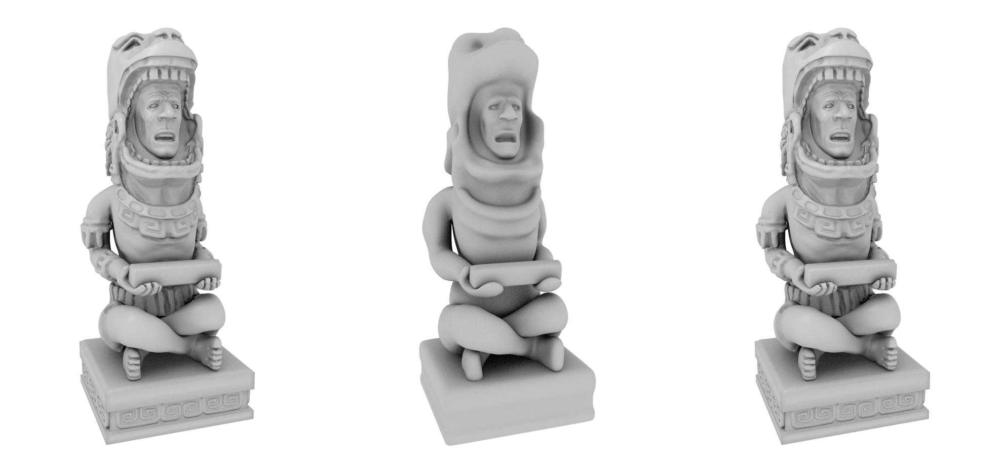

There are two ways to create a normal map:

1. A normal map can be created in an image-editing tool, such as Photoshop or GIMP. Plug-ins are available that can convert a black-and-white height map into a normal map.

2. Use Blender's built-in tool to bake a normal map from a high-polygon model to a low-polygon model.

_**Tutorial**_
To bake a normal map from a high-polygon model to a low-polygon model:

1. Open /Chapter8/NormalMap.blend.

2. Notice that we have two objects of the same model: a high-resolution model that we'll use as the input, and a low-resolution model that we will bake the normal map to. They occupy the same space because this is necessary for the normal map-baking process to work properly.

3. As with lightmap baking, you first need to UV unwrap the model so that the texture baking knows where to place the texture. Select the low-resolution model (since that's the one you are baking to). Go into Edit mode, press U, and select Unwrap.

4. Because no image texture is created for you automatically, manually create a new image texture data block by clicking on the New button in the Image Editor. A resolution of 1024 is sufficient for this example.

5. Now comes the tricky part. First, select the high-resolution model; then hold down Shift to add the low-resolution model to the selection. This way, both objects should be selected, with the low-resolution model being the active object. You can select the object from the Outliner to make the process simpler.

6. From the Render Properties Editor, select Normal from Bake mode and then click on Bake.

7. Once the baking is done, the baked texture should have a purple hue to it. If the color is off, check to make sure that you are baking a normal map into the correct normal space (tangent), as shown in Figure 8.17.

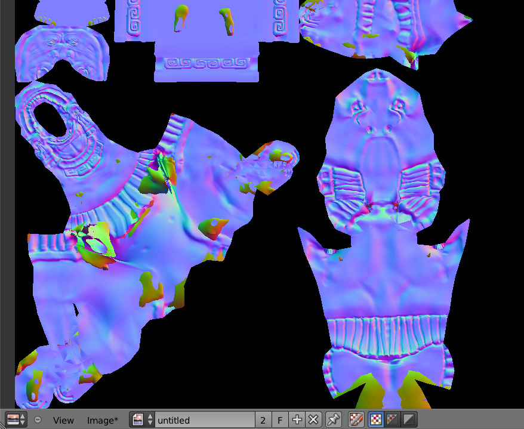

8. At this point, you have no use for the high-resolution model anymore. Move the object to a different layer or delete it.

9. To use the normal map, create a material and image texture for the low-resolution model, as shown in Figure 8.18.

10. The final result should look like the file Chapter8/NormalMap-Finished.blend.

If you are curious, a normal map uses the three color channels (RGB) to store the normal directions (XYZ) of a surface. Because most surface normals are pointing outward, they have a normal value of (X=0.5,Y=0.5, Z=1.0), which is what gives normal maps that distinct purple color.

>**Normal Map Utilities**
>
>The two most popular normal map utilities seem to be Gimp-NormalMap for (you guessed it!) the GIMP (http://code.google.com/p/gimp-normalmap) and NVIDIA Texture Tools for Photoshop (http://developer.nvidia.com/nvidia-texture-tools-adobe-photoshop).

### Level of Detail 

Level of detail (LOD) is a general term referring to ways to adjust the complexity of the object, depending on its perceived size. The idea is that objects farther away are smaller and generally less significant to the gameplay. Therefore, they can often be removed or simplified.

Ideally, LOD requires computing the size of the object on the screen. Because this is usually very difficult to achieve, LOD is commonly done by looking at the distance between the camera and the object.

For a complex mesh, you can create multiple copies of the same model, with decreasing complexity. So when an object is a certain distance away from the camera, you can ask Blender to swap the mesh to a less detailed version. Additionally, as the object gets further away, you can even set the object to invisible, which avoids rendering that object completely.

Unfortunately, Blender does not have built-in support for LOD, so you have to create your own with Python.

A reference implementation of a LOD system can be found at /Chapter8/LoD.blend. This implementation uses a small script that keeps track of the distance of the object to the camera, and replaces the mesh with a less detailed one as the distance increases. Figure 8.19 shows the script-based LOD system.

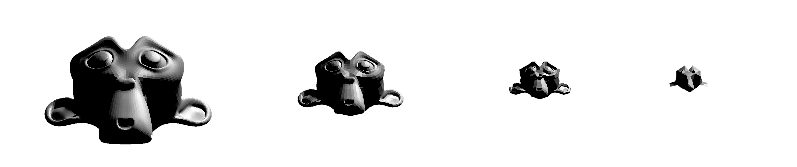

The script should be a good place for you to start tinkering with your own LOD implementation.

### Object Culling 

To make the game run as efficiently as possible, objects that are not visible should not be rendered. While it might be obvious that everything behind a solid wall should not be processed, the computer will need a bit more help to accomplish that.

To help the game engine cull objects, set up occluders to hide part of the scene from view. For example, occluders can be used to mark the separation between an indoor scene and an outdoor scene. A sample file is provided at /Chapter8/culling.blend. The effect of culling is shown in Figure 8.20.

To see the effects of occlusion culling, make sure that you are in wireframe view.

First, run the sample file. Notice that everything inside the house is visible, even when the camera is outside. This is because there is no occluder object.

Now, set the WallOccluder object to be an occluder and rerun the game. Notice that the wall effectively hides objects inside the house until the camera is inside.

Keep in mind that culling is done on a per-object basis. Blender will not hide part of the model. Therefore, occlusion culling is effective only when there are many small objects in the scene hiding behind a large object.

### Scene Management 

Optimization isn't just about making your game fast; it is also about keeping the project organized and easy to manage. As the game project becomes larger, it gets progressively harder to keep everything organized. Here are some things you can do to maintain your own sanity:

### Linked Libraries 

The size of a single Blender file is virtually unlimited, so in theory, you can make a massive game with everything stored in a one Blender file. However, this approach is not practical for many reasons. Only one person at a time can edit a Blender file. So how do you spread a large project out so that multiple people can work on different aspects of it at the same time, without overwriting each other's work?

The answer is Blender's library system. You have already been exposed to linking and appending in Chapter 2. It's a system that allows you to bring in data blocks (such as a character model) from other Blender files into the current file. This way, each asset can be worked on at the same time separately. This also makes reusing of assets easier.

The game _Yo Frankie!_ (available for free online) is a great example of how a large game project is organized. In it, each entity (for example, tree, character model, and rocks) has its own Blender file, which can be linked into a master file, which makes up the game level.

#### Linking vs. Appending 

Both functions import data blocks in Blender from an external file. The difference is that append makes a copy of the data block, and in doing so, severs the ties with the original library file. Once an append operation is done, you can edit, move, or even delete the library file without any consequences on the appended object.

Link does not make a new copy of the data block, but instead references the library file every time the master Blender file is loaded. This way, changes made to the linked object will be propagated to master file.

Linking is generally preferred over appending since it doesn't replicate the data blocks.

#### Relative Path vs. Absolute Path 

Once you start referencing external files (such as image textures and audios files) into a project, you need to decide if you want Blender to point to that file using a relative file path (the default option) or an absolute file path. Generally, keeping paths relative means it's easier to move a whole project around, as long as the overall folder structure is maintained. If multiple people are working on a project jointly using a file-share or source-management system, using relative path is absolutely crucial.

Blender has some helpful tools under the File > External Files menu that can let you mange file paths.

#### StreetLamp vs. Cube.001 

A scene teeming with objects with unhelpful names like Cube.001, Cylinder.87, and Material.002 would be a nightmare to manage. First, scripts that refer to objects by their name will be harder to understand if object names aren't clear. By keeping everything named, you reduce the time it takes searching for something.

Assigning proper names is not only limited to objects. All data blocks in Blender can be renamed. This includes objects, object data, lamps, materials, textures, and image data blocks. Renaming everything might seem like a lot of work, even borderline OCD, but once you are used to it, it really does make the project easier to manage. Think of the poor intern who has to pick up your project six month later!

### Layers 

Not unlike the layer functionality in a 2D image-editing program, the layer functionality in a 3D program is mostly there to keep the scene organized. Blender provides 20 layers for you to work with. How these layers are utilized is up to the artist. Since you cannot assign names to layers, it will be up to you to keep track of, and perhaps document, how the layers are being used.

## Beauty Trumps Complexity 

Armed with these newly acquired optimization methods, you might be tempted to beef up the game with more details. More polygons! Higher-resolution textures! Larger explosions! (Cough[md]Michael Bay[md]Cough.) It's easy to lose sight of the big picture. A visually beautiful game does not have to be photorealistic, nor does it have to be crammed to the brim with details. Sometimes, simple visuals can be just as powerful.

Below are a few games that are faithful to the adage that "less is more":

- **Journey**: http://thatgamecompany.com/games/journey/

- **Limbo**: http://limbogame.org/

- **Love**: http://www.quelsolaar.com/love/
