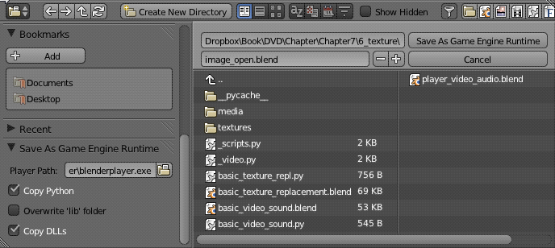
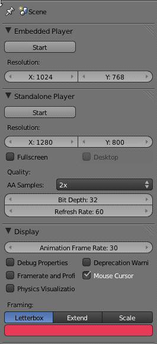
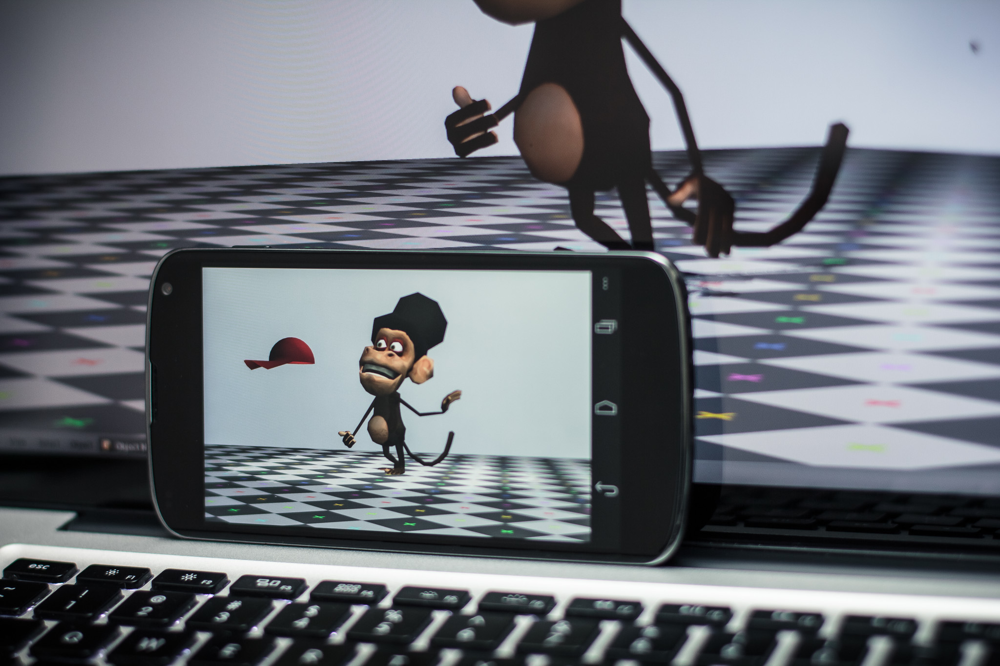
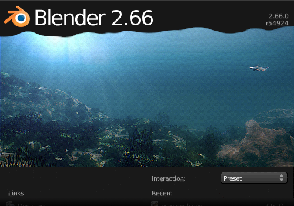

**Table of Contents**

- [Chapter 9: Publishing and Beyond](#Chapter 9: Publishing and Beyond)
	- [Getting Ready for Publishing](#Getting Ready for Publishing)
	- [Resources](#Resources)
	- [The Theory of Relativity](#The Theory of Relativity)
	- [Packing](#Packing)
	- [Blenderplayer](#Blenderplayer)
		- [Export as Runtime](#Export as Runtime)
		- [Resource Files](#Resource Files)
		- [Interface Options](#Interface Options)
		- [File Security](#File Security)
	- [Licensing](#Licensing)
	- [Web Publishing: Burster](#Web Publishing: Burster)
	- [Mobile Publishing: Android](#Mobile Publishing: Android)
	- [Other Tools](#Other Tools)
		- [GameKit](#GameKit)
		- [Unity, SIO2](#Unity, SIO2)
	- [Blender Development Cycle](#Blender Development Cycle)
	- [How to Report Bugs](#How to Report Bugs)
	- [Do It Yourself](#Do It Yourself)

# Chapter 9: Publishing and Beyond 

You've made it this far! By now you should have a solid understanding of everything it takes to make a game. Now the question is: How do you get that game into the hands of the public?

This chapter will focus on publishing the game, including how to package your game, using the stand-alone Blenderplayer, and understanding the licensing issues related to using Blender. We will also explore alternatives to the Blender game engine while still using Blender as the main content-creation tool. Even though this is a Blender-specific book, we encourage you to familiarize yourself with other game engines and to understand their pros and cons so you can decide for yourself what is the best publishing platform to use for a particular game.

## Getting Ready for Publishing 

You finished your game, now what? Apart from stress-test, promote, and polish it, there are a few technical things you need to do in order to deploy your project. They apply to almost any of the options discussed in this chapter, and even if you are using external engines, you should take them into consideration.

## Resources 

Generally speaking, for other users to run a game created by Blender, they will need all of the following files:

**       ** [lb] **        Blender file** : This is a .blend file that contains your 3D scene and game logic.

**       ** [lb] **        Resources** : These include image textures, audios, fonts, and scripts.

**       ** [lb]**        Blender Binary (or executable)**: This can be the Blender or Blenderplayer binary that is needed to run the game for people who don't already have Blender installed.

This list is simplified. For example, in a larger project, instead of a single Blender file, a game could be composed of multiple Blender files, but there will always be one file that acts as an entry point to start the game. Resources are external files that are used in the game. Resources can be packed, which basically copies these files into the Blender file. Finally, Blender binary is also not usually a single file. It contains libraries and scripts that Blender will need. It is usually a good idea to include the binary with the release, because unless the game is distributed exclusively within the Blender community, the user probably will not have Blender (or the correct version of Blender) installed to run the Blender file.

## The Theory of Relativity 

The first rule of deployment is to remember that because we have no control over the user's computer, it is impossible to predict where our game will be installed. If that is not bad enough, different operating systems (Windows, Mac, Linux) handle file paths differently. The only way to ensure compatibility across different systems is to make sure all file paths used in the game are relative and nested to the root folder of your game.

Some relative file paths:

_//textures/color.png_

_//audio/music/background.mp3_

Some bad relative file paths (avoid them):

_//..\..\..\Fonts\ComicSans.ttf_

_//../../Downloads/textures/floor.png_

Some absolute file paths (avoid them):

_C:\Users\Documents\Peter\MyBlenderProject\textures\color.png_

_/home/desktop/DownloadedFromInternet/audio/music/background.mp3_

As you can see, not only does an absolute file path reveal a lot of things you probably don't want others to see, but an absolute file path simply wouldn't work on another computer unless it has the same folder setup as you and a compatible operating system.

By default, Blender references all external assets (such as image textures, audio files, and linked Blender files) using a relative path. The file path is always relative to the Blender file.

Because all relative paths are relative to the currently opened Blender file, in order for the relative path to work, the Blender file should be saved before any external assets are loaded.

If you are using Python scripts to load a file from the computer, you should always use the "os" module (os.path.sep, os.path.join, …) to handle these files' locations.

\*\*\* Begin Note

It's Never Too Late to Make It Right

If you forgot to save your file before appending assets, or missed the "Relative Path" option in the load menu, don't worry. There is an option in the file menu that helps rearrange the assets' file paths:

File > External Data > Make all Paths Relative

\*\*\* End Note

## Packing 

If you don't want to deal with external files, Blender also offers another helpful tool to simplify the distribution of a game[md]packing. Packing makes the Blender file self-sufficient by collecting all external assets such as images, sounds, and fonts into the current Blender file.

To pack a file, click on File > External Data > Pack into .blend file.

Needless to say, packing will make the Blender file increase in size. Packing is a very crude way to hide the file structure of your game from casual observers, but in no way does packing ensure the security of these files. It is easy for someone to unpack the files and have access to the entire game asset you created. Packing is a convenience tool, not an encryption method.

Unpacking does the reverse of packing; it takes all the packed data from a Blender file and writes them out as separate files.

\*\*\* Begin Note

For the Lazy and Unorganized

When you start a project, use external data from wherever on your computer, with no regard to its location. When you feel like getting organized, simply do a pack operation, and then immediately follow it with an unpack operation (with the Unpack to Current Directory option). This will first pack all the images into Blender and then unpack them neatly into a directory called _textures_. This way, there is no need to manually move stuff around. All the external data used will be automatically moved to a single folder for easy distribution. Images in their original location are untouched.

\*\*\* End Note

## Blenderplayer 

One of the strengths of the game engine is its tight integration with Blender and the almost instantaneous feedback you get when starting a game inside the Blender Viewport. This mix of level editor, character design, and general asset management is indeed a trend in the game industry nowadays. Often, we see game engines that have been brought inside the 3D editing tools. There needs to be a distinction between the editing tool and the deployment tool, though. Your game, once published, needs to be a software application on its own. The player shouldn't be aware of the tool you are using[md]not that magicians never reveal their tricks. (You can include a good description of your tools in your credits if that pleases you.) But to go through the Blender interface to open your game will certainly break the spell.

### Export as Runtime 

As we mentioned earlier, Blenderplayer is a way to play back your files independently of Blender. The first step is to make sure the "Save As Game Engine Runtime" add-on is enabled. The next is to run it through the menu File  Export  Save As Game Engine Runtime. See Figure 9.1.

This will open up a dialog for you to choose where to save your binary file, which works differently in different operating systems:

**       ** [lb] **        Windows:** A few files will be copied to the folder you exported the runtime to. The main file is an executable (.exe) that you will be using to launch your game. The name of the file is the one you choose in the Export dialog. It contains both your Blender file (.blend) and Blenderplayer (.exe) bundled together. A few libraries (.dll) are presented as well. They are needed to play your game, so make sure to bring them with your executable wherever it goes (copy, zip, pack).

Finally, something that is present in all operating systems, you will find a folder that contains the files needed to run Python scripts. The folder is named after the current Blender version (for example, 2.66\python\).

**       ** [lb] **        Linux:** In Linux (and Mac OSX), the Blenderplayer binary is static-linked to the libraries. That means that you have one single executable file that contains almost everything you will need. The newly created file (named from the Export as Runtime dialog) already has the proper user permission to be run by any user.

Just like the Windows runtime, in Linux we have a folder with the files needed for the Python scripts. Even if the system already has Python installed, Blenderplayer (and Blender for that matter) relies on one particular version of Python for its execution. This prevents your games from running into compatibility issues with different Python versions that may exist on the user's system. This also allows you to use compiled Python scripts as we will soon see.

**       ** [lb] **        Mac OSX:** In this case, the Export as Runtime creates an executable (.app) that you can run by double-clicking on it. This executable is named from the Export dialog, but it's no more than a folder you can explore via the command line. This folder contains the Blenderplayer executable, the Blender file (game.blend), the Python libraries, and the icons used for game file.

\*\*\* Begin Note

Using Blenderplayer Without Exporting Your Game

You don't need to export your game every time you want to test it in the Blenderplayer.

In the same folder where you installed Blender, you can find the Blenderplayer executable. Run it from the commandline/console with your file as argument:

Blenderplayer.exe C:\MyFileWindows.blend

./blenderplayer.app/Contents/MacOS/blenderplayer ~/myFileOSX.blend

./blenderplayer ~/myFileLinux.blend

If you run it with the argument "-h," you can see all the options available through the command-line. Another option is to use the Start button in the Stand-alone Player tab in the Scene menu to launch the current file in Blenderplayer (see "Interface Options" next in this chapter).

\*\*\* End Note

### Resource Files 

Often, your game will need more than you've enclosed in Blender. For example, if you decided not to pack the textures into your file, you will need to copy them to the same folder structure as they were originally. The same applies for sounds, fonts, movies, Python scripts, and so on.

For Linux and Windows, you simply need to copy them to the same folder of the exported executable. In other words, you need to keep the same file structure as you were using from inside Blender.

For Mac OSX, you need to copy them to "mygame.app/Contents/Resources/." This is the base folder (for example, textures go in mygame.app/Contents/Resources/textures/").

### Interface Options 

In the Render panel, you can find a few specific options for Blenderplayer, as shown in Figure 9.2.

**       ** [lb] **        Start:** A quick way to launch your game in Blenderplayer. It will open it in a new window, You need to save your file first. Don't mistake this with the Start button in the Embedded Player tab, which plays the game inside Blender.

**       ** [lb] **Width** and **Height:** The width and height of the Embedded Player determines the aspect ratio of the camera. The ones in the Blenderplayer panel change the actual size of the screen.

**       ** [lb] **        Full-Screen**** and ****Desktop:** If you want to launch your game in full-screen, you can use this option. If you set the Desktop option, the game engine will use the current computer screen resolution for the Full-screen mode. Otherwise, the Blenderplayer resolution will change the desktop resolution.

**       ** [lb] **        AA Samples:** For smooth rendered edges, you can turn on anti-aliasing. If the computer running the game does not support a specific level of AA or doesn't support AA at all, the game engine will fall back to the maximum supported parameter.

**       ** [lb] **Bit Depth** and **Refresh Rate:** The color depth and the refresh rate for the graphics.

[lb] **        Framing:** What can you do when the screen is scaled? Choose one of those three options: Letterbox, Extend, and Scale. Scale will stretch the frame to the new screen size (expect some aspect ratio distortions); Extend will reveal more of the frame, as if you had changed the Blenderplayer and the Embedded Player resolution at the same time. Letterbox will fill any difference between the camera aspect ratio (Embedded Player resolution) and the screen size with the color you choose in the color box (black by default).

### File Security 

Because Blender is available for free to everyone, if you distribute your game as a Blender file (.blend), there is really no way to prevent people from firing up Blender and taking a peek at your Blender file. Even if the game is packed and made into a runtime in the form of a single executable, it is still relatively easy for someone with a bit of technical skill to extract the game data. The bottom line is that packing, compressing, and making runtime are just conveniences for you; a Blend file is never secure against a curious (and determined) evil mind.

\*\*\* Begin Note

No-Cheating

If the game involves multiple players connected across the Internet, the only way to make sure that the game is tamper-proof is to do rigorous checking on the server. Any client-side Python code to ensure integrity can be easily modified by the user, and so it is effectively useless. For example, for a shooter game, the game server should keep track of the remaining ammunition for each player; this way, a malicious player would not be able to cheat by altering his own ammunition count.

\*\*\* End Note

The part of your program you can easily protect is the Python scripts. Although the plain text .py file is easy to be read by anyone, a compiled script is an unintelligible blob of binary code. To compile your script, all you need to do is run it once, and the game engine will generate a .pyc file for you. This file can be found in the same folder as your original scripts in a subfolder called \_\_pycache\_\_. Now all you need to do is to replace the original script files (.py) by their compiled version (.pyc). Alternatively, you can use Python stand-alone to generate the .pyc files: python –m compileall –b <folder-with-scripts>.

Even though your production files will be exposed, this is not the end of the world. Your work is still protected under the licensing rights. Which happens to be our next topic[md] what were the odds?

## Licensing 

It's true that 11 out of 10 people haven't read a single software EULA (End User License Agreement) in their lives. You know, that box full of text you have to agree to before installing a program. To enlighten your mind and relieve your guilty conscience, try not to skip this section.

Just like a document you composed in Word rightfully belongs to you, and not Microsoft, any Blender file you created is entirely yours. You are free to distribute, sell, and publicly show the Blender file as much as you want.

The game engine has a catch, though. Blender and Blenderplayer are licensed under the GNU General Public License (GPL). In a nutshell, it means that any executable file that is derived from one of those binaries needs to follow the same original license. And from that legal perspective, a game exported as a Runtime is considered to be a derived binary.

In other words, you need to ensure that all the files you don't want to license under the GPL are not bundled within the Blenderplayer. The option for export as Runtime can still be used, but your initial file (the one incorporated inside the Blenderplayer) will have to be licensed under GPL.

A simple way to keep your files separated from the Blenderplayer is to create an initial load file. This file will have a game actuator that only then will load your real main file. This way, all your actual game files can be kept external to the binary. Your file doesn't even need to end in ".blend" for the Game actuator to work.

\*\*\* Begin Note

Why the Blender Game Engine Won't Run on iOS

There is a downside of the GPL license when publishing in some distribution platforms. For legal (and perhaps economic) reasons, most distribution game platforms do not accept GPL code in their components. That means it will be hard to get the game engine ported over to consoles and some more restrictive mobile and portable devices.

\*\*\* End Note

## Web Publishing: Burster 

_www.geta3d.com_

Burster is a plug-in that allows you to publish and play your games in a Web browser. The plug-in was developed and is supported by a third-party company, independently of Blender Foundation. The plug-in contains a slightly modified version of Blenderplayer that runs as fast as if it were installed natively.

Not all Python modules are supported (for security reasons), but external assets (for example, textures and videos) work pretty well. Additionally, Burster offers a protection system for your work through online on-the-fly decryption of your Blender files. This does not violate the GPL and can provide the necessary security that some commercial works demand.

If you are considering using the Web as a publishing platform, you can find updated information in the Burster website. Make sure you test your game extensively. Even though most of the features are supported, more advanced resources can get a bit tricky (for example, video texture is supported, but the only way to play videos is with external URLs in a server that supports streaming).

\*\*\* Begin Note

Beyond Packing

For Web deployment and mobile, you need to include all the external dependencies into the main file. While textures can be incorporated with the Packing option, the files and scripts need to be merged in manually.

If you are using Python scripts follow these advanced instructions:

\*\*\* Begin Bulleted List within note

[lb]Open all the external scripts (e.g., originally in //scripts/) in the Blender Text Editor

[lb]Remove all the "from ." from the scripts

[lb]Fix all the Python Module controllers by copying this into the Blender Text Editor and running it as a script (in Blender, not inside the game engine):

import bpy

for obj in bpy.data.objects:

    for cont in obj.game.controllers:

        if cont.type == 'PYTHON' and cont.mode == 'MODULE':

            cont.module = cont.module.replace('script.', '')

\*\*\* End List

\*\*\* End Note

## Mobile Publishing: Android 

_wiki__.blender.org/index.php/Doc:2.6/Manual/Game\_Engine/Blender\_Player/Android_

Although it is early to know how far this will go, the Android deployment for the game engine is starting to get in shape. An experimental branch of Blender, "soc-2012-swiss\_cheese" makes an Android-compatible Blenderplayer that can open simple .blend game files. Animation, Physics, GLSL materials, and mouse interaction are already supported.

In Figure 9.3, you can see the final sample file from Chapter 4 running in an Android phone. To see this in action go to: [http://youtu.be/bF1m5b4jEKs](http://youtu.be/bF1m5b4jEKs).

To run your game, you can download the Blenderplayer Android app and open the game from it. As of the time of writing, the app is not yet on the Android market. You can download it from this BlenderArtists forum thread: [http://blenderartists.org/forum/showthread.php?255746](http://blenderartists.org/forum/showthread.php?255746)

A mobile platform is a limited deployment target. The phones and tablets are getting more powerful every day, yet they still lack in hardware horsepower compared to gaming PCs. As such, you need to be especially careful with optimizing your games.

Some general guidelines:

\*\*\* Begin List

[lb]Simplify the geometry.

[lb]Chop down big objects into small parts.

[lb]Use Occlusion Culling when possible.

[lb]Work with power of two textures.

\*\*\* End List

## Other Tools 

The Blender game engine can be used for prototyping, before the game is fully developed in another game engine. Or, another common situation, you can use Blender only for asset making for an external engine, and the Blender game engine for previewing the animation playbacks and basic interactions. In those cases, you will not be using the logic components of the game, but mostly making sure your assets (objects, materials, animations) can be transferred easily to other engines.

\*\*\* Begin Note

Exchange File Formats

When your engine does not support Blender files directly, you have to find the best format to export from Blender. There is one format in Blender intended for games. It supports not only mesh and texture, but also animation, shading, and physics.

Collada is an open exchange file format maintained by Khronos consortium (the same group behind the well known OpenGL, OpenCL, and others). Although the support for it in Blender is not complete yet, it's getting there.

Another format broadly used is FBX. This is a proprietary format created and maintained by Autodesk with proper support in Blender going on and off in the past releases.

\*\*\* End Note

Even when you are using Blender only to build your assets, the game engine can be of great value. It should be simple to create test levels for your character animations, test ideas, and, in some cases, even build a whole game prototype before migrating to another engine.

In the next chapter, you will learn about some projects that used the game engine in one way or another. One of these projects is _Cubic World,_ originally created in the game engine for a game contest. The project was so well received that the main developer decided to port it to the iPhone, writing a specific engine from scratch. Whether you are building your own engine, porting it to an open or commercial alternative, or deploying with the game engine, be aware of the alternatives to better support your decisions. This is an ever-changing topic. New technologies come and go, and it's up to you to keep yourself updated on the subject. Sign up for newsletters, visit forums, and go to conferences (and although it may eventually help, we don't mean wandering around on Twitter or Facebook).

### GameKit 

_www.gamekit.org_

GameKit is a "basic game engine that allows fast prototyping built around open source software free for commercial use." GameKit uses Bullet for physics, Ogre for rendering, OpenAL for sound, Lua for scripting, and AnimKit for animation (a stand-alone library created specifically for this engine but open for use elsewhere). It reads Blender files and supports all of its Logic Bricks.

This modular approach makes it quite interesting for indie developers who often need to design their own engine from scratch. You can borrow their support for Blender files and Render engine and implement a unique logic system, for example.

One of its key benefits over the Blender game engine is that GameKit fully supports non-PC platforms such as Android and iOS. GameKit also uses a non-viral license, meaning the games you create can have any license you want.

As of the time this book went to press, GameKit is still in its early stages. Nevertheless, it's generating some hype in the Blender game community. We are following this project closely and recommend you do the same.

### Unity, SIO2 

While GameKit stands out for its tight integration with Blender, there are other engines with strong supports for the Blender native file.

SIO2 is an engine targeted exclusively to the mobile market. It currently supports both Android and iPhone devices. It also supports native Blender files, so there is no need to fiddle with export file types.

If your market does not use only portable devices, then Unity3D is another commercial engine that works with Blender files; it's as simple as drag-dropping them inside the editor.

Unity3D has been broadly used by the indie industry. They support mobiles to desktops, and by the time you read this, they can probably deploy for all the main consoles on the market. You still need to rework your materials once you import them inside the engine, but changes in the original file can be merged into the Unity3D editor.

## Blender Development Cycle 

The development of the game engine is tied to the development cycle of Blender itself. Although improvements in different parts of the software are done separately, the release of new versions of the game engine happens as part of the Blender releases.

Once a week there is an online developers' meeting[md]Blender Sunday Meeting. At the meeting, they deliberate on pending issues, present current development from coders, and trace plans for the upcoming weeks and months. The meetings happen in the #blendercoders channel in the Freenode IRC network every Sunday at 4 p.m. Amsterdam time.

For topics that require longer discussions and a larger audience, the developers use a mailing list hosted at the Blender Institute servers: bf-committers@blender.org.

To subscribe to this list or visit its archives, go to: _http://lists.blender.org/mailman/listinfo/bf-committers_

Proposals and roadmaps are presented and discussed in both channels. Some long-term projects end up resting in the Blender wiki, which in turn can be incorporated at the official development documentation page: _http://www.blender.org/development/._

Approximately every two months, a new release cycle starts. In the first week, the proposals for what features should be in the trunk (official Blender code) are presented, discussed, and, if necessary, voted in or out of the upcoming Blender release.

This is especially applicable for big features developed on branches (code not incorporated into the trunk yet). Developers may go for long periods of time coding, testing, and calling for feedback, before the code ever gets incorporated into Blender's main source.

To follow new developments, to help beta-test new features, and to make sure we keep the game engine backward compatible, you can keep track of the branches, which are always announced in the Blender Sunday Meetings and in the mailing lists.

Additionally, if you want to talk with Blender game engine coders directly, or follow our discussions, the #bgecoders IRC channel (also on Freenode) is a place where development is discussed.

## How to Report Bugs 

All software has bugs. Make no mistake about that. For those unfamiliar with this technical terminology, a bug is a problem in the software. Think about the last time you swore at a computer. Behind your lost hours of work lies a bug (and the imprudence of not saving your work; haven't you learned anything from playing videogames?).

Blender has a webpage dedicated solely to report and track bugs from users: _http://projects.blender.org._

The guidelines for bug reporting are simple:

\*\*\* Begin Bullet List

[lb]Make sure you can reproduce the bug several times.

[lb]Re-create or isolate the bug in the simplest file you can think of.

[lb]Report the environment you are working in if it's relevant (OS, hardware, version).

[lb]Be patient. Reporting a bug can be a very-time consuming task. And a fix may take a long, long time with some further tests and interactions with you and the coders.

\*\*\* End Bullet List

And remember, the more time you spend on making a good report[md]with good sample files, concise descriptions, and so on[md]the more you free a developer to work on fixing the bug itself.

## Do It Yourself 

As a provocative final thought, have you considered literally expanding the game engine yourself? We haven't been giving enough attention to the fact that the Blender source code is open and available to everyone. That may not be the reason you got into the software, but it's interesting to explore its potential.

Blender and the game engine are partly maintained by the Blender Foundation and partially by online volunteer coders. Most of the coders started as users, implementing specific features required for their projects. In the short term, that leads to solutions that make life easier and a project more complete. In the long term, it helps build the community that dedicates energy to the game engine project.

If nothing else, you can try building Blender and replacing the splash screen (see Figure 9.4). It's definitively the first step to looking cool and impressing your boss:

_http://wiki.blender.org/index.php/Dev:Doc/Building\_Blender_

DF: To be replaced with a splash screen with Blender 2.6 say on it and the cover of the book. Waiting for the cover of the book.

