# Chapter 1: Getting Started
Here is something you don't know about Mike. He has read more Linux books than he cares to admit. Unfortunately, Mike rarely makes it past chapter 2. Given that the first two chapters usually contain nothing more than a warm introduction and a history of the software, this practice has two profound consequences. The first is that Mike can articulate the history of Linux far better than almost anyone. The second is that he still does not know how to actually use Linux. Granted, the former happens to be far more useful at a party than knowing the difference between "tar cvfz" and "lshw."

In keeping with this tech book tradition, this book won't be any different. In this chapter, you will learn Blender's rich history and be introduced to the very basics of this application.

## An Origin Story

It was the mid-1990s, and the personal computer was taking off faster than anyone had anticipated. With it, there arose the advent of animated graphics and 3D games.

### Blender Begins
It was at this ripe time that Blender came into being. Blender started off as an in-house 3D animation software created by a small Dutch animation studio called NeoGeo. Perhaps it was because of the lack of a cheap and capable substitute; perhaps it was due to sheer ambition, NeoGeo decided to create its own animation software from scratch rather than using what was available. The chief programmer of Blender was *Ton Roosendaal*, who was responsible for writing a large part of the core Blender functionalities.

For the next few years, Blender remained the internal tool of a very successful animation studio. The software became so good that in 1998, Blender was made available to the public. A new company, Not a Number (NaN), was formed to oversee the development and distribution of Blender. Largely via the Internet, Blender was distributed as two separate versions: a free version with limited functionality and a version that was not free (called Blender Publisher) that had a few additional features. Being the only complete 3D animation and game creation package available for free at a time when computer graphics was still in its infancy, Blender started gaining popularity, and many online communities developed that allowed artists to share knowledge and their work.

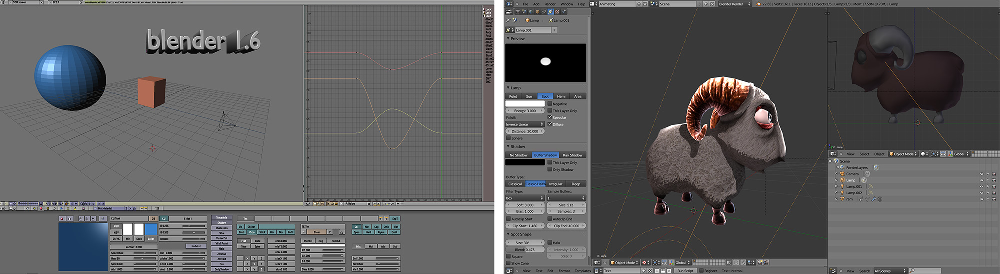

###  The Dark Nights
Alas, with the collapse of the Internet bubble and some other unfortunate circumstances, Not a Number (NaN) filed for bankruptcy in 2002. Since Blender was the intellectual property of the company at the time, dissolving the company meant an uncertain future for Blender. The Blender community did not want to see their favorite software go down with NaN. So a deal was struck in which NaN would release the source code of Blender to the public for a payment of €100,000. A "Free the Blender" fundraising campaign was started. The online community responded very generously. A few months later, enough money was collected to convince NaN to re-release Blender as an open source software to the newly established Blender Foundation. The foundation was created specifically to manage the now open source Blender. Ton Roosendaal, the original creator of Blender, heads the foundation.

### Blender Rises
Located in beautiful Amsterdam, the Blender Foundation now oversees the development, distribution, and marketing of Blender. But because of the open source nature of the software, its development has been driven largely by volunteer contributors from across the world.

The Blender Foundation also created the Blender Institute, an animation and game studio that focuses on movie and game development using Blender. The Institute produced the movies _Elephants Dream_, _Big Buck Bunny_, _Sintel_, _Tears of Steel_, Cosmos Laundromat and the game _Yo, Frankie!_ These projects serve two main goals: The production process is an opportunity to improve Blender in a real studio environment, and the end result also serves as an advertisement for the software itself.

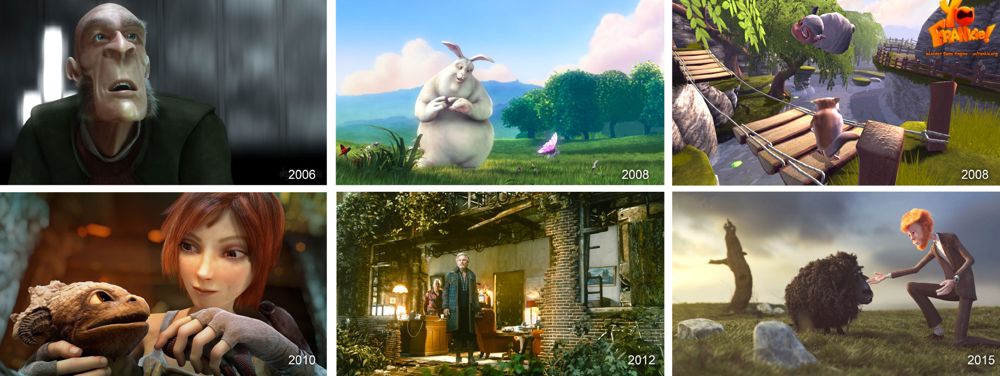

Then came Blender 2.5, which changed much of how Blender looked and behaved. This refactoring, as it was called, took years of planning and coding. Blender 2.5 marks a significant milestone in the history of Blender. For users coming from the Blender 2.4x series, the entire interface looks radically different: menus items are rearranged, keyboard shortcuts are altered, even the default color scheme has changed from a boring gray to a slightly less boring shade of gray.  Blender 2.5 is designed to be more intuitive, faster to use, and easier to learn than its predecessor.

Blender uses the Python programming language for scripting. With Python, you can customize the behavior of Blender, extend its functionality, and, more importantly, control the game engine. Knowing how to program is not a requirement for using Blender, but knowing Python will make you a far more capable game-maker.

The year 2012 marked the tenth anniversary of Blender going open source. During these 10 years of open source development, more than 150 people have contributed something to the source code, totaling 50,000 contributions ("commits," in SVN techno-jargon), averaging nearly 30 commits every day over the past year. Needless to say, the program has improved much over the years, and it shows no sign of slowing down. The image below shows the Blender development statistics gathered from the official SVN repository including Blender trunk all its branches.

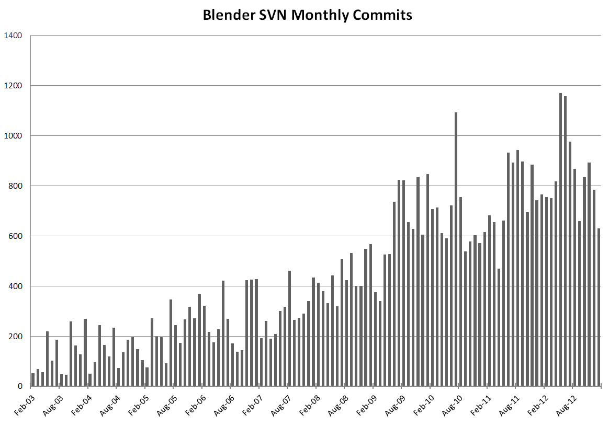

Of course, software exists to serve the users - that's you. Every time a Blender user creates a piece of artwork, it justifies, even if just a little, the enormous amount of time that went into creating the software. We hope that by picking up this book, you are on your way to creating something amazing to share with the world.

---

## About Blender

Chances are, you already know that Blender is an open source 3D software that is capable of modeling, animation, rendering, compositing, and producing a game all in one package. Even if you are not sure what each of those term means, don't fret!

Let's break down the term "open source 3D animation software."

"Open source" means that Blender's source code is available for anyone to access and modify. The most obvious advantage to open source software is that as an artist, you can use Blender for free, for non-commercial as well as commercial work. As a developer, you are allowed to modify Blender in any way you want to suit your specific needs. But open source does not mean that anyone can make malicious changes to the Blender code without approval. Blender is licensed under the GNU Public License v2 (GPL2). In a nutshell, it means that Blender can be copied, modified, and if re-shared, the changes in the source code have to be available and licensed in an equivalent license.

> **Caveat**:
>
> Before you publish a game using Blender, you should understand the limitations of the GPL. This topic is covered in Chapter 9, "Publishing and Beyond."

The term "3D" means three dimensions. The world we live in is 3D because it has height, width, and depth. Compare this with 2D software programs such as Photoshop, GIMP or Krita, the content-creation process in Blender is done in a 3D space, not on a 2D canvas.

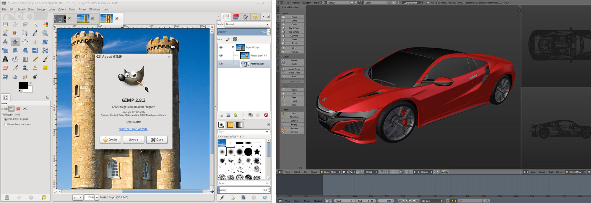

The term "animation" is perhaps a misleading one. Although we tend to attribute the term "computer animated" to any film that is done by a computer, we should remember that Blender isn't limited to just creating animation. Blender is capable of modeling, rendering, compositing, and making games just as well as it can animate.

The term "software" suggests that Blender is a tool-a tool that allows you to create animations and games. So this book will treat it as such-merely a means to an end. We will help you understand each of Blender's features, so you will know how to use the software to achieve what you want.

As this is a book about the tools, this is not a book on game design. Topics such as storyline, art direction, and game playability are beyond the scope of this book. Blender is merely a platform that enables you to make art.

### About the Game Engine

Blender is a multi-faceted tool. This book will focus on one aspect of it: the game-creation process. If you are new to Blender, learning the game engine means you will pick up basic modeling, animation, and other necessary skills along the way. If you already have Blender experience, great! The skills you already know will make transitioning to the game engine much easier.

Compared to some of the commercial game engines available today, the Blender Game Engine (BGE or GE for short) is relatively simple. Is that a bad thing? Not necessarily. A simple platform like Blender is very easy to learn, and yet it's flexible enough to do a lot.

To give you some idea of what the game engine is capable of, Chapter 10, "Case Studies," is dedicated to projects that were done in the GE.

### Future of BGE

One downside to writing about software is that it's constantly improving. Even today, projects such as UPBGE are promising to dramatically improve the features and functionalities of the Blender Game Engine. We will try our best to keep this ebook as up-to-date as possible. What you should do as a reader, is to make sure you are always using the latest version of Blender.

> **Test Builds**
>
> If the latest version is not fresh good enough, uou can find official daily builds on [builder.blender.org](https://builder.blender.org/download/). Additionally, many non-official test builds of Blender are available from [graphicall.org](http://graphicall.org/).

## 3D Basics

If you haven't used any 3D application before, the terms modeling, animation, and rendering might be foreign to you. So before you go off to create the spectacular game that you always wanted to make, let's have a quick refresher on the basics of computer graphics. You don't have to endure the boring section below if you are already know what RGB stands for and the difference between Cartesian and Gaussian.

The knowledge in this section is universal and applies to all other 3D applications. So even if you are coming from a different application, the same concepts drive all of them.

### Coordinate System

We live in a three-dimensional world that has width, height, and depth. So to represent anything that resembles real life as a virtual world inside a computer, we need to think and work in three dimensions. The most common system used is called the Cartesian coordinate system, where the three dimensions are represented by X, Y, and Z, laid out as intersecting planes. Where the three axes meet is called the _origin_. You can think of the origin as the center of your digital universe. A single position in space is represented by a set of numbers that corresponds to its position from the origin: thus (2, -4, 8) is a point in space that is 2 units from the origin along the X axis, 4 units from the origin along the -Y axis, and 8 units up in the Z direction.

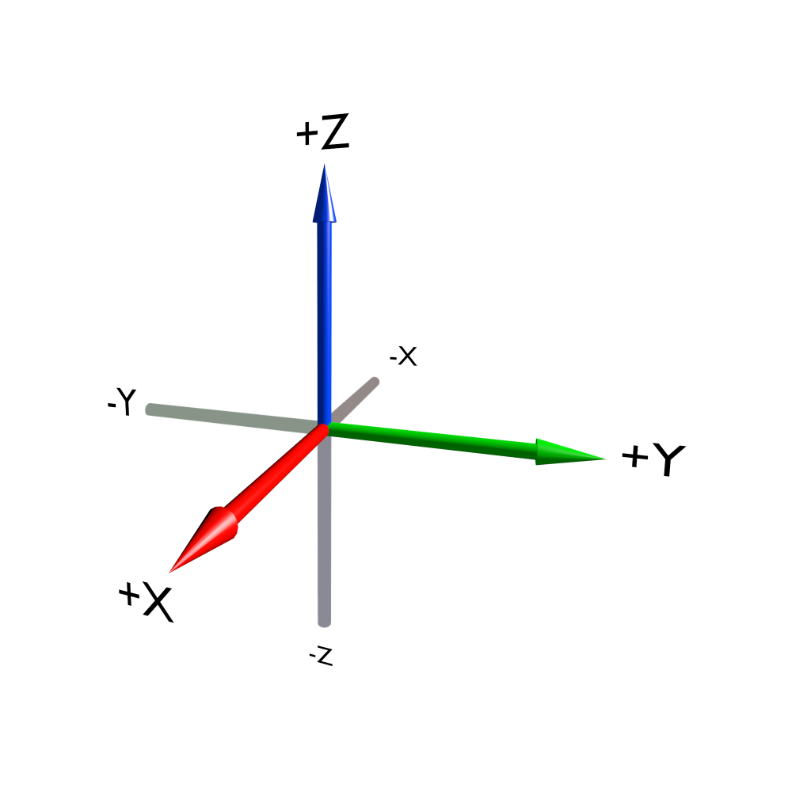

### Points, Edges, Triangles, and Meshes

Although we can define a position in space using the XYZ coordinates, a single point (or a "vertex," as it's more commonly known in computer graphics) is not terribly useful; after all, you can't see a dot that is infinitesimally small. But you can join this vertex with another vertex to form a line (also known as an "edge"). An edge by itself still wouldn't be very visible, so you create another vertex and join all three vertices together with lines and fill in the middle. Suddenly, something far more interesting is created[md]a triangle (also known as a "face")! By linking multiple faces together, you can create any shape, the result of which is called a "mesh" or "model." Figure below shows how a mesh can be broken down into faces, then edges, and ultimately, as vertices.

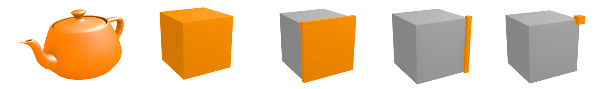

Why is the triangle so important? Turns out, modern computer graphics use the triangle as the basic building block for almost any shape. A rectangular plane (also known as a _quadrangle_, or more commonly a _quad_) is simply two triangles arranged side by side. A cube is simply six squares put together. Even a sphere is just made of tiny facelets arranged into a ball shape.

In Blender, a mesh can be made from a combination of triangles, quads, or n-gons. The benefit of n-gons is their ability to retain a clean topology while modeling. Without n-gons, certain areas of a model (such as a window on a wall) would require a higher number of triangles or quads to approximate, as shown below. While n-gons make modeling easier in some cases, Blender still converts them to triangles when you start the game.

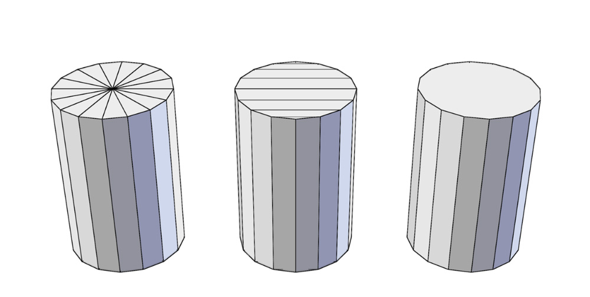

The process of creating a mesh by rearranging vertices, edges, and lines is called _modeling_. Blender has many tools that help artists define the geometry they want.

It is worth noting that unlike the real world, polygonal models do not have volumes. They are just a shell made of interconnected faces that take the shape of the object, but the inside of the object is always "hollow."

Another concept that a modeler will likely encounter is surface normals, or "normals" for short. Normal is a property of each face that indicates the direction a polygon is facing. Because normals are used for shading computation of the surface, ideally all the normals for a mesh should be pointed "outward." Wrongly oriented normals can cause the mesh to show up as black or invisible. Fortunately, there is a Make Normals Consistent function in Blender that can usually resolve the issue. Figure 1.8 shows how normals are presented in Blender.

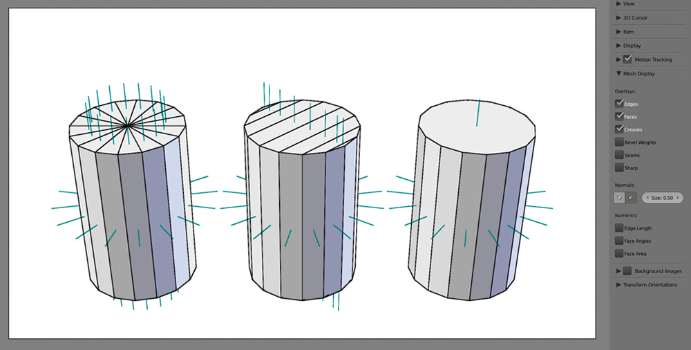

> **Beyond Polygons**
>
> Technically, there are other approaches to computer graphics that do not rely on triangles or polygons, such as NURBS (Non-uniform rational B-spline) and voxel (short for VOlumetric piXEL). But polygon modeling and rendering is by far the most common, and it is the only supported method in the game engine.

### Basic Transforms

The three basic transforms that you should be familiar with are:

* **Translation:** The moving of an object in any direction, without rotating it.
* **Scaling:** The resizing of an object around a point.
* **Rotation:** The rotating of an object around a point.

These three are the most common manipulations you will encounter. They are illustrated below.

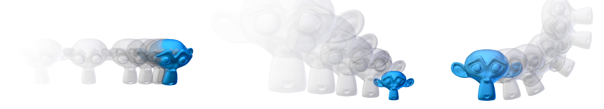

### Materials and Textures

Using polygons, you can define the shape of a mesh. To alter the color and appearance of it, you need to apply materials to the object. Material controls the color, shininess, bumpiness, and even transparency of the object. These variables ultimately all serve to add details to the object.

Often, changing the color is not enough to make a surface look realistic. This is where textures come in. Texturing is a common technique used to add color and detail to a mesh by wrapping the mesh with an image, like a decal. Imagine a toy globe: if you carefully peel off the paper map that is glued onto the plastic ball and lay it out flat on the table, that map would be the texture, and the plastic ball would be the mesh. The projection of the 2D image onto a 3D mesh is called _texture mapping_. Texture mapping can be an automatic process, using one of the predefined projections, or a manual process, which uses a UV layout to map the 2D image onto the 3D mesh. Figure 1.10 illustrates how an image is mapped onto a model.

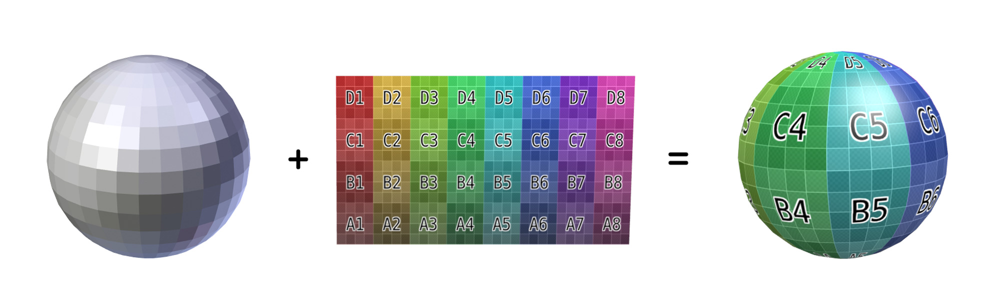

Traditionally, a texture changes the color of a surface. But that's not all it can do: textures can also be used to alter other properties of the surface such as its transparency, reflectivity, and even bumpiness to create the illusion of a much more detailed surface. Figure 1.11 shows different textures that can be applied to a brick wall.

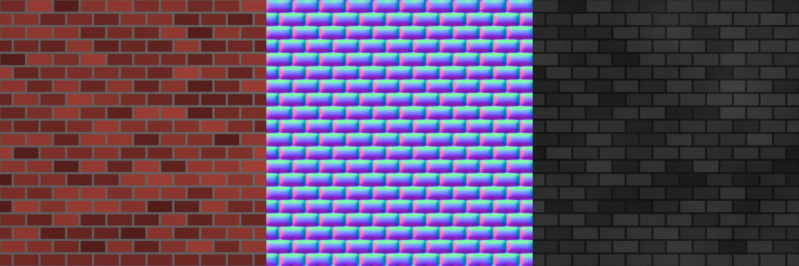

A diffuse map controls the base color of the surface. A normal map controls the surface normal of an object, creating a bumpy effect by changing the way the light is reflected off the object. A specular map controls the specular reflection of an object, making it look shiny in certain places and dull in others. A texture map can also have transparent pixels, rendering part of the object transparent.

Generally, textures are image files. But there are also other ways to texture a surface, such as using a procedural texture. Procedural texture differs from an image in that it's generated by an algorithm in real time, rather than from a pre-made image file. The Blender game engine does not support procedural textures yet.

### Lights

Everything you see is the result of light hitting your eyes-without lights, the world would be pitch black. Likewise, light is just as important in a virtual world. With light comes shadow as well. Shadow might not be something that you think about every day, but the interplay of shadow and light makes a huge difference in how the scene is presented.

In most 3D applications, there are several different types of light available to the artist; each type has its advantages and disadvantages. For example, a Spot lamp approximates a lamp with a conical influence; a sun lamp approximates a light source from infinitely far away. Lamps in Blender are treated like regular objects: they can be positioned and rotated just like any other object. Figure 1.12 shows how different lamps look in Blender.

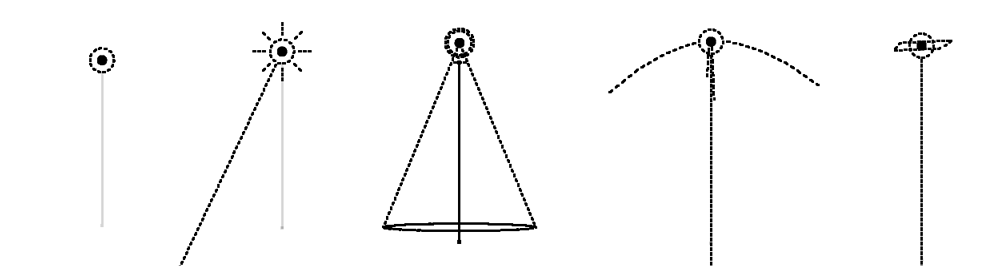

Think of lighting as more than something that makes your scene visible. Good lighting can enhance the purpose of the scene by highlighting details while hiding irrelevant areas in shadow. Skillful placement of lighting also adds drama and realism to the scene, making an otherwise boring scene look visually exciting.

### Camera

When you are creating a 3D scene, you are looking at the virtual world from an omniscient view. In this mode, you can view and edit the world from any angle[md]just like a movie director walking around a set in order to adjust things. Once the game starts, the player must view the game through a predetermined camera. Note that a predetermined camera does not mean the camera is fixed; almost all games have a camera that reacts to a player's input. In an action game, the camera tends to follow the character from behind; in a strategy game, the camera might be hovering high above, looking down; in a platformer, the camera is usually looking at the scene from the side.

A camera is also treated as a regular object in Blender, so you can manipulate its location and orientation just as you can with any other object. Figure 1.13 shows a camera object as seen from different views.

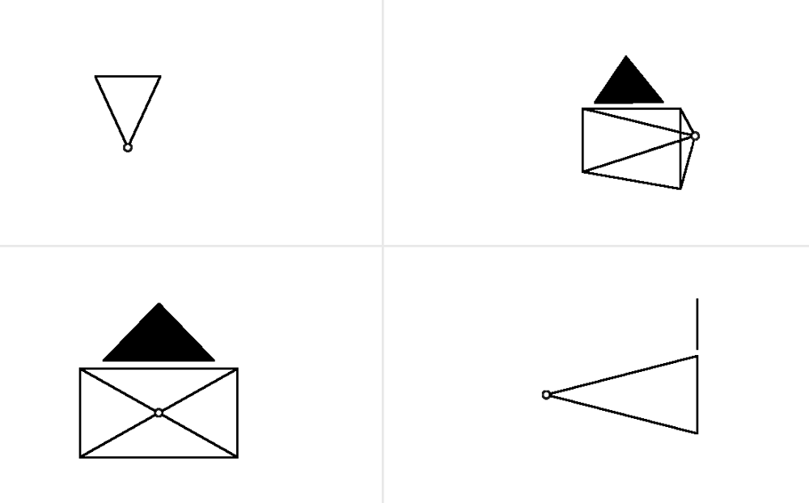

> **Drawing and Composition for Visual Storytellers**
>
> Speaking of lights and cameras, this is the part where we point out the wonderful book by Marcos Mateu-Mestre called Framed Ink. The book uses tons of beautiful drawings to illustrate the many key principles in visual storytelling.

### Animation

In this context, _animation_ refers to the technique of making things change over time. For example, animation can involve moving an object, deforming it, or changing its color. To set up an animation, you create "keyframes," which are snapshots in time that store specific values pertaining to the animation. The software can then automatically interpolate in between those values to create a smooth transition. Figure 1.14 shows keyframing using Blender's Dopesheet Editor. The Dopesheet allows you to see the various properties that change during an animation: the horizontal axis represents time; the vertical axis shows the various properties, such as location or rotation that are keyframed.

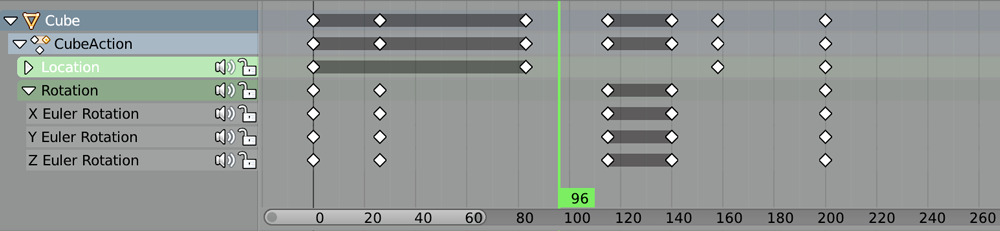

The easiest way to animate is to alter the location, rotation, and scaling of an object over time. For example, by altering these variables, you can realistically animate the movement of a bouncing ball, as shown in Figure 1.15.

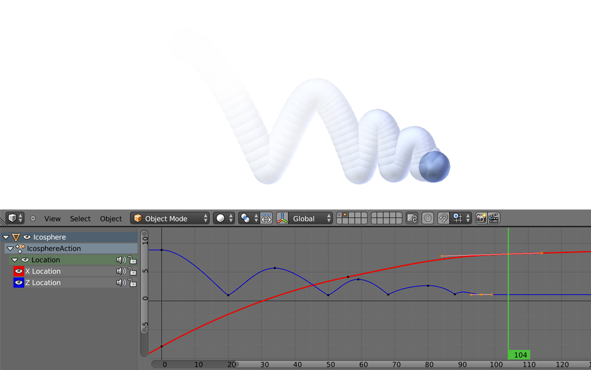

To animate something more complicated, such as a human, it's not enough to just move, rotate, and scale the object as a whole. This is where armatures come in. Armatures are skeletons that can be "inserted" into a model to control the model's deformation. Using this system, you can create complex yet organic-looking animations like Figure 1.16.

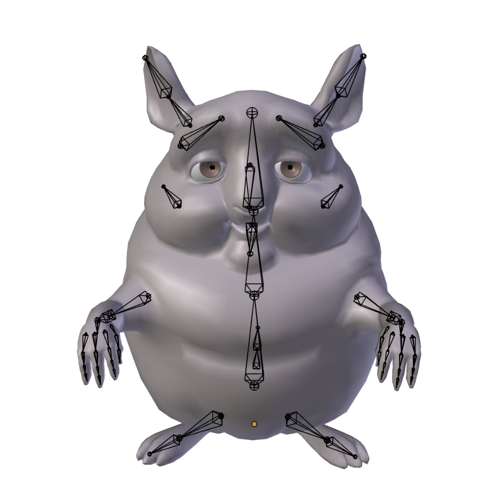

A third way to animate is using shape keys. Shape keys are snapshots of the mesh in different shapes. They are often used to animate nuanced changes that cannot be otherwise easily animated with armatures, as shown in Figure 1.17. 

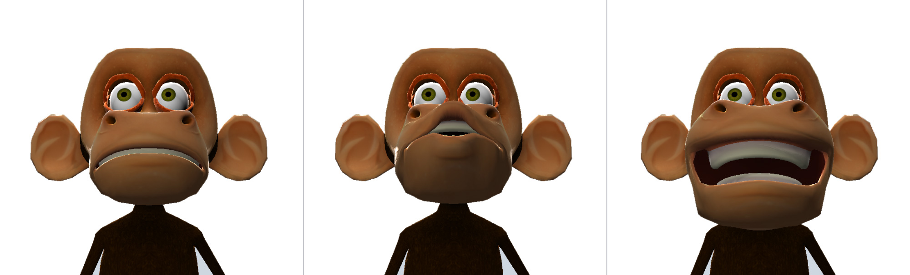

Finally, keep in mind that making objects move doesn't always have to be a manual process. You can also make objects move by using the physics engine, as shown in Figure 1.18 (see Chapter 6).

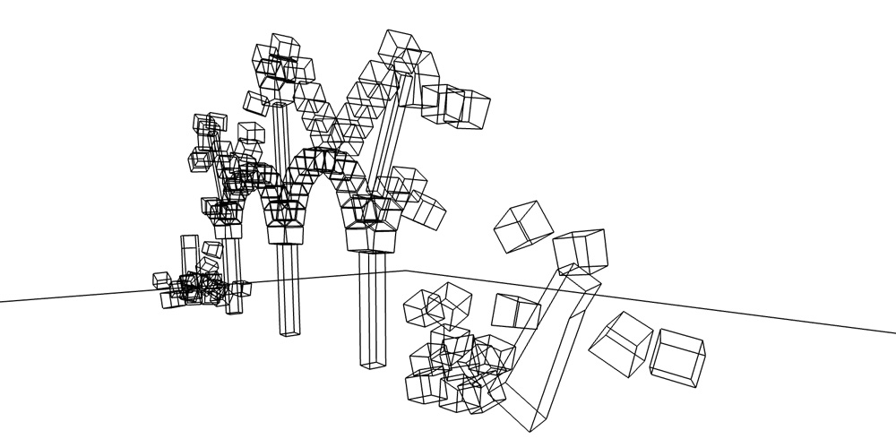

### Game

So far, we have talked about 3D at length. But how does the game engine fit into? Well, a game engine simply takes the existing 3D assets and attaches a "brain" to them so the objects know how to respond to events. The  "brain" can be in the form of logic bricks (which can perform different actions depending on the user input), scripts (which can extend the functionality of logic bricks), or other physical properties of an object (such as rigid body settings to make an object tumble and fall realistically). 

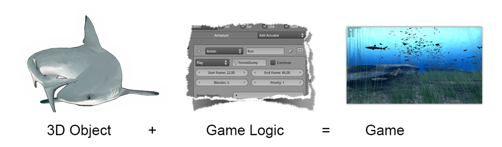

A game engine is made up of many distinct components:

- **Rendering Engine** : Turns the 3D scene you've built (including models, lights, and camera) into an image to be displayed onscreen.
- **Physics** : Handles collisions and physical simulations of objects.
- **Logic/Scripting** : The brain behind a game[md]it reacts to the user input, makes decisions, and keeps track of what's going on in the game.
- **Sound** : Produces the audio events.

The above list is not meant to be exhaustive, but it should give you an idea of what a game engine does. The Blender game engine gives you a lot of control over each of these components, which you will learn one by one in later chapters.

> **Quality vs. Performance**
>
> Making a video game is a constant balancing act between quality and performance. As artists, you want to make the virtual world as rich and detailed as possible; on the other hand, you need to make sure the game can run smoothly for people who might not have top-of-the-line computers. Throughout the process of game-making, you will run into cases where you have to make a decision whether to prioritize the visual quality or the performance of the game. You will also learn tricks to achieve high-quality visual without compromising the performance, as well as how to optimize the game by identifying what is slowing it down.

## Quickstart

This concludes the crash course on 3D graphics. It's finally time to dive into Blender! From now on, you may be better off reading the book with the computer at your side. In this section, we will give you a short tour of Blender, just enough to get you familiar with the software.

### Installation

Blender runs on Windows, Mac OS X, and Linux, You can find the Blender installer for your operating system from www.blender.org. The complete Blender download size is about 100MB.

Go ahead and install Blender. Start the application once it's installed.

> **Installation Not Required**
>
> Technically, Blender does not need to be installed before it can be used. The installer is available for convenience only. Blender will run from any location. You can even copy it to a USB storage device and carry it with you, so you'll never be apart from your favorite program. Although, by default, Blender saves some user settings to the user directory.

Even though you need Blender to develop the game, Blender games can be packaged as stand-alone applications, so that others playing it don't need to install anything. See Chapter 9, "Publishing and Beyond," for more details.

### System Requirements

Blender has no explicit system requirement. The performance of the software is dependent on the complexity of the project. Needless to say, the faster your computer is, the better Blender will run.

## Blender Basics

When you start Blender, you will be greeted with the splash screen. There is an option to change the user interaction preset to Maya. This will alter the keyboard shortcuts and mouse behavior to match that of Maya. Although you are welcome to do that if you are a Maya user, in this book, we will assume you are using the default Blender preset.

Once the initial splash screen disappears, you are presented with an empty workspace like this:

The Blender window is divided into Editors. Each Editor region can be resized, moved, and changed to display a specific set of content. For now, let's focus on the default setup as shown in Figure 1.20.

#### Main Menu

At the top of the screen is the main menu, which offers basic functionalities such as Open, Save, and Help. Furthermore, the main menu controls the view for the rest of the Blender window. The Render Engine option in the middle of the menu controls how the interface is configured. By default, Blender Render is selected. In this mode, the interface is configured for doing 3D modeling, animation, and rendering. But let's switch it to the Blender Game mode. Click the drop-down menu and select Blender Game from the list. This setting will unlock certain features that are not visible when Blender is in the Blender Render mode, and, to reduce clutter, it also hides features that are not available in the Blender game engine.
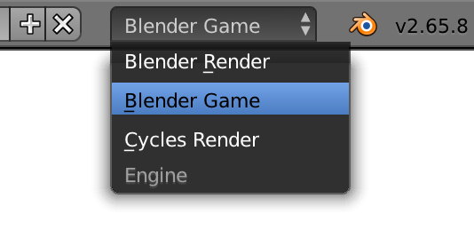

> **Game Engine First Setup**
>
> Always make sure that the Blender game engine is selected in the main menu when you are working on a game project (see Figure 1.21).
>

#### 3D Viewport

Occupying the majority of the screen is a 3D Viewport. Here you can see the 3D world you created and test the game. For now, feel free to explore the 3D Viewport by holding down your middle mouse button over the 3D Viewport and dragging the mouse; the view should rotate with the mouse movement. (Mac users can do the rotate gesture on the Trackpad or the Magic Mouse.) The default scene contains three objects: a cube, a camera, and a light. To select one of the objects, right-click on it. The selected object is highlighted in yellow.

\*\*\* Begin Note

Basic Navigation Controls

Press and hold the middle mouse button to rotate the 3D view. Scroll the mouse wheel to zoom in the 3D view. Right-click to select a 3D object. Selected objects are highlighted in yellow.

\*\*\* End Note

Another common setup for the 3D Viewport is to split the view into four quadrants: top view, side view, front view, and a perspective view. You can turn on Quad view by pressing Ctrl+Alt+Q with the mouse over the 3D Viewport (see Figure 1.22). Press the same key combination to go back to the single view.

\*\*\*Insert Fig 01-22.tif

Figure 1.22

Quad view.

Source: Blender Foundation. Art [c] 2014 Cengage Learning[r]. All Rights Reserved.

To quickly snap to one of the predetermined views (side, top, front, and so on), the number pad is the way to go. Figure 1.23 shows the keyboard layout on the number pad.

\*\*\*Insert Fig 01-23.tif

Figure 1.23

Number pad keyboard layout.

[c] 2014 Cengage Learning[r]. All Rights Reserved.

#### Outliner

Back to Figure 1.20. To the right of the screen are two editors. The top portion is the Outliner, which contains a listing of all the data in the current Blender file. For a large project, the Outliner is an indispensable tool for organizing your scene. For now, you can safely ignore it.

#### Properties Editor

Under the Outliner on the right, you have the Properties Editor. Here you can access global settings for the file, as well as settings for individual objects. This is one of the most frequently used panels in Blender, after the 3D view perhaps. The Properties Editor is context sensitive, which means it will automatically display different content, depending on the object that is active. Take a closer look at the row of icons at the top of the Properties Editor, as shown in Figure 1.24. These tabs organize the properties into groups, with the more general settings on the left-most tab, and the more specific settings on the right.

\*\*\*Insert Fig 01-24.tif

Figure 1.24

Properties Editor icons.

Source: Blender Foundation.

#### Timeline

At the very bottom of the screen is a timeline window, which will be useful when you start making animations.

#### Workspace Customization

The default screen, as described previously, is set up for general use. At some point, it becomes necessary to change the screen layout to accomplish other tasks. To select a different layout, use the Screens layout drop-down menu from the main menu.

Apart from the predefined screen layouts, you can customize the screen layout however you like. You can either split an existing editor into two or merge two adjacent editors together.

\*\*\* Begin Note

Editor, Region, and Area

A region within the Blender windows is called an _editor_. An editor displays a specific set of content and tools. Common areas include: 3D View, Properties Editor, UV/Image Editor, and Logic Brick Editor.

\*\*\* End Note

Figure 1.25 shows one area split into two. You can do it by dragging the top corner of the area to the right or bottom

\*\*\*Insert Fig01-25.tif

Figure 1.25

Area splitting.

Source: Blender Foundation.

To merge two adjacent areas into one is exactly the same as shown in Figure 1.25, but it is done in reverse order. Optionally, you can click with the right mouse button in the edge of the area you want to split or join, and select the option in the Area Options pop-up menu.

Each editor contains a header, which is found on either the bottom or the top of that editor. They contain tools and menu options relevant to the editor. Figure 1.26 shows some headers for the different editors.

\*\*\*Insert Fig01-26.tif

Figure 1.26

Headers (Action Editor, 3D Editor, Image Editor, Properties Editor).

Source: Blender Foundation.

Not only can you change the size and layout of the editor, but the type of editor can also be changed. As you can see in Figure 1.27, the left-most icon in the header can be used to change the editor type.

\*\*\*Insert Fig01-27.tif

Figure 1.27.

Editor selection.

Source: Blender Foundation.

Almost everything a studio needs to create the game is integrated into a single interface: you can create the game, test the game, and play the game all from the same program. This means that, as an artist, you can create a game in the shortest time possible, without having to worry about importing and exporting files between different applications. As a programmer, you won't have to switch back and forth between different software just to test your code. Figure 1.28 shows some screenshots of different editors that you will be using throughout the book.

\*\*\*Insert Fig01-28.tif

Figure 1.28

Dopesheet, Image Editor, and Logic Brick Editor.

Source: Blender Foundation.

### More on the 3D View

The 3D view is where you will spend most of your time, so let's take a look at it in a bit more detail. You've already learned a few ways to navigate around the scene earlier in this chapter, using both the mouse and the keyboard.

#### Viewport Shading Modes

Let's look at the four different Viewport Shading modes available in the 3D view. As shown in Figure 1.29, they are used to change the way the scene is displayed onscreen. The four modes are:

**       ** [lb] **        Bounding Box** : Represents all objects as a wireframe boundary. Useful for when the scene gets really complex.

**       ** [lb] **        Wireframe** : Draws all objects as wireframe, which allows you to see through objects.

**       ** [lb] **        Solid** : Draws all objects as solid faces, which is commonly used when modeling.

**       ** [lb] **        Textured** : Draws all objects as solid faces, also with texture and accurate lighting. This is useful for previewing the scene.

\*\*\*Insert Fig01-29.tif

Figure 1.29

The four Viewport Shading modes.

Source: Blender Foundation.

The two most commonly used Shading modes are Wireframe and Solid. Therefore, they are assigned to a keyboard toggle for easy access. Press the Z key to toggle between Wireframe and Solid View modes. Additionally, you can Press Alt+Z to toggle between Solid and Textured view modes.

\*\*\* Begin Note

Standing Out

Individual objects can also override the Viewport Shading mode via a setting under the Properties Editor  Object  Display  Type.

\*\*\* End Note

### Editing Modes

To the left of the Shading mode selector is the Editing Mode selector.

**       ** [lb] **        Object Mode** : The default mode, which allows the manipulation of objects in the scene as a whole. From this mode, you can select any of the objects in the scene, and move, rotate, and scale them. In fact, almost everything apart from modeling can be done from Object mode.

**       ** [lb] **        Edit Mode** : This mode can be seen as the counterpart to Object mode. It allows you to edit the underlying geometry of the object. If you are modeling, you'll probably want to be in Edit mode. For this reason, Edit mode is not available when a non-editable object is selected (for example, a camera or lamp).

To switch between Object mode and Edit mode, press the tab key.

In addition to the two editing modes we just discussed, there are a few other modes that are less commonly used.

**       ** [lb] **        Sculpt Mode** : Only available for Mesh objects. Allows modifications to the mesh as if it were clay.

**       ** [lb] **        Vertex** , **Weight,** and **Texture Paint Mode** : Only available for Mesh objects. These modes allow the assignment of color or weight to the mesh.

**       ** [lb] **        Pose Mode** : Is used to animate bones in an armature.

Edit mode and Object mode are by far the most commonly used editing modes, so we will refrain from diving too deeply into the other modes for now.

### Keyboard and Mouse

The joke is that to move an object in Blender, you have to press the G key, which stands for "movinG." This gag stems from the fact that to a beginner, many of the shortcuts in Blender seem counterintuitive. However, there is a very good reason why "G" is preferred over "M." In this case, the G key can be easily accessed on the keyboard by the left hand while the right hand is on the mouse. Also, officially, G stands for Grab.

\*\*\* Begin Note

Think Different

By default, the Mac keyboard uses Command instead of Control as the default modifier key. So whenever you see Ctrl+s

omething in this book, mentally map it to Cmd if you are using a Jobsian product.

Additionally, Blender has good support for multi-touch gestures on OS X. You can pinch to zoom, rotate to orbit around, and pan around.

\*\*\* End Note

Let's start with some shortcuts that work the way you would expect:

**       ** [lb] **       ** Ctrl + S: Save

**       ** [lb] **       ** Ctrl + O: Open

**       ** [lb] **       ** Ctrl + N: New File

**       ** [lb] **       ** Ctrl + Z: Undo

**       ** [lb] **       ** Ctrl + Shift + Z: Redo

**       ** [lb] **       ** Ctrl + Q: Close Application

The above shortcuts work anywhere within Blender: they are effectively global. Unfortunately, the familiarity ends here.

To manipulate an object in the 3D view, generally you have to select it at first:

**       ** [lb] **       ** Right-click: Select object

**       ** [lb] **       ** Shift + Right-click: Extend selection to multiple objects

**       ** [lb] **       ** A: Select all

All of the actions above are "reversible." If something is already selected, right-clicking on it will deselect it. If all the objects are already selected, pressing A will deselect all.

Once an object is selected, you can start manipulating it. The keyboard shortcuts below correspond to the three most basic transforms:

**       ** [lb] **       ** G: Start Grabbing

**       ** [lb] **       ** S: Start Scaling

**       ** [lb] **       ** R: Start Rotating

**       ** [lb] **       ** Move mouse: Carry out transform action

**       ** [lb] **       ** Left-click: Confirm transformation

**       ** [lb] **       ** Enter: Confirm transformation

Pressing one of the keys will start the transformation, and then you can move your mouse to control the degree of the effect. To finalize the transformation, left-click the mouse or press Enter.

### Search

The final tip that you will learn is the search functionality in Blender. If you are unable to recall how to invoke a certain operation, whether through a button or a keyboard shortcut, a quick way to find it is by using the search functionality. Key in a few letters of what you are looking for, and the result should appear as shown in Figure 1.30.

Tapping on the spacebar from anywhere will bring out a search box that contains a list of actions.

\*\*\*Insert Fig01-30.tif

Figure 1.30

The search box.

Source: Blender Foundation.

A word of caution, though: the current implementation of the search is not very context-aware, so sometimes operations that are not permitted in the active context might show up.

### Blender Philosophy

Blender is designed with certain philosophies in mind. Understanding these will allow you to use Blender the way it is intended, which allows you to navigate around Blender faster and work more efficiently.

Let the brainwashing begin!

### Interface

Because Blender was originally created as an in-house software, its interface is designed to maximize speed and efficiency for users who have mastered it. Since Blender 2.5, a lot of work has been done to make the interface more user-friendly. That said, Blender is probably unlike any other program you've used before, including other kinds of 3D software. Luckily, the Blender interface is very consistent within the application. This means that once you learn to do something, you'll be able to use it in another part of the program.

### Keyboard

Because of the large number of commands Blender is capable of performing, invoking a function through a quick tap on the keyboard is generally faster than using the mouse to find the menu entry. As you follow through the rest of this section, pay special attention to the shortcut keys that are used, because Blender is designed to let you work fast once you learn the shortcuts.

Blender's keyboard shortcuts are optimized for a full-sized English QWERTY keyboard. The number pad (which, unfortunately, is not present on many laptops) is used to quickly navigate around the 3D scene. Laptop users usually have to press extra keys on their keyboard (such as the Fn key or a toggle) in order to simulate a number pad key. Alternatively, Blender also has an add-on called "3D Navigation" that provides an easier way to navigate around the world for people without a number pad.

To enable the 3D navigation plug-in to help you navigate around the 3D Viewport quickly, go to File  User Preferences  Add-Ons, and turn on 3D Views: 3D Navigation. Then you can switch views quickly from the 3D view's Toolshelf, as shown in Figure 1.31

\*\*\*Insert Fig01-31.tif

Figure 1.31

3D Navigator.

Source: Blender Foundation.

### Mouse

Blender is designed for a three-button mouse: a mouse with two buttons and a scroll wheel. Although there is an option to emulate the middle-mouse button (when you click on the scroll wheel), this book will assume that you are working with a three-button mouse for convenience.

\*\*\* Begin Note

How to Emulate a Three-Button Mouse

If you don't have a three-button mouse, you can use the Alt+Left mouse button combination to emulate the middle mouse button. To enable this feature, go to File  User Preferences  Input and turn on Emulate 3 Button Mouse.

\*\*\* End Note

### Context

In Blender, the actions you can perform at any given time are limited to the current state of Blender, also known collectively as the " context." For example, certain operations can only be invoked when you have an object selected; the Property Editors change, depending on which object is selected; the effect of the keyboard shortcuts even changes, depending on where your mouse is positioned. This context-sensitive nature lets you focus on the task at hand by only providing you with options that makes sense at the time. This is Blender's way of preventing the interface from getting too cluttered.

The "context" usually refers to one or a combination of the following:

**       ** [lb] **        Active rendering engine** : Blender Render, Blender Games, and Cycles Render are the default three.

**       ** [lb] **        Active editor** : The active editor is defined as the window subdivision that the mouse cursor is hovering over. Shortcut keys often have different effects, depending on which editor the mouse is over.

**       ** [lb] **        Active object** : The active object is defined as the object that is most recently selected.

**       ** [lb] **        Selected object** : All the objects that have been selected (highlighted). Keep in mind that there can be more than one selected object, but only one active object.

**       ** [lb] **        Editing mode** : Blender has six different modes of editing. Two of the most commonly used are the Edit mode and the Object mode. In Object mode, you can manipulate objects as a whole. In Edit mode, you can change the shape of a mesh. In each mode, there is a unique set of tools and options at your disposal. You will learn about the other four modes (Sculpt, Vertex Paint, Texture Paint, Weight Paint) in later chapters.

### Datablocks

Often, a single Blender file contains hundreds of objects, each with different colors, textures, and animations. How is all this organized?

Blender uses "data blocks" to represent content stored within a Blender file. Each data block represents a collection of data or settings. Some common datablock types you will encounter are Object datablock, Mesh datablock, Material datablock, Texture datablock, and Image datablock.

In order to reduce the apparent complexity of the program, Blender further organizes data blocks into hierarchies. At the top level are scenes, which can have a number of worlds, each of which can have any number of objects (objects can be a mesh, a lamp, a camera, and so on). If the object is a mesh, then a Mesh datablock is attached to it. If the object is a lamp, then a Lamp datablock is attached to the object.

An example of a datablock hierarchy chain is shown in Figure 1.32: Scene  Object  Mesh  Material  Texture  Image

\*\*\*Insert Fig01-32.tif

Figure 1.32

Datablock hierarchy.

Source: Blender Foundation.

Throughout the Blender interface, you will run into many datablock managers. They all look like Figure 1.33.

\*\*\*Insert Fig01-33.tif

Figure 1.33

Datablock manager.

Source: Blender Foundation.

Because datablocks can be shared, copied, and reused, large scenes can be managed efficiently through the use of shared datablocks. Figure 1.33 shows a datablock that has been shared by three "users," as denoted by the number next to its name.

### Parenting and Grouping

Grouping and parenting both allow you to introduce some form of order to the scene by setting up arbitrary relationships between different objects. But grouping and parenting work in different ways.

Parenting is used to establish links between multiple objects so that basic transformations like location, rotation, and scaling are propagated from the parent to its children. This way, any transformation applied to the parent is automatically applied to all the children. Parenting is a useful way to "glue" different objects together so they behave as one.

To parent one object to another, simply select the object you want to be the child first.  If more than one object is to be a child, select all of them now. Lastly, select the object that you want to be the parent. Then press Ctrl+P to set parent.

An object can only have one parent object, but a parent object can have many children.

Grouping can also be used to logically link objects in the scene together without any transformation constraints to the objects. Unlike parenting, grouping does not have a parent-child relationship; objects are simply members of a group.

Select all the objects you want to group. Then press Ctrl+G to add them to a new group. You can also manage group membership from the Object Properties Editor.

Grouping, by itself, it not very useful. But groups can be quickly "instanced" as group instances. Group Instance is a very useful way to create multiple copies of objects without making actual copies of the objects. Grouping will also come in handy for asset management, which will be discussed in the next chapter.

A single object can be in multiple groups. A group can have multiple objects.

### Backward Compatibility

Blender is designed so that older files can be opened with newer versions of Blender. But due to the rate that Blender matures, some unexpected behaviors are to be expected when you least expect them.

Due to the Blender Python API change in Blender 2.5, old scripts written for 2.4x will be broken in later versions of Blender. But by the time you are reading this, there should be enough new content available for you to find.

## Onward

This concludes the crash course on Blender and the game engine. By now, you should have a cursory understanding of the function of a game engine and be familiar with the Blender interface. In the next chapter, you will get your hands dirty and build a simple game by following the step-by-step tutorial.